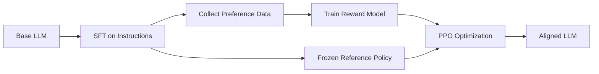

# 05 - RLHF with PPO

> [!info] TL;DR
> RLHF (Reinforcement Learning from Human Feedback) aligns LLMs to human preferences via three steps: train a reward model on preference data, then use PPO to optimize the policy to maximize the reward (with a KL penalty to stay close to the SFT model). DPO ([[04 - DPO Derivation|DPO]]) is the simpler modern alternative.

## The Three-Stage Pipeline

### Stage 1: SFT
Supervised fine-tuning on instruction-response pairs. Produces a chat-capable model. See [[03 - Instruction Tuning and Chat Templates]].

### Stage 2: Reward Model Training
Train a model $r_\phi(x, y)$ that scores how good a response $y$ is for a prompt $x$, based on human preferences.

**Preference data format**: $(x, y_w, y_l)$ — for prompt $x$, response $y_w$ is preferred over $y_l$.

**Training objective** (Bradley-Terry model):

$$
\mathcal{L}_{\text{RM}} = -\log \sigma(r_\phi(x, y_w) - r_\phi(x, y_l))
$$

The reward model is usually the SFT model with a scalar head replacing the language modeling head.

### Stage 3: PPO Optimization
Use PPO to optimize the policy $\pi_\theta$ to maximize rewards while staying close to the SFT model:

$$
\max_\theta \mathbb{E}_{x \sim \mathcal{D}, y \sim \pi_\theta(\cdot \mid x)} \left[ r_\phi(x, y) - \beta \log \frac{\pi_\theta(y \mid x)}{\pi_{\text{ref}}(y \mid x)} \right]
$$

The KL penalty $\beta \log(\pi_\theta / \pi_{\text{ref}})$ prevents reward hacking — the model drifting to outputs that score high on the reward model but are degenerate.

See [[03 - Machine Learning/Reinforcement Learning/10 - PPO Deep Treatment|PPO Deep Treatment]] for the PPO mechanics.

## Practical Setup

### Models in memory
PPO for RLHF requires 4 models in memory simultaneously:
1. **Policy** $\pi_\theta$ (being trained).
2. **Reference** $\pi_{\text{ref}}$ (frozen, for KL penalty).
3. **Reward model** $r_\phi$ (frozen).
4. **Value model** $V_\psi$ (the critic, being trained).

For a 7B SFT model: 4 × 7B = 28B params in fp16 = 56 GB. Plus optimizer state and activations. Needs multiple H100s.

### Generating rollouts
Each PPO step:
1. Sample prompts from the preference dataset.
2. Generate responses with the current policy (this is the expensive part).
3. Score responses with the reward model.
4. Compute per-token KL penalty against the reference.
5. PPO update.

### Hyperparameters (typical)
- $\beta$ (KL coefficient): 0.01–0.5. Critical — too low → reward hacking; too high → no learning.
- Learning rate: 1e-5 to 5e-5.
- PPO clip range: 0.1–0.2.
- Rollout batch size: 32–512 prompts.
- PPO epochs per batch: 1–4.

## Reward Hacking

The classic RLHF failure mode: the policy finds inputs to the reward model that score high but are degenerate. Examples:
- Repetitive outputs (the reward model gives high scores to repeated phrases it saw in positive training data).
- Gibberish that exploits reward model biases.
- Overly long responses (if length correlates with positive examples).

Mitigations:
- **KL penalty** (the main defense) — keeps the policy close to SFT.
- **Reward model ensembles** — average multiple reward models.
- **Length normalization** — penalize long responses.
- **Active reward model retraining** — update the reward model with newly collected preferences.

## Why RLHF Lost Ground to DPO

PPO-based RLHF is finicky and expensive:
- 4 models in memory.
- Tuning-sensitive (KL coefficient, clip range, LR all matter).
- Slow (rollout generation is sequential).
- Hard to debug.

**DPO** ([[04 - DPO Derivation]]) replaced PPO for most open-source work:
- 2 models (policy + reference).
- No reward model training.
- No PPO.
- Standard supervised learning on preference pairs.

PPO survives at frontier labs (where every bit of quality matters) but is rare in open-source RLHF as of 2026.

## When to Use RLHF (vs DPO)

### Use RLHF (PPO)
- You have a frontier-scale compute budget.
- You have an active data collection pipeline (continuously updating the reward model).
- DPO quality is insufficient and you've exhausted DPO variants.

### Use DPO
- Default choice for open-source alignment.
- Smaller compute budget.
- Want simplicity and reproducibility.

### Use RLAIF / Constitutional AI
- When you don't have human preference data.
- Use a strong LLM (e.g., Claude) to label preferences.

## Why This Matters for AI

- RLHF (whether PPO or DPO) is what turned pretrained LLMs into useful chat assistants. Without it, ChatGPT wouldn't exist.
- The KL-penalized RL formulation is a general pattern — it appears in safety training, alignment, and agent training.
- Understanding RLHF helps you read alignment papers and reason about model behavior (why does the model refuse? why does it have a particular style?).

## Production Implications

- **For most teams, use DPO** instead of PPO. Simpler, cheaper, comparable quality.
- **For custom alignment**, start with DPO. Move to PPO only if DPO is insufficient.
- **Reward model quality is the bottleneck**. Invest in preference data quality.
- **Monitor KL** during training — if it grows past a threshold, the model is reward hacking.
- **For agents**, "RLHF" can mean training with task-completion rewards (verifiable signals like code passing tests, agent reaching goals). This is closer to R1-style training.

## Common Pitfalls

- **KL coefficient too low** — reward hacking; model produces gibberish.
- **KL coefficient too high** — no learning; model stays at SFT.
- **Reward model trained on biased data** — propagates bias into the policy.
- **Forgetting to freeze the reward model** during PPO — breaks the algorithm.
- **Not enough rollout diversity** — PPO overfits to a narrow distribution.
- **Forgetting to detach the value target** — gradient flows through itself.

## Further Reading

- Ouyang et al. (2022), *Training language models to follow instructions with human feedback* (InstructGPT).
- Christiano et al. (2017), *Deep Reinforcement Learning from Human Preferences*.
- Bai et al. (2022), *Constitutional AI* (RLAIF).
- Rafailov et al. (2023), *DPO*.

## See Also

- [[04 - DPO Derivation]] — the simpler alternative
- [[03 - Machine Learning/Reinforcement Learning/10 - PPO Deep Treatment|PPO Deep Treatment]]
- [[03 - Instruction Tuning and Chat Templates]]
- [[01 - LoRA]]
- [[12 - Fine-Tuning/MOC|Fine-Tuning MOC]]

## Interview Questions

1. **Q: What are the three stages of RLHF?**
   A: (1) SFT — supervised fine-tuning on instruction-response pairs. (2) Reward model training — train $r_\phi(x,y)$ on preference data $(x, y_w, y_l)$ using Bradley-Terry loss: $-\log \sigma(r(y_w) - r(y_l))$. (3) PPO optimization — train policy $\pi_\theta$ to maximize $r_\phi(x,y) - \beta KL(\pi_\theta || \pi_{ref})$, where $\pi_{ref}$ is the frozen SFT model.

2. **Q: Why does PPO for RLHF need 4 models in memory?**
   A: (1) Policy $\pi_\theta$ (being trained). (2) Reference $\pi_{ref}$ (frozen, for KL penalty). (3) Reward model $r_\phi$ (frozen). (4) Value model $V_\psi$ (the critic, being trained). For a 7B SFT model: 4 × 7B = 28B params in fp16 = 56 GB. Plus optimizer state and activations. Needs multiple H100s. DPO reduces this to 2 models (policy + reference).

3. **Q: What is reward hacking and how do you prevent it?**
   A: Reward hacking: the policy finds inputs to the reward model that score high but are degenerate (repetitive outputs, gibberish, overly long responses). Prevention: (1) KL penalty — keeps policy close to SFT; (2) reward model ensembles — average multiple RMs; (3) length normalization — penalize long responses; (4) active RM retraining — update RM with new preferences.

4. **Q: How does the KL penalty work in RLHF?**
   A: The objective is $r(x,y) - \beta \log(\pi_\theta(y|x) / \pi_{ref}(y|x))$. The KL term $\beta \log(\pi_\theta / \pi_{ref})$ penalizes the policy for drifting from the reference. $\beta$ controls the strength: too low → reward hacking; too high → no learning. The KL is computed per-token, accumulated over the response.

5. **Q: Why did DPO replace PPO for most open-source alignment?**
   A: PPO is finicky (4 models, tuning-sensitive, weeks to converge, hard to debug). DPO is simpler (2 models, stable, hours, standard supervised learning). DPO quality is comparable to PPO for most use cases. PPO survives at frontier labs where every bit of quality matters and they have the compute to tune it.

6. **Q: What is RLAIF and how does it differ from RLHF?**
   A: RLAIF (Constitutional AI) replaces human preference labels with AI-generated labels. A strong LLM (e.g., Claude) evaluates which response is better, providing the preference signal. This removes the need for human labelers, making alignment scalable. The rest of the pipeline (reward model + PPO, or DPO) is the same.

## Connection to Other Concepts

- [[12 - Fine-Tuning/DPO/04 - DPO Derivation|DPO Derivation]] — the simpler alternative.
- [[03 - Machine Learning/Reinforcement Learning/10 - PPO Deep Treatment|PPO Deep Treatment]] — PPO mechanics.
- [[12 - Fine-Tuning/Instruction Tuning/03 - Instruction Tuning and Chat Templates|Instruction Tuning]] — SFT stage.
- [[02 - Mathematics/Probability/07 - Probability Essentials|Probability Essentials]] — Bradley-Terry model.
- [[26 - Papers/Alignment/07 - InstructGPT 2022|InstructGPT 2022]] — original RLHF recipe.
- [[26 - Papers/Alignment/31 - Constitutional AI 2022|Constitutional AI]] — RLAIF.
