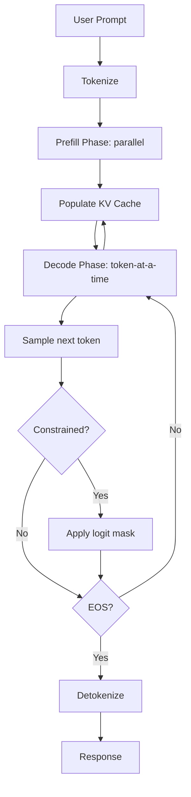

# 13 — Inference MOC

> [!info] Running LLMs in production. Iteration 6 added three new notes: Continuous Batching Deep Dive (the scheduling technique behind all modern serving engines), Constrained Decoding and CFG (forcing structured output), and TensorRT-LLM (inference chapter perspective on NVIDIA's serving engine).

## Reading Order

| #   | Note                                              | Sub-domain          | Purpose                                            |
|-----|---------------------------------------------------|---------------------|----------------------------------------------------|
| 01  | (see [[08 - LLMs/Context and KV Cache/02 - KV Cache Mechanics\|KV Cache Mechanics]]) | KV Cache     | The foundation.                                   |
| 02  | [[02 - PagedAttention]]                           | KV Cache            | vLLM's memory management breakthrough.             |
| 03  | [[03 - Quantization]]                             | Quantization        | INT8/INT4/FP8/GPTQ/AWQ/GGUF.                       |
| 04  | [[04 - vLLM and Continuous Batching]]             | Serving             | The dominant serving engine.                       |
| 05  | [[05 - Speculative Decoding]]                     | Speculative Decode  | 2-3x speedup via draft model.                      |
| 06  | [[06 - Continuous Batching Deep Dive]]            | Serving             | Iteration-level batching algorithm.                |
| 07  | [[07 - Constrained Decoding and CFG]]             | Decoding            | JSON/regex/grammar-constrained output.             |
| 08  | [[08 - TensorRT-LLM]]                             | Serving             | NVIDIA-optimized serving engine.                   |

## Sub-Domains

- [[13 - Inference/KV Cache/02 - PagedAttention|KV Cache]] — notes 01–02
- [[13 - Inference/Quantization/03 - Quantization|Quantization]] — note 03
- [[13 - Inference/Serving/04 - vLLM and Continuous Batching|Serving]] — notes 04, 06, 08
- [[13 - Inference/Speculative Decoding/05 - Speculative Decoding|Speculative Decoding]] — note 05
- [[13 - Inference/Decoding/07 - Constrained Decoding and CFG|Decoding]] — note 07
- [[13 - Inference/Optimization|Optimization]] — (planned: kernel fusion, torch.compile)

## The Big Picture

Modern inference has three optimization layers:

1. **Memory** (KV cache, PagedAttention): fit more requests per GPU.
2. **Compute** (FlashAttention, FP8): faster matrix multiplications.
3. **Scheduling** (continuous batching, prefix caching): higher throughput via better request management.

## Why This Matters for AI Engineers

Inference cost is the dominant cost in production AI. A poorly-optimized inference setup costs 5-10× more than a well-optimized one for the same workload. Understanding the techniques in this chapter is essential for:

- **Cost optimization**: choosing the right engine, quantization, and batching strategy.
- **Latency optimization**: choosing the right kernels, decoding strategy, and caching.
- **Capacity planning**: estimating how many GPUs you need for a given QPS.
- **Production reliability**: understanding failure modes and mitigation.

## Cross-Domain Connections

- [[08 - LLMs/MOC|08 LLMs]] — what we're running.
- [[12 - Fine-Tuning/MOC|12 Fine-Tuning]] — fine-tuned models may need different inference settings.
- [[20 - AI Infrastructure/MOC|20 AI Infrastructure]] — where inference runs.
- [[22 - Production AI/MOC|22 Production AI]] — production deployment patterns.
- [[25 - Frameworks and Tools/MOC|25 Frameworks]] — serving engines (vLLM, TGI, TensorRT-LLM, SGLang).
- [[02 - Mathematics/Linear Algebra/04 - Matrix Multiplication|Matrix Multiplication]] — the core operation being optimized.

## Future Expansion (Iteration 7+)

- Kernel fusion deep dive.
- torch.compile and graph compilation.
- Disaggregated inference (DeepSeek, Mooncake).
- Multi-modal inference (VLM serving).
- Edge inference (mobile, browser).

## See Also

- [[08 - LLMs/MOC|08 LLMs]] — what we're running
- [[12 - Fine-Tuning/MOC|12 Fine-Tuning]]
- [[20 - AI Infrastructure/MOC|20 AI Infrastructure]]
- [[22 - Production AI/MOC|22 Production AI]]
