# 06 — Continuous Batching Deep Dive

> [!info] TL;DR
> Continuous batching (also called iteration-level batching or in-flight batching) is the scheduling technique that enabled 5-20× throughput improvements in LLM serving. Unlike static batching (where a batch is formed, processed to completion, then returned), continuous batching inserts new requests into the active batch at every iteration, and evicts completed requests. This eliminates the "tail latency" problem where a batch of 32 requests is held up by the slowest one. vLLM, TGI, SGLang, and TensorRT-LLM all implement continuous batching. This note explains the algorithm, the engineering challenges, and the production trade-offs.

## The Problem: Static Batching's Tail Latency

In static batching, the server waits to fill a batch (e.g., 32 requests), processes the entire batch to completion, then returns all results. This has a fundamental problem: the batch's wall-clock time is determined by the **longest** request in the batch. If 31 requests finish in 50 tokens but one runs for 1000 tokens, the 31 short requests are blocked for the duration of the long one.

For LLMs, where generation length varies wildly (a quick "yes/no" vs. a 2000-token essay), this is catastrophic. Average latency is dominated by tail latency. GPU utilization is poor because the batch is mostly idle waiting for the long request to finish.

```mermaid
gantt
    title Static Batching - All requests wait for the longest
    dateFormat X
    axisFormat %s
    section Batch
    Short req 1 :done, a1, 0, 5
    Short req 2 :done, a2, 0, 5
    Short req 3 :done, a3, 0, 5
    Long req    :active, a4, 0, 30
    Note: short reqs blocked 5-30 while long req continues
```



Static batching was fine for encoders (BERT) where all requests had similar lengths. It's wrong for autoregressive LLMs where generation length is unpredictable.

## The Solution: Continuous Batching

Continuous batching operates at the **iteration level** instead of the request level. At each iteration (each token generated), the scheduler can:

1. **Insert** a new request into the active batch.
2. **Evict** a completed request from the batch.
3. **Continue** the remaining requests.

```mermaid
gantt
    title Continuous Batching - Requests join and leave independently
    dateFormat X
    axisFormat %s
    section Iterations
    Req 1 short   :done, 0, 5
    Req 2 long    :active, 0, 30
    Req 3 short   :done, 6, 11
    Req 4 medium  :done, 12, 22
    Req 5 short   :done, 23, 28
```



The batch is dynamic: at iteration 6, Req 3 joins. At iteration 5, Req 1 leaves (it finished). The GPU never sits idle waiting for a long request to finish.

This requires that the batch's KV cache is structured so each request has its own slot. vLLM's PagedAttention (see [[02 - PagedAttention]]) is the canonical implementation: each request's KV cache is a sequence of blocks, and blocks can be allocated/freed independently per request.

## The Algorithm

### Scheduler Loop

The scheduler runs a tight loop:

```
while True:
    # 1. Check for completed requests
    for req in active_batch:
        if req.is_finished():
            evict(req)
    
    # 2. Admit new requests if there's capacity
    while pending_queue and has_capacity():
        req = pending_queue.pop()
        admit(req)
    
    # 3. Run one decode iteration
    logits = model.forward(active_batch)  # batch dimension = len(active_batch)
    
    # 4. Sample next token for each request
    for req in active_batch:
        next_token = sample(logits[req])
        req.append_token(next_token)
    
    # 5. Stream tokens to clients
    for req in active_batch:
        if req.has_new_token():
            stream(req, req.last_token())
```

The key insight: steps 1 and 2 happen between iterations, not between requests. This is what makes the batch dynamic.

### Capacity Calculation

The "capacity" check is critical. A request can be admitted if:

- There's a free KV cache slot for its prefix.
- The batch size is below the limit.
- The total tokens in the batch don't exceed memory.

Without PagedAttention, capacity is determined by `max_batch_size * max_seq_len * kv_per_token`. This wastes memory because short requests reserve space they don't use. With PagedAttention, capacity is determined by `total_kv_blocks_available`, which is shared across requests and allocated on demand.

### Prefill vs. Decode Phases

LLM inference has two phases:

- **Prefill**: process the prompt, computing attention over all prompt tokens. This is compute-bound (large matrix multiplies).
- **Decode**: generate one token at a time, attending to the prompt + previously generated tokens. This is memory-bound (small matrix multiplies, but reads the full KV cache each step).

Continuous batching must handle both phases. A new request starts in prefill; after preill, it transitions to decode. Mixing prefill and decode in the same iteration is possible but tricky (prefill requests need lots of compute; decode requests need lots of memory bandwidth).

Two scheduling strategies:

- **Prefill-priority**: admit new requests (prefill) only when the decode batch is below a threshold. Decodes get priority; prefills wait. Lowers tail latency for ongoing requests.
- **Chunked prefill**: split a long prefill into chunks and process one chunk per iteration alongside decodes. Smooths out the prefill cost.

Chunked prefill is the production default (used by vLLM, SGLang) — it eliminates the "long prefill stalls all decodes" problem.

## Engineering Challenges

### Memory Management

Each request in the batch has its own KV cache. The KV cache grows as the request generates more tokens. The scheduler must:

- Allocate KV cache blocks when a request is admitted.
- Free blocks when a request is evicted.
- Handle the case where a request's KV cache grows beyond available memory (preemption).

vLLM's PagedAttention handles this elegantly — see [[02 - PagedAttention]]. Without paging, you must reserve worst-case memory per request, which wastes capacity.

### Variable Batch Dimension

The batch size changes every iteration (as requests join and leave). This means:

- The model forward pass has a dynamic batch dimension.
- CUDA kernels must handle variable batch sizes efficiently.
- Some kernels are optimized for fixed batch sizes (e.g., powers of 2); padding to a fixed size wastes compute.

This is mostly an engineering concern; modern serving engines handle it well. But it's a reason why naive implementations can be slow.

### Sampling Per Request

Each request in the batch may have different sampling parameters (temperature, top-p, top-k). The sampler must apply per-request parameters:

```python
def sample_batched(logits, sampling_params):
    """logits: (batch, vocab), sampling_params: list[SamplingParams]"""
    next_tokens = []
    for i, params in enumerate(sampling_params):
        token = sample(logits[i], params)
        next_tokens.append(token)
    return torch.tensor(next_tokens)
```

This is a small overhead but worth noting — sampling is per-request, not batched.

### Cancellation

A user may cancel a request mid-generation. The scheduler must:

- Detect the cancellation (e.g., via a flag or closed connection).
- Free the request's KV cache.
- Remove it from the active batch.

Without proper cancellation handling, abandoned requests consume GPU memory until they finish or hit the max token limit.

### Prefix Sharing

If multiple requests share a common prefix (e.g., the same system prompt), their KV caches can share the prefix blocks. SGLang's RadixAttention (see [[14 - SGLang]]) automates this. vLLM supports it via `--enable-prefix-caching`. Without prefix sharing, each request recomputes the common prefix, wasting compute.

## Production Trade-offs

### Batch Size vs. Latency

Larger batches improve throughput (more requests per second) but increase per-request latency (each request competes for GPU memory bandwidth). The sweet spot depends on the workload:

- **High-throughput batch processing**: large batches (64-256), accept higher latency.
- **Real-time chat**: small batches (8-32), prioritize latency.

Production systems often run two configurations: a low-latency config for chat and a high-throughput config for batch jobs.

### Max Sequence Length

Longer max sequence length increases memory usage per request, reducing batch size. But cutting off long requests frustrates users. The trade-off: set max sequence length high enough for 99% of requests; reject or truncate the 1%.

### Preemption Strategy

When memory is exhausted, the scheduler must evict a request. Two strategies:

- **Recompute**: evict the request, then recompute its KV when memory frees up. Cheap to implement; expensive at runtime.
- **Swap**: evict the request's KV cache to CPU memory, then swap back when memory frees up. More memory-efficient; adds CPU-GPU transfer latency.

vLLM supports both. Swap is the default for production.

### Multi-Model Coexistence

If you serve multiple models on the same GPU (e.g., a small model for routing and a large model for generation), their KV caches compete for memory. Continuous batching across models is possible but complex. Most production setups run one model per GPU.

## Comparison to Alternatives

| Technique              | Throughput | Latency     | Implementation Complexity |
|------------------------|------------|-------------|---------------------------|
| Static batching        | Low        | High (tail) | Low                       |
| Continuous batching    | High       | Low         | Medium                    |
| Continuous + paging    | Higher     | Lower       | High (PagedAttention)     |
| Continuous + prefix cache | Highest | Lowest      | Highest (RadixAttention)  |

Static batching is appropriate only for benchmarks or when all requests have identical length. Production LLM serving requires at least continuous batching; modern engines add paging and prefix caching.

## Performance Numbers

For a 7B model on a single A100, serving a mix of short (50-token) and long (500-token) requests:

- **Static batching (batch=32)**: ~50 requests/sec, p99 latency 30s.
- **Continuous batching (batch=32-256)**: ~200 requests/sec, p99 latency 2s.
- **Continuous + paging (vLLM)**: ~400 requests/sec, p99 latency 1s.
- **Continuous + paging + prefix caching (SGLang)**: ~800 requests/sec for prefix-heavy workloads.

The exact numbers depend on workload, hardware, and model size, but the relative improvements are consistent.

## See Also

- [[02 - PagedAttention]] — the memory management that makes continuous batching efficient
- [[04 - vLLM and Continuous Batching]] — vLLM's implementation
- [[14 - SGLang]] — RadixAttention's prefix caching
- [[02 - KV Cache Mechanics]] — what the scheduler is managing
- [[07 - Constrained Decoding and CFG]] — per-request decoding options
- [[08 - TensorRT-LLM]] — in-flight batching (TensorRT-LLM's name for continuous batching)
- [[13 - Inference/MOC|13 Inference MOC]]


## Interview Questions

1. **Q: What is the difference between static batching and continuous batching?**
   A: Static: form a batch, process all requests to completion, return results. Wall-clock time = longest request. Continuous: at every iteration (token), insert new requests and evict finished ones. GPU stays saturated, tail latency is minimized. For LLMs where generation length varies wildly (50 vs 2000 tokens), continuous batching gives 5-20x throughput.

2. **Q: What is chunked prefill and why is it the production default?**
   A: Prefill (processing the prompt) is compute-bound and can stall all decodes in the batch. Chunked prefill splits a long prefill into chunks (e.g., 512 tokens) and processes one chunk per iteration alongside decodes. This smooths out the prefill cost — decodes aren't blocked for the full prefill duration. Used by vLLM and SGLang as the default.

3. **Q: How does the scheduler decide when to admit a new request?**
   A: Capacity check: (1) is there a free KV cache slot for the prefix? (2) is the batch size below the limit? (3) do total tokens exceed memory? With PagedAttention, capacity is determined by total KV blocks available (shared across requests, allocated on demand). Without paging, you must reserve worst-case memory per request, wasting capacity.

4. **Q: What is the prefill-priority vs chunked prefill tradeoff?**
   A: Prefill-priority: admit new requests only when decode batch is below threshold. Decodes get priority; prefills wait. Lowers tail latency for ongoing requests but increases queue time for new requests. Chunked prefill: split prefills into chunks and interleave with decodes. Smoother — both prefills and decodes make progress every iteration. Chunked is the production default.

5. **Q: How does preemption work when memory is exhausted?**
   A: Two strategies: (1) recompute — evict the request, recompute its KV when memory frees (cheap to implement, expensive at runtime); (2) swap — evict the KV to CPU memory, swap back when memory frees (more memory-efficient, adds CPU-GPU transfer latency). vLLM supports both; swap is the default for production.

6. **Q: How does prefix sharing work in continuous batching?**
   A: If multiple requests share a common prefix (e.g., the same system prompt), their KV caches can share the prefix blocks. SGLang's RadixAttention automates this via a radix tree of prefix hashes. vLLM supports it via `--enable-prefix-caching`. Without prefix sharing, each request recomputes the common prefix, wasting compute. For chatbot workloads, 30-80% of requests share a prefix.

## Connection to Other Concepts

- [[13 - Inference/KV Cache/02 - PagedAttention|PagedAttention]] — memory management for continuous batching.
- [[13 - Inference/Serving/04 - vLLM and Continuous Batching|vLLM]] — implements continuous batching.
- [[25 - Frameworks and Tools/Serving/14 - SGLang|SGLang]] — RadixAttention prefix caching.
- [[13 - Inference/Serving/08 - TensorRT-LLM|TensorRT-LLM]] — in-flight batching.
- [[08 - LLMs/Context and KV Cache/02 - KV Cache Mechanics|KV Cache Mechanics]] — what the scheduler manages.
