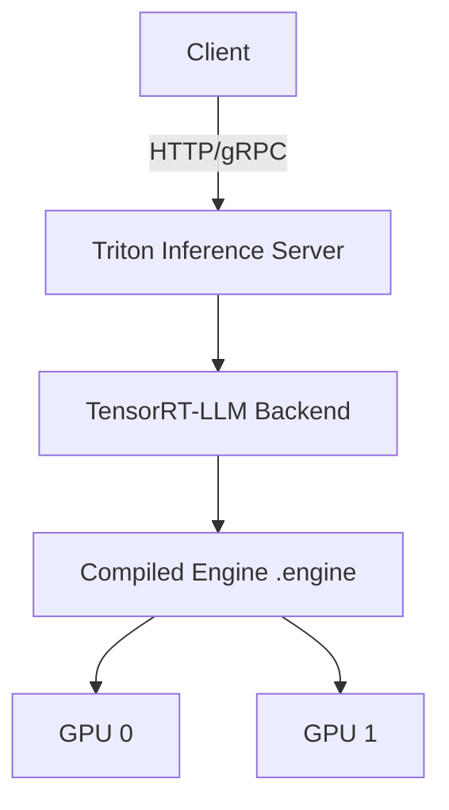

# 08 — TensorRT-LLM (Inference Chapter Perspective)

> [!info] TL;DR
> From the inference chapter's perspective, TensorRT-LLM is the **highest-performance LLM serving engine on NVIDIA hardware**. It compiles a model into a TensorRT engine — a binary with fused kernels, FP8/INT8 support, and platform-specific optimizations. The compilation step is the key difference from vLLM/TGI: you trade build-time complexity for runtime performance. This note covers TensorRT-LLM's inference characteristics (latency, throughput, memory, deployment patterns) and how it fits into production inference stacks. For the framework-perspective treatment, see [[13 - TensorRT-LLM]] in chapter 25.

## Why TensorRT-LLM for Inference

Inference has different priorities than training:

- **Latency** matters more than throughput (users wait for tokens).
- **Cost-per-token** matters more than absolute speed (production economics).
- **Stability** matters more than flexibility (production uptime).
- **Numerical reproducibility** may matter (regulated industries).

TensorRT-LLM is optimized for these priorities. It compiles the model once into a binary that runs optimally on the target GPU, with no Python overhead in the hot path. For latency-sensitive applications (real-time chat, voice agents, interactive tools), TensorRT-LLM delivers the lowest per-token latency of any open-source engine.

## Inference Performance Characteristics

### Latency

For a 7B model on H100 (FP8):

| Engine         | Prefill (1000 tokens) | Per-token decode | Total (100 + 100 tokens) |
|----------------|----------------------|------------------|--------------------------|
| TensorRT-LLM   | ~15ms                | ~5ms             | ~25ms                    |
| vLLM           | ~25ms                | ~8ms             | ~40ms                    |
| TGI            | ~30ms                | ~10ms            | ~50ms                    |

(The numbers are approximate; actual performance depends on workload.)

The latency advantage comes from:

- **Fused kernels**: multiple operations (QKV, softmax, FFN) compiled into single CUDA kernels, reducing kernel launch overhead.
- **WGMMA on Hopper**: Hopper's warpgroup matrix multiply-accumulate instructions, used by TensorRT-LLM's FP8 kernels.
- **Async execution**: compute and memory transfer overlap, hiding latency.

### Throughput

For a 7B model on H100 (FP8, batched):

| Engine         | Tokens/sec | Requests/sec (avg 200 tokens) |
|----------------|------------|-------------------------------|
| TensorRT-LLM   | ~25,000    | ~125                          |
| vLLM           | ~18,000    | ~90                           |
| TGI            | ~14,000    | ~70                           |

Throughput advantage is smaller than latency advantage because vLLM's PagedAttention is also highly optimized. The gap widens at scale (70B+) where TensorRT-LLM's optimizations compound.

### Memory

TensorRT-LLM uses memory more efficiently than vLLM for some workloads:

- **Weights**: same (both support INT4/INT8/FP8 quantization).
- **KV cache**: TensorRT-LLM uses block-based KV cache similar to PagedAttention, with NVIDIA-specific optimizations.
- **Activations**: TensorRT-LLM's kernel fusion reduces activation memory.

For 70B models on H100 80GB, TensorRT-LLM typically fits larger batches than vLLM at the same latency.

### Cost per Token

Cost per token = (GPU-hour cost) / (tokens per hour). For H100 at ~$3/hour:

- TensorRT-LLM: $3 / (25,000 × 3600) = ~$0.00000003 per token = ~$0.03 per million tokens.
- vLLM: ~$0.04 per million tokens.
- TGI: ~$0.05 per million tokens.

The 20-40% cost reduction compounds at scale. For a service processing billions of tokens per day, TensorRT-LLM saves thousands of dollars per day.

## Inference Features

### In-Flight Batching

TensorRT-LLM's continuous batching (called "in-flight batching" in NVIDIA's terminology) inserts and evicts requests at iteration boundaries, like vLLM's continuous batching. The implementation uses NVIDIA-specific kernel scheduling for tighter compute-memory overlap.

For the algorithmic details, see [[06 - Continuous Batching Deep Dive]]. TensorRT-LLM's implementation is conceptually identical to vLLM's; the difference is in the kernel implementation.

### FP8 Inference

FP8 on H100 halves memory and doubles throughput vs. FP16. TensorRT-LLM has the most mature FP8 implementation:

- **Per-tensor scaling**: each weight and activation tensor is scaled to fit FP8's range.
- **E4M3 format**: used for both weights and activations (sufficient range for inference).
- **Quality preservation**: <1% degradation on most benchmarks.

For production deployment on H100, FP8 is the default for cost-sensitive workloads. The quality loss is minimal; the cost savings are significant.

### Speculative Decoding

TensorRT-LLM supports speculative decoding (see [[05 - Speculative Decoding]]) with both draft-model and Medusa-style approaches. The engine handles the draft model's KV cache and the verification step efficiently.

### Quantization

TensorRT-LLM supports:

- **INT4 weight-only** (GPTQ-style): 4x memory reduction, slight quality loss.
- **INT8 weight-only**: 2x memory reduction, minimal quality loss.
- **INT8 weight-activation** (SmoothQuant): 2x memory + 2x throughput, more quality loss.
- **FP8**: 2x memory + 2x throughput, minimal quality loss (Hopper+).
- **FP4** (Blackwell+): 4x memory + 4x throughput (cutting edge).

The choice depends on hardware, quality requirements, and the specific model. FP8 is the production sweet spot on H100.

### Constrained Decoding

TensorRT-LLM supports JSON schema and regex constrained decoding via integration with `xgrammar` and `outlines`. The constraint engine is called from the C++ runtime, avoiding Python overhead.

### Streaming

TensorRT-LLM streams tokens via the OpenAI-compatible API (SSE) or via Triton's streaming protocol. Streaming latency (time to first token) is competitive with vLLM.

## Deployment Patterns

### Triton Inference Server

The standard production deployment is via Triton Inference Server:

- **Triton** handles HTTP/gRPC, model repository, metrics, multi-model serving.
- **TensorRT-LLM backend** handles LLM-specific execution.
- **Triton's model repository** stores the compiled TensorRT engine.



Triton provides:

- Multi-model serving (different engines on different GPUs).
- Model versioning (deploy new engine versions with traffic splitting).
- Metrics (Prometheus endpoint with per-model latency, throughput).
- Load balancing across multiple Triton instances.

### Standalone Deployment

For simpler setups, TensorRT-LLM can be deployed standalone via its Python API:

```python
from tensorrt_llm import Runtime
runtime = Runtime("path/to/engine")
session = runtime.create_session()
output = session.generate(input_ids=input_ids)
```

This is appropriate for development or for embedding TensorRT-LLM in a custom serving stack.

### Multi-Node Deployment

For 70B+ models that don't fit on a single GPU:

- **Tensor parallelism**: shard each layer across GPUs.
- **Pipeline parallelism**: split layers across GPUs sequentially.
- **NCCL communication**: GPU-to-GPU communication via NCCL.

Multi-node requires InfiniBand or NVLink for acceptable latency. The deployment uses `mpirun` to launch workers on each node.

### Hybrid Deployment (TensorRT-LLM + vLLM)

For fleets serving many models:

- **TensorRT-LLM** for the high-traffic models (where compilation cost is amortized).
- **vLLM** for the long-tail models (where compilation isn't worth it).

A router (LiteLLM or custom) routes requests based on model name. This combines TRT-LLM's performance with vLLM's flexibility.

## Trade-offs

### Build Complexity

The biggest inference trade-off: TensorRT-LLM requires a build phase. You must:

1. Specify the model architecture (in Python or via a config file).
2. Choose precision and optimization settings.
3. Wait minutes-to-hours for compilation.
4. Test the engine produces correct output.
5. Deploy the engine to production.

vLLM has no build phase — you load the model and serve. This is a major operational advantage for vLLM in environments with rapid model turnover (testing many models, frequent updates).

### Engine Specificity

Engines are specific to (model, GPU type, TensorRT-LLM version). For a fleet with multiple GPU types (A100, H100, B100), you need separate engines for each. Storage and version management become operational concerns.

### NVIDIA-Only

TensorRT-LLM only runs on NVIDIA GPUs. If your fleet includes AMD or Intel GPUs, you need a different engine for those.

### Architecture Support Lag

When a new model architecture is released (e.g., Mamba, MLA), TensorRT-LLM support requires NVIDIA to write a plugin. This can take weeks-to-months. vLLM and TGI typically support new architectures within days via HuggingFace integration.

## When to Choose TensorRT-LLM for Inference

### Choose TensorRT-LLM When:
- **NVIDIA-only fleet** with strict latency targets.
- **High-traffic models** where compilation cost is amortized over many requests.
- **70B+ models** where every optimization compounds.
- **FP8 on H100** is a cost requirement.
- **Triton is already your serving infrastructure**.

### Choose vLLM When:
- **Multi-vendor fleet** (AMD, Intel GPUs).
- **Frequent model changes** (build phase is too slow).
- **Cutting-edge architectures** not yet supported by TensorRT-LLM.
- **Simpler deployment** is more important than peak performance.

### Choose TGI When:
- **HuggingFace-model compatibility** is critical.
- **Chat templates** are important.
- **Ease of deployment** matters more than peak performance.

### Choose SGLang When:
- **Agentic workloads** with prefix sharing.
- **Structured output** is the primary use case.

## Production Best Practices

### Cache Engines

Build engines once per (model, GPU type, TRT-LLM version) and cache them in artifact storage (S3, NFS). Don't rebuild on every deploy. Version the engine files explicitly.

### Pin Versions

TRT-LLM versions are not backward-compatible. Pin the Docker image, engine version, and runtime version. Test upgrades in staging.

### Use FP8 by Default on H100

For H100 deployments, FP8 is the production default. The 1% quality loss is worth the 2× cost reduction for most workloads.

### Have a vLLM Fallback

For models or architectures TRT-LLM doesn't yet support, have vLLM as a fallback. The router can route supported models to TRT-LLM and unsupported models to vLLM.

### Monitor for Numerical Issues

TRT-LLM's aggressive optimizations can produce rare numerical instabilities (NaN, inf). Monitor for these; have a fallback to FP16 if FP8 produces NaNs.

### Use Triton for Production

For production, deploy via Triton Inference Server. Don't roll your own serving layer on top of the Python API.

## See Also

- [[13 - TensorRT-LLM]] — chapter 25 framework perspective
- [[04 - vLLM and Continuous Batching]] — vLLM alternative
- [[06 - Continuous Batching Deep Dive]] — algorithmic details of in-flight batching
- [[07 - Constrained Decoding and CFG]] — constraint support
- [[03 - Quantization]] — quantization formats
- [[05 - Speculative Decoding]] — speculative decoding support
- [[13 - Inference/MOC|13 Inference MOC]]


## Interview Questions

1. **Q: What is the main tradeoff of TensorRT-LLM vs vLLM?**
   A: TRT-LLM: higher performance (fused kernels, FP8, WGMMA) but requires a compilation phase (minutes to hours per model). vLLM: lower performance but no compilation (load and serve). TRT-LLM is best for high-traffic models where compilation is amortized; vLLM for rapid model turnover or multi-vendor fleets.

2. **Q: How does FP8 inference on H100 work?**
   A: Per-tensor scaling: each weight and activation tensor is scaled to fit FP8's range (E4M3: ~0.002 to ~448). The scale is computed from the tensor's absmax. Quality loss: <1% on most benchmarks. Throughput: ~2x vs FP16. TRT-LLM has the most mature FP8 implementation. For production on H100, FP8 is the default for cost-sensitive workloads.

3. **Q: What is in-flight batching in TensorRT-LLM?**
   A: TRT-LLM's name for continuous batching. Same algorithm as vLLM: insert/evict requests at iteration boundaries. The difference is in kernel implementation — TRT-LLM uses NVIDIA-specific scheduling for tighter compute-memory overlap.

4. **Q: When would you choose TRT-LLM over vLLM?**
   A: Choose TRT-LLM when: (1) NVIDIA-only fleet with strict latency targets; (2) high-traffic models where compilation is amortized; (3) 70B+ models where every optimization compounds; (4) FP8 on H100 is a cost requirement; (5) Triton is already your serving infrastructure. Choose vLLM for: multi-vendor, frequent model changes, cutting-edge architectures, simpler deployment.

5. **Q: What are TRT-LLM's deployment patterns?**
   A: (1) Triton Inference Server — the standard production deployment (HTTP/gRPC, model repository, metrics). (2) Standalone via Python API — for development or custom serving stacks. (3) Multi-node — tensor + pipeline parallelism via NCCL. (4) Hybrid (TRT-LLM + vLLM) — TRT-LLM for high-traffic, vLLM for long-tail models; router dispatches.

6. **Q: What are TRT-LLM's limitations?**
   A: (1) Build complexity — compilation phase takes minutes to hours. (2) Engine specificity — engine is specific to (model, GPU type, TRT-LLM version); separate engines for A100, H100, B100. (3) NVIDIA-only — no AMD/Intel support. (4) Architecture support lag — new architectures (Mamba, MLA) need NVIDIA plugins, taking weeks to months. vLLM/TGI support new architectures within days.

## Connection to Other Concepts

- [[13 - Inference/Serving/04 - vLLM and Continuous Batching|vLLM]] — the alternative.
- [[13 - Inference/Serving/06 - Continuous Batching Deep Dive|Continuous Batching]] — in-flight batching algorithm.
- [[13 - Inference/Decoding/07 - Constrained Decoding and CFG|Constrained Decoding]] — TRT-LLM supports it.
- [[13 - Inference/Quantization/03 - Quantization|Quantization]] — INT4/INT8/FP8/FP4 support.
- [[13 - Inference/Speculative Decoding/05 - Speculative Decoding|Speculative Decoding]] — TRT-LLM supports it.
- [[25 - Frameworks and Tools/Serving/13 - TensorRT-LLM|TensorRT-LLM (Ch 25)]] — framework perspective.
