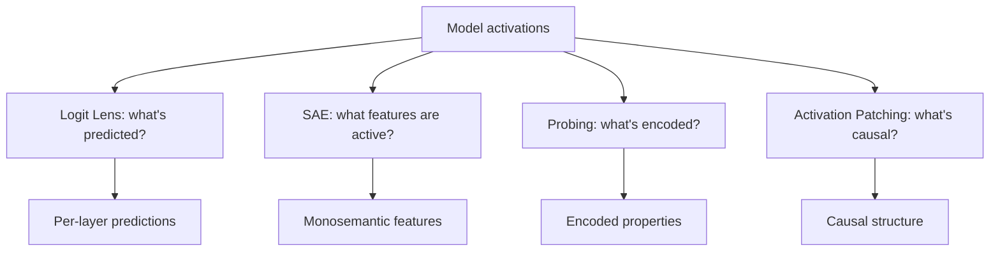

# 14 — Interpretability MOC

> [!info] Understanding what neural networks actually compute. Iteration 4 expanded this chapter with notes on logit lens, sparse autoencoders, activation patching, and probing — the four core interpretability techniques.

## Reading Order

| #   | Note                                              | Sub-domain            | Purpose                                            |
|-----|---------------------------------------------------|-----------------------|----------------------------------------------------|
| 01  | [[01 - Mechanistic Interpretability]]             | Mechanistic           | Circuits, induction heads, overview.               |
| 02  | [[02 - Logit Lens and Tuned Lens]]                | Mechanistic           | Apply unembedding to intermediate activations.     |
| 03  | [[03 - Sparse Autoencoders Deep Dive]]            | Sparse Autoencoders   | Decompose activations into interpretable features. |
| 04  | [[04 - Activation Patching and Causal Tracing]]   | Mechanistic           | Intervention-based causal analysis.                |
| 05  | [[05 - Probing]]                                  | Probing               | Train classifiers on activations.                  |

## Sub-Domains

- [[14 - Interpretability/Mechanistic/01 - Mechanistic Interpretability|Mechanistic]] — notes 01, 02, 04
- [[14 - Interpretability/Mechanistic/01 - Mechanistic Interpretability|Attention Analysis]] — (planned: attention rollout, attention flow)
- [[14 - Interpretability/Sparse Autoencoders/03 - Sparse Autoencoders Deep Dive|Sparse Autoencoders]] — note 03
- [[14 - Interpretability/Probing/05 - Probing|Probing]] — note 05

## The Interpretability Toolkit

## Why This Matters for AI

- Interpretability is essential for safety: understanding what models compute is the first step to ensuring they behave as intended.
- The four core techniques answer different questions: what's predicted (logit lens), what's represented (SAE/probing), what's causal (patching).
- SAEs are the leading approach to scaling interpretability — they turn opaque activations into sparse, human-reviewable features.
- Activation patching is the gold standard for causality — it establishes whether an activation *causes* behavior, not just correlates.

## Production Implications

- Interpretability is mostly research in 2025–2026, but feature steering (using SAE features to control behavior) is approaching production readiness.
- Logit lens is useful for debugging — you can see when a model "knows" the answer at intermediate layers even if the final output is wrong.
- Probing can detect biases and safety-relevant properties in production models.

## See Also

- [[05 - Multi-Head Attention]] — head specialization
- [[04 - In-Context Learning]] — induction heads enable ICL
- [[07 - Transformers/MOC|07 Transformers]]
- [[22 - Production AI/MOC|22 Production AI]] — safety applications
