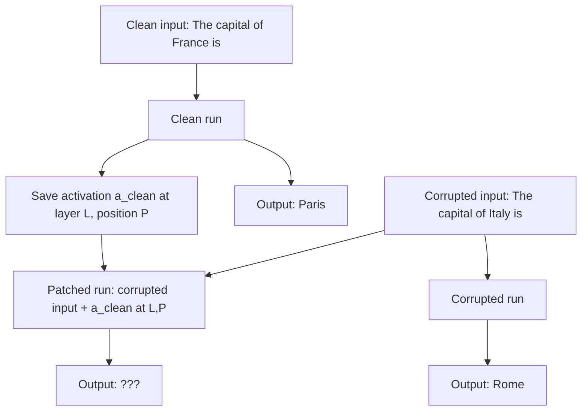

# 04 — Activation Patching and Causal Tracing

> [!info] TL;DR
> Activation patching is the gold standard for establishing **causality** in interpretability: take a clean input, run the model, save an activation; take a corrupted input, run the model, replace an activation with the saved clean version, and see if the output recovers. If it does, that activation is causally responsible for the behavior. Causal tracing is a specific application that localizes where information is stored and propagated in the model.

## The Problem Being Solved

[[02 - Logit Lens and Tuned Lens|The logit lens]] and [[03 - Sparse Autoencoders Deep Dive|SAEs]] tell you what the model *represents* at each layer, but not what those representations *cause*. A feature might be highly active when the model answers correctly, but not be the cause of the correct answer — it could be a side effect of some other computation.

To establish causality, you need **intervention**: change the activation and observe the effect on behavior. Activation patching (also called causal mediation analysis, interchange intervention, or activation swapping) is the standard intervention technique.

The technique was popularized by Meng et al. (2022) in the "Locating and Editing Factual Associations in GPT" paper (the ROME paper), which used it to find where factual knowledge is stored in GPT.

## The Key Idea: Clean → Corrupted → Patched

### The Three-Step Procedure

1. **Clean run**: run the model on a clean input (e.g., "The capital of France is"). Save the activation `a_clean` at the layer/position of interest.

2. **Corrupted run**: run the model on a corrupted input (e.g., "The capital of Italy is"). The model now predicts "Rome" instead of "Paris". Save the corrupted output.

3. **Patched run**: run the model on the corrupted input, but at the layer/position of interest, replace the corrupted activation with the saved clean activation `a_clean`. Observe the output.

If the patched run's output switches from "Rome" (corrupted) to "Paris" (clean), then the activation at that layer/position is **causally responsible** for the factual recall. The model "knows" the answer is Paris at that location, and patching it in restores the correct behavior.

### Variations

**Direct Patching**: patch a single activation and measure the effect. Simple but may miss effects that require patching multiple activations.

**Path Patching**: patch activations along a specific computational path (e.g., from attention head A's output to attention head B's input). Reveals which paths carry information.

**Iterative Patching**: patch activations one at a time across all layers/positions, building a "causal map" of where information flows.

**Causal Scrubbing**: a more rigorous formulation that patches multiple activations simultaneously according to a hypothesis about the model's algorithm, testing whether the hypothesis fully explains the model's behavior.

## Causal Tracing (Meng et al., 2022)

### The ROME Paper's Experiment
The ROME paper asked: where in GPT is the fact "Paris is the capital of France" stored?

They used the following setup:
- Clean input: "The capital of France is"
- Corrupted input: "The capital of Italy is" (or with noise added to the subject embedding)
- Target output: "Paris"

They patched the clean activation at every layer and position, measuring how much each patch restored the "Paris" prediction.

### Key Findings

**Factual knowledge is stored in MLP layers**. Patching the MLP output at the last subject token ("France") in early-to-middle layers restored the correct answer. This suggested that factual associations are stored in MLP weights, not in attention.

**Attention propagates the information**. After the MLP stores the fact, attention heads in later layers propagate it to the output position. Patching attention activations had smaller effects than patching MLP activations.

**Information is localized**. Only a few layers (typically 10–20 in a 24-layer model) were causally important for any given fact. The model doesn't spread factual knowledge across all layers — it concentrates it in specific MLP modules.

### The ROME Editing Method
Based on the causal tracing results, ROME introduced a method to **edit** factual knowledge in GPT: directly modify the MLP weights to change what fact is stored. This was the first demonstration that you could surgically edit a specific fact in a Transformer without retraining.

The follow-up MEMIT method (Meng et al., 2023) scaled this to editing thousands of facts simultaneously, establishing model editing as a practical technique.

## Applications

### Localizing Computation
For any model behavior (factual recall, in-context learning, instruction following), activation patching tells you which layers, positions, and heads are causally responsible. This is the foundation of mechanistic understanding.

### Identifying Circuits
By patching along specific paths, you can identify circuits — subnetworks of heads and MLPs that perform specific functions. Examples: indirect object identification circuits (Wang et al., 2022), copy circuits, induction heads.

### Testing Interpretability Hypotheses
If you hypothesize that "head H performs function F", activation patching can test this: patch H's output and see if behavior F changes. If not, the hypothesis is wrong.

### Model Editing
Once you know where information is stored, you can edit it. ROME and MEMIT edit MLP weights; other methods edit attention patterns or residual stream activations. This enables correcting specific errors without retraining.

### Safety and Alignment
Activation patching can identify which activations correspond to unsafe behaviors (deception, harmful content). This is the foundation for representation engineering and activation steering, which modify these activations at inference time to control behavior.

## Key Results (2022–2025)

### Indirect Object Identification (Wang et al., 2022)
Used activation patching to identify the circuit in GPT-2 Small that performs indirect object identification (resolving "When Mary and John went to the store, John gave the bag to ___" → "Mary"). The circuit involves 26 attention heads across multiple layers, organized into name mover heads, backup name movers, S-inhibition heads, and duplicate token heads.

### In-Context Learning Circuits
Activation patching identified induction heads — attention heads that perform pattern completion ("[A] [B] ... [A] → [B]"). These heads are causally responsible for in-context learning and emerge reliably during training across model sizes and architectures.

### Function Vectors (Todd et al., 2024)
Used activation patching to identify that specific attention heads encode task functions (e.g., "antonyms", "past tense"). Patching the activations of these heads can induce the task even without the typical prompt format.

### Refusal Directions (Arditi et al., 2024)
Used activation patching to identify a 1-dimensional direction in the residual stream that controls whether the model refuses harmful requests. Ablating this direction removes refusal; amplifying it increases refusal. This has implications for jailbreaks and safety.

## Limitations

### Computational Cost
Activation patching requires running the model 3× per intervention (clean, corrupted, patched), and you need to try many interventions to map out the causal structure. For a 24-layer model with 12 heads per layer and 50 positions, that's ~14,000 interventions per input — expensive.

### Confounding Effects
Patching a single activation may have confounding effects: the patched activation might be inconsistent with surrounding activations, causing the model to behave unpredictably. Path patching and causal scrubbing address this but add complexity.

### Limited to Linear Effects
Standard activation patching replaces activations wholesale. It cannot easily test "what if this activation were 50% more active?" — for that, you need directional ablation or activation addition.

### Hypothesis-Driven
Activation patching is most effective when you have a specific hypothesis to test ("does head H cause behavior B?"). Exploratory patching (trying all patches) is expensive and produces large amounts of data that are hard to interpret.

### Causal vs. Correlational
Even with patching, establishing full causality is subtle. A patch might restore behavior not because the patched activation is the cause, but because it triggers a different computation that happens to produce the same output. Causal scrubbing addresses this by requiring the patched model to match the clean model on a distribution of inputs.

## Tooling

- **TransformerLens** (Neel Nanda): includes activation patching utilities.
- **Pyvene** (Princeton): framework for intervention-based interpretability.
- **nnsight** (NDIF): similar framework with support for remote execution on large models.
- **Custom**: easy to implement — save activations from a clean run, replace during a corrupted run using forward hooks.

## Future Directions

- **Automated circuit discovery**: instead of manual hypothesis testing, automatically search for circuits using patching. ACDC (Conmy et al., 2023) is an early example.
- **Scaling to frontier models**: patching GPT-4 or Claude requires API access and is expensive. Techniques for efficient patching at scale are active research.
- **Combining with SAEs**: patch SAE features (rather than raw activations) to test causal hypotheses at the feature level. This combines the interpretability of SAEs with the causal rigor of patching.
- **Real-time steering**: use identified causal activations to steer model behavior in production, not just research.

## See Also

- [[01 - Mechanistic Interpretability]]
- [[02 - Logit Lens and Tuned Lens]]
- [[03 - Sparse Autoencoders Deep Dive]]
- [[05 - Probing]]
- [[14 - Interpretability/MOC|14 Interpretability MOC]]
