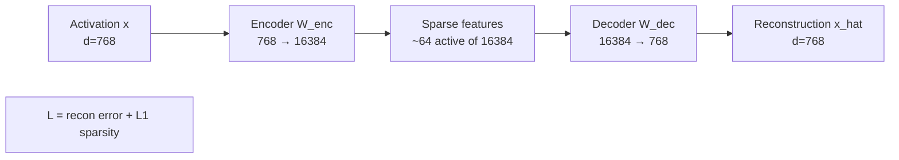

# 03 — Sparse Autoencoders Deep Dive

> [!info] TL;DR
> Sparse Autoencoders (SAEs) decompose a model's intermediate activations into a sparse combination of interpretable "features". Trained on activation data with an L1 sparsity penalty, SAEs learn a dictionary of feature directions such that most activations are explained by a few active features. SAEs are the leading approach to **scaling mechanistic interpretability** — they turn opaque high-dimensional activations into a sparse, human-reviewable set of concepts.

## The Problem Being Solved

[[01 - Mechanistic Interpretability|Mechanistic interpretability]] aims to understand what each part of a Transformer computes. But individual neurons are **polysemantic** — a single neuron might activate for "cats", "Python code", "French text", and "mathematical equations". This makes it impossible to assign a single, clean interpretation to each neuron.

The reason for polysemanticity: the model has more concepts to represent than it has neurons. Superposition theory (Elhage et al., 2022) explains this — the model represents features as *directions in activation space*, not as individual neurons, and packs many features into fewer dimensions using near-orthogonal directions. The features are recoverable (because they're approximately orthogonal), but only if you look at the full activation vector, not individual neurons.

Sparse Autoencoders address this by learning an **overcomplete dictionary** of features. Instead of `d` neurons, learn `k >> d` features, where each activation is a sparse combination of a few features. This unpacks the superposition: each feature (hopefully) corresponds to a single, interpretable concept.

## The Architecture

A sparse autoencoder is a simple two-layer network:

```
Encoder:  f(x) = ReLU(W_enc · x + b_enc)         # shape (k,) — k features
Decoder:  x_hat = W_dec · f(x) + b_dec            # shape (d,) — reconstruction
```

where:
- `x` is the activation vector (e.g., a hidden state from layer L of the Transformer).
- `W_enc` is `(k, d)` — projects from `d` dimensions to `k` features.
- `W_dec` is `(d, k)` — projects back from `k` features to `d` dimensions.
- `k >> d` (e.g., `d=768, k=16384`).

### The Loss Function
```
L(x) = ||x - x_hat||² + λ · ||f(x)||₁
```

The first term is reconstruction error (the SAE should reconstruct the original activation). The second term is an L1 penalty on the feature activations (most features should be inactive for any given input). `λ` controls the sparsity-quality trade-off.

### The Sparsity-Overcompleteness Trade-off
- **More features (larger k)**: the SAE can represent more concepts, but each feature may be harder to interpret (the SAE might split one concept into multiple features).
- **More sparsity (larger λ)**: fewer features are active per input, making interpretation easier, but reconstruction quality drops.

Typical settings: `k = 16× to 64× d`, `λ` chosen so that ~32–128 features are active per input.



## Training

### Data Collection
1. Run the base model (e.g., GPT-2 Small, Llama) on a diverse corpus (WebText, the Pile).
2. Collect the activation vector `x` at a specific layer (e.g., the residual stream after layer 8) for every token.
3. This gives millions of activation vectors, which become the SAE's training data.

### Training Loop
- Train the SAE on the collected activations.
- The base model is frozen — only the SAE's weights (`W_enc, W_dec, b_enc, b_dec`) are updated.
- Use Adam with learning rate ~1e-3, train for ~1B tokens worth of activations.

### Scaling
SAEs scale: larger k (more features) captures finer-grained concepts. OpenAI (2024) trained SAEs with 16M features on GPT-4 — the largest SAEs to date. Anthropic trained SAEs with ~34M features on Claude 3 Sonnet. The features at this scale capture very specific concepts (individual entities, programming constructs, scientific facts).

## What SAEs Reveal

### Feature Interpretability
Once trained, you can inspect what each feature responds to. The standard approach:

1. Find inputs that maximally activate a given feature.
2. Look at the patterns in those inputs.
3. Assign a human-interpretable label to the feature.

For example, a feature might activate maximally on:
- Sentences mentioning "DNA" or "genetics".
- Code that defines a function.
- Sentences in French.
- Text about baseball statistics.
- Images of currency (in vision models).

The hope (largely validated in 2024–2025) is that SAE features are **monosemantic** — each feature corresponds to a single, interpretable concept. This is in contrast to polysemantic neurons, which respond to multiple unrelated concepts.

### Circuit Analysis
SAEs enable circuit-level analysis. Once you know which features represent which concepts, you can trace how those features are computed and used:

- Which attention heads write to a feature? (Reading from attention patterns.)
- Which downstream features does a feature influence? (Following the residual stream.)
- How do features combine to produce behavior? (Compositional analysis.)

This is the foundation of mechanistic interpretability at scale — instead of analyzing individual neurons (which are polysemantic), you analyze features (which are monosemantic).

### Steering and Control
Once you identify a feature for a specific concept (e.g., "sycophancy", "harmfulness", "honesty"), you can steer the model by clamping that feature's activation:

```python
# During inference, artificially increase the "honesty" feature
feature_idx = 12345  # the feature for honesty
saefeatures[feature_idx] = 10.0  # clamp to high value

# Reconstruct the modified activation
modified_x = W_dec @ sae_features + b_dec

# Continue forward pass with modified activation
```

This has been shown to steer model behavior in interpretable ways (e.g., making a model more honest, less sycophantic, or more cautious). It's a promising approach to alignment via interpretability.

## Key Results (2023–2025)

### Scaling Laws for SAEs
SAE quality (measured by reconstruction loss and feature interpretability) scales with k. Larger dictionaries capture more concepts and split coarse features into finer-grained ones. There's no sign of saturation at the scales tested so far (up to 34M features).

### Feature Universality
Features learned by SAEs trained on different models (GPT-2, Llama, Claude) show significant overlap — many features represent the same concepts across models. This suggests that the underlying concepts are properties of the data, not arbitrary artifacts of training.

### Claude 3 Sonnet SAEs (Anthropic, 2024)
Anthropic trained SAEs on Claude 3 Sonnet and found features for:
- Specific entities (the Golden Gate Bridge, individual people).
- Abstract concepts (deception, immunity, code bugs).
- Safety-relevant features (harmful intent, sycophancy).
- Multilingual features (a single feature for "code" that activates across programming languages).

The "Golden Gate Bridge" feature was so reliably activating that Anthropic released a "Golden Gate Claude" variant where that feature was clamped high — the model became obsessed with the bridge in every response.

### Scaling to GPT-4 (OpenAI, 2024)
OpenAI trained SAEs with 16M features on GPT-4. The features captured highly specific concepts (individual programming languages, scientific subfields, literary genres). This demonstrated that SAEs scale to frontier models, though the analysis becomes harder as the feature count grows.

## Limitations

### Feature Splitting
As k increases, a single concept might split into multiple features (e.g., "DNA" splits into "DNA in biology context", "DNA in crime context", "DNA in genetics research"). This makes interpretation harder — you need to cluster related features.

### Reconstruction Quality
SAEs typically reconstruct only 60–90% of the variance in activations. The unreconstructed portion might contain important information. The trade-off: better reconstruction requires denser features (less sparsity), which hurts interpretability.

### Interpretation is Still Manual
Despite monosemantic features, labeling them still requires human inspection. Automated labeling (using another LLM to interpret feature activations) is an active research area but not yet reliable.

### Computational Cost
Training SAEs at scale is expensive. OpenAI's GPT-4 SAEs required significant compute. Collecting activations from a frontier model is itself expensive (you have to run the model on a large corpus).

### Features ≠ Causal Mechanisms
SAE features tell you what concepts are *represented*, but not necessarily what concepts are *causally important*. A feature might activate on "French text" without being the cause of the model's French-language behavior. Establishing causality requires intervention (see [[04 - Activation Patching and Causal Tracing]]).

## Tooling

- **SAELens** (Joseph Bloom): open-source SAE training and analysis toolkit. Integrates with TransformerLens.
- **TransformerLens** (Neel Nanda): includes SAE training utilities.
- **Anthropic's SAE visualizer**: web UI for browsing features (released for Claude 3 Sonnet).
- **OpenAI's SAE explorer**: web UI for GPT-4 SAE features.

## Future Directions

- **Better sparsity penalties**: L1 has known issues (it penalizes large activations too much). Alternative penalties (TopK, JumpReLU) show promise.
- **Cross-layer SAEs**: train SAEs across multiple layers simultaneously, to capture how features evolve through the model.
- **Automated feature interpretation**: use LLMs to label features automatically, scaling interpretation beyond manual inspection.
- **Feature steering for alignment**: use identified features to control model behavior in production (not just research).

## See Also

- [[01 - Mechanistic Interpretability]]
- [[02 - Logit Lens and Tuned Lens]]
- [[04 - Activation Patching and Causal Tracing]]
- [[05 - Probing]]
- [[14 - Interpretability/MOC|14 Interpretability MOC]]
