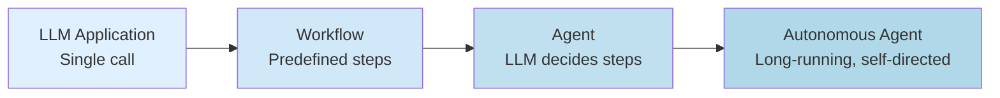

# Agent vs Workflow vs LLM Application

> [!info] TL;DR
> Not every LLM use case is an agent. The spectrum: **LLM application** (single call) → **workflow** (multi-step, predefined flow) → **agent** (LLM decides next step) → **autonomous agent** (long-running, self-directed). Knowing where on the spectrum you are determines architecture, tools, and cost.

## The Spectrum



Each step adds: autonomy + complexity + cost + capability.

## 1. LLM Application (Single Call)

The simplest case: prompt in, response out. No tools, no iteration, no state.

```python
response = llm.chat(prompt="Translate to French: Hello")
print(response)  # "Bonjour"
```

**Examples**: translation, single-turn Q&A, classification, summarization of a single document.

**Architecture**:
- One LLM call.
- No state.
- No tools.
- No control flow beyond the call.

**When to use**: when the task fits in a single prompt and doesn't require tools or multi-step reasoning. Most "wrap an LLM API" projects start here.

## 2. Workflow (Multi-Step, Predefined Flow)

A sequence of LLM calls (and possibly other operations) with a **predefined control flow**. The LLM doesn't decide what to do next — the developer does.

```python
# RAG pipeline (simplified)
docs = retrieve(query)
context = compress(docs)
answer = llm.chat(prompt=f"Answer: {query}\nContext: {context}")
citation = llm.chat(prompt=f"Generate citation for: {answer}")
return answer, citation
```

**Examples**: RAG pipelines, document processing pipelines, content moderation, ETL with LLM transformations.

**Architecture**:
- Multiple LLM calls in a defined sequence.
- May include tools (retrieval, search, APIs).
- Control flow is hard-coded by the developer.
- LLM is invoked at specific steps but doesn't control the flow.

**When to use**: when the task has predictable structure and you want reliability. Most production LLM features are workflows, not agents.

## 3. Agent (LLM Decides Next Step)

The LLM is in a loop: it decides what to do next based on observations so far. Tools are available; the LLM chooses which to call (if any).

```python
# ReAct-style agent (simplified)
messages = [system_prompt, user_goal]
while True:
    response = llm.chat(messages=messages, tools=available_tools)
    if response.tool_calls:
        for call in response.tool_calls:
            result = execute_tool(call)
            messages.append(tool_result_message(result))
    else:
        return response.content  # final answer
```

**Examples**: coding assistants (Claude Code, Cursor, Cline), research agents (Perplexity Pro), customer support agents, autonomous web browsers.

**Architecture**:
- LLM in a loop with tool access.
- LLM decides when to call tools, which to call, and when to stop.
- State is maintained across iterations (messages list).
- Tools are a first-class concept.

**When to use**: when the task requires adaptive multi-step reasoning — the right next step depends on what you observed in the previous steps.

## 4. Autonomous Agent (Long-Running, Self-Directed)

An agent that runs for an extended period (hours, days, indefinitely), pursues high-level goals, manages its own state, and may interact with humans opportunistically.

```python
# Autonomous agent loop (simplified)
while True:
    goals = load_goals()
    plan = planner(goals, current_state)
    for step in plan:
        result = execute(step)
        observe(result)
        if needs_human_input(result):
            await request_human_input()
        update_state(result)
    sleep(until_next_iteration)
```

**Examples**: Devin (autonomous coder), AutoGPT, BabyAGI, self-driving research agents, automated DevOps.

**Architecture**:
- Long-running loop (could be event-driven or scheduled).
- Persistent state across sessions (database, vector store, knowledge graph).
- Self-planning and self-reflection.
- May include human-in-the-loop checkpoints.
- Handles failure, retry, and escalation.

**When to use**: when the task is open-ended, long-running, and would benefit from autonomous operation. Be cautious — these are hard to debug and can run up large bills.

## Comparison Table

| Property          | LLM App  | Workflow    | Agent              | Autonomous Agent   |
|-------------------|----------|-------------|--------------------|--------------------|
| Control flow      | Single   | Predefined  | LLM decides        | LLM decides + plans|
| Number of LLM calls| 1       | Fixed       | Variable           | Variable, ongoing  |
| Tools             | None     | Fixed       | Available, chosen  | Many, dynamic      |
| State             | None     | Within-pipeline | Across iterations | Persistent         |
| Typical duration  | Seconds  | Seconds–minutes | Minutes–hours    | Hours–days         |
| Cost predictability| High    | High        | Medium             | Low                |
| Debugging         | Easy     | Easy        | Hard               | Very hard          |
| Failure mode      | Bad output | Pipeline stage fails | Loop, no convergence | Drift, runaway costs |

## Why This Matters for AI

- Knowing where on the spectrum you are determines **everything**: architecture, framework choice, cost model, reliability approach, debugging strategy.
- **Most production use cases should be workflows, not agents.** Workflows are predictable, testable, and cheap. Agents are powerful but unpredictable.
- The AI industry has a tendency to over-agent-ify problems. If a workflow solves your problem, use a workflow.
- True autonomy (level 4) is still research-grade for most applications. Be skeptical of claims of "fully autonomous agents" — they usually have humans in the loop somewhere.

## How to Decide

Ask yourself:

1. Can a single LLM call solve this? → **LLM application**.
2. Is the multi-step flow predictable in advance? → **Workflow**.
3. Does the next step depend on what we observe? → **Agent**.
4. Is the task long-running and open-ended? → **Autonomous agent** (proceed with caution).

## Production Implications

- **Default to workflows.** Move to agents only when workflows can't solve the problem.
- **For agents**, set strict limits: max iterations, max tool calls, max cost per run.
- **For autonomous agents**, add monitoring and kill switches. They will eventually do something unexpected.
- **Cost management**: agents can burn through tokens fast. Budget per run, per user, per day.
- **Observability**: trace every LLM call, tool call, and observation. Without traces, agents are impossible to debug.

## Common Pitfalls

- **Calling everything an "agent"** — dilutes the term. A RAG pipeline is a workflow, not an agent.
- **Defaulting to agents when workflows would do** — wastes complexity and cost.
- **No iteration limits on agents** — agents can loop forever, burning money.
- **No tool-call validation** — agents will pass invalid arguments to tools. Validate before executing.
- **Trusting agent output without verification** — agents hallucinate, especially in long contexts. Verify critical actions.

## Further Reading

- Anthropic, *Building Effective Agents* (2024) — excellent overview.
- Lilian Weng, *LLM Powered Autonomous Agents* (blog, 2023).
- Harrison Chase, *Agents vs Workflows* (LangChain blog).

## See Also

- [[ReAct Pattern]]
- [[Chain-of-Thought]]
- [[Function Calling]]
- [[Reflection]]
- [[15 - AI Agents/MOC|AI Agents MOC]]
- [[16 - Multi-Agent Systems/MOC|Multi-Agent Systems MOC]]
