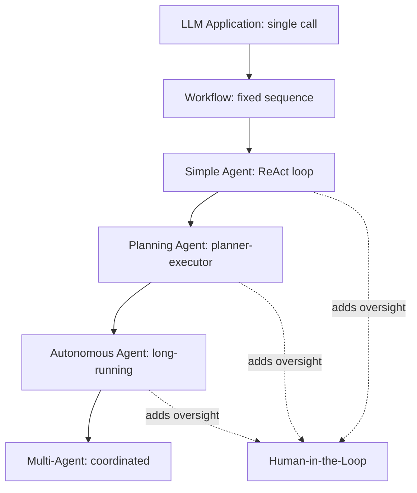

# 15 — AI Agents MOC

> [!info] Agents are LLMs that take actions in the world via tool calls, observe results, and iterate. Iteration 6 added three new notes: Planner-Executor Pattern (global planning vs. ReAct's greedy step-by-step), Autonomous Agent Lifecycles (production engineering for long-running agents), and Human-in-the-Loop Patterns (adding oversight at critical points).

## Reading Order

| #   | Note                                              | Sub-domain   | Purpose                                            |
|-----|---------------------------------------------------|--------------|----------------------------------------------------|
| 01  | [[01 - Agent vs Workflow vs LLM Application]]     | Architecture | What is (and isn't) an agent.                      |
| 02  | [[02 - Chain-of-Thought]]                         | Reasoning    | The foundational reasoning technique.              |
| 03  | [[03 - ReAct Pattern]]                            | Reasoning    | Reasoning + Acting; the agent loop.                |
| 04  | [[04 - Function Calling]]                         | Tool Calling | How agents invoke tools.                           |
| 05  | [[05 - Reflection]]                               | Patterns     | Self-improvement via past attempts.                |
| 06  | [[06 - Tree of Thoughts and Self Consistency]]    | Reasoning    | Advanced multi-branch reasoning.                   |
| 07  | [[07 - Planner-Executor Pattern]]                 | Planning     | Upfront planning + sequential execution.           |
| 08  | [[08 - Autonomous Agent Lifecycles]]              | Autonomy     | Production engineering for long-running agents.    |
| 09  | [[09 - Human-in-the-Loop Patterns]]               | Autonomy     | Approval gates, escalation, supervision.           |

## Sub-Domains

- [[15 - AI Agents/Architecture/01 - Agent vs Workflow vs LLM Application|Architecture]] — note 01
- [[15 - AI Agents/Planning/07 - Planner-Executor Pattern|Planning]] — note 07
- [[15 - AI Agents/Reasoning/03 - ReAct Pattern|Reasoning]] — notes 02, 03, 06
- [[15 - AI Agents/Tool Calling/04 - Function Calling|Tool Calling]] — note 04
- [[15 - AI Agents/Patterns/05 - Reflection|Patterns]] — note 05
- [[15 - AI Agents/Autonomy/08 - Autonomous Agent Lifecycles|Autonomy]] — notes 08, 09

## The Agent Landscape

Each level adds capability but also complexity. Most production agents are at the "Planning Agent" level; autonomous and multi-agent systems are emerging.

## Why This Matters for AI Engineers

Agents are the frontier of LLM applications. Understanding the patterns in this chapter is essential for:

- **Building production agents**: choosing the right pattern (ReAct, planner-executor, hierarchical).
- **Adding oversight**: knowing when and how to add human-in-the-loop.
- **Designing lifecycles**: production agents need checkpointing, monitoring, cost control.
- **Choosing frameworks**: LangGraph, AutoGen, CrewAI, PydanticAI each suit different patterns.

## Cross-Domain Connections

- [[16 - Multi-Agent Systems/MOC|16 Multi-Agent Systems]] — multi-agent coordination.
- [[17 - RAG/MOC|17 RAG]] — RAG is a tool agents use.
- [[18 - Memory Systems/MOC|18 Memory Systems]] — agents need memory.
- [[19 - MCP/MOC|19 MCP]] — MCP exposes tools to agents.
- [[25 - Frameworks and Tools/MOC|25 Frameworks]] — agent frameworks.
- [[26 - Papers/Agents and RAG/MOC|26 Papers (Agents and RAG)]] — landmark agent papers.

## Future Expansion (Iteration 7+)

- Tool selection strategies.
- Error recovery patterns.
- Long-running memory consolidation.
- Agent evaluation methodologies.

## See Also

- [[16 - Multi-Agent Systems/MOC|16 Multi-Agent Systems]]
- [[17 - RAG/MOC|17 RAG]]
- [[18 - Memory Systems/MOC|18 Memory Systems]]
- [[19 - MCP/MOC|19 MCP]]
- [[25 - Frameworks and Tools/MOC|25 Frameworks]]
