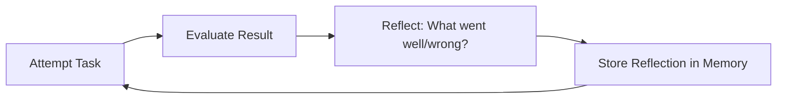

# Reflection

> [!info] TL;DR
> Reflection is the agent pattern of "looking back" on past actions to improve future ones. After completing (or failing) a task, the agent verbalizes what went well, what went wrong, and what to do differently. The reflection is added to memory and consulted in future attempts.

## The Idea

Without reflection, an agent that fails a task will often fail the same way next time — it has no memory of past mistakes. Reflection adds a feedback loop:



This is inspired by how humans learn: we don't just do things, we think about how we did them and adjust.

## The Reflexion Algorithm (Shinn et al., 2023)

The canonical reference:

1. **Attempt**: the agent tries the task (using ReAct or similar).
2. **Evaluate**: an evaluator (rule-based, human, or LLM-as-judge) scores the result.
3. **Reflect**: if the result is unsatisfactory, the agent produces a reflection — a verbal summary of what went wrong and what to try differently.
4. **Store**: the reflection is added to long-term memory.
5. **Retry**: the agent attempts again, this time with access to past reflections.

After a few iterations, the agent has built up a "lessons learned" memory that substantially improves performance.

## Worked Example

**Task**: Write a function that sorts a list.

**Attempt 1**:
```
Thought: I'll use bubble sort.
Action: write_code("""
def sort(lst):
    for i in range(len(lst)):
        for j in range(len(lst) - 1):
            if lst[j] > lst[j+1]:
                lst[j], lst[j+1] = lst[j+1], lst[j]
    return lst
""")
Observation: code written
Thought: Done.
Action: finish("sort function written")
```

**Evaluation**: tests fail — `sort([3,1,2])` returns `[1,2,3]` correctly, but `sort([])` returns `[]` correctly too. Wait, actually all tests pass... but the code is inefficient.

Hmm, let's say tests fail because of an off-by-one error.

**Reflection 1**:
> The bubble sort implementation had an off-by-one error in the inner loop. The condition `range(len(lst) - 1)` should be `range(len(lst) - 1 - i)` to avoid re-checking already-sorted elements. Next time, I should test edge cases (empty list, single element) and consider efficiency.

**Attempt 2** (with reflection in context):
```
Thought: Past reflection says to use `range(len(lst) - 1 - i)` and to handle edge cases. Let me use Python's built-in sort for simplicity and correctness.
Action: write_code("""
def sort(lst):
    return sorted(lst)
""")
Observation: code written, all tests pass
Action: finish("used built-in sorted()")
```

The reflection led to a better solution.

## Variants

### Self-reflection
The agent evaluates its own work without external feedback. Useful but limited — the agent can't catch errors it doesn't know it's making.

### External evaluation
A separate evaluator (rule-based tests, human review, LLM-as-judge) provides the signal. More reliable but more expensive.

### Reflection on success
Reflect on what went well, not just what failed. Reinforces good strategies. Rare in practice but useful.

### Continuous reflection
Reflect during the task, not just after. The agent periodically steps back and asks "is this approach working?" Useful for long-running agents.

### Reflexion with retrieval
Store reflections in a vector store and retrieve relevant ones for new tasks. Generalizes lessons across tasks, not just within a single task's retries.

## Implementation Sketch

```python
def reflexion_agent(task, max_attempts=3):
    reflections = []
    
    for attempt in range(max_attempts):
        # Attempt the task with past reflections in context
        result, trace = react_agent(task, additional_context=reflections)
        
        # Evaluate
        score = evaluator(task, result)
        if score == "pass":
            return result
        
        # Reflect
        reflection = llm.chat(
            f"Task: {task}\nAttempt: {trace}\nResult: {result}\nScore: {score}\n\n"
            f"What went wrong? What should you do differently next time?"
        )
        reflections.append(reflection)
    
    return result  # best effort after max attempts
```

## Why This Matters for AI

- Reflection is **the** self-improvement pattern for agents. Without it, agents repeat mistakes; with it, they learn within a session.
- Reflexion (the paper) showed substantial improvements on coding (HumanEval), decision-making (ALFWorld), and reasoning (HotpotQA) — often 10–30% absolute improvement.
- Reflection is the basis for many advanced patterns: Self-Refine, Self-Critique, Constitutional AI, and RLAIF.
- For long-running autonomous agents, reflection is essential — it's how they accumulate "experience" without retraining.

## Production Implications

- **Add reflection to agents that retry tasks**. A simple "what went wrong?" prompt after failure often yields 10%+ improvement.
- **Store reflections persistently**. Don't lose them between sessions — they're the agent's "experience".
- **Use LLM-as-judge for evaluation** when ground-truth tests aren't available. Cheap and effective.
- **Limit reflection length**. Reflections can ramble; cap at 200–500 tokens per reflection.
- **Reflection is not free** — it adds LLM calls. Use it for high-stakes tasks, not every interaction.

## Common Pitfalls

- **Reflecting without acting on reflections** — if reflections aren't fed back into context, they don't help.
- **Reflecting too much** — endless reflection loops burn tokens without progress. Cap reflection iterations.
- **Self-evaluation bias** — agents tend to rate themselves too positively. Use external evaluators when possible.
- **Reflection drift** — over many iterations, reflections can drift away from the actual problem. Periodically reset.
- **Forgetting the original goal** — long reflection chains can lose sight of the task. Always include the original task in context.

## Further Reading

- Shinn et al. (2023), *Reflexion: Language Agents with Verbal Reinforcement Learning*.
- Madaan et al. (2023), *Self-Refine: Iterative Refinement with Self-Feedback*.
- Huang et al. (2022), *Large Language Models Cannot Self-Correct Reasoning Yet* (a counterpoint — self-reflection doesn't always work).

## See Also

- [[ReAct Pattern]]
- [[Chain-of-Thought]]
- [[Function Calling]]
- [[15 - AI Agents/MOC|AI Agents MOC]]
- [[18 - Memory Systems/MOC|Memory Systems MOC]] — reflections need storage


## Interview Questions

1. **Q: What is the Reflexion algorithm and how does it work?**
   A: (1) Attempt: the agent tries the task (using ReAct or similar). (2) Evaluate: an evaluator (rule-based, human, or LLM-as-judge) scores the result. (3) Reflect: if unsatisfactory, the agent produces a verbal reflection — what went wrong and what to try differently. (4) Store: the reflection is added to memory. (5) Retry: the agent attempts again with past reflections in context. After a few iterations, the "lessons learned" memory substantially improves performance (10-30% absolute improvement on coding, reasoning tasks).

2. **Q: When does self-reflection fail?**
   A: (1) The agent can't catch errors it doesn't know it's making (self-evaluation bias). (2) Reflections can drift away from the actual problem over many iterations. (3) Endless reflection loops burn tokens without progress. (4) Huang et al. (2022) showed LLMs "cannot self-correct reasoning yet" — self-reflection on reasoning tasks without external feedback often doesn't improve accuracy. Use external evaluators when possible.

3. **Q: How is reflection different from fine-tuning?**
   A: Reflection is in-context learning: the agent stores reflections in the prompt/context for the next attempt. No weight updates. Fine-tuning: weight updates from data. Reflection is instant (no training) but limited to the current session. Fine-tuning is permanent but expensive. For production: start with reflection; if the same reflections recur across sessions, consider fine-tuning on them.

4. **Q: What is the difference between self-reflection and external evaluation?**
   A: Self-reflection: the agent evaluates its own work. Cheap but limited — the agent can't catch unknown errors. External evaluation: a separate evaluator (tests, human review, LLM-as-judge) provides the signal. More reliable but more expensive. For coding: use tests (external). For writing: use LLM-as-judge. For creative tasks: use human review.

5. **Q: How do you prevent reflection loops from running forever?**
   A: (1) Max iteration count — hard limit (e.g., 3 attempts). (2) No-progress detection — if state hasn't changed in N iterations, terminate. (3) Repeated action detection — if the same action is taken 3+ times, terminate. (4) Cost/time budget — hard limits on tokens and wall-clock time. Always have a termination condition.

6. **Q: How does reflection relate to Constitutional AI and RLAIF?**
   A: Constitutional AI uses AI feedback (a model critiques its own outputs against principles) instead of human feedback. This is large-scale reflection — the model reflects on its outputs during training, not just inference. The reflection pattern (inference-time) and RLAIF (training-time) are the same idea applied at different scales: inference-time self-critique vs training-time self-critique.

## Connection to Other Concepts

- [[15 - AI Agents/Reasoning/03 - ReAct Pattern|ReAct Pattern]] — the base agent loop that reflection enhances.
- [[15 - AI Agents/Reasoning/02 - Chain-of-Thought|Chain-of-Thought]] — reasoning technique used in reflection.
- [[15 - AI Agents/Reasoning/06 - Tree of Thoughts and Self Consistency|ToT and Self-Consistency]] — alternative reasoning patterns.
- [[15 - AI Agents/Autonomy/08 - Autonomous Agent Lifecycles|Autonomous Agent Lifecycles]] — reflection in long-running agents.
- [[18 - Memory Systems/Types/01 - Memory Types|Memory Types]] — reflections need persistent storage.
- [[26 - Papers/Agents and RAG/32 - Reflexion 2023|Reflexion 2023]] — the paper.
- [[26 - Papers/Agents and RAG/33 - Self-Refine 2023|Self-Refine 2023]] — iterative refinement.
- [[26 - Papers/Alignment/31 - Constitutional AI 2022|Constitutional AI]] — training-time reflection.
