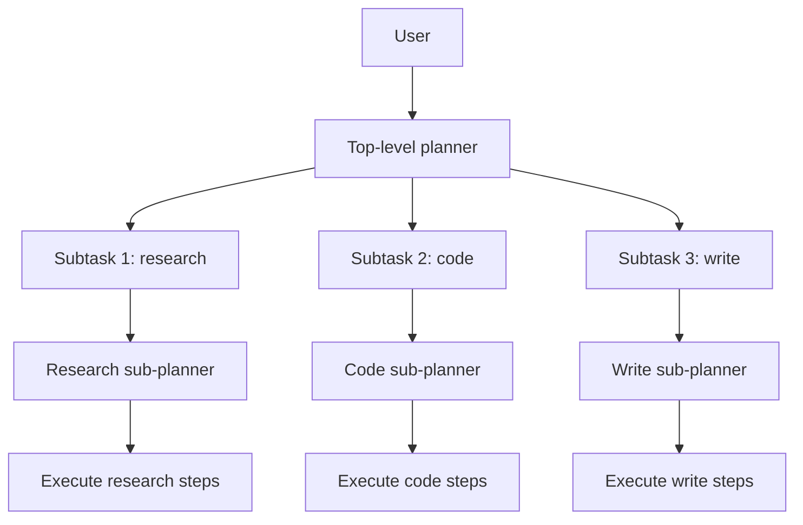

# 07 — Planner-Executor Pattern

> [!info] TL;DR
> The planner-executor pattern (also called plan-and-execute) decomposes a complex task into a sequence of subtasks upfront, then executes each subtask sequentially or in parallel. Unlike ReAct (which interleaves reasoning and action step-by-step), planner-executor separates the **planning** phase from the **execution** phase. This produces more coherent multi-step behavior because the planner considers the whole task before acting, avoiding the "greedy local choice" failure mode of ReAct. The pattern is used in production agent systems (LangChain's Plan-and-Execute, LangGraph's planner-executor template, CrewAI's hierarchical process) because it's more reliable than ReAct for tasks requiring 5+ steps.

## Why Planner-Executor

ReAct (see [[03 - ReAct Pattern]]) is the simplest agent pattern: reason, act, observe, repeat. It works well for short tasks (3-5 steps) but has known failure modes for longer tasks:

### Greedy Local Choices

At each step, ReAct picks the next action based on the current state. This is greedy — it doesn't consider whether the action advances the long-term goal. A ReAct agent might spend 5 steps exploring an irrelevant tool because each step looked promising locally.

### No Global Plan

ReAct has no global plan. If the agent is asked to "write a research report on X," it doesn't decompose this into "search for X, read sources, outline, draft, edit." It just takes the next reasonable step, which may not advance toward the report.

### Drift

Over many steps, ReAct agents drift. The conversation history grows; the original goal becomes less salient; the agent starts repeating itself or exploring tangents.

### Wasted Tool Calls

ReAct makes tool calls that, in hindsight, were unnecessary. Without a plan, the agent doesn't know what information it will need, so it gathers everything that might be relevant.

Planner-executor addresses these by **planning first**. The planner decomposes the task into a sequence of subtasks; the executor runs each subtask. The plan provides global structure; the executor handles local execution.

## The Pattern

### Phase 1: Planning

The planner (an LLM with a planning prompt) takes the user's request and produces a list of subtasks:

```python
PLANNER_PROMPT = """You are a planner. Decompose the user's request into a sequence of subtasks.

Each subtask should:
1. Be specific and actionable.
2. Specify the executor type (e.g., "search", "code", "write").
3. List dependencies on prior subtasks.

Output a JSON list of subtasks.

User request: {request}
"""
```

Example output for "Write a research report on Mamba-2":

```json
[
  {"id": 1, "description": "Search for the Mamba-2 paper and read the abstract.", "executor": "search", "dependencies": []},
  {"id": 2, "description": "Find 3 blog posts explaining Mamba-2's SSD formulation.", "executor": "search", "dependencies": [1]},
  {"id": 3, "description": "Read the paper's experiments section and summarize results.", "executor": "read", "dependencies": [1]},
  {"id": 4, "description": "Write an outline for the report based on gathered information.", "executor": "write", "dependencies": [2, 3]},
  {"id": 5, "description": "Write the full report following the outline.", "executor": "write", "dependencies": [4]}
]
```

### Phase 2: Execution

The executor runs each subtask in dependency order:

```python
def execute_plan(plan, executors):
    results = {}
    for subtask in topological_sort(plan):
        # Gather inputs from dependencies
        inputs = [results[dep_id] for dep_id in subtask["dependencies"]]
        
        # Pick the executor
        executor = executors[subtask["executor"]]
        
        # Execute
        result = executor.run(subtask["description"], inputs)
        results[subtask["id"]] = result
        
        # Stream progress to UI
        emit_progress(subtask, result)
    
    return results
```

Subtasks with no dependencies can run in parallel; subtasks with dependencies run sequentially after their dependencies complete.

### Phase 3: Synthesis

After all subtasks complete, the synthesizer (often the planner LLM) combines the results into the final answer:

```python
SYNTHESIZER_PROMPT = """You are a synthesizer. Combine the subtask results into the final answer for the user.

User's original request: {request}

Subtask results:
{results}

Write the final answer:
"""
```

## Comparison to ReAct

| Aspect                  | ReAct                              | Planner-Executor                    |
|-------------------------|------------------------------------|-------------------------------------|
| Planning                | None (greedy step-by-step)         | Upfront global plan                 |
| Tool calls              | Potentially wasteful               | Targeted to plan                    |
| Coherence over long tasks| Drifts                            | Stays on plan                       |
| Adaptability            | High (replans each step)           | Low (stuck with initial plan)       |
| Latency                 | Higher (LLM call per step)         | Lower (fewer LLM calls)             |
| Implementation complexity| Simple                            | Moderate                            |

ReAct is better for tasks where the plan is unclear and the agent must explore. Planner-executor is better for tasks where the structure is known in advance (research, writing, multi-step data processing).

## Variations

### Replanning (Dynamic Planner-Executor)

The plan is not fixed. After each subtask, the planner can revise the remaining plan based on what was learned:

```python
for subtask in plan:
    result = execute(subtask)
    if result.requires_replan:
        remaining_plan = planner.replan(original_request, completed_subtasks, result)
        plan = completed_subtasks + remaining_plan
```

This combines the structure of planner-executor with the adaptability of ReAct. LangGraph's planner-executor template supports this pattern.

### Hierarchical Planning

The planner produces a high-level plan; each high-level subtask is decomposed by a sub-planner into a detailed plan. This is the multi-agent hierarchy from [[04 - Enterprise Multi-Agent Architectures]]:



This is appropriate for very complex tasks (multi-day projects) where a single level of planning is insufficient.

### ReWOO (Reasoning WithOut Observation)

ReWOO is a variant where the planner generates the entire plan including tool calls before any execution. The executor then runs all tool calls without further LLM reasoning. This minimizes LLM calls (one for planning, one for synthesis) at the cost of no adaptation.

ReWOO is appropriate when tool calls are reliable (no error recovery needed) and the plan is clear. It's faster than ReAct (fewer LLM calls) but less robust to surprises.

### Parallel Execution

Subtasks with no dependencies can execute in parallel. This is a major advantage over ReAct (which is inherently sequential). For tasks with independent subtasks (e.g., "research topic A, B, and C"), parallel execution can be 3-5× faster.

## Production Patterns

### Validate the Plan

Before executing, validate the plan:

- Are all dependencies satisfiable (no cycles)?
- Are all executor types known?
- Is the plan reasonable in length (not 100 subtasks)?

A bad plan wastes compute; validating upfront catches issues early.

### Set Maximum Subtask Count

Planners can over-decompose simple tasks. Set a maximum (e.g., 10 subtasks). If the planner exceeds it, ask for a more concise plan.

### Use Structured Outputs

Use JSON schema constrained decoding (see [[07 - Constrained Decoding and CFG]]) for the planner's output. Without it, planners produce malformed JSON 5-10% of the time, breaking the executor.

### Stream Progress

Stream each subtask's start and completion to the UI. Users tolerate long agent runs if they see progress. A 30-second wait with no progress feels broken; with progress updates, it feels fine.

### Cache Subtask Results

If the same subtask is requested multiple times (e.g., "search for X" appears in multiple plans), cache the result. This is especially valuable for search and read operations.

### Handle Subtask Failures

Subtasks can fail (tool errors, API timeouts, bad inputs). The executor should:

1. Retry the subtask (with backoff).
2. If retries fail, mark the subtask as failed and continue with dependent subtasks.
3. At synthesis time, note which subtasks failed and adjust the final answer accordingly.

## When to Use Planner-Executor

### Good Fit
- **Multi-step research**: gather, synthesize, write.
- **Content pipelines**: outline, draft, edit, publish.
- **Data processing**: extract, transform, load, analyze.
- **Code generation**: design, implement, test, document.
- **Any task with 5+ steps and known structure**.

### Poor Fit
- **Short tasks** (1-3 steps): ReAct is simpler.
- **Exploratory tasks**: where the plan can't be known upfront.
- **Highly adaptive tasks**: where each step's outcome changes the next step.
- **Real-time tasks**: where the upfront planning delay is unacceptable.

## Common Pitfalls

### Over-Decomposition

Planners love to decompose. A 2-step task becomes 10 subtasks, each with overhead. Set a minimum subtask granularity ("each subtask should produce meaningful output, not just call one tool").

### Ignoring Dependencies

If the planner's dependency list is wrong, the executor may run subtasks out of order, producing incoherent results. Validate dependencies before execution.

### Plan Drift

The plan was good, but the first subtask's result changes the situation. The remaining plan is now wrong. Solution: use replanning (above) to revise the plan based on results.

### Single-Point-of-Failure Planning

If the planner is bad (poor prompt, weak model), the entire agent fails. Test the planner independently before deploying.

### No Synthesis

Some implementations skip the synthesis phase and just concatenate subtask results. This produces a disjointed final answer. Always run the synthesizer.

## See Also

- [[03 - ReAct Pattern]] — the alternative pattern
- [[02 - Chain-of-Thought]] — reasoning technique used in planning
- [[06 - Tree of Thoughts and Self Consistency]] — more advanced planning
- [[05 - Reflection]] — can be added to planner-executor for self-improvement
- [[08 - Autonomous Agent Lifecycles]] — long-running planner-executor agents
- [[09 - Human-in-the-Loop Patterns]] — adding HiTL to planner-executor
- [[06 - Build a Multi-Agent System]] — project implementing this pattern
- [[15 - AI Agents/MOC|15 AI Agents MOC]]


## Interview Questions

1. **Q: What is the key advantage of planner-executor over ReAct?**
   A: Planner-executor creates a global plan upfront, avoiding ReAct's "greedy local choice" failure mode. ReAct picks the next action based only on the current state; planner-executor considers the whole task before acting. This produces more coherent multi-step behavior (5+ steps) because the plan provides global structure.

2. **Q: What is ReWOO and when would you use it?**
   A: ReWOO (Reasoning WithOut Observation) generates the entire plan including tool calls before any execution. The executor runs all tool calls without further LLM reasoning. Minimizes LLM calls (one for planning, one for synthesis). Use when tool calls are reliable (no error recovery needed) and the plan is clear. Faster than ReAct but less robust to surprises.

3. **Q: How does replanning work?**
   A: After each subtask, the planner can revise the remaining plan based on what was learned: if a subtask's result changes the situation, the planner generates a new plan for the remaining subtasks. This combines the structure of planner-executor with the adaptability of ReAct. LangGraph's planner-executor template supports this pattern.

4. **Q: When is planner-executor a poor fit?**
   A: (1) Short tasks (1-3 steps) — ReAct is simpler. (2) Exploratory tasks — where the plan can't be known upfront. (3) Highly adaptive tasks — where each step's outcome changes the next step. (4) Real-time tasks — the upfront planning delay is unacceptable. Planner-executor is best for tasks with 5+ steps and known structure (research, writing, data processing).

5. **Q: How do you handle subtask failures in planner-executor?**
   A: (1) Retry the subtask with backoff. (2) If retries fail, mark the subtask as failed and continue with dependent subtasks. (3) At synthesis time, note which subtasks failed and adjust the final answer. (4) Use replanning if the failure invalidates the remaining plan. Always have a failure handling strategy — subtask failures are common in production.

6. **Q: How does hierarchical planning work?**
   A: The top-level planner produces a high-level plan; each high-level subtask is decomposed by a sub-planner into a detailed plan. This is appropriate for very complex tasks (multi-day projects) where a single level of planning is insufficient. Each level has its own planner-executor pair. The coordinator (top-level) monitors worker (sub-level) progress and synthesizes results.

## Connection to Other Concepts

- [[15 - AI Agents/Reasoning/03 - ReAct Pattern|ReAct Pattern]] — the alternative pattern.
- [[15 - AI Agents/Reasoning/02 - Chain-of-Thought|Chain-of-Thought]] — reasoning used in planning.
- [[15 - AI Agents/Reasoning/06 - Tree of Thoughts and Self Consistency|ToT]] — more advanced planning.
- [[15 - AI Agents/Patterns/05 - Reflection|Reflection]] — can be added for self-improvement.
- [[15 - AI Agents/Autonomy/08 - Autonomous Agent Lifecycles|Autonomous Agents]] — long-running planner-executor.
- [[15 - AI Agents/Autonomy/09 - Human-in-the-Loop Patterns|HiTL]] — adding oversight.
- [[16 - Multi-Agent Systems/Architectures/01 - Multi-Agent Architectures|Multi-Agent Architectures]] — hierarchical planning.
- [[25 - Frameworks and Tools/Agent Frameworks/03 - LangGraph|LangGraph]] — planner-executor template.
