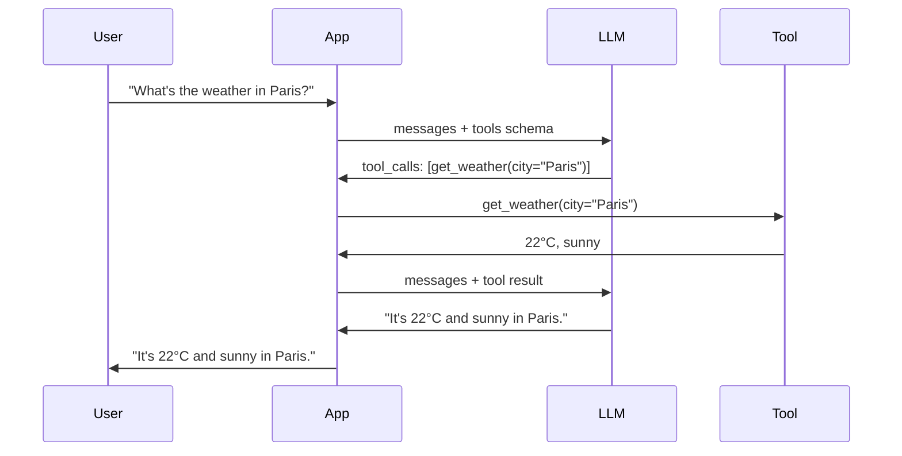

# Function Calling

> [!info] TL;DR
> Function calling is the LLM API feature that lets the model invoke external tools via structured JSON. The model decides which function to call and with what arguments; the framework executes the function and returns the result. The modern foundation of agent tool use.

## The Two Eras

### Era 1: Text-parsed tool calls (2022–2023)

In the original ReAct pattern, the model produced text like:

```
Thought: I should search for France's population.
Action: search
Action Input: "France population 2024"
```

The framework parsed this text with regex or LLM-based parsing. Fragile, error-prone, but worked.

### Era 2: Native function calling (2023–present)

OpenAI introduced `tools` parameter in June 2023. The model returns a structured `tool_calls` field in the response, already parsed. Other LLM providers followed. This is now the standard.

```python
response = openai.chat.completions.create(
    model="gpt-4o",
    messages=[...],
    tools=[{
        "type": "function",
        "function": {
            "name": "get_weather",
            "description": "Get weather for a city",
            "parameters": {
                "type": "object",
                "properties": {
                    "city": {"type": "string"},
                },
                "required": ["city"],
            },
        },
    }],
)

if response.choices[0].message.tool_calls:
    call = response.choices[0].message.tool_calls[0]
    args = json.loads(call.function.arguments)
    result = get_weather(**args)
    # Feed back to the model
```

## The Function Calling Flow



## Tool Schema

Tools are described with JSON Schema (a subset). The schema tells the model:
- The function name.
- A description of what it does.
- The parameters (with types, descriptions, required flags).
- Optionally, the return type.

```python
tool_schema = {
    "type": "function",
    "function": {
        "name": "search_web",
        "description": "Search the web for current information. Use for queries about recent events, prices, or anything beyond the model's training cutoff.",
        "parameters": {
            "type": "object",
            "properties": {
                "query": {
                    "type": "string",
                    "description": "The search query, in natural language.",
                },
                "max_results": {
                    "type": "integer",
                    "description": "Maximum results to return.",
                    "default": 5,
                },
            },
            "required": ["query"],
        },
    },
}
```

### Schema design principles

1. **Be specific in descriptions**. The model chooses based on the description. Vague descriptions → wrong tool choices.
2. **Use enums for fixed choices** (e.g., `"enum": ["ASC", "DESC"]`).
3. **Mark required fields as required**. Optional fields with sensible defaults reduce model decision load.
4. **Avoid overly complex schemas**. Nested objects and oneOf/anyOf are supported but harder for the model to use correctly.
5. **Document parameter formats**. If a date is "YYYY-MM-DD", say so.

## Parallel Function Calling

Modern APIs (OpenAI, Anthropic) support **parallel function calling** — the model can return multiple tool calls in one response, to be executed concurrently:

```python
response = openai.chat.completions.create(
    model="gpt-4o",
    messages=[{"role": "user", "content": "What's the weather in Paris and London?"}],
    tools=[weather_tool, ...],
)
# response.tool_calls = [get_weather(Paris), get_weather(London)]
# Execute both, return both results
```

This is a significant speedup for independent operations.

## Forced Tool Choice

You can force the model to call a specific tool (or any tool):

```python
response = openai.chat.completions.create(
    model="gpt-4o",
    messages=[...],
    tools=tools,
    tool_choice={"type": "function", "function": {"name": "get_weather"}},  # force this
    # OR
    tool_choice="required",  # must call some tool
    # OR
    tool_choice="auto",  # default — model decides
)
```

Useful for structured output extraction: force the model to call a `extract_info` function whose schema defines the output format.

## Structured Output via Function Calling

Function calling is also a way to get **structured output** — instead of parsing free text, you force the model to call a function whose arguments match your desired schema:

```python
# Force structured extraction
response = openai.chat.completions.create(
    model="gpt-4o",
    messages=[{"role": "user", "content": text}],
    tools=[{
        "type": "function",
        "function": {
            "name": "extract_entities",
            "parameters": {
                "type": "object",
                "properties": {
                    "people": {"type": "array", "items": {"type": "string"}},
                    "organizations": {"type": "array", "items": {"type": "string"}},
                    "dates": {"type": "array", "items": {"type": "string"}},
                },
                "required": ["people", "organizations", "dates"],
            },
        },
    }],
    tool_choice={"type": "function", "function": {"name": "extract_entities"}},
)
entities = json.loads(response.choices[0].message.tool_calls[0].function.arguments)
```

OpenAI's "Structured Outputs" feature (2024) extends this with strict schema validation — guaranteed to match the schema. Other providers have similar features.

## Implementation Patterns

### Pattern 1: Single tool call (no agent loop)
For one-shot queries: model calls one tool, gets result, returns final answer. No iteration.

### Pattern 2: ReAct loop
The standard agent loop — see [[ReAct Pattern]]. The model iterates: think, call tool, observe, repeat until done.

### Pattern 3: Multi-agent
Multiple agents with different tool sets collaborate. See [[16 - Multi-Agent Systems/MOC|Multi-Agent Systems MOC]].

## Why This Matters for AI

- Function calling is **the** interface between LLMs and the rest of the world. Without it, LLMs are isolated text generators.
- The function-calling API is the foundation of all agent frameworks. LangChain, LangGraph, OpenAI Agents SDK, PydanticAI — all use it.
- MCP (Model Context Protocol) extends function calling to a standard protocol for cross-application tool sharing. See [[19 - MCP/MOC|MCP MOC]].
- Structured output via function calling has replaced regex/JSON parsing for almost all production extraction tasks.

## Production Implications

- **Use native function calling** when available. Don't parse text — it's fragile.
- **Validate tool arguments server-side**. The model will sometimes produce invalid arguments (wrong types, missing fields, hallucinated enums). Validate and return clear error messages.
- **Tool descriptions matter as much as schemas**. Spend time writing good descriptions — the model reads them.
- **Limit tool count**. Too many tools confuse the model. 5–20 is typical; >50 is hard.
- **Tool versioning**: if you change a tool's schema, the model may need re-tuning. Pin tool versions in production.
- **Token cost**: tool schemas consume input tokens. A 20-tool setup might add 1000–2000 tokens per request.
- **Caching**: identical tool calls can be cached (e.g., `get_weather(Paris)` is the same for every user in the same minute).

## Common Pitfalls

- **Vague tool descriptions** — model doesn't know when to use the tool.
- **Trusting model arguments without validation** — model will produce invalid args; validate.
- **Returning raw JSON to user** — the model's final answer should be natural language, not the raw tool output.
- **Forgetting to handle tool errors** — the model should know when a tool failed so it can retry or give up.
- **Long observation text** — tool outputs that are too long blow up context. Summarize or truncate.
- **Tool schema changes mid-deployment** — version your tools; don't change schemas on a running model.

## Further Reading

- OpenAI function calling docs: https://platform.openai.com/docs/guides/function-calling
- Anthropic tool use docs: https://docs.anthropic.com/claude/docs/tool-use
- PydanticAI docs: https://ai.pydantic.dev/

## See Also

- [[ReAct Pattern]]
- [[Agent vs Workflow vs LLM Application]]
- [[15 - AI Agents/MOC|AI Agents MOC]]
- [[19 - MCP/MOC|MCP MOC]] — protocol for tool sharing
- [[17 - RAG/MOC|RAG MOC]] — agentic RAG uses tools for retrieval
