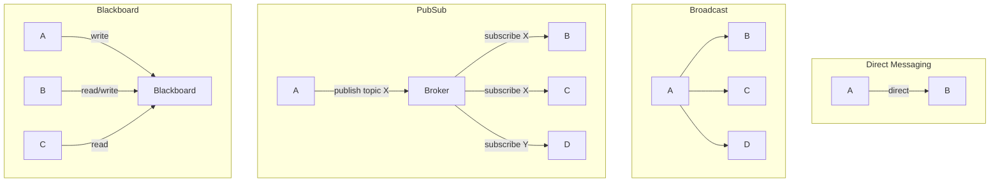

# 02 — Communication Patterns

> [!info] TL;DR
> Multi-agent systems need structured communication protocols. The four canonical patterns are: **direct messaging** (one agent sends to another), **broadcast** (one agent sends to all), **publish-subscribe** (agents subscribe to topics), and **blackboard** (agents read/write to a shared workspace). The choice of communication pattern determines the system's scalability, fault tolerance, and emergent behavior.

## Why Communication Patterns Matter

A single-agent system has one LLM, one memory, one set of tools. Communication is trivial — everything happens in one process.

A multi-agent system has multiple LLMs, each with its own memory, tools, and goals. The agents need to exchange information: partial results, requests for help, status updates, coordination signals. The communication pattern is the architecture's backbone — it determines what's easy, what's hard, and what's possible.

Poor communication design leads to common pathologies:
- **Flooding**: every agent broadcasts everything, overwhelming the system.
- **Starvation**: critical information does not reach the agent that needs it.
- **Deadlock**: agents wait for each other's responses forever.
- **Inconsistent state**: agents disagree about the world because they have different information.

The right pattern depends on the task topology, the agent count, and the latency requirements.

## The Four Canonical Patterns

### 1. Direct Messaging (Point-to-Point)

Agent A sends a message directly to Agent B. The message is addressed and delivered only to B.

```python
# Agent A
response = agent_b.handle(request={"from": "A", "type": "lookup", "query": "..."})

# Agent B
def handle(self, request):
    return self.process(request)
```

**Strengths**:
- Simple to reason about.
- Low overhead (no broker, no topic infrastructure).
- Direct request/response semantics — natural for "ask Agent B for X" interactions.

**Weaknesses**:
- Agents must know about each other (tight coupling).
- Does not scale to many agents — N agents need O(N²) pairwise channels.
- Hard to add new agents — existing agents must be updated to know about them.

**When to use**: small systems (2–5 agents), hierarchical systems where a manager agent dispatches to specific workers.

### 2. Broadcast

Agent A sends a message to all other agents. Every agent receives every message.

```python
# Agent A
for agent in all_agents:
    if agent != self:
        agent.receive(message)

# Or via a broker
broker.broadcast(message, sender="A")
```

**Strengths**:
- Simple to implement.
- No addressing logic — every agent sees everything.
- Good for global announcements (e.g., "task complete, all agents stop").

**Weaknesses**:
- Does not scale — every agent processes every message.
- Agents must filter (decide what's relevant), which adds work.
- Privacy: agents see messages not intended for them.

**When to use**: very small systems (2–3 agents), or for specific control messages (shutdown, status query) that genuinely need to reach everyone.

### 3. Publish-Subscribe (Pub/Sub)

Agents publish messages to topics; agents subscribe to topics they care about. A broker routes messages from publishers to subscribers.

```python
# Agent A publishes
broker.publish(topic="task.completed", message={"task_id": "..."})

# Agent B subscribes
broker.subscribe(topic="task.completed", callback=b.on_task_completed)
```

**Strengths**:
- Decoupled: publishers and subscribers don't need to know about each other.
- Scalable: agents only receive messages on their subscribed topics.
- Extensible: add a new agent by subscribing to relevant topics — no changes to publishers.
- Async: publishers don't block waiting for subscribers.

**Weaknesses**:
- Requires a broker (additional infrastructure).
- Topic design is non-trivial (too few topics → flooding; too many → fragmentation).
- Hard to reason about who receives a given message (must trace subscriptions).

**When to use**: medium-to-large systems (5+ agents), event-driven architectures, systems that need to scale or evolve over time.

### 4. Blackboard (Shared Workspace)

All agents read from and write to a shared data structure (the "blackboard"). Agents monitor the blackboard for relevant changes and act when they see something they can contribute to.

```python
# Shared blackboard
blackboard = {
    "facts": [],
    "hypotheses": [],
    "decisions": [],
}

# Agent A writes
blackboard["facts"].append({"source": "A", "content": "..."})

# Agent B reads
def monitor(blackboard):
    for fact in blackboard["facts"]:
        if is_relevant(fact, self.specialty):
            self.act(fact)
```

**Strengths**:
- Maximum decoupling: agents don't communicate directly at all.
- Natural for problems where multiple specialists contribute partial results.
- Easy to add/remove agents without disrupting others.
- Supports opportunistic reasoning: an agent contributes when it can, not when called.

**Weaknesses**:
- Concurrency control is hard (multiple agents writing simultaneously).
- Performance can degrade (every agent polls the blackboard).
- Hard to debug (no explicit message flow; behavior is emergent).

**When to use**: problems with multiple specialist contributors (medical diagnosis, intelligence analysis), research-style multi-agent exploration.

## Comparison

| Pattern         | Coupling  | Scalability | Latency  | Use Case                              |
|-----------------|-----------|-------------|----------|---------------------------------------|
| Direct          | High      | Poor (O(N²))| Low      | Small systems, hierarchical           |
| Broadcast       | Medium    | Very poor   | Low      | Control messages, very small systems  |
| Pub/Sub         | Low       | Good        | Medium   | Event-driven, evolving systems        |
| Blackboard      | Very low  | Medium      | Variable | Specialist collaboration              |



## Message Structure

Regardless of pattern, messages need structure. A typical message envelope:

```json
{
  "id": "msg_001",
  "from": "agent_researcher",
  "to": "agent_writer",  // or "topic": "drafts.ready"
  "type": "draft.complete",
  "content": {
    "draft_id": "draft_42",
    "summary": "...",
    "needs_review": true
  },
  "metadata": {
    "timestamp": "2026-08-07T12:00:00Z",
    "trace_id": "...",
    "reply_to": "msg_000"
  }
}
```

Key fields:
- **id**: unique identifier for the message (for tracing and dedup).
- **from / to / topic**: routing information.
- **type**: a string identifying the message type (for handler dispatch).
- **content**: the actual payload (often JSON).
- **metadata**: trace IDs, timestamps, reply chains.

Strongly-typed messages (Pydantic models, Protocol Buffers) catch errors at write time and make the system debuggable. Avoid free-form string messages — they're a recipe for protocol drift.

## Communication Topologies

Beyond the pattern, the **topology** of who-talks-to-whom matters:

### Star (Hub-and-Spoke)
One central agent (the "hub") communicates with all others. Other agents do not communicate directly.
- Pro: simple, centralized control.
- Con: hub is a bottleneck and single point of failure.
- Example: a manager agent dispatching tasks to worker agents.

### Mesh
Every agent can communicate with every other agent.
- Pro: maximum flexibility, no bottleneck.
- Con: O(N²) channels, hard to reason about.
- Example: small research team where everyone talks to everyone.

### Ring
Agents communicate in a cycle: A → B → C → A.
- Pro: simple, fair, predictable.
- Con: slow (a message must traverse the ring).
- Example: pipeline of agents (extractor → analyzer → writer → reviewer → extractor).

### Hierarchy
Tree structure: a root agent has child agents, which have their own children.
- Pro: scales well, clear delegation.
- Con: information loss at each level; rigid.
- Example: a CEO agent with department-head agents, each with team-lead agents.

## Frameworks and Implementation

### LangGraph
Provides explicit graph-based agent communication. You define nodes (agents) and edges (communication channels). Supports both direct messaging (edge from A to B) and conditional routing (edge decides which agent goes next based on state).

### AutoGen
Conversational agent framework. Agents communicate via "conversable" messages — each agent has a `send` and `receive` method. Supports group chat (a special broadcast pattern).

### CrewAI
Role-based agent framework. Agents have roles (researcher, writer, reviewer) and communicate via "tasks" — a task is assigned to one agent, who produces an output that flows to the next agent in the pipeline.

### Semantic Kernel
Microsoft's framework. Uses a "kernel" that orchestrates plugin calls. Communication is implicit through plugin invocations rather than explicit messages.

### Custom (Pydantic + Redis/RabbitMQ)
For production systems with strict requirements, many teams build custom:
- Pydantic models for message types.
- Redis pub/sub or RabbitMQ for the broker.
- FastAPI for the agent endpoints.
- OpenTelemetry for tracing.

This is more work than using a framework but gives full control over scalability, observability, and error handling.

## Common Pitfalls

### No Schema Enforcement
Free-form message content (just a string or unstructured dict) leads to protocol drift — Agent A sends a field that Agent B doesn't expect, and the failure is silent. Always use typed message schemas.

### Synchronous Communication in Async Systems
Agent A blocks waiting for Agent B's response. If B is slow or fails, A hangs. Use async messaging (publish-subscribe, message queues) for systems that need to scale.

### No Timeout
An agent sends a message and waits forever for a response. Always set timeouts and have a fallback (retry, default response, error to caller).

### No Idempotency
The same message delivered twice causes the agent to act twice. Use message IDs and dedup.

### No Dead Letter Queue
Messages that fail to process are silently dropped. Use a dead letter queue to capture failed messages for inspection and replay.

### Tracing Gap
Without distributed tracing (trace IDs propagated through messages), multi-agent bugs are nearly impossible to debug. Always propagate trace IDs.

## See Also

- [[01 - Multi-Agent Architectures]]
- [[03 - Coordination and Consensus]]
- [[04 - Enterprise Multi-Agent Architectures]]
- [[16 - Multi-Agent Systems/MOC|16 Multi-Agent MOC]]
- [[15 - AI Agents/MOC|15 AI Agents]]
- [[25 - Frameworks and Tools/Agent Frameworks/01 - Framework Selection Guide|Framework Selection]]
