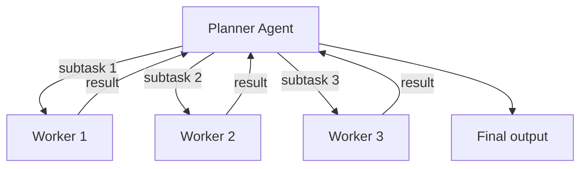
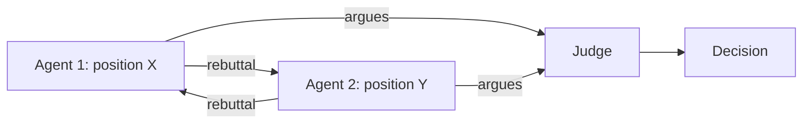

# 03 — Coordination and Consensus

> [!info] TL;DR
> Coordination is the process by which multiple agents decide who does what, when. The three core problems are: **task allocation** (who works on which subtask), **consensus** (how do agents agree on a shared state), and **negotiation** (how do agents with conflicting goals reach agreement). Patterns range from simple (centralized planner) to complex (market-based auctions, voting protocols). The right choice depends on agent count, task structure, and fault-tolerance requirements.

## Why Coordination Is Hard

Multiple agents working on the same problem create classic distributed-systems issues:
- **Concurrency**: agents act in parallel, possibly on overlapping subtasks.
- **Conflicting information**: different agents may have different views of the world.
- **Conflicting goals**: agents may optimize for different objectives (e.g., speed vs. accuracy).
- **Failure handling**: if Agent A fails mid-task, who picks up the work?
- **Aggregation**: how do you combine multiple agents' outputs into a coherent result?

Without explicit coordination, multi-agent systems exhibit emergent but often undesirable behavior: agents duplicate work, contradict each other, or produce inconsistent outputs. Coordination patterns make the system's behavior predictable and debuggable.

## Task Allocation Patterns

### 1. Centralized Planner
A single "planner" agent decomposes the task, assigns subtasks to worker agents, and aggregates results.



**Strengths**:
- Simple to implement and reason about.
- Predictable: the planner controls all decisions.
- Easy to add/remove workers (planner reroutes).

**Weaknesses**:
- Planner is a bottleneck and single point of failure.
- Doesn't scale well to many subtasks (planner becomes the limit).
- Workers cannot adapt to discovered subtasks — they wait for the planner.

**When to use**: hierarchical decomposition with clear subtask boundaries (e.g., "research, then write, then review" pipeline).

### 2. Market-Based Allocation (Auction)
Subtasks are "auctioned" to agents. Each agent bids based on its suitability (capacity, expertise, current load). The auctioneer assigns the subtask to the highest bidder.

```python
def auction(subtask, agents):
    bids = []
    for agent in agents:
        bid = agent.bid(subtask)  # returns a score or cost
        bids.append((agent, bid))
    winner = min(bids, key=lambda x: x[1])  # lowest cost wins
    winner[0].assign(subtask)
```

**Strengths**:
- Decentralized: no central planner needs to know each agent's state.
- Adaptive: agents bid based on current load, so work is balanced.
- Scales well: new agents just join the auction.

**Weaknesses**:
- Bidding logic is non-trivial (how does an agent estimate its cost?).
- Auction overhead per subtask.
- Strategic agents may "game" the auction (bid low to win, then do poor work).

**When to use**: heterogeneous agent pools (agents with different specialties), dynamic workloads.

### 3. Self-Assignment
Agents monitor a shared task queue and pick up tasks they can handle. No central planner or auction.

```python
def worker_loop(agent, task_queue):
    while True:
        task = task_queue.get_next_compatible(agent.capabilities)
        if task:
            task_queue.mark_in_progress(task, agent)
            result = agent.execute(task)
            task_queue.mark_complete(task, result)
```

**Strengths**:
- Fully decentralized, no coordinator.
- Workers can be added/removed freely.
- Naturally load-balanced (busy workers don't pick up new tasks).

**Weaknesses**:
- Race conditions (two workers grab the same task) — needs locking.
- No global optimization (a worker picks the next task, not the best task).
- Hard to enforce priorities.

**When to use**: homogeneous agent pools, simple task structures, fault-tolerant workloads.

## Consensus Patterns

Consensus is the problem of getting multiple agents to agree on a shared state. This is necessary when:
- Agents have different observations of the world.
- The system needs a single "truth" to act on.
- Fault-tolerant decisions are required (one agent's failure should not corrupt the decision).

### 1. Voting
Each agent proposes an answer; the majority (or plurality) wins.

```python
def vote(answers):
    counts = Counter(answers)
    return counts.most_common(1)[0][0]
```

**Strengths**: simple, well-understood, no special infrastructure.

**Weaknesses**: 
- Majority can be wrong (especially on hard questions).
- Does not weight by confidence or expertise.
- For free-form outputs, "voting" requires a similarity metric to cluster answers.

**When to use**: multiple agents independently solving the same problem (e.g., [[Self-Consistency]]).

### 2. Debate
Agents argue for their proposed answer. A judge (another agent or human) decides.



**Strengths**: forces agents to justify their answers; catches errors through adversarial scrutiny.

**Weaknesses**: expensive (multiple rounds of LLM calls); judge quality matters.

**When to use**: high-stakes decisions where errors are costly (medical, legal, safety-critical).

### 3. Aggregation (Mixture of Experts)
Combine multiple agents' outputs rather than picking one. For numeric answers: average. For text: have a "synthesizer" agent merge them.

```python
def aggregate(answers):
    if all_numeric(answers):
        return mean(answers)  # or median, more robust to outliers
    else:
        return synthesizer_agent.merge(answers)
```

**Strengths**: leverages all agents' contributions; often more accurate than any single agent.

**Weaknesses**: synthesizer is another LLM call; aggregation logic is task-specific.

**When to use**: tasks where multiple perspectives add value (research summaries, code reviews).

### 4. Quorum
A subset of agents (the quorum) must agree before a decision is committed. Used in distributed systems for fault tolerance.

**Strengths**: tolerant of faulty agents (Byzantine fault tolerance).

**Weaknesses**: slower (need to wait for quorum); complex to implement.

**When to use**: safety-critical systems, multi-region deployments.

## Negotiation Patterns

When agents have conflicting goals (e.g., a buyer agent wants low price, a seller agent wants high price), they need to negotiate.

### 1. Alternating Offers
Agents take turns proposing terms. If the other accepts, deal. If not, they counter-offer. Bounded by a deadline.

```python
def negotiate(buyer, seller, item, deadline):
    offer = seller.initial_offer(item)
    while not deadline.reached():
        if buyer.accepts(offer):
            return offer
        counter = buyer.counter(offer)
        if seller.accepts(counter):
            return counter
        offer = seller.counter(counter)
    return None  # failed
```

**Strengths**: simple, captures the natural back-and-forth of negotiation.

**Weaknesses**: slow; agents may have incentive to stall.

**When to use**: clearly adversarial settings (price negotiation, resource allocation).

### 2. Auction-Based
Multiple agents bid; the highest bidder wins. Used for resource allocation (compute, attention).

**Strengths**: fast, market-driven.

**Weaknesses**: agents with more resources dominate; may not optimize for fairness.

### 3. Mediated
A neutral "mediator" agent proposes terms that both sides can accept.

**Strengths**: breaks deadlocks; mediator can optimize for fairness.

**Weaknesses**: mediator's quality determines outcomes.

**When to use**: high-stakes negotiations where a deal is critical (e.g., supply-chain agreements).

## Failure Handling

Coordination systems must handle agent failures gracefully:

### Timeout and Retry
If an agent does not respond within a deadline, treat as failed. Reassign the task or proceed without the result.

### Checkpointing
Periodically save intermediate state. On failure, restart from the last checkpoint rather than the beginning.

### Redundancy
Assign critical tasks to multiple agents. Use the first result that completes.

### Circuit Breaker
If an agent fails repeatedly, stop sending it tasks (assume it's broken). Periodically probe to see if it has recovered.

## Common Pitfalls

### Deadlock
Agents wait for each other's responses forever. Always have timeouts and a fallback.

### Livelock
Agents keep responding to each other without making progress. Cap the number of rounds.

### Starvation
A "loud" agent dominates the conversation; quieter agents never contribute. Use round-robin or turn-taking enforcement.

### Inconsistent State
Agents disagree about the world because they have different observations. Use a shared state store (blackboard, database) as the source of truth.

### No Trace
Without tracing, multi-agent bugs are impossible to debug. Log every message, every decision, every failure. Use distributed tracing (OpenTelemetry).

## Frameworks

- **LangGraph**: graph-based coordination with explicit state and conditional routing.
- **AutoGen**: conversational coordination with group chat patterns.
- **CrewAI**: role-based coordination with task assignment.
- **OpenAI Swarm**: lightweight agent handoff pattern (experimental).

For production systems, custom implementations on top of Redis/RabbitMQ with strong tracing are common.

## See Also

- [[01 - Multi-Agent Architectures]]
- [[02 - Communication Patterns]]
- [[04 - Enterprise Multi-Agent Architectures]]
- [[06 - Tree of Thoughts and Self Consistency]]
- [[15 - AI Agents/MOC|15 AI Agents]]
- [[16 - Multi-Agent Systems/MOC|16 Multi-Agent MOC]]
