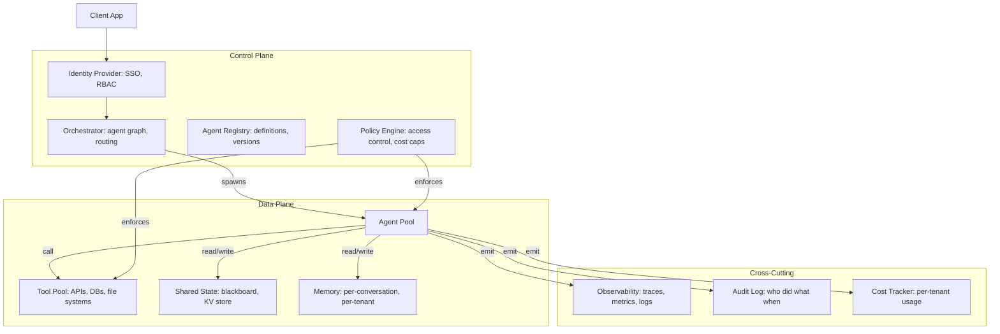

# 04 — Enterprise Multi-Agent Architectures

> [!info] TL;DR
> Enterprise multi-agent systems are not just "multiple LLMs chatting." They are production systems with strict requirements: multi-tenancy, audit trails, access control, observability, cost governance, and graceful degradation. The reference architecture combines a control plane (orchestrator, registry, policy engine) with a data plane (agents, tools, shared state) and integrates with enterprise identity, monitoring, and governance systems.

## Why Enterprise Multi-Agent Is Different

The patterns in [[02 - Communication Patterns]] and [[03 - Coordination and Consensus]] describe *how* agents talk to each other. Enterprise architectures add the concerns that make a multi-agent system deployable inside a real organization:

- **Multi-tenancy**: different teams or customers share the same infrastructure but must be isolated.
- **Access control**: Agent A can call Tool X on Tenant 1's data but not Tenant 2's.
- **Auditability**: every action must be traceable to a user, a policy, and a decision.
- **Cost governance**: per-tenant cost caps, chargebacks, budget enforcement.
- **Compliance**: GDPR, HIPAA, SOC 2, internal data-handling policies.
- **Observability**: distributed tracing across the agent graph, metrics per tenant, alerting.
- **Reliability**: graceful degradation when LLM providers fail, when tools are unavailable, when context limits are exceeded.

A multi-agent system that handles these concerns looks very different from a research prototype. This note describes the reference architecture.

## Reference Architecture

## The Control Plane

### Orchestrator
The orchestrator is the entry point for client requests. It:
- Receives the request, authenticates the caller (via the identity provider).
- Loads the agent graph definition from the registry.
- Determines which agents to invoke, in what order.
- Enforces policies (cost caps, rate limits, access control).
- Returns the final result to the client.

The orchestrator is the **only** component exposed to clients. Agents and tools are never directly callable — clients cannot bypass the orchestrator's policy enforcement.

### Agent Registry
Stores versioned definitions of every agent:
- The agent's role and capabilities.
- The model + prompt + tools it uses.
- The agent's input/output schema.
- Version history with rollback support.

Agents are deployed by promoting versions through dev → staging → production, just like any other service. See [[03 - Model Registry and Versioning]].

### Policy Engine
Centralized enforcement of:
- **Access control**: which users/tenants can invoke which agents and tools.
- **Cost caps**: per-tenant daily/monthly budgets; requests that would exceed the cap are rejected.
- **Rate limits**: per-user, per-tenant, per-agent throttling.
- **Data residency**: certain data cannot leave certain regions or be processed by certain models.
- **Tool allowlists**: only specific tools can be called by specific agents in specific contexts.

The policy engine is consulted on every request and every tool call. Without centralized policy enforcement, multi-agent systems develop ad-hoc policies in each agent — a security and compliance nightmare.

### Identity Provider
Integrates with enterprise SSO (Okta, Azure AD, etc.). Maps users to tenants, roles, and permissions. The orchestrator accepts SSO tokens and resolves them to identity context that the policy engine can use.

## The Data Plane

### Agent Pool
The actual LLM-backed agents. In a production system:
- Agents run as separate processes (or containers) for isolation.
- Each agent has its own model client, prompt, and tool definitions.
- Agents scale horizontally based on load.
- Agents are stateless between requests — conversation state lives in the memory store, not in the agent.

Stateless agents are essential for horizontal scaling and fault tolerance. If an agent process crashes, the orchestrator can retry on another instance.

### Tool Pool
Tools are external systems the agents call: databases, APIs, file stores, code interpreters. Each tool:
- Has a versioned schema (parameters, return type).
- Has its own access control (which agents can call it, on which data).
- Has rate limits and quotas.
- Logs every call for audit.

Tools are the most security-sensitive component — they have real-world effects (writing to databases, calling external APIs). Treat them as untrusted: validate inputs, sanitize outputs, log everything.

### Shared State
For agents to coordinate, they need shared state. Options:
- **Blackboard pattern** (see [[02 - Communication Patterns]]): a shared KV store (Redis, Postgres) that agents read/write.
- **Message broker**: Redis pub/sub, Kafka, RabbitMQ for async messaging.
- **Workflow state**: LangGraph-style explicit state passed through the agent graph.

For multi-tenant systems, every state object must be tagged with tenant ID and access-controlled.

### Memory
Per-conversation, per-tenant memory:
- **Conversation history**: the messages exchanged so far.
- **Long-term memory**: facts learned about the user, preferences, past interactions.
- **Working memory**: intermediate state for the current task.

Memory must be tenant-isolated. A common bug: Agent A reads Agent B's memory because the memory store does not enforce tenant scoping. Use database-level row-level security or explicit tenant filtering on every query.

## Cross-Cutting Concerns

### Observability
- **Distributed tracing**: every request gets a trace ID; every agent invocation and tool call is a span. Use OpenTelemetry.
- **Metrics**: per-agent latency, per-tool call rate, per-tenant cost, error rates.
- **Logs**: structured logs with trace IDs, tenant IDs, agent IDs.
- **Content sampling**: sample 1% of agent outputs for LLM-as-judge quality monitoring.

Without distributed tracing, multi-agent bugs are nearly impossible to debug — a failure in Agent D might be caused by a bad input from Agent A three steps earlier.

### Audit Log
Immutable record of every decision:
- Who (user, tenant) initiated the request.
- Which agents were invoked, in what order.
- Which tools were called, with what arguments.
- What the final output was.
- When each step happened.

Audit logs are required for compliance in most enterprises. They must be tamper-evident (append-only, cryptographically signed) and retained per regulatory requirements.

### Cost Tracking
- Per-request cost: tokens consumed by each agent + tool calls.
- Per-tenant aggregation: daily, monthly totals.
- Chargeback: assign costs to tenants or departments.
- Budget enforcement: requests that would exceed a tenant's cap are rejected.

Cost tracking must be granular enough to attribute costs accurately. A single user request might invoke 3 agents, each making 5 LLM calls and 2 tool calls — all of which contribute to the cost.

## Common Architectures

### Hierarchical (Manager-Worker)
A manager agent decomposes the task, dispatches to specialist worker agents, and synthesizes results.
- Pro: clear control flow, easy to reason about.
- Con: manager is a bottleneck; doesn't leverage worker autonomy.
- Use: customer support (manager routes to billing/support/technical workers).

### Pipeline (Sequential)
Agents execute in a fixed sequence: Agent A → B → C → D.
- Pro: simple, predictable, easy to monitor.
- Con: no parallelism; one slow agent blocks all subsequent.
- Use: content generation (researcher → writer → editor → publisher).

### Debate / Adversarial
Multiple agents argue for different positions; a judge picks the winner.
- Pro: catches errors through adversarial scrutiny; good for high-stakes decisions.
- Con: expensive (multiple LLM calls per decision); slow.
- Use: medical diagnosis, legal analysis, safety review.

### Swarm (OpenAI Swarm-style)
Lightweight agents with simple handoff: Agent A does its part, then hands off to Agent B with full context.
- Pro: simple abstraction, easy to add new agents.
- Con: less explicit coordination; harder to enforce global policies.
- Use: customer support with many specialist agents.

## Reliability Patterns

### Provider Failover
If OpenAI is down, fall back to Anthropic or a self-hosted model. The orchestrator abstracts the provider; agents don't know which provider served their request.

### Tool Failure Handling
If a tool is unavailable:
- Retry with backoff (transient failures).
- Fall back to a degraded mode (e.g., return cached data, or skip the tool and proceed without its result).
- Fail gracefully (return a clear error to the user, not a stack trace).

### Context Limit Handling
If a conversation grows beyond the model's context window:
- Summarize older turns.
- Drop irrelevant turns.
- Use long-context models for the affected requests.

### Cost Cap Enforcement
If a request would exceed the tenant's remaining budget:
- Reject the request with a clear message.
- Or: degrade gracefully (use a cheaper model, skip optional steps).

## Common Pitfalls

### No Tenant Isolation in Shared State
Agents read other tenants' data because the state store doesn't enforce scoping. Use row-level security or explicit tenant filtering.

### Agent Logic in the Orchestrator
The orchestrator should only coordinate, not do agent work. Logic creeps in over time and becomes unmaintainable.

### No Audit Trail for Tool Calls
Tools have real-world effects. Every call must be logged with arguments, caller, timestamp. Without this, you cannot investigate incidents.

### Cost Leaks
A "helper" agent that runs in the background and isn't tracked can rack up costs invisibly. Every LLM call must be attributed to a tenant and a request.

### Synchronous Provider Calls
If an agent makes a synchronous LLM call, the entire request blocks. Use async patterns (LangGraph, async/await) for concurrent agent execution.

## Tooling

- **LangGraph**: graph-based orchestration with state management. Best for complex workflows.
- **OpenAI Swarm**: lightweight handoff pattern. Good starting point for simple systems.
- **AutoGen**: conversational multi-agent framework. Good for research and prototyping.
- **CrewAI**: role-based, easy to reason about. Good for content-generation pipelines.
- **Custom on Kubernetes**: for strict enterprise requirements (multi-tenancy, audit, compliance), many teams build custom on top of Kubernetes with Istio/Linkerd for service mesh, OpenTelemetry for tracing, and a policy engine like OPA.

## See Also

- [[01 - Multi-Agent Architectures]]
- [[02 - Communication Patterns]]
- [[03 - Coordination and Consensus]]
- [[01 - Production AI Stack]]
- [[21 - LLMOps and MLOps/MOC|21 LLMOps]]
- [[22 - Production AI/MOC|22 Production AI]]
- [[16 - Multi-Agent Systems/MOC|16 Multi-Agent MOC]]
