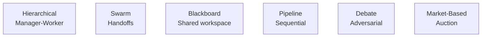

# 16 — Multi-Agent Systems MOC

> [!info] Multiple agents coordinating to solve complex tasks. Iteration 3 expanded this chapter with notes on communication patterns, coordination, and enterprise architectures.

## Reading Order

| #   | Note                                              | Sub-domain      | Purpose                                            |
|-----|---------------------------------------------------|-----------------|----------------------------------------------------|
| 01  | [[01 - Multi-Agent Architectures]]                | Architectures   | Patterns: hierarchical, swarm, blackboard, etc.    |
| 02  | [[02 - Communication Patterns]]                   | Communication   | Direct, broadcast, pub/sub, blackboard.            |
| 03  | [[03 - Coordination and Consensus]]               | Coordination    | Task allocation, voting, debate, negotiation.      |
| 04  | [[04 - Enterprise Multi-Agent Architectures]]     | Enterprise      | Multi-tenancy, audit, policy, observability.       |

## Sub-Domains

- [[16 - Multi-Agent Systems/Architectures/01 - Multi-Agent Architectures|Architectures]] — note 01
- [[16 - Multi-Agent Systems/Communication/02 - Communication Patterns|Communication]] — note 02
- [[16 - Multi-Agent Systems/Coordination/03 - Coordination and Consensus|Coordination]] — note 03
- [[16 - Multi-Agent Systems/Enterprise/04 - Enterprise Multi-Agent Architectures|Enterprise]] — note 04

## Architecture Patterns at a Glance

## Why This Matters for AI

- Multi-agent systems unlock tasks that single agents cannot solve: complex research, multi-step coding, enterprise workflows.
- The communication pattern is the architecture's backbone — it determines scalability and emergent behavior.
- Enterprise deployment requires multi-tenancy, audit, and policy enforcement that research prototypes ignore.
- Most production multi-agent systems are hierarchical or pipeline; debate and auction patterns are rare in production.

## Production Implications

- **Start simple**: hierarchical or pipeline. Don't reach for swarm or debate until you've validated the simpler patterns can't do the job.
- **Observability first**: distributed tracing across the agent graph is non-negotiable.
- **Tenant isolation**: every shared state must be tenant-scoped.
- **Cost governance**: every LLM call attributed to a tenant and a request.

## See Also

- [[15 - AI Agents/MOC|15 AI Agents]] — single-agent foundations
- [[25 - Frameworks and Tools/Agent Frameworks/01 - Framework Selection Guide|Framework Selection]] — LangGraph, AutoGen, CrewAI
- [[22 - Production AI/MOC|22 Production AI]]
- [[21 - LLMOps and MLOps/MOC|21 LLMOps]]
- [[04 - Enterprise Multi-Agent Architectures]]
