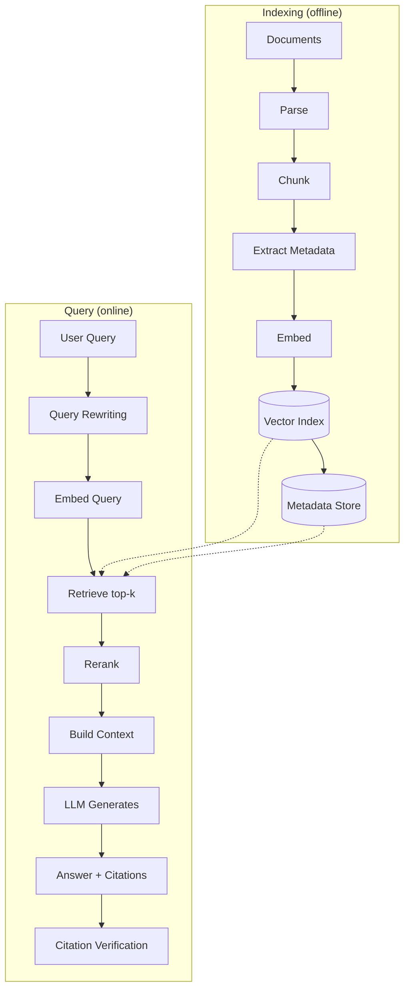

# RAG Pipeline Overview

> [!info] TL;DR
> A RAG (Retrieval-Augmented Generation) pipeline retrieves relevant documents from a knowledge base and feeds them to an LLM as context for answering a user's question. This note is the end-to-end overview; deep dives on each stage are in [[17 - RAG/MOC|the RAG chapter]]. Covers the full pipeline (indexing + query), design decisions, advanced patterns, evaluation, multi-tenancy, production trade-offs, common failure modes, and a worked production example.

## The Problem RAG Solves

LLMs have three limitations that RAG addresses:

1. **Knowledge cutoff**: an LLM trained in 2024 doesn't know 2026 news. RAG injects fresh data at query time.
2. **Hallucination**: LLMs fabricate plausible-sounding but wrong answers. RAG grounds responses in retrieved documents.
3. **Private data**: an LLM has never seen your company's internal docs. RAG lets it answer questions about them without retraining.

A fourth, less-discussed benefit:

4. **Attribution / auditability**: RAG can cite sources. For regulated industries (legal, medical, financial), this is essential — you can't deploy an LLM that says "trust me" without evidence.

## The Standard Pipeline



### Indexing (offline, batch)

1. **Parse**: convert source documents (PDF, HTML, Word, etc.) to plain text. May include OCR for scanned PDFs, table extraction, layout preservation. For multimodal documents, extract images and their captions.
2. **Chunk**: split long documents into shorter passages (typically 200–1000 tokens). Strategy matters a lot — see [[02 - Chunking Hybrid Search Reranking]].
3. **Extract metadata**: store source document title, page number, section heading, date, author, access control list. This metadata is essential for filtering, citation, and multi-tenancy.
4. **Embed**: pass each chunk through an embedding model (BGE, E5, OpenAI text-embedding-3, etc.) to get a vector.
5. **Index**: store vectors (and the original text + metadata) in a vector database (pgvector, Pinecone, Qdrant, Weaviate, Milvus).

### Query (online, real-time)

1. **Query rewriting** (optional): transform the user's query for better retrieval. Common transformations: HyDE (generate hypothetical answer, embed that), multi-query (generate variations), decomposition (split complex query into sub-queries).
2. **Embed query**: same embedding model used for indexing.
3. **Retrieve**: find the top-k most similar chunks (by cosine similarity) to the query. May use hybrid search (vector + BM25).
4. **Rerank** (optional but recommended): pass the top-k candidates through a more expensive cross-encoder reranker (Cohere Rerank, bge-reranker) to re-order by true relevance.
5. **Build context**: concatenate the top-N chunks into a context string, with metadata for citation.
6. **Generate**: pass the context and the question to an LLM, which produces the answer.
7. **Cite**: include source citations (chunk IDs, document names, page numbers).
8. **Verify** (optional): check that the answer is actually grounded in the cited sources (faithfulness check).

## A Minimal Implementation

```python
from sentence_transformers import SentenceTransformer
import faiss
import openai

# Indexing
chunks = chunk_documents(load_documents())
embedder = SentenceTransformer('BAAI/bge-large-en-v1.5')
embeddings = embedder.encode(chunks, normalize_embeddings=True)
index = faiss.IndexFlatIP(embeddings.shape[1])
index.add(embeddings)

# Query
def answer(question, k=5):
    q_emb = embedder.encode([question], normalize_embeddings=True)
    scores, ids = index.search(q_emb, k)
    retrieved = [chunks[i] for i in ids[0]]
    
    context = "\n\n".join(retrieved)
    response = openai.chat.completions.create(
        model="gpt-4o",
        messages=[
            {"role": "system", "content": "Answer based on the context. Cite sources."},
            {"role": "user", "content": f"Context:\n{context}\n\nQuestion: {question}"},
        ],
    )
    return response.choices[0].message.content
```

## A Production Implementation

A real production RAG system adds metadata, filtering, reranking, citations, and evaluation:

```python
from pydantic import BaseModel
from typing import Optional
import hashlib

class Chunk(BaseModel):
    id: str
    text: str
    document_id: str
    document_title: str
    page: int
    section: Optional[str]
    acl: list[str]  # access control list - which user groups can see this
    embedding: Optional[list[float]] = None
    
    @classmethod
    def from_text(cls, text, document, page, section=None):
        return cls(
            id=hashlib.sha256(text.encode()).hexdigest()[:16],
            text=text,
            document_id=document.id,
            document_title=document.title,
            page=page,
            section=section,
            acl=document.acl,
        )

class ProductionRAG:
    def __init__(self, embedder, vector_db, reranker, llm_client):
        self.embedder = embedder
        self.vector_db = vector_db
        self.reranker = reranker
        self.llm = llm_client
    
    def retrieve(self, query, user_groups, k=20, final_k=5):
        """Retrieve and rerank, with access control."""
        q_emb = self.embedder.encode([query], normalize_embeddings=True)
        
        # Vector search with metadata filter for ACL
        results = self.vector_db.search(
            vector=q_emb,
            filter={"acl": {"$in": user_groups}},  # only chunks the user can see
            k=k,
        )
        
        # Hybrid: also do BM25 search and merge
        bm25_results = self.bm25_search(query, user_groups, k=k)
        merged = self.reciprocal_rank_fusion(results, bm25_results)
        
        # Rerank with cross-encoder
        reranked = self.reranker.rerank(query, merged, top_k=final_k)
        return reranked
    
    def generate(self, query, retrieved_chunks):
        """Generate answer with citations."""
        context = self._build_context(retrieved_chunks)
        prompt = self._build_prompt(query, context)
        
        response = self.llm.chat(
            messages=[
                {"role": "system", "content": COT_SYSTEM_PROMPT},
                {"role": "user", "content": prompt},
            ],
            response_format={"type": "json_schema", "schema": ANSWER_SCHEMA},
        )
        
        answer = self._parse_response(response)
        answer = self._verify_citations(answer, retrieved_chunks)
        return answer
    
    def _build_context(self, chunks):
        """Build context with explicit source markers."""
        parts = []
        for i, chunk in enumerate(chunks):
            parts.append(
                f"[Source {i+1}] (from {chunk.document_title}, p.{chunk.page})\n{chunk.text}"
            )
        return "\n\n---\n\n".join(parts)
    
    def _build_prompt(self, query, context):
        return f"""Answer the question based on the sources below. Cite sources as [Source N].

If the sources don't contain enough information, say "I don't have enough information."

Sources:
{context}

Question: {query}

Answer (with citations):"""
```

## Key Design Decisions

### Chunk size
- **Too small** (50–100 tokens): loses context; answers lack coherence. The model retrieves fragments without enough surrounding text to interpret them.
- **Too large** (2000+ tokens): each chunk covers too many topics; retrieval precision drops. The embedding averages over too many concepts.
- **Sweet spot**: 200–500 tokens for most use cases. Use overlap (50–100 tokens) to avoid splitting key information across chunk boundaries.
- **Document-type specific**: 
  - Technical docs: chunk by section (semantic chunking).
  - Legal docs: chunk by paragraph (preserves argument structure).
  - Code: chunk by function/class.
  - Tables: keep tables intact; don't split rows.

### Embedding model
- BGE, E5, GTE: open-source, self-hostable.
- OpenAI text-embedding-3-large: high quality, easy to use.
- Cohere, Voyage: commercial, high quality.
- Match the model to your language and domain. Multilingual models (BGE-M3, multilingual-E5) for non-English.
- **Matryoshka embeddings** (OpenAI text-embedding-3, Nomic Embed): support variable dimensionality — trade off size vs. quality at inference time.

### Retrieval method
- **Pure vector**: good for semantic queries ("how do I configure auth?").
- **Pure BM25**: good for keyword queries with rare terms ("error code ERR_4093").
- **Hybrid** (vector + BM25): best of both worlds. Modern default. Use **reciprocal rank fusion** (RRF) to merge:

$$
\text{RRF score}(d) = \sum_{r \in \text{rankings}} \frac{1}{k + \text{rank}_r(d)}
$$

where $k$ is typically 60.

### Number of chunks retrieved (k)
- **Too few (1–3)**: misses relevant info. Bad for multi-faceted questions.
- **Too many (20+)**: dilutes context with irrelevant info; increases cost and latency.
- **Sweet spot**: retrieve 20, rerank to top 5. The reranker's precision justifies its cost.
- **Context budget**: total retrieved tokens should fit comfortably in the LLM's context window, leaving room for the prompt and a generous answer.

### LLM context construction
- Include source metadata (title, page, date) for citations.
- Limit total context size to fit within the model's context window (leave room for the answer).
- Order matters: some studies suggest putting the most relevant chunks at the start and end of the context ("lost in the middle" effect — Liu et al., 2023).
- **Explicit source markers**: `[Source 1] ... [Source 2] ...` makes citation extraction reliable.
- **Instruction-tuned prompts**: modern LLMs follow instructions like "answer based only on the context" reliably. Older models needed more careful prompting.

## Advanced Patterns

### Query rewriting
Transform the user's query before retrieval:
- **HyDE** (Hypothetical Document Embeddings): generate a hypothetical answer, embed that instead of the query. The hypothesis is closer to the documents in embedding space than the question.
- **Multi-query**: generate multiple query variations, retrieve for each, merge results. Captures different phrasings of the same intent.
- **Decomposition**: split a complex query into sub-queries, retrieve for each. E.g., "Compare GPT-4 and Claude on reasoning" → retrieve for "GPT-4 reasoning capabilities" and "Claude reasoning capabilities" separately.
- **Step-back prompting**: ask the LLM to generate a more general "step-back" question, retrieve for both.

### Parent-document retrieval
Retrieve small chunks (for precision) but return their parent document (for context). Best of both worlds. Implementation:
- Index small chunks (e.g., 200 tokens) with a parent_id field.
- On retrieval, fetch the parent (e.g., 2000 tokens) and include it in context.
- The LLM sees the small chunk's surrounding context, improving coherence.

### Multi-hop retrieval
For complex questions, retrieve iteratively: first retrieval finds a partial answer that points to the next source. Implementation:
- Retrieve initial top-k.
- LLM reads them and generates follow-up queries.
- Retrieve again with follow-up queries.
- Repeat until the LLM has enough to answer.

Use case: "Who is the CEO of the company that acquired WhatsApp?" — first retrieval finds "Facebook acquired WhatsApp", second retrieves "Mark Zuckerberg is CEO of Facebook".

### GraphRAG
Build a knowledge graph from documents and use graph traversal for retrieval. Better for multi-hop questions about entities and relationships. Implementation:
- Extract entities and relations from documents (LLM-based extraction).
- Build a graph (Neo4j, NetworkX).
- On query, find relevant entities and traverse the graph.
- Return paths as context.

Microsoft's GraphRAG (2024) is the leading implementation. Strong for questions like "What are all the subsidiaries of Meta?" — pure vector retrieval struggles with this.

### Agentic RAG
Use an agent (see [[03 - ReAct Pattern]]) to decide when to retrieve, what to retrieve, and whether to retrieve again. Most flexible; most expensive. The agent:
- Decides if retrieval is needed (some questions don't need it).
- Formulates the retrieval query (using the question + conversation history).
- Evaluates whether retrieved context is sufficient.
- May retrieve again with refined queries.
- May use multiple retrieval tools (vector, BM25, graph, SQL).

See [[03 - Advanced RAG Patterns]] for details.

### Self-RAG / Corrective RAG
The LLM decides whether the retrieved context is sufficient; if not, it retrieves again or falls back to its own knowledge. Self-RAG (2023) trains the model to emit special tokens (`[Retrieve]`, `[NoRetrieve]`, `[Relevant]`, `[Irrelevant]`) that control retrieval behavior.

### Contextual Compression
After retrieval, compress the context before passing to the LLM:
- Extract only the relevant sentences from each chunk.
- Summarize long chunks.
- Remove redundant information across chunks.

Use case: when retrieved chunks are long but only partially relevant. LangChain's `ContextualCompressionRetriever` implements this.

## Multi-Tenancy and Access Control

Production RAG systems almost always need multi-tenancy: different users see different documents. Implementation patterns:

### ACL-based filtering
Store an access control list (ACL) with each chunk. At retrieval time, filter to chunks the user can access:

```python
results = vector_db.search(
    vector=q_emb,
    filter={"acl": {"$in": user_groups}},
    k=20,
)
```

This is the standard pattern. Vector databases (pgvector, Qdrant, Pinecone) support metadata filtering natively.

### Per-tenant indexes
For strict isolation, maintain separate indexes per tenant. Pros: clean isolation, no filter overhead. Cons: more infrastructure, cross-tenant search is hard.

### Hybrid
Maintain a global index with ACL filtering for most tenants. For high-security tenants (e.g., regulated industries), maintain separate indexes.

## Evaluation

RAG systems need both retrieval and generation evaluation:

### Retrieval metrics
- **Hit rate**: fraction of queries where the relevant doc is in the top-k.
- **MRR (Mean Reciprocal Rank)**: average of 1/rank of the first relevant doc.
- **NDCG**: normalized discounted cumulative gain (rewards relevant docs at top).
- **Recall@k**: fraction of all relevant docs that are in the top-k.
- **Context relevance**: are the retrieved chunks actually relevant to the query? (Subjective, often LLM-judged.)

### Generation metrics
- **Faithfulness**: answer is grounded in retrieved context (no hallucination). Measured by checking each claim in the answer against the sources.
- **Answer relevance**: answer actually addresses the question.
- **Context relevance**: retrieved context is relevant to the question.
- **Citation accuracy**: do the cited sources actually support the claims?

### Tools
- **RAGAS**: open-source framework for RAG evaluation. Computes faithfulness, answer relevance, context precision/recall.
- **TruLens**: similar, with more production monitoring features.
- **DeepEval**: another option, integrates with pytest.
- **Custom LLM-as-judge**: use a strong LLM (GPT-4, Claude) to evaluate faithfulness and relevance.

### Building an Evaluation Set

A good RAG eval set has:
- 100-1000 (query, gold answer, gold sources) triples.
- Queries sampled from real production traffic (not synthetic).
- Gold answers and sources labeled by humans.
- Coverage of common query types (factual, multi-hop, comparison, temporal).
- Negative queries (questions the system should say "I don't know" to).

Without an eval set, RAG improvements are guesswork. Every chunking change, embedding model change, or reranker change should be measured against the eval set.

## Cost and Latency Analysis

### Cost per query (typical)
- Embedding query: ~$0.0001 (1K tokens at OpenAI text-embedding-3 prices).
- Vector search: ~$0.0001 (depends on DB and index size).
- Reranking: ~$0.001 (cross-encoder on 20 chunks).
- LLM generation: ~$0.01-0.05 (depending on context size and model).
- **Total**: ~$0.011-0.051 per query.

For 1M queries/month: ~$11K-51K/month. Cost is dominated by the LLM.

### Latency breakdown (typical)
- Embedding query: 50-100ms.
- Vector search: 20-50ms (HNSW index, sublinear).
- Reranking: 100-300ms (cross-encoder on 20 chunks).
- LLM generation: 500-3000ms (depends on context and output length).
- **Total**: 700-3500ms, dominated by LLM generation.

Latency optimization:
- **Stream LLM output**: user sees first token in 500ms instead of waiting for full response.
- **Cache aggressively**: query cache (same query → same answer), semantic cache (similar query → same answer).
- **Parallel retrieval and query rewriting**: start vector search and BM25 search in parallel.
- **Smaller LLM for easy queries**: route to a 1B model for simple lookup, 70B for complex reasoning.

## Why This Matters for AI

- RAG is **the** pattern for enterprise LLM applications. Most production LLM features use RAG.
- A well-tuned RAG system can match or exceed a fine-tuned model on knowledge-intensive tasks, at a fraction of the cost.
- RAG is **complementary** to fine-tuning: fine-tune for style/behavior, RAG for knowledge.
- The RAG pipeline is also the basis for many agent patterns — agents often retrieve before acting.
- RAG attribution (citing sources) is essential for regulated industries and for user trust.

## Production Implications

- **Start simple**: vector-only RAG with off-the-shelf embeddings is a strong baseline. Don't add complexity (reranking, graph, agents) until you've measured that simpler RAG isn't enough.
- **Invest in chunking**: it's the highest-leverage tuning knob. Bad chunking sinks the whole pipeline. Spend time on document-aware chunking.
- **Evaluate continuously**: as documents change, RAG quality drifts. Set up automated evaluation that runs on every index update.
- **Monitor retrieval quality**: track hit rate, MRR, and context relevance in production. A sudden drop indicates a problem (new documents polluting the index, embedding model drift, etc.).
- **Cost**: RAG queries cost ~2-3× a non-RAG query (embedding + retrieval + generation). Cache aggressively — query cache for repeated queries, semantic cache for paraphrased queries.
- **Latency**: retrieval adds 50–200ms. Use ANN indexes (HNSW, IVF) for sub-linear search. Parallelize vector and BM25 retrieval.
- **Incremental indexing**: as documents change, update the index incrementally. Don't rebuild from scratch unless the embedding model changes.
- **Version your embeddings**: store the embedding model name + version with each chunk. When you upgrade the embedding model, you must re-embed all chunks (embeddings from different models are incompatible).
- **Plan for re-embedding**: when you upgrade the embedding model, the index must be rebuilt. For large corpora, this is expensive. Schedule it during low-traffic periods.
- **Multi-modal RAG**: for documents with images, extract image captions and index them alongside text. For pure-image queries, use a CLIP-style encoder for image embeddings.
- **Streaming RAG**: stream the LLM's answer as it generates. The retrieval happens upfront (blocking), but generation can stream. Use SSE or WebSocket for real-time UI updates.

## Common Pitfalls

- **Bad chunking** — the #1 RAG failure mode. Test chunking strategies empirically; don't assume one size fits all.
- **Wrong embedding model** — must match the language and domain of your docs. A model trained on English Wikipedia won't retrieve well from Chinese legal documents.
- **No reranking** — pure vector retrieval often returns semantically-similar-but-irrelevant results. Reranking helps a lot, especially for top-3 precision.
- **Forgetting to deduplicate** — same content in multiple chunks wastes context. Deduplicate by content hash during indexing.
- **Lost in the middle** — models often ignore content in the middle of long contexts. Put important info at the start and end, or use shorter contexts.
- **No evaluation** — without metrics, you can't tell if changes help or hurt. Build an eval set early; run it on every change.
- **Treating RAG as magic** — RAG doesn't fix a bad base model, bad prompts, or bad data. If the documents are garbage, RAG retrieves garbage.
- **Ignoring access control** — multi-tenant RAG without ACL filtering leaks data between tenants. This is a security-critical bug.
- **Stale embeddings** — documents change but embeddings don't get updated. Set up incremental indexing with freshness checks.
- **Context window overflow** — retrieving too many chunks overflows the LLM's context window. Use token counting and truncation.
- **Citation hallucination** — the LLM cites sources that don't exist or don't say what it claims. Verify citations against retrieved chunks.
- **No fallback** — when retrieval returns no relevant chunks, the LLM should say "I don't know" rather than hallucinate. Train this behavior with prompt instructions and few-shot examples.

## Worked Example: Building a RAG System for Internal Docs

Let's say you're building a RAG system for a company's internal documentation (Confluence, Notion, Google Drive). Here's the recipe:

### Phase 1: Baseline (1 week)
1. **Ingest**: export all docs to markdown. Use document-aware chunking (split by heading).
2. **Embed**: use `BAAI/bge-large-en-v1.5` (open-source, strong quality).
3. **Index**: store in pgvector (if you already use Postgres) or Qdrant (standalone).
4. **Retrieve**: vector search, top-10.
5. **Generate**: GPT-4o or Claude 3.5 Sonnet, with a clear prompt to answer + cite.
6. **Evaluate**: build a 50-query eval set from real questions. Measure hit rate and faithfulness.

Expected: ~60-70% faithfulness, ~70% hit rate.

### Phase 2: Add Hybrid Search and Reranking (1 week)
1. **Add BM25**: index chunks with BM25 (Elasticsearch, or PostgreSQL's `tsvector`).
2. **Hybrid retrieval**: vector + BM25, merged with RRF.
3. **Add reranker**: `bge-reranker-large` (open-source) or Cohere Rerank.
4. **Re-evaluate**.

Expected: ~75-80% faithfulness, ~80% hit rate. The reranker is the biggest win.

### Phase 3: Query Rewriting and Multi-tenancy (1 week)
1. **Add HyDE**: for each query, generate a hypothetical answer, embed that.
2. **Add ACL filtering**: tag chunks with team/department, filter at retrieval.
3. **Re-evaluate**.

Expected: ~80-85% faithfulness.

### Phase 4: Agentic RAG (2 weeks, only if needed)
1. **Add an agent layer**: LLM decides whether to retrieve, what tool to use, whether to retrieve again.
2. **Add a SQL tool**: for structured queries (e.g., "How many customers in Q3?"), the agent routes to SQL instead of vector search.
3. **Add a graph tool**: for entity-relationship queries.
4. **Re-evaluate**.

Expected: ~85-90% faithfulness, but 2-3× cost and latency. Only worth it for complex use cases.

## Interview Questions

- **Q: Why use RAG instead of fine-tuning?**  
  A: RAG is better for knowledge that changes frequently, for attribution (citing sources), and for multi-tenant data isolation. Fine-tuning is better for style, behavior, and domain-specific reasoning patterns. They're complementary.

- **Q: How would you handle a RAG system where the user asks a question that has no answer in the documents?**  
  A: Train the LLM to say "I don't know" when retrieval returns low-relevance chunks. Use a relevance threshold (if top chunk score < 0.5, refuse). Add "I don't know" examples to the prompt. Evaluate on negative queries.

- **Q: What's the "lost in the middle" problem, and how do you address it?**  
  A: LLMs pay less attention to content in the middle of long contexts (Liu et al., 2023). Solutions: use shorter contexts, put the most relevant chunks at the start and end, or use models with better long-context attention (Gemini, Claude 3.5).

- **Q: How do you evaluate a RAG system?**  
  A: Measure both retrieval (hit rate, MRR, recall@k) and generation (faithfulness, answer relevance, citation accuracy). Use RAGAS or a custom LLM-as-judge. Build a labeled eval set with (query, gold answer, gold sources) triples.

- **Q: When would you use GraphRAG instead of vector RAG?**  
  A: GraphRAG is better for multi-hop questions about entities and relationships ("What are all of Meta's subsidiaries?"). Vector RAG is better for semantic similarity queries ("How do I configure auth?"). GraphRAG is more expensive to build (entity extraction) but more precise for relationship queries.

- **Q: How do you handle multi-tenancy in RAG?**  
  A: Store an ACL with each chunk, filter at retrieval time. Vector databases support metadata filtering natively. For strict isolation, use per-tenant indexes (more infrastructure but cleaner).

## Further Reading

- Lewis et al. (2020), *Retrieval-Augmented Generation for Knowledge-Intensive NLP Tasks* — the original RAG paper. See [[35 - RAG 2020]].
- Gao et al. (2024), *Retrieval-Augmented Generation for Large Language Models: A Survey*.
- Liu et al. (2023), *Lost in the Middle: How Language Models Use Long Contexts*.
- RAGAS docs: https://docs.ragas.io
- Pinecone's RAG cookbook: https://www.pinecone.io/learn/rag/
- Microsoft GraphRAG: https://microsoft.github.io/graphrag/

## See Also

- [[17 - RAG/MOC|RAG MOC]]
- [[02 - Chunking Hybrid Search Reranking]] — deep dive on these stages
- [[03 - Advanced RAG Patterns]] — Self-RAG, Corrective RAG, GraphRAG, Agentic RAG
- [[15 - AI Agents/MOC|AI Agents MOC]] — agentic RAG
- [[18 - Memory Systems/MOC|Memory Systems MOC]] — RAG as long-term memory
- [[05 - Word2Vec GloVe FastText]] — embedding foundations
- [[03 - Cosine Similarity]] — the similarity metric for retrieval
- [[04 - Vector Memory Backends]] — vector database options
- [[06 - Embedding Model Training]] — how embedding models are trained
- [[35 - RAG 2020]] — the original RAG paper
