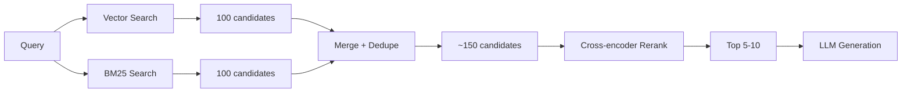

# 02 - Chunking, Hybrid Search, and Reranking

> [!info] TL;DR
> The three biggest RAG quality levers after model choice: (1) chunking strategy, (2) hybrid search (BM25 + vector), (3) cross-encoder reranking. Get these right and your RAG system will dramatically outperform a naive setup. This note covers chunking strategies in depth, hybrid search fusion methods, bi-encoder vs cross-encoder, reranking workflow, production patterns, worked examples, and common pitfalls.

## Chunking

How you split documents into passages affects retrieval precision and generation quality. Chunking is the #1 RAG quality lever — bad chunking sinks the whole pipeline.

### Chunk Size

- **Too small (50–100 tokens)**: loses context; the model gets fragments without enough info to answer. The retrieved chunks lack surrounding context, so the LLM can't interpret them.
- **Too large (2000+ tokens)**: each chunk covers too many topics; retrieval precision drops. The embedding averages over too many concepts, making it less specific.
- **Sweet spot**: 200–500 tokens for most use cases. Use overlap (50–100 tokens) to avoid splitting key information across chunk boundaries.

### Why Chunk Size Matters

The embedding model encodes each chunk into a single vector. If the chunk covers multiple topics, the vector averages over them, making it less specific to any one topic. At retrieval time, a query about topic A might retrieve a chunk that's 70% about topic A and 30% about topic B — not because it's the best match, but because the averaging made it look similar.

Smaller chunks are more specific but may lack context. The LLM retrieves a fragment without enough surrounding text to interpret it. The sweet spot balances specificity and context.

### Chunking Strategies

#### Fixed-size chunking

Split every N tokens. Simple, fast. Bad for documents with structural breaks (headings, code blocks).

```python
def fixed_chunk(text, n=500):
    tokens = tokenize(text)
    return [tokens[i:i+n] for i in range(0, len(tokens), n)]
```

Use case: quick prototyping, uniform documents.

#### Sentence-aware chunking

Split at sentence boundaries. Preserves natural units. Use `nltk.sent_tokenize` or `spaCy`.

```python
import nltk
nltk.download('punkt')

def sentence_chunk(text, max_tokens=500):
    sentences = nltk.sent_tokenize(text)
    chunks = []
    current = []
    current_len = 0
    for sent in sentences:
        sent_len = len(tokenize(sent))
        if current_len + sent_len > max_tokens and current:
            chunks.append(' '.join(current))
            current = [sent]
            current_len = sent_len
        else:
            current.append(sent)
            current_len += sent_len
    if current:
        chunks.append(' '.join(current))
    return chunks
```

Use case: prose documents where sentence boundaries matter.

#### Recursive chunking (LangChain default)

Try splitting by `\n\n` (paragraphs), then `\n` (lines), then `. ` (sentences), then characters. Adapts to document structure.

```python
from langchain.text_splitter import RecursiveCharacterTextSplitter

splitter = RecursiveCharacterTextSplitter(
    chunk_size=500,
    chunk_overlap=50,
    separators=["\n\n", "\n", ". ", " ", ""],
)
chunks = splitter.split_text(document)
```

Use case: mixed-format documents (HTML, markdown, plain text). The default for most RAG systems.

#### Semantic chunking

Embed sentences; split when embedding similarity drops sharply. Produces topically-coherent chunks. More expensive but higher quality.

```python
def semantic_chunk(text, threshold=0.5):
    sentences = nltk.sent_tokenize(text)
    embeddings = embedder.encode(sentences)
    
    chunks = [sentences[0]]
    for i in range(1, len(sentences)):
        sim = cosine_similarity(embeddings[i-1], embeddings[i])
        if sim < threshold:
            chunks.append(sentences[i])  # new chunk
        else:
            chunks[-1] += ' ' + sentences[i]  # same chunk
    return chunks
```

Use case: documents with clear topical shifts. Higher quality but slower (requires embedding each sentence).

#### Layout-aware chunking

For PDFs / HTML: respect headings, lists, tables. Tools: Unstructured, LlamaParse, Marker.

```python
from unstructured.partition.pdf import partition_pdf

elements = partition_pdf("document.pdf")
# elements respect document structure: headings, paragraphs, tables, lists
chunks = combine_elements_into_chunks(elements, max_tokens=500)
```

Use case: PDFs with complex layout (tables, figures, multi-column). Essential for document AI.

#### Document-level chunking

Don't split — use the whole document. Works for short docs; doesn't scale for long ones. With long-context models (Gemini 1.5 Pro at 2M tokens), this is increasingly viable for medium-length documents.

Use case: short documents (<2K tokens), or long-context models with documents <100K tokens.

### Overlap

Overlap (50-100 tokens between adjacent chunks) prevents splitting key information across chunk boundaries. If a sentence is split between two chunks, both chunks contain part of it — retrieval can find either.

```python
def chunk_with_overlap(text, chunk_size=500, overlap=50):
    tokens = tokenize(text)
    chunks = []
    for i in range(0, len(tokens), chunk_size - overlap):
        chunk = tokens[i:i + chunk_size]
        chunks.append(detokenize(chunk))
        if i + chunk_size >= len(tokens):
            break
    return chunks
```

Trade-off: more overlap = better coverage but more storage and compute.

### Metadata to Attach

- **Document title, source, page number**: for citation.
- **Chunk index within document**: for ordering and parent-document retrieval.
- **Section / heading hierarchy**: for context (e.g., "this chunk is from Section 3.2").
- **Date, author, language**: for filtering.
- **ACL (access control list)**: for multi-tenancy.
- **Chunk hash**: for deduplication and change detection.

Metadata enables filtering ("only search documents from 2024") and better citation.

## Hybrid Search (BM25 + Vector)

Pure vector search misses exact-match queries (product codes, names, error messages). Pure BM25 misses semantic matches. **Combine both**.

### Why Hybrid?

**Vector search** (embeddings) excels at:
- Semantic queries ("how do I configure auth?").
- Paraphrased queries (query and doc use different words for the same concept).
- Conceptual search ("things related to machine learning").

**BM25** excels at:
- Keyword queries (exact match matters).
- Rare terms (product codes, error messages, names).
- Code search (variable names, function names).

Most real-world queries have aspects of both. Hybrid search captures both.

### How to Combine

#### Score Fusion

Convert both BM25 and vector scores to a common scale (e.g., min-max normalize), then weighted sum:

$$
\text{final} = \alpha \cdot \text{BM25\_score} + (1-\alpha) \cdot \text{vector\_score}
$$

$\alpha = 0.5$ is a starting point; tune on your data.

**Issues**:
- BM25 and vector scores have different distributions. Min-max normalization helps but is sensitive to outliers.
- The optimal $\alpha$ varies by query type. Keyword-heavy queries want high $\alpha$; semantic queries want low $\alpha$.

#### Reciprocal Rank Fusion (RRF)

Combine rankings instead of scores:

$$
\text{RRF}(d) = \sum_{r \in \text{rankings}} \frac{1}{k + r(d)}
$$

where $r(d)$ is the rank of document $d$ in ranking $r$, and $k \approx 60$.

**Advantages**:
- No scale issues (works with rankings, not scores).
- Robust to outliers.
- Simple to implement.
- Works well in practice.

RRF is the production standard for hybrid search fusion.

#### Learned Fusion

Train a small model to predict the optimal weight $\alpha$ per query. More sophisticated but requires training data.

Use case: large-scale production systems where the tuning effort pays off.

### Hybrid Search in Production

- **Elasticsearch / OpenSearch**: native hybrid support via `bool` query combining `match` (BM25) and `knn` (vector).
- **Postgres with `tsvector` (BM25) + `pgvector` (vector)**: possible but requires manual fusion. Good for small-to-medium scale.
- **Weaviate, Qdrant**: native hybrid search with built-in fusion.
- **Vespa**: native hybrid, mature.
- **Custom**: run BM25 (Elasticsearch) and vector (Qdrant) separately, fuse with RRF in application code.

## Reranking

Vector search returns **approximate** nearest neighbors — fast but imprecise. A **cross-encoder reranker** scores each candidate (query, doc) pair with a more expensive model, then re-orders.

### Bi-encoder vs Cross-encoder

- **Bi-encoder** (what embedding models are): encode query and doc separately, compare via cosine. Fast, scalable, less accurate.
- **Cross-encoder**: encode (query, doc) together through a transformer. Slow (one model call per pair), more accurate.

| Aspect | Bi-encoder | Cross-encoder |
|--------|-----------|---------------|
| Encoding | Separate | Joint |
| Speed | Fast (precomputed) | Slow (per pair) |
| Accuracy | Lower | Higher |
| Scalability | Million-scale | Thousand-scale |
| Use case | Initial retrieval | Reranking |

The standard pattern: use a bi-encoder for initial retrieval (fast, scalable), then a cross-encoder for reranking (slow, accurate, but only on top-K candidates).

### Why Cross-encoders Are Better

A bi-encoder encodes query and doc independently. The query embedding doesn't know about the doc, and vice versa. The cosine similarity is a fixed function of the two embeddings.

A cross-encoder encodes (query, doc) together. The model can attend between query and doc tokens, capturing fine-grained interactions. For example, the model can learn that "capital of France" matches "Paris is the seat of government" — a bi-encoder might miss this because the embeddings are too coarse.

### Standard Rerankers

- **Cohere Rerank** (API): commercial, strong, easy to use.
- **bge-reranker-large** (open-source BAAI): strong, free, self-hostable.
- **Jina Reranker**: commercial + open-source options.
- **ColBERT** (and ColPali): late-interaction models — a middle ground between bi-encoders and cross-encoders. Faster than cross-encoders, more accurate than bi-encoders.
- **Voyage Rerank**: commercial, high quality.

### Late-Interaction Models (ColBERT)

ColBERT is a hybrid between bi-encoder and cross-encoder:
- **Bi-encoder-like**: encode query and doc separately (so docs can be precomputed).
- **Cross-encoder-like**: at query time, compute fine-grained interactions between query and doc token embeddings.

The "MaxSim" operation: for each query token, find the doc token with the highest similarity, and sum these maxima. This captures token-level interactions without the cost of a full cross-encoder.

ColBERT is more expensive than bi-encoders but cheaper than cross-encoders. Good for medium-scale production.

### Workflow

1. **Vector search** → top 100 candidates (fast, approximate).
2. **BM25 search** → top 100 candidates.
3. **Merge** → ~150 unique candidates (after deduplication).
4. **Rerank** with cross-encoder → top 5–10 final.

The rerank step is more expensive but only operates on ~150 candidates, not the whole corpus. The cost is manageable.



## Worked Example

```python
from rank_bm25 import BM25Okapi
from sentence_transformers import SentenceTransformer, CrossEncoder
import faiss
import numpy as np

# 1. Index
chunks = chunk_documents(docs)  # recursive chunking, 500 tokens, 50 overlap
embedder = SentenceTransformer('BAAI/bge-large-en-v1.5')
embeddings = embedder.encode(chunks, normalize_embeddings=True)
vector_index = faiss.IndexFlatIP(embeddings.shape[1])
vector_index.add(embeddings)

bm25 = BM25Okapi([c.split() for c in chunks])

# 2. Query
query = "What is the capital of France?"
q_emb = embedder.encode([query], normalize_embeddings=True)

# Vector search
_, vec_ids = vector_index.search(q_emb, 100)
vec_candidates = [(chunks[i], 'vector') for i in vec_ids[0]]

# BM25 search
bm25_scores = bm25.get_scores(query.split())
bm25_ids = bm25_scores.argsort()[-100:][::-1]
bm25_candidates = [(chunks[i], 'bm25') for i in bm25_ids]

# Merge with RRF
def reciprocal_rank_fusion(rankings, k=60):
    """rankings: list of (item, rank) lists. Returns fused scores."""
    scores = {}
    for ranking in rankings:
        for rank, (item, _) in enumerate(ranking):
            scores[item] = scores.get(item, 0) + 1 / (k + rank + 1)
    return sorted(scores.items(), key=lambda x: -x[1])

fused = reciprocal_rank_fusion([vec_candidates, bm25_candidates])
candidates = [item for item, _ in fused[:150]]

# 3. Rerank
reranker = CrossEncoder('BAAI/bge-reranker-large')
pairs = [(query, c) for c in candidates]
rerank_scores = reranker.predict(pairs)
top_k = sorted(zip(candidates, rerank_scores), key=lambda x: -x[1])[:5]

# 4. Generate
context = "\n\n".join([c for c, _ in top_k])
answer = llm.generate(f"Context: {context}\n\nQuestion: {query}")
```

## Why This Matters for AI

- These three techniques are **the** difference between a mediocre RAG system and a great one. Most "RAG doesn't work" complaints trace to one of these being wrong.
- Hybrid search is non-negotiable for production — pure vector search misses too many query types.
- Reranking gives 5–15% retrieval quality improvement, which translates to large end-to-end answer quality gains.
- Chunking is the highest-leverage tuning knob. Invest time in document-aware chunking.
- Understanding these techniques is essential for any production RAG system.

## Production Implications

- **Default recipe**: BM25 + vector + cross-encoder reranker. Use it unless you have a specific reason not to.
- **Chunking**: start with recursive 500-token chunks with 50-token overlap. Tune from there.
- **Tune on real queries**: collect failed queries, analyze why they failed, iterate.
- **Cache**: embedding queries and reranking results are cacheable. Big cost win for repeated queries.
- **Latency**: hybrid + rerank adds ~200ms. Acceptable for most use cases; for real-time chat, consider skipping rerank for easy queries.
- **Hybrid weights**: tune $\alpha$ or RRF $k$ on your eval set. Default 50/50 may not be optimal.
- **Reranker choice**: for English, bge-reranker-large is a strong open-source choice. For multilingual, Cohere Rerank or multilingual bge.
- **Parallel retrieval**: run vector and BM25 search in parallel. Cuts latency.
- **Index updates**: as documents change, update both indexes. Don't let them drift out of sync.
- **Monitor retrieval quality**: track hit rate, MRR, and context relevance. A sudden drop indicates a problem.

## Common Pitfalls

- **Bad chunking** — the #1 RAG failure mode. Test chunking strategies empirically.
- **No reranking** — pure vector retrieval returns semantically-similar-but-irrelevant chunks.
- **Wrong chunk size for the model** — long-context models can use bigger chunks; short-context models need smaller.
- **Forgetting to deduplicate** — same content in multiple chunks wastes context.
- **Not tuning hybrid weights** — default 50/50 may not be optimal for your data.
- **Wrong reranker for the domain** — a general reranker may underperform a domain-specific one.
- **Reranking too many candidates** — reranking 1000 candidates is slow. Rerank top 100-150.
- **Not using metadata** — metadata enables filtering and better citation. Don't ignore it.
- **Mixing embedding models** — query and doc must use the same embedding model. Don't mix.
- **Stale indexes** — documents change but indexes don't get updated. Set up incremental indexing.
- **Forgetting to handle empty results** — if retrieval returns nothing, the LLM should say "I don't know" rather than hallucinate.

## Interview Questions

- **Q: Why use hybrid search instead of just vector search?**  
  A: Vector search misses exact-match queries (product codes, names, error messages). BM25 handles these. Combining both captures both semantic and keyword queries. Most real-world queries have aspects of both.

- **Q: What's the difference between a bi-encoder and a cross-encoder?**  
  A: A bi-encoder encodes query and doc separately, compares via cosine (fast, scalable, less accurate). A cross-encoder encodes (query, doc) together through a transformer (slow, more accurate). Use bi-encoder for initial retrieval, cross-encoder for reranking.

- **Q: How does RRF work, and why use it over score fusion?**  
  A: RRF combines rankings instead of scores: $\sum 1/(k + \text{rank})$. It's robust to scale differences between BM25 and vector scores, and doesn't require normalization. Production standard.

- **Q: What chunk size should I use?**  
  A: 200-500 tokens for most use cases. Too small loses context; too large loses specificity. Use overlap (50-100 tokens) to avoid splitting key info. Test empirically on your data.

- **Q: Why is chunking the #1 RAG quality lever?**  
  A: Because the embedding encodes the whole chunk into one vector. If the chunk covers multiple topics, the vector averages over them, making it less specific. Bad chunking produces bad embeddings, which produce bad retrieval, which produces bad answers — regardless of the model.

## Further Reading

- Lewis et al. (2020), *Retrieval-Augmented Generation*. See [[35 - RAG 2020]].
- Lin et al. (2021), *In Defense of the Lexical Baseline* (BM25 still beats many learned retrievers).
- Khattab & Zaharia (2020), *ColBERT: Efficient and Effective Passage Search via Contextualized Late Interaction over BERT*.
- Karpukhin et al. (2020), *Dense Passage Retrieval for Open-Domain Question Answering* (DPR).
- Cohere Rerank documentation.
- BGE reranker documentation.

## See Also

- [[01 - RAG Pipeline Overview]] — the full pipeline
- [[03 - Advanced RAG Patterns]] — Self-RAG, GraphRAG, agentic RAG
- [[09 - Foundation Models/Embedding Models/02 - Embedding Models for Retrieval|Embedding Models]]
- [[06 - Embedding Model Training]] — how embedding models are trained
- [[05 - NLP Fundamentals/Pre-Transformer NLP/09 - TF-IDF|TF-IDF]] — the math behind BM25
- [[05 - NLP Fundamentals/Pre-Transformer NLP/10 - BM25|BM25]] — the production keyword search
- [[03 - Cosine Similarity]] — the similarity metric
- [[17 - RAG/MOC|RAG MOC]]
