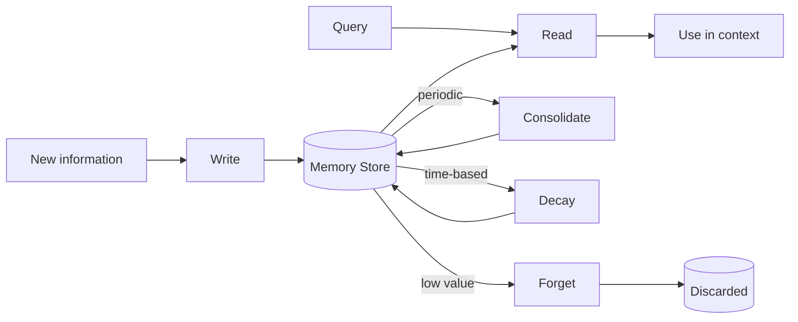
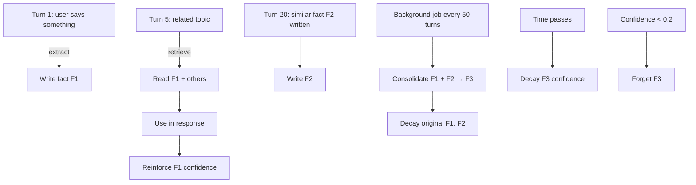

# 03 — Memory Operations

> [!info] TL;DR
> Agent memory is not a passive store — it is an active system with operations: **write** (store new memories), **read** (retrieve relevant memories), **consolidate** (merge and summarize), **decay** (deprecate stale or low-value memories), and **forget** (delete). Without these operations, memory grows unboundedly, retrieval quality degrades, and the agent acts on stale information. The operations are inspired by human memory (consolidation during sleep, decay over time) but implemented as explicit system functions.

## The Five Core Operations



### 1. Write
Store new information in memory. The write operation has several variants:

- **Direct write**: the agent (or application) explicitly stores a fact. "The user's name is Alice."
- **Extracted write**: a background process extracts facts from conversation and stores them. "Based on the conversation, extract 3 facts about the user."
- **Inferred write**: the agent infers a fact not directly stated. "The user mentioned a 6-year-old daughter; the user is likely a parent."

Each write should include metadata:
- **Source**: who/what wrote it (agent ID, user, system).
- **Timestamp**: when it was written.
- **Confidence**: how certain the fact is (1.0 for explicit statements, lower for inferences).
- **TTL**: time-to-live, if the fact is expected to expire (e.g., "user is currently in a meeting" — expires in 1 hour).
- **Tags**: categorical metadata for filtering (topic, entity, type).

Without metadata, you cannot decay, consolidate, or validate memories later.

### 2. Read
Retrieve relevant memories for the current context. Read operations:

- **Semantic search**: embed the query, retrieve the top-K most similar memories. Use a vector DB.
- **Keyword search**: BM25 or full-text search for exact matches. Useful for entity names, IDs.
- **Hybrid search**: combine semantic + keyword; typical production default.
- **Time-filtered**: only memories from the last N hours/days. Useful for "what happened recently" queries.
- **Metadata-filtered**: only memories with specific tags. Useful for topic-specific retrieval.
- **Graph traversal**: if memories are linked (e.g., a knowledge graph), traverse from a starting memory to related ones.

Read operations should return not just the memory content but also the metadata, so the agent can reason about source, confidence, and recency.

### 3. Consolidate
Merge and summarize memories to reduce redundancy and improve retrieval quality. Consolidation patterns:

- **Deduplication**: if two memories are semantically similar, merge them. "User likes pizza" + "User ordered pizza twice this week" → "User likes pizza (frequently orders)."
- **Summarization**: replace N old memories with a single summary. Common for conversation history — summarize the last 50 turns into a paragraph.
- **Hierarchical summarization**: summaries of summaries. Day → week → month → year. Each level is more compact but loses detail.
- **Entity consolidation**: merge all facts about an entity into a single "entity card." "Alice: name=Alice, age=32, lives=NYC, job=engineer."
- **Conflict resolution**: if two memories conflict ("user lives in NYC" vs. "user lives in London"), resolve by recency, confidence, or explicit user correction.

Consolidation is typically run as a background job (every N turns, or nightly) rather than synchronously during a conversation. It is expensive (LLM calls for summarization) but essential for long-running agents.

### 4. Decay
Reduce the priority or confidence of memories over time. Decay patterns:

- **Time-based decay**: confidence decreases with age. A fact from 6 months ago has lower confidence than one from yesterday.
- **Access-based decay**: memories that haven't been retrieved in a long time are deprioritized. Similar to LRU cache eviction.
- **Reinforcement**: when a memory is retrieved and used, its confidence is boosted (it's clearly still relevant).
- **Exponential decay**: `confidence *= 0.99^days_since_write`. Smooth, gradual.

Decay does not delete memories — it just affects retrieval ranking. A decayed memory is still retrievable if explicitly searched for, but it ranks lower in semantic search.

### 5. Forget
Delete memories that are no longer useful. Forgetting patterns:

- **TTL expiration**: memories with a TTL are deleted when it expires. "User is in a meeting" — deleted after 1 hour.
- **Low-confidence deletion**: memories below a confidence threshold (e.g., 0.2) are deleted during consolidation.
- **Explicit deletion**: the agent or user explicitly forgets a fact. "Forget that I told you my password."
- **Privacy-driven deletion**: delete PII after a retention period, per GDPR or similar regulations.
- **Capacity-driven deletion**: when memory is full, evict the lowest-priority memories (LRU-style).

Forgetting is irreversible (unless you have an audit log). Be conservative — decay first, forget only when clearly safe.

## Operation Lifecycle

A typical memory lifecycle in a long-running agent:



## Implementation Patterns

### Memory as a Database
Most production memory systems use a database:
- **Vector DB** (Pinecone, Qdrant, Weaviate, pgvector): for semantic search.
- **Relational DB** (Postgres): for structured facts, metadata, relationships.
- **Document DB** (MongoDB): for flexible memory schemas.
- **Graph DB** (Neo4j): for entity-relationship memories (knowledge graphs).

Hybrid: pgvector gives you both vector search and relational queries in one database. For most production systems, this is the right starting point.

### Memory Schema
A typical memory record:

```python
class Memory(BaseModel):
    id: str
    user_id: str
    tenant_id: str
    content: str  # the actual memory text
    embedding: list[float]  # for vector search
    metadata: dict  # source, tags, entities
    confidence: float  # 0.0 to 1.0
    created_at: datetime
    last_accessed_at: datetime
    access_count: int
    ttl: Optional[datetime]  # when to expire
    superseded_by: Optional[str]  # if a newer memory replaces this one
```

### Operation APIs
```python
class MemoryStore:
    def write(self, content: str, metadata: dict = None, confidence: float = 1.0, ttl: timedelta = None) -> str: ...
    def read(self, query: str, limit: int = 5, filter: dict = None) -> list[Memory]: ...
    def consolidate(self, user_id: str) -> int: ...  # returns number of memories merged
    def decay(self, user_id: str) -> int: ...  # returns number of memories decayed
    def forget(self, memory_id: str) -> bool: ...
    def reinforce(self, memory_id: str) -> None: ...  # boost confidence on access
```

These APIs are wrapped in agent tools (function calls) so the agent can manage memory autonomously, similar to MemGPT (see [[02 - MemGPT and Letta]]).

## Common Pitfalls

### No Consolidation
Memories accumulate without deduplication. After 1000 turns, the store has 5000 memories, many redundant. Search quality degrades; latency increases.

### No Decay
A fact from 2 years ago has the same confidence as one from yesterday. The agent acts on stale information. Always implement decay.

### Forgetting Without Audit
A user asks "what did you know about me last month?" and you cannot answer because you forgot everything. Maintain an audit log of forgotten memories for compliance and debugging.

### No Confidence Tracking
All memories are treated as equally reliable. The agent acts on a low-confidence inference the same way as a high-confidence explicit statement. Always track and use confidence.

### Synchronous Consolidation
Consolidation runs during the conversation, adding seconds of latency. Run it as a background job.

### No Per-Tenant Isolation
Agent A reads Agent B's user's memories. Use row-level security or explicit tenant filtering on every query.

### Embedding Drift
If you change embedding models, old memories have stale embeddings and are not retrievable. Either re-embed everything (expensive) or maintain a versioning scheme.

## Why This Matters

Memory operations are the difference between an agent that learns and one that forgets. Without consolidation, agents accumulate noise. Without decay, agents act on stale information. Without forgetting, agents become slow and unmanageable.

For production agents, the memory operations layer is as important as the LLM itself. A great LLM with poor memory operations produces a worse user experience than a mediocre LLM with well-designed memory.

## See Also

- [[01 - Memory Types]]
- [[02 - MemGPT and Letta]]
- [[04 - Vector Memory Backends]]
- [[18 - Memory Systems/MOC|18 Memory MOC]]
- [[17 - RAG/MOC|17 RAG]] — retrieval is the read operation
- [[02 - Chunking Hybrid Search Reranking]] — search techniques apply to memory retrieval

## Mathematical Model of Decay and Consolidation

A useful way to reason about memory operations quantitatively is to assign each memory $m_i$ a **priority score** $p_i \in [0, 1]$ that determines its retrieval ranking and eligibility for forgetting. The priority is updated by three rules:

1. **Time decay** (continuous): $p_i(t) = p_i(t_0) \cdot e^{-\lambda \Delta t}$ where $\Delta t = t - t_{\text{last\_access}}$ and $\lambda$ is the decay constant (e.g., $\lambda = 0.01$/day for slow decay, $\lambda = 0.1$/day for fast decay).
2. **Access reinforcement** (discrete): each time $m_i$ is retrieved, $p_i \leftarrow \min(1, p_i + \alpha)$ where $\alpha \approx 0.1$.
3. **Confidence update** (continuous): if a new memory $m_j$ contradicts $m_i$, set $p_i \leftarrow p_i \cdot (1 - c_j)$ where $c_j$ is the confidence of the new memory.

A memory is **forgetting-eligible** when $p_i < \theta_{\text{forget}}$ (typically 0.05). It is **consolidation-eligible** when there exists another memory $m_j$ with cosine similarity $> \theta_{\text{similar}}$ (typically 0.85). These thresholds must be tuned per use case — too-aggressive forgetting discards useful memories; too-conservative consolidation leaves duplicates that confuse retrieval.

For a graph-structured memory store (knowledge graph), the same model extends by adding **edge weights** that represent relationship strength. Consolidation becomes **community detection** (group related nodes); decay becomes **edge weight reduction** over time; forgetting becomes **node pruning** for low-degree, low-weight nodes.

## Modern Developments (2024–2026)

### Tiered Memory with Hot/Warm/Cold Storage
Production memory systems now use three-tier storage:
- **Hot tier** (in-process memory, Redis): working memory + last 1–2k turns. Sub-millisecond access.
- **Warm tier** (vector DB with SSD-backed index, e.g., Qdrant): frequently accessed facts, summaries. 10–50ms access.
- **Cold tier** (Postgres table, S3 archive): full history, rarely accessed facts. 100–500ms access.

A **promotion/demotion policy** moves memories between tiers based on access frequency. Mem0 v2, Letta 0.7, and LangGraph's Checkpoint v2 all implement this pattern with slight variations.

### GraphRAG-Inspired Memory Consolidation
Microsoft's GraphRAG (2024) introduced a memory consolidation pattern: rather than storing raw text chunks, extract entities + relationships and store as a knowledge graph. When new information arrives, update the graph (add nodes/edges, merge duplicates). Retrieval combines vector search over node summaries + graph traversal for multi-hop queries. This pattern produces more structured, queryable memory than flat vector stores, especially for entity-heavy domains (legal, medical, financial).

### Sleep-Time Consolidation
Building on the MemGPT sleep-time-compute pattern (see [[02 - MemGPT and Letta]]), modern systems run consolidation jobs during idle windows:
1. **Cluster memories** by semantic similarity; merge clusters below a similarity threshold into a single summary memory.
2. **Detect conflicts** — memories with similar subjects but contradictory content; resolve by recency + confidence.
3. **Extract entity cards** — for each entity mentioned in ≥3 memories, generate a structured "entity card" summarizing all known facts.
4. **Re-rank by importance** — use an LLM-as-judge to score each memory 0–10; demote memories scoring <4 to cold storage.

### Memory Versioning and Time-Travel
Some applications (legal, audit) require knowing "what did the agent know at time T?" Versioning memory means each write produces a new version with `valid_from`/`valid_to` timestamps; superseded memories are not deleted but marked as historical. Querying with `AS_OF=T` returns the memory state at time T. This is implemented as a temporal table in Postgres or a versioned KV store.

### Right-to-Be-Forgotten Compliance
GDPR Article 17 and similar regulations require that users can request deletion of their personal data — including from agent memory. A compliant memory system must:
1. Track all memories by `user_id` (every memory owned by exactly one user).
2. Support cascading delete: `forget(user_id)` deletes all memories for that user, including references in consolidated summaries (which requires re-running consolidation after deletion).
3. Maintain an audit log of the deletion (who requested it, when, scope) without retaining the deleted content.
4. Handle "soft delete" (mark as deleted) for grace periods, then hard delete after confirmation.

## Worked Example — Implementing Decay and Consolidation

```python
import math
from datetime import datetime, timedelta
from typing import Optional

class MemoryRecord:
    def __init__(self, id: str, content: str, confidence: float = 1.0):
        self.id = id
        self.content = content
        self.confidence = confidence
        self.created_at = datetime.utcnow()
        self.last_accessed_at = self.created_at
        self.access_count = 0
        self.superseded_by: Optional[str] = None

    def priority(self, now: datetime, lambda_decay: float = 0.01, alpha_boost: float = 0.1) -> float:
        """Compute current priority score in [0, 1]."""
        if self.superseded_by:
            return 0.0  # superseded memories are effectively gone
        days_since_access = (now - self.last_accessed_at).total_seconds() / 86400
        time_decay = math.exp(-lambda_decay * days_since_access)
        boost = min(1.0, alpha_boost * self.access_count)
        return self.confidence * (0.7 * time_decay + 0.3 * boost)  # weighted blend

    def touch(self):
        """Called when this memory is retrieved."""
        self.last_accessed_at = datetime.utcnow()
        self.access_count += 1

# Example consolidation: merge two memories if cosine similarity > 0.85
def consolidate_pair(m1: MemoryRecord, m2: MemoryRecord, llm) -> MemoryRecord:
    """Use an LLM to merge two semantically similar memories."""
    prompt = f"""Merge these two memories into a single concise statement:
    Memory A: {m1.content}
    Memory B: {m2.content}
    Merged:"""
    merged_content = llm.complete(prompt).strip()
    merged = MemoryRecord(
        id=f"merged-{m1.id}-{m2.id}",
        content=merged_content,
        confidence=max(m1.confidence, m2.confidence),
    )
    m1.superseded_by = merged.id
    m2.superseded_by = merged.id
    return merged

# Nightly background job
def run_consolidation(store, user_id: str, similarity_threshold: float = 0.85):
    memories = store.list_all(user_id)
    for i, m1 in enumerate(memories):
        for m2 in memories[i+1:]:
            if m1.superseded_by or m2.superseded_by:
                continue
            sim = cosine_similarity(embed(m1.content), embed(m2.content))
            if sim > similarity_threshold:
                merged = consolidate_pair(m1, m2, llm)
                store.write(merged)
```

## Common Failure Modes — Diagnostic Table

| Symptom                                | Likely Cause                                  | Fix                                                          |
|----------------------------------------|-----------------------------------------------|--------------------------------------------------------------|
| Search returns irrelevant memories     | Embedding model poorly suited to content type | Use domain-tuned embedder; consider fine-tuning              |
| Agent acts on stale facts              | No decay implemented                          | Implement exponential decay; tune λ per memory type          |
| Memory grows unbounded                 | No consolidation or forgetting job            | Schedule nightly consolidation; cap memory count per user    |
| Consolidation loses important details  | LLM summarizer too aggressive                 | Increase summary length; preserve named entities             |
| Same fact stored 5x                    | No dedup on write                             | Pre-write similarity check; reject if sim > 0.95             |
| Latency grows with memory size         | Linear scan in read path                      | Use ANN index (HNSW, IVF); pin hot memories in Redis         |
| Memory leak across users               | Missing tenant filter on read                 | Enforce `WHERE tenant_id = ?` on every query                 |
| Cannot answer "what did you know at T" | No versioning                                 | Add temporal table; track `valid_from`/`valid_to`            |
| GDPR delete leaves orphan facts        | Consolidated summaries still contain PII      | Re-run consolidation after deletion; scrub PII from summaries|

## Interview Questions

1. **Q: Walk through the lifecycle of a single memory from write to forget.**
   A: (1) **Write** — agent or extractor stores the fact with metadata (source, timestamp, confidence, TTL). (2) **Read** — at retrieval time, the memory is ranked by priority (decay × confidence × recency). (3) **Reinforce** — if retrieved, `last_accessed_at` updates and confidence is boosted. (4) **Consolidate** — if a similar memory is later written, an LLM merges them; the originals are marked superseded. (5) **Decay** — priority decreases exponentially with time since last access. (6) **Forget** — once priority drops below threshold (or TTL expires, or user requests deletion), the memory is hard-deleted (with audit log entry).

2. **Q: Why is consolidation expensive, and how do you make it tractable?**
   A: Consolidation requires pairwise similarity checks (O(n²)) and LLM calls for each merge. To make it tractable: (1) run as a **background job** during low-traffic windows; (2) **cluster first** with cheap ANN search, then only consolidate within clusters; (3) **batch LLM calls** — merge multiple memory pairs in a single prompt; (4) **incremental consolidation** — only process memories written since last run, not the whole store. A 1M-memory store can be consolidated nightly with ~$5 of LLM cost using these techniques.

3. **Q: How do you handle conflicting memories (e.g., "user lives in NYC" vs "user lives in London")?**
   A: Three-step conflict resolution: (1) **Detect** — during consolidation, if two memories have high subject similarity but contradictory content (use an LLM judge), flag as conflict. (2) **Resolve** — apply priority rules: explicit user statement > inferred; recent > old; high-confidence > low-confidence. (3) **Mark** — the losing memory is marked `superseded_by` the winning one (not deleted, for audit purposes). For ambiguous cases (same recency, same confidence), surface to the user: "I have conflicting info — do you live in NYC or London?"

4. **Q: What's the difference between decay and forgetting?**
   A: **Decay** is a soft signal — it reduces a memory's priority/retrieval rank but doesn't remove it. The memory is still searchable if explicitly queried. **Forgetting** is hard deletion — the memory is removed from the store (possibly with audit log). Decay is reversible (retrieval boosts priority back up); forgetting is irreversible. Best practice: decay aggressively, forget conservatively. Use forgetting only for TTL expiration, low-confidence cleanup, or explicit user/GDPR requests.

5. **Q: How would you implement GDPR-compliant "right to be forgotten" in an agent memory system?**
   A: (1) Every memory has a `user_id` — no anonymous writes. (2) `forget(user_id)` cascade-deletes all memories where `user_id` matches, including in consolidated summaries (re-run consolidation to scrub PII). (3) Audit log records the deletion event (who, when, scope) but NOT the deleted content. (4) Soft-delete for a 30-day grace period (recoverable), then hard-delete. (5) Vector embeddings derived from deleted content are also deleted (not just the text). (6) Backups must support point-in-time deletion requests — typically a 30-day backup retention limit, with GDPR delete requests queued for after-backup-expiry.

6. **Q: How does tiered storage (hot/warm/cold) interact with decay?**
   A: Decay drives tier transitions. Hot tier holds high-priority memories (recently accessed, high confidence). As priority decays, memories are **demoted** to warm tier (slower access, larger capacity), then to cold tier (slowest, largest, cheapest). Re-access **promotes** them back to hot tier. This is the same pattern as CPU caches (L1/L2/L3) — the OS analogy continues to hold. Tuning: hot tier ~1k memories/user (Redis, ~1MB/user), warm tier ~50k (Qdrant, ~50MB/user), cold tier unbounded (S3, ~$0.023/GB/month).

## Connection to Other Concepts

- [[18 - Memory Systems/Types/01 - Memory Types]] — the cognitive-science taxonomy that motivates operations like consolidation (sleep) and decay (forgetting curve).
- [[18 - Memory Systems/Architectures/02 - MemGPT and Letta]] — exposes these operations as agent-callable tools.
- [[18 - Memory Systems/Vector Memory/04 - Vector Memory Backends]] — the storage layer where write/read/decay/forget physically happen.
- [[17 - RAG/Ingestion and Retrieval/02 - Chunking Hybrid Search Reranking]] — the read operation uses the same search techniques.
- [[17 - RAG/Advanced Patterns/03 - Advanced RAG Patterns]] — GraphRAG-inspired consolidation.
- [[15 - AI Agents/Autonomy/08 - Autonomous Agent Lifecycles]] — operations fire during agent lifecycle phases.
- [[22 - Production AI/Security/05 - PII and Data Leakage]] — PII handling in memory write/forget.
- [[21 - LLMOps and MLOps/Monitoring/05 - Production Monitoring]] — memory ops metrics (write rate, retrieval latency, consolidation cost).
- [[02 - Mathematics/Information Theory/15 - Entropy Cross-Entropy KL]] — information-theoretic view of consolidation as compression.
- [[02 - Mathematics/Statistics/16 - Estimators and Bias]] — confidence scoring as a statistical estimator.
