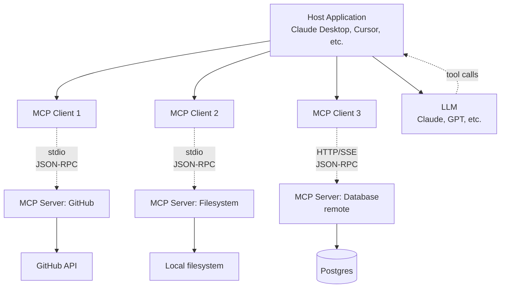

# 01 - MCP (Model Context Protocol)

> [!info] TL;DR
> MCP (Anthropic, 2024) is an open protocol for connecting LLMs to external tools, data sources, and services. Standardizes "tool/function calling" across models and applications. Increasingly the standard for agentic tool integration in 2026. This note covers the problem MCP solves, the architecture, the three resource types (tools, resources, prompts), the protocol details, transports, security model, lifecycle, comparison to function calling, production patterns, and the broader ecosystem.

## The Problem MCP Solves

Before MCP, every LLM application that needed tools wrote custom integrations:
- Custom OpenAI function calling schemas.
- Custom Anthropic tool use.
- Custom local LLM tool formats.
- Custom RAG pipeline connections.

This produced an N×M integration problem: N LLM clients × M tools = N×M custom integrations. Each new model required rewriting tool integrations for every tool. Each new tool required integration code for every model.

The result was:
- Tools couldn't be shared across applications.
- Switching LLM providers required rewriting tool integrations.
- Each new tool needed app-specific code.
- Tool developers had to support multiple formats.
- Application developers had to maintain many integrations.

MCP defines a standard protocol so any MCP-compatible tool can be used by any MCP-compatible client. This reduces N×M to N+M: each tool implements MCP once; each client implements MCP once. The protocol is the bridge.

## The MCP Architecture



### Components

- **Host**: the application (Claude Desktop, Cursor, custom app). The host contains one or more MCP clients and an LLM.
- **Client**: lives in the host; connects to one server. Each client manages one server connection. The host may have multiple clients (one per server).
- **Server**: a process exposing tools/resources/prompts via MCP. Servers can be local (subprocess of the host) or remote (HTTP service).
- **LLM**: the model that decides when to call tools. The LLM doesn't directly talk to MCP — it talks to the host, which routes tool calls to the appropriate client.

### Communication Pattern

1. Host starts an MCP server (or connects to a remote one).
2. Client sends an `initialize` request to negotiate capabilities.
3. Client calls `list_tools`, `list_resources`, `list_prompts` to discover what the server offers.
4. Host aggregates tools from all servers and presents them to the LLM.
5. When the LLM emits a tool call, the host routes it to the appropriate client.
6. Client sends `call_tool` to the server; server executes and returns the result.
7. Host passes the result back to the LLM as a tool response.

This decoupling means:
- Servers are model-agnostic (don't care which LLM is calling).
- Hosts are tool-agnostic (don't care which server provides a tool).
- LLMs are transport-agnostic (don't care if a tool is local or remote).

## The Three Resource Types

MCP defines three types of capabilities a server can expose: tools, resources, and prompts. Each serves a different purpose.

### Tools

Functions the LLM can call. Like function calling, but standardized:

```json
{
  "name": "search_issues",
  "description": "Search GitHub issues in a repo",
  "inputSchema": {
    "type": "object",
    "properties": {
      "repo": {"type": "string", "description": "owner/repo format"},
      "query": {"type": "string", "description": "search query"},
      "state": {"type": "string", "enum": ["open", "closed", "all"], "default": "open"}
    },
    "required": ["repo"]
  }
}
```

Tools are the primary way MCP extends LLM capabilities. The LLM decides when to call a tool, based on the tool's name and description.

Key characteristics:
- **Model-invoked**: the LLM chooses to call the tool (vs. resources, which are user/developer-invoked).
- **Side-effecting**: tools can modify state (write a file, send an email, deploy code).
- **Asynchronous**: tool calls return results; the LLM waits for the response.
- **Schema-validated**: the input schema is JSON Schema; the server validates inputs.

### Resources

Read-only data sources the LLM can access:
- File contents.
- Database rows.
- API responses.
- Logs, metrics, configuration.

Resources have URIs (`file:///path/to/file`, `github://repo/issue/123`, `db://users/42`). The client can list available resources and read specific ones by URI.

Key characteristics:
- **User/developer-invoked**: resources are typically attached to the conversation by the user (e.g., "analyze this file") or programmatically by the host.
- **Read-only**: resources don't have side effects (vs. tools, which can).
- **URI-addressable**: each resource has a unique URI; clients can read by URI.
- **Subscribable**: clients can subscribe to resource changes (e.g., a log file that updates).

Resources are useful for providing context without explicit tool calls. For example, a file system MCP server exposes `file:///path/to/file` resources; the host can attach relevant files to the conversation automatically.

### Prompts

Pre-defined prompt templates the user can invoke. Like slash commands:
- `/summarize_issue` — fetches issue, summarizes it.
- `/review_pr` — fetches PR, reviews it.
- `/explain_error` — reads an error log, explains the cause.

Prompts are parameterized templates. When the user invokes a prompt, the server fills in the template (possibly using tools to fetch data) and returns a complete message for the LLM.

Key characteristics:
- **User-invoked**: prompts are triggered by the user (e.g., typing `/summarize_issue 123`).
- **Templated**: prompts have arguments (e.g., issue number, file path).
- **Server-side composition**: the server can use its tools internally to compose the prompt (e.g., fetch the issue, then format the prompt with its content).
- **Reusable**: prompts codify workflows that users invoke repeatedly.

Prompts bridge the gap between tools (LLM-invoked) and resources (developer-invoked). They let users trigger complex workflows with a single command.

## The Protocol Details

MCP uses JSON-RPC 2.0 as the message format. Messages are request/response or notification.

### Message Format

```json
{
  "jsonrpc": "2.0",
  "id": 1,
  "method": "tools/call",
  "params": {
    "name": "search_issues",
    "arguments": {"repo": "anthropics/anthropic-sdk-python", "query": "bug"}
  }
}
```

Response:
```json
{
  "jsonrpc": "2.0",
  "id": 1,
  "result": {
    "content": [
      {"type": "text", "text": "Found 3 issues:\n1. ..."}
    ]
  }
}
```

### Core Methods

| Method                  | Direction         | Purpose                                |
|-------------------------|-------------------|----------------------------------------|
| `initialize`            | Client → Server   | Negotiate capabilities, exchange info  |
| `initialized`           | Client → Server   | Notification: initialization complete  |
| `tools/list`            | Client → Server   | List available tools                   |
| `tools/call`            | Client → Server   | Call a specific tool                   |
| `resources/list`        | Client → Server   | List available resources               |
| `resources/read`        | Client → Server   | Read a resource by URI                 |
| `resources/subscribe`   | Client → Server   | Subscribe to resource changes          |
| `prompts/list`          | Client → Server   | List available prompts                 |
| `prompts/get`           | Client → Server   | Get a specific prompt with arguments   |
| `notifications/*`       | Server → Client   | Server-initiated notifications         |

### Capability Negotiation

During initialization, client and server exchange capabilities:

```json
{
  "method": "initialize",
  "params": {
    "protocolVersion": "2024-11-05",
    "capabilities": {
      "experimental": {},
      "sampling": {},
      "roots": {"listChanged": true}
    },
    "clientInfo": {"name": "Claude Desktop", "version": "1.0.0"}
  }
}
```

Server responds with its capabilities:
```json
{
  "result": {
    "protocolVersion": "2024-11-05",
    "capabilities": {
      "tools": {"listChanged": true},
      "resources": {"subscribe": true, "listChanged": true},
      "prompts": {"listChanged": true}
    },
    "serverInfo": {"name": "github-mcp-server", "version": "1.2.0"}
  }
}
```

This negotiation lets clients and servers with different feature sets interoperate. A server that doesn't support resource subscriptions simply doesn't advertise that capability; the client knows not to use it.

## Transports

MCP supports multiple transports:

### stdio (Local)

The server is a subprocess of the host. Communication is via stdin/stdout (JSON-RPC messages). This is the default for local tools.

- **Pros**: simple, fast, no network overhead.
- **Cons**: server must run on the same machine as the host.
- **Use case**: local file system, local databases, local development tools.

### HTTP + SSE (Remote)

The server is a remote HTTP service. Communication is via HTTP POST for requests and Server-Sent Events (SSE) for responses/notifications.

- **Pros**: server can run anywhere; multiple hosts can share a server.
- **Cons**: adds network latency; needs authentication.
- **Use case**: shared enterprise tools, cloud services, multi-user environments.

### WebSocket (Future)

The spec includes WebSocket as a transport, useful for bidirectional real-time communication. Less commonly implemented in 2026.

### Transport-Agnostic Protocol

The protocol is transport-agnostic. The same JSON-RPC messages work over stdio, HTTP+SSE, or WebSocket. This lets servers be deployed locally or remotely without changing the tool implementation.

## Security Model

MCP servers can execute arbitrary code, access files, and make network calls. Security is critical.

### Trust Model

- **Local servers (stdio)**: trusted by default (the user installed them). But still validate inputs and outputs.
- **Remote servers (HTTP)**: untrusted by default. Require authentication (OAuth 2.1) and HTTPS.

### Authentication

For remote servers, MCP supports OAuth 2.1:

- Server exposes an OAuth endpoint.
- Client obtains an access token (via user consent flow).
- Client includes the token in the `Authorization: Bearer ...` header.
- Server validates the token before processing requests.

For local servers, authentication is typically implicit (the user running the host is the user accessing the server).

### Permissions

MCP supports per-tool permissions. The host can:
- Prompt the user before calling a tool with side effects.
- Restrict which tools the LLM can see (filter `list_tools` results).
- Log all tool calls for audit.

This is especially important for tools that modify state (write files, send emails, deploy code). See [[09 - Human-in-the-Loop Patterns]] for the approval gate pattern.

### Sandboxing

For untrusted servers, run in a sandbox:
- Docker container with restricted filesystem and network.
- Separate user account with limited permissions.
- AppArmor / SELinux profiles.

### Tool Code Execution

Tools that execute LLM-generated code (e.g., a Python REPL tool) are especially dangerous. Use:
- Docker containers with resource limits (CPU, memory, network).
- No access to host filesystem.
- No access to host environment variables.
- Timeouts to prevent infinite loops.

## Lifecycle

The MCP lifecycle has distinct phases:

### 1. Discovery

The host discovers available MCP servers. This may be:
- Configuration file (Claude Desktop's `claude_desktop_config.json`).
- Dynamic discovery (mDNS, service registry).
- User-installed extensions.

### 2. Initialization

For each server, the host creates a client and sends `initialize`. They negotiate protocol version and capabilities.

### 3. Capability Listing

Client calls `tools/list`, `resources/list`, `prompts/list` to discover what the server offers. The host aggregates these across all servers.

### 4. Tool Presentation

The host presents aggregated tools to the LLM (as function definitions). The LLM decides when to call tools.

### 5. Tool Execution

When the LLM emits a tool call:
- Host routes to the appropriate client (based on tool name).
- Client sends `tools/call` to the server.
- Server executes and returns the result.
- Host passes the result to the LLM.

### 6. Resource/Prompt Invocation

For resources and prompts, the user or host triggers invocation (not the LLM). The server returns content that's added to the conversation.

### 7. Shutdown

When the host exits or the user removes a server:
- Client sends shutdown notification.
- Server cleans up resources.
- For stdio: subprocess terminates.
- For HTTP: connection closes.

## MCP vs Function Calling

Function calling (OpenAI, Anthropic) and MCP solve related but distinct problems:

| Aspect              | Function Calling                  | MCP                                |
|---------------------|-----------------------------------|------------------------------------|
| Scope               | Per-request, per-app              | Cross-app, cross-model             |
| Standard            | Vendor-specific                   | Open protocol                      |
| Tool discovery      | App provides at request time      | Server advertises; client discovers|
| Tool execution      | App executes                      | Server executes                    |
| State               | Stateless                         | Server can be stateful             |
| Cross-app reuse     | No                                | Yes                                |
| Resources/prompts   | No (just tools)                   | Yes                                |
| Transport           | N/A (in-process)                  | stdio, HTTP+SSE, WebSocket         |

MCP doesn't replace function calling — it standardizes how tools are exposed and discovered. Under the hood, MCP servers receive function-call requests and execute them. The host translates between the LLM's function-calling format and MCP's `tools/call`.

### When to Use Which

- **Use function calling directly** when: you have a small, app-specific set of tools; you don't need cross-app reuse; you want maximum control.
- **Use MCP** when: you want tools reusable across apps; you're building an ecosystem of tools; you want to support multiple LLM providers; you need resources or prompts (not just tools).

Most production agent systems will use both: MCP for reusable tools, function calling for app-specific tools.

## Worked Example (MCP Server)

```python
from mcp.server import Server
from mcp.types import Tool, Resource, Prompt
import json

server = Server("github-mcp-server")

@server.list_tools()
async def list_tools():
    return [
        Tool(
            name="search_issues",
            description="Search GitHub issues in a repo",
            inputSchema={
                "type": "object",
                "properties": {
                    "repo": {"type": "string", "description": "owner/repo format"},
                    "query": {"type": "string"},
                    "state": {"type": "string", "enum": ["open", "closed", "all"], "default": "open"}
                },
                "required": ["repo"]
            }
        ),
        Tool(
            name="create_issue",
            description="Create a new GitHub issue",
            inputSchema={
                "type": "object",
                "properties": {
                    "repo": {"type": "string"},
                    "title": {"type": "string"},
                    "body": {"type": "string"}
                },
                "required": ["repo", "title"]
            }
        )
    ]

@server.call_tool()
async def call_tool(name, arguments):
    if name == "search_issues":
        result = await github_search_issues(**arguments)
        return {"content": [{"type": "text", "text": json.dumps(result, indent=2)}]}
    elif name == "create_issue":
        # This is a side-effecting tool — host may want approval
        result = await github_create_issue(**arguments)
        return {"content": [{"type": "text", "text": f"Created issue #{result['number']}"}]}

@server.list_resources()
async def list_resources():
    return [
        Resource(
            uri="github://anthropics/anthropic-sdk-python/issues",
            name="Open issues for anthropic-sdk-python",
            mimeType="application/json"
        )
    ]

@server.read_resource()
async def read_resource(uri):
    if uri.startswith("github://"):
        # Parse repo and resource type from URI
        parts = uri[len("github://"):].split("/")
        repo = "/".join(parts[:2])
        resource_type = parts[2] if len(parts) > 2 else None
        if resource_type == "issues":
            issues = await github_list_issues(repo)
            return json.dumps(issues)
    raise ValueError(f"Unknown URI: {uri}")

@server.list_prompts()
async def list_prompts():
    return [
        Prompt(
            name="summarize_issue",
            description="Fetch and summarize a GitHub issue",
            arguments=[
                {"name": "repo", "description": "owner/repo", "required": True},
                {"name": "issue_number", "description": "Issue number", "required": True}
            ]
        )
    ]

@server.get_prompt()
async def get_prompt(name, arguments):
    if name == "summarize_issue":
        repo = arguments["repo"]
        issue_num = arguments["issue_number"]
        issue = await github_get_issue(repo, issue_num)
        return {
            "description": f"Summarize issue #{issue_num} in {repo}",
            "messages": [
                {"role": "user", "content": f"Please summarize this GitHub issue:\n\nTitle: {issue['title']}\nBody: {issue['body']}"}
            ]
        }

if __name__ == "__main__":
    import asyncio
    from mcp.server.stdio import stdio_server
    async def main():
        async with stdio_server() as (read, write):
            await server.run(read, write, server.create_initialization_options())
    asyncio.run(main())
```

This server exposes:
- 2 tools (search_issues, create_issue).
- 1 resource (github://...issues).
- 1 prompt (/summarize_issue).

## MCP Clients

Any application can be an MCP client:
- **Claude Desktop** (Anthropic): first-party support.
- **Cursor** (AI code editor): MCP for tools.
- **Cline**, **Continue**, **Roo Code**: code assistants with MCP.
- **LangGraph / LangChain**: MCP integration for agents.
- **Custom applications**: use the MCP SDK (Python, TypeScript, Rust, Go).

The MCP SDK handles the protocol details (JSON-RPC, capability negotiation, transport). Application developers focus on tool implementation.

## Why This Matters for AI

- MCP is becoming **the** standard for agentic tool integration. Major AI apps (Claude, Cursor, Cline) support it.
- For tool builders, MCP means **write once, run in any MCP-compatible app**. No per-app integrations.
- For AI engineers, MCP provides a clean separation: your agent code talks to MCP servers; the servers handle tool execution.
- The protocol is open and vendor-neutral, avoiding lock-in.
- MCP enables an ecosystem of reusable tools — a GitHub MCP server can be used by Claude, Cursor, and any other MCP-compatible app without modification.
- Resources and prompts (beyond just tools) enable richer interactions: context attachment, workflow automation.

## Production Implications

- **For tool builders**: expose your tool as an MCP server. Any MCP-compatible client can use it.
- **For agent builders**: use MCP clients to consume tools. Don't write custom tool integrations.
- **Security**: MCP servers can run arbitrary code. Only run servers you trust; sandbox untrusted ones. Use OAuth for remote servers.
- **Authentication**: MCP supports OAuth for remote servers. Use it for any sensitive tool.
- **Performance**: local (stdio) MCP servers are fast; remote (HTTP) add latency. Cache where possible.
- **Tool versioning**: when you update a tool's schema, old clients may break. Version your server and document breaking changes.
- **Tool selection**: don't expose 100 tools to the LLM — it gets confused. Expose the relevant subset, or use a tool router.
- **Audit logging**: log all tool calls (name, arguments, result, timestamp) for compliance and debugging.
- **Rate limiting**: for shared remote servers, rate-limit per client to prevent abuse.
- **Multi-tenancy**: for shared servers, isolate tenants' data. Don't let one tenant's tool call see another tenant's resources.

## Common Pitfalls

- **Trusting untrusted MCP servers** — they can execute arbitrary code. Vet and sandbox.
- **Forgetting to handle tool errors** — MCP tools can fail; your agent should handle gracefully (retry, fall back, report to user).
- **Not setting timeouts** — long-running tools can hang agents. Set per-tool timeouts (e.g., 30 seconds default).
- **Mixing MCP and direct function calling** — pick one approach for consistency, or use a clear abstraction layer.
- **Forgetting to update tool schemas** when the server changes — leads to runtime errors. Re-fetch tool lists periodically.
- **Exposing too many tools** — the LLM gets confused with >20 tools. Use a router or sub-server architecture.
- **Not validating tool arguments** — even though the schema is JSON Schema, validate semantically (e.g., path traversal in file tools).
- **Returning too much data** — tool results go into the LLM's context. Truncate large results.
- **Not handling resource subscriptions** — if a resource changes, subscribers should be notified. Forgetting this produces stale data.
- **Ignoring transport differences** — stdio is fast, HTTP is slow. Don't assume one transport.
- **Security: prompt injection via tool results** — a malicious tool result could contain prompt injection ("ignore previous instructions and..."). Sanitize tool outputs.

## Comparison to Related Standards

| Standard | Focus | Status (2026) |
|----------|-------|---------------|
| MCP | Tool/resource/prompt protocol for LLMs | Growing adoption |
| OpenAPI | REST API description | Mature, but not LLM-specific |
| GraphQL | API query language | Mature, not LLM-specific |
| JSON Schema | Data validation | Mature, used by MCP |
| LangChain Tools | LangChain-specific tool format | LangChain ecosystem only |
| OpenAI Function Calling | OpenAI-specific tool format | OpenAI only |

MCP is the first widely-adopted open protocol specifically designed for LLM tool use. It builds on JSON-RPC and JSON Schema but adds LLM-specific concepts (resources, prompts, capability negotiation).

## Future Directions

- **MCP registries**: a public registry of MCP servers (like npm for tools) for discovery.
- **MCP composition**: servers that compose other servers (meta-servers).
- **Streaming tool results**: for long-running tools, stream partial results instead of waiting for completion.
- **Multi-modal resources**: resources that include images, audio, video.
- **Formal verification**: tools that formally verify their behavior (for high-stakes domains).
- **MCP over QUIC**: faster transport for remote servers.

## Interview Questions

- **Q: What problem does MCP solve?**  
  A: The N×M integration problem: N LLM clients × M tools = N×M custom integrations. MCP standardizes the protocol, reducing to N+M.

- **Q: What are the three types of MCP resources?**  
  A: Tools (LLM-invoked functions), resources (URI-addressable read-only data), prompts (user-invoked templated workflows).

- **Q: How does MCP differ from function calling?**  
  A: Function calling is per-app and vendor-specific. MCP is an open protocol for cross-app, cross-model tool integration. MCP also adds resources and prompts, which function calling doesn't have.

- **Q: How would you secure an MCP server?**  
  A: For remote servers, use OAuth 2.1 and HTTPS. For local servers, run as a subprocess with limited permissions. For untrusted servers, sandbox in Docker. Always validate inputs, set timeouts, and log all calls.

- **Q: Why would you use MCP over LangChain tools?**  
  A: MCP tools are reusable across any MCP-compatible app (Claude, Cursor, custom apps). LangChain tools are LangChain-specific. If you want your tool usable by multiple AI applications, use MCP.

## Further Reading

- Anthropic (2024), *Model Context Protocol specification*: https://modelcontextprotocol.io
- MCP SDKs: Python, TypeScript, Rust, Go.
- Anthropic blog: https://www.anthropic.com/news/model-context-protocol
- MCP server examples: https://github.com/modelcontextprotocol/servers

## See Also

- [[02 - MCP Components]] — detailed tools, resources, prompts
- [[03 - MCP Security]] — security considerations in depth
- [[04 - MCP Enterprise Integration]] — enterprise deployment patterns
- [[15 - AI Agents/Tool Calling/04 - Function Calling|Function Calling]] — the underlying mechanism
- [[15 - AI Agents/MOC|15 AI Agents]]
- [[19 - MCP/MOC|MCP MOC]]
- [[08 - Build an MCP Server]] — implementing an MCP server
