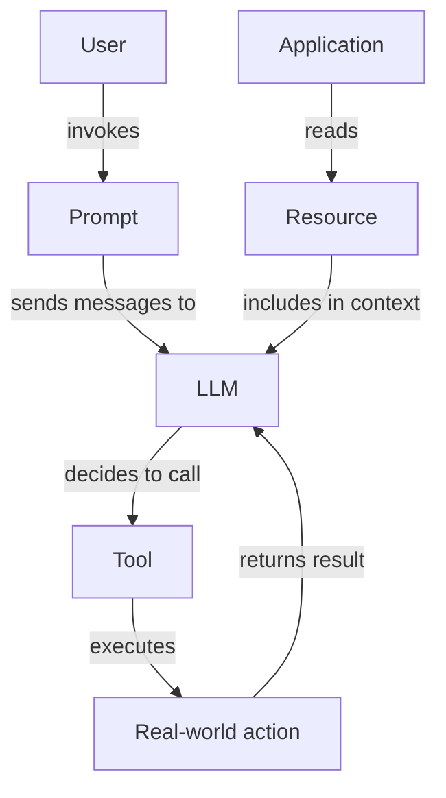

# 02 — MCP Components

> [!info] TL;DR
> The Model Context Protocol (MCP) defines three first-class component types that servers can expose to clients: **Resources** (read-only data the model can read), **Prompts** (templated prompts the user can invoke), and **Tools** (executable functions the model can call). Resources are passive context, prompts are user-triggered workflows, and tools are model-triggered actions. Understanding the distinction is essential for designing MCP servers that integrate cleanly with LLM clients.

## The Three Component Types

MCP separates three different ways an external system can interact with an LLM:

| Component | Triggered By    | Returns              | Example                                  |
|-----------|-----------------|----------------------|------------------------------------------|
| Resource  | Application/ User | Static or semi-static data | "Read the API docs at docs://api/v1"     |
| Prompt    | User (via UI)   | Messages to send to LLM | "Code review prompt for a Python file"   |
| Tool      | Model (function call) | Result of execution  | "Query the database: SELECT * FROM users" |

This separation matters because the three have different trust models, latency expectations, and integration patterns. Conflating them leads to security issues and poor UX.

## Resources

A **resource** is a piece of data the server exposes for the client to read. Resources are addressed by URIs (`docs://api/v1`, `file:///path/to/file`, `db://users/123`). The client (typically the LLM application) decides when to read a resource and how to include it in the model's context.

### URI Schemes
Resources use any URI scheme. Common patterns:
- `file://` — local files.
- `http://` and `https://` — web resources.
- `git://` — Git repository files.
- `db://` — database rows.
- `prompt://` — templated prompts (overlap with the Prompts component).

Custom schemes are encouraged for domain-specific resources (e.g., `jira://issue/PROJ-123`).

### Resource Templates
Resources can be parameterized via URI templates: `db://users/{user_id}`. The client fills in the parameter and reads the resulting URI. This lets the server expose a logical namespace without enumerating every possible resource.

### Resource Discovery
Servers expose a `resources/list` endpoint that returns available resources (or resource templates). Clients can list resources to show the user what's available, or programmatically discover resources based on the current task.

### When to Use Resources
- Static context the model needs (API docs, schema definitions, configuration files).
- Data the user explicitly chooses to share (selected files, database rows).
- Long-lived reference material that does not change per request.

Resources are **not** for:
- Dynamic data the model needs to compute (use a Tool instead).
- One-shot prompts (use the Prompts component instead).
- Streaming data (resources are read-once).

## Prompts

A **prompt** is a templated set of messages the server provides. The user invokes the prompt (typically through a UI like "Run the code-review prompt"), the server fills in the template, and the resulting messages are sent to the LLM.

### Prompt Structure
A prompt is a list of messages, each with a role (user/assistant/system) and content:

```json
{
  "name": "code-review",
  "description": "Review a code file for issues",
  "arguments": [
    {"name": "file_path", "description": "Path to the file to review", "required": true}
  ],
  "messages": [
    {
      "role": "user",
      "content": {
        "type": "text",
        "text": "Please review the file at {{file_path}} for: bugs, security issues, style problems. Be specific."
      }
    }
  ]
}
```

The server can also embed resources in the prompt (e.g., include the file content as a resource attachment).

### When to Use Prompts
- Pre-defined workflows the user invokes explicitly (code review, summarization, translation).
- Prompts that should be shared across users (the server provides them; users don't have to write them).
- Workflows that combine instructions with embedded context (resources).

Prompts are **not** for:
- Ad-hoc queries (the user just types these directly).
- Model-initiated actions (use Tools instead).

### Prompt Discovery
Servers expose a `prompts/list` endpoint. Clients show available prompts in a UI (like a slash-command menu). Users select a prompt, fill in arguments, and the prompt runs.

## Tools

A **tool** is a function the model can call. The model decides when to call the tool based on the user's request and the tool's description. The server executes the tool and returns the result.

### Tool Structure
```json
{
  "name": "query_database",
  "description": "Run a SQL query against the production database. Use for read-only queries only.",
  "inputSchema": {
    "type": "object",
    "properties": {
      "sql": {"type": "string", "description": "The SQL query to run"}
    },
    "required": ["sql"]
  }
}
```

The model sees the tool's name, description, and input schema. It generates a tool call (function invocation with arguments), the server executes it, and the result is returned to the model.

### When to Use Tools
- Dynamic data retrieval (database queries, API calls, web search).
- Computation (running code, evaluating expressions).
- Side effects (sending emails, creating tickets, updating records).
- Anything the model cannot know statically.

Tools are the most powerful MCP component but also the most dangerous — they can have real-world effects. See [[03 - MCP Security]].

## Component Comparison



| Aspect                | Resource              | Prompt                | Tool                  |
|-----------------------|-----------------------|-----------------------|-----------------------|
| Triggered by          | Application or user   | User                  | Model                 |
| Returns               | Data (text, binary)   | Messages              | Execution result      |
| Latency expectation   | Fast (read cache)     | Instant (template)    | Variable (execution)  |
| Side effects          | None                  | None                  | Yes (potentially)     |
| Trust level           | Read-only, low risk   | Read-only, low risk   | High risk             |
| Authorization         | Read access           | User permissions      | Per-tool permissions  |
| Caching               | Yes                   | N/A                   | Rarely (idempotent)   |

## Combining Components

Real MCP servers typically expose all three component types. Example — a Jira MCP server:

- **Resources**: `jira://issue/PROJ-123` (read an issue), `jira://project/PROJ` (list project metadata).
- **Prompts**: "Summarize open issues assigned to me", "Create a release notes draft from completed issues".
- **Tools**: `create_issue`, `update_issue`, `add_comment`, `transition_issue`.

A user might invoke the "release notes" prompt, which reads multiple resources (the completed issues), and the model might call the `add_comment` tool to post the release notes back to Jira.

This separation keeps the server's surface clean: passive data (resources), user workflows (prompts), and model actions (tools) are each in their own namespace.

## Implementation Patterns

### Resource Implementation
```python
@mcp.resource("db://users/{user_id}")
def get_user(user_id: str):
    user = db.query("SELECT * FROM users WHERE id = ?", user_id)
    return {"mime_type": "application/json", "content": json.dumps(user)}

@mcp.resource("docs://api/v1")
def api_docs():
    return open("docs/api_v1.md").read()
```

Resources are simple functions that return content. The MCP framework handles the URI routing and content negotiation.

### Prompt Implementation
```python
@mcp.prompt()
def code_review(file_path: str) -> list:
    return [
        {"role": "user", "content": f"Please review the file at {file_path} for issues."}
    ]
```

Prompts are functions that return a list of messages. The framework handles argument validation and message formatting.

### Tool Implementation
```python
@mcp.tool()
def query_database(sql: str) -> str:
    """Run a SQL query against the production database."""
    if not is_read_only(sql):
        raise ValueError("Only read-only queries allowed.")
    result = db.execute(sql)
    return json.dumps(result)
```

Tools are functions with type-annotated parameters. The framework generates the JSON schema automatically from the type hints.

## Common Pitfalls

### Using Tools for Static Data
A common mistake: exposing static data (like API docs) as a tool that the model must call. This wastes a model turn (the tool call) and adds latency. Use a Resource instead — the application includes it in context before the model sees the prompt.

### Using Resources for Dynamic Data
Conversely, exposing dynamic data (like the current weather) as a resource is wrong. Resources are read by the application, not the model — the model cannot decide to read a resource mid-conversation. Use a Tool instead.

### No Schema for Tools
Tools without input schemas (or with vague schemas) lead to model hallucination — the model invents arguments. Always provide strict JSON schemas with clear descriptions.

### Verbose Tool Descriptions
Tool descriptions that are too long waste context tokens. Be concise but complete: what the tool does, when to use it, what the arguments mean.

### No Prompt Discovery
If users don't know what prompts are available, they won't use them. Always expose prompts via `prompts/list` and integrate with client UIs.

## See Also

- [[01 - MCP Overview]]
- [[03 - MCP Security]]
- [[04 - MCP Enterprise Integration]]
- [[04 - Function Calling]]
- [[19 - MCP/MOC|19 MCP MOC]]
- [[15 - AI Agents/MOC|15 AI Agents]]

## Modern Developments (2024–2026)

### MCP 2025-06 Spec — Resource Templates and URI Subscriptions
The June 2025 MCP spec revision introduced **resource templates** (parameterized resource URIs like `file://projects/{project_id}/docs/{doc_id}`) and **subscriptions** — clients can subscribe to a resource URI and receive update notifications when the underlying data changes. This turns MCP from a pull-only protocol into a push-capable one, essential for collaborative tools (live-updating documents, shared whiteboards). The spec also added **elicitation** — servers can request additional information from the user mid-operation (e.g., "Please confirm your 2FA code").

### Sampling — Server-Initiated LLM Calls
The 2025-06 spec also standardized **sampling**: a server can request that the client's LLM complete a prompt on its behalf. This inverts the usual client→server direction and lets servers delegate LLM work to the client (which has the user's API key and rate limits). Use cases: an MCP server that summarizes documents can ask the client's LLM to do the summarization, avoiding server-side LLM costs. The client retains control (can decline, modify the prompt, or substitute a different model) — security is preserved.

### Composability — MCP Servers as MCP Clients
Modern MCP servers are often **composable**: they aggregate other MCP servers behind a unified interface. A "company knowledge" server might proxy to filesystem, Slack, GitHub, and Notion servers, presenting them as one logical server to the client. This enables a marketplace pattern: small, focused MCP servers (one per service) combined by an orchestration layer. The Composability spec (2025-11) standardizes how servers declare dependencies on other servers.

### Tool Result Schema Validation
Servers can now declare JSON Schemas for **tool result shapes** (not just input args). Clients validate tool results before passing them to the LLM, catching malformed outputs early. This eliminates a class of bugs where a tool returns unexpected JSON and the LLM hallucinates around it. The 2025-06 spec made result schemas a first-class citizen.

### Streamable HTTP Transport
The 2025-03 spec revision replaced the older HTTP+SSE transport with **Streamable HTTP** — a single-endpoint transport that supports both request/response and server-sent streaming over the same connection. This simplified deployment behind CDNs/load balancers (no need for sticky SSE sessions) and enabled serverless hosting (Lambda/Cloudflare Workers). Stdio transport remains for local servers (lowest latency, no network overhead).

### MCP Marketplace Emergence
2025 saw the emergence of MCP marketplaces — registries where developers publish and discover MCP servers:
- **Anthropic's official registry** (`registry.mcp.anthropic.com`) — curated, verified servers.
- **Smithery** (community) — open marketplace with quality scores.
- **Pulumi MCP Hub** — enterprise-grade registry with security scanning.

Each marketplace has different curation policies; the official Anthropic registry is the most trusted, while community marketplaces prioritize breadth.

## Worked Example — A Production-Grade MCP Server

```python
from mcp.server import Server
from mcp.types import Tool, Resource, ResourceTemplate, Prompt
from pydantic import BaseModel, Field
import json
from pathlib import Path

server = Server("project-docs")

# === Tool: search docs ===
class SearchArgs(BaseModel):
    query: str = Field(description="Search query")
    project_id: str = Field(description="Project to search within")
    limit: int = Field(default=10, ge=1, le=50)

@server.tool("search_docs", description="Search project docs by semantic + keyword")
async def search_docs(args: SearchArgs) -> list[dict]:
    # Implementation: hybrid search via pgvector + tsvector
    results = await hybrid_search(args.project_id, args.query, args.limit)
    return [{"path": r.path, "snippet": r.snippet, "score": r.score} for r in results]

# === Resource template: a specific doc ===
@server.resource_template("docs://projects/{project_id}/docs/{doc_id}")
async def get_doc(project_id: str, doc_id: str) -> str:
    """Retrieve a specific document by ID."""
    path = Path(f"/projects/{project_id}/docs/{doc_id}.md")
    return path.read_text()

# === Resource: list of all projects ===
@server.resource("docs://projects")
async def list_projects() -> str:
    """List all available projects (read-only)."""
    return json.dumps(await fetch_all_projects())

# === Prompt: code review template ===
@server.prompt("code_review")
async def code_review_prompt(code: str, language: str = "python") -> list[dict]:
    """Generate a code review prompt pre-loaded with project conventions."""
    conventions = await fetch_project_conventions()
    return [
        {"role": "system", "content": f"You are a senior reviewer. Project conventions:\n{conventions}"},
        {"role": "user", "content": f"Review this {language} code:\n```\n{code}\n```"},
    ]

# === Subscription: notify on doc changes ===
@server.subscription("docs://projects/{project_id}/docs/{doc_id}")
async def doc_changes(project_id: str, doc_id: str):
    """Stream updates whenever the doc changes."""
    async for event in watch_filesystem(project_id, doc_id):
        yield {"method": "notifications/resourceUpdated",
               "params": {"uri": f"docs://projects/{project_id}/docs/{doc_id}"}}

if __name__ == "__main__":
    import asyncio
    asyncio.run(server.run_stdio())
```

This example demonstrates all five MCP component types in production:
- **Tools**: callable functions with Pydantic-validated args (search_docs).
- **Resources**: static read-only data (list_projects).
- **Resource templates**: parameterized resources with URI substitution (get_doc).
- **Prompts**: pre-built prompt templates (code_review_prompt).
- **Subscriptions**: push notifications for changing data (doc_changes).

## Common Failure Modes — Diagnostic Table

| Symptom                                | Likely Cause                                    | Fix                                                        |
|----------------------------------------|-------------------------------------------------|------------------------------------------------------------|
| Tool call returns malformed JSON       | No result schema validation                     | Declare JSON Schema for tool results; validate server-side |
| Prompt not discoverable                | Missing from `prompts/list` response            | Use the `@server.prompt` decorator; ensure name uniqueness |
| Resource URI returns 404               | Wrong URI scheme or path format                 | Match URI exactly to resource template; URI-encode args    |
| Client times out on long tool call     | No streaming progress updates                   | Use `notifications/progress` for ops >5s; consider chunking|
| Subscription misses updates            | Watcher not registered before change            | Register subscription before any writes; use atomic ops    |
| LLM ignores tool results               | Result text too verbose or low signal           | Concise results; pre-format as JSON when structured        |
| Server crashes on bad input            | No input validation                             | Pydantic models for all tool args; reject invalid inputs   |
| Auth fails for some users              | Hardcoded credentials; no per-user identity     | Use OAuth 2.1 (2025-06 spec); pass user context to tools   |
| Server hangs under load                | Blocking I/O in tool implementation             | Use async I/O; don't block event loop                      |
| Duplicate tool names across servers    | No namespacing convention                       | Prefix tools with server name: `github__create_issue`      |

## Interview Questions

1. **Q: What's the difference between an MCP resource, a tool, and a prompt?**
   A: **Resources** are application-controlled, read-only data identified by URIs (e.g., `file://project/readme.md`). The application decides when to load them. **Tools** are model-controlled callable functions with structured args (e.g., `search_docs(query="...")`). The model decides when to call them. **Prompts** are user-controlled templates pre-built by the server (e.g., a code-review prompt with project conventions baked in). The user picks them from a UI menu. This separation respects who should control each interaction type: app for data, model for actions, user for workflows.

2. **Q: Why does MCP separate resources from tools? Why not just expose everything as tools?**
   A: Three reasons. (1) **Trust boundary**: tools execute side effects; resources are read-only. Allowing the model to call resource-like things as tools would let it delete files via a "delete_file" tool that should have been a read. (2) **UI affordances**: clients display resources as browsable lists (like a file picker) and tools as callable buttons. Conflating them confuses users. (3) **Permission model**: resources can be auto-loaded (with user consent) without per-call confirmation; tools typically require per-call confirmation. Separation enforces least-privilege.

3. **Q: How does MCP sampling work, and what's the security model?**
   A: Sampling inverts the usual direction: the **server** asks the **client's** LLM to complete a prompt. The client remains in control — it can modify the prompt, decline the request, or substitute a different model. The server never sees the user's API key. Use case: a doc-summarization MCP server delegates the summarization to the client's LLM, avoiding server-side LLM costs. Security: the client must display sampling requests to the user (or apply a pre-approved policy), so a malicious server can't silently extract LLM completions for arbitrary prompts.

4. **Q: How would you design an MCP server that aggregates multiple other MCP servers (composability)?**
   A: The aggregating server acts as both server (to the client) and client (to the upstream servers). On `tools/list`, it queries all upstream servers, prefixes tool names with the upstream server name (`github__create_issue`), and merges the lists. On `tools/call`, it routes to the correct upstream based on the prefix. Conflict resolution: if two upstreams expose the same tool name, the prefix disambiguates. Auth: the aggregator passes through the user's OAuth token to each upstream. Caching: cache `tools/list` responses (with TTL) to avoid re-querying upstreams on every client request.

5. **Q: When should you use stdio vs Streamable HTTP transport?**
   A: **Stdio** for local servers running on the user' machine (filesystem, local DB, git). Zero network overhead, no auth needed, no port conflicts. The client spawns the server as a subprocess. **Streamable HTTP** for remote servers (cloud APIs, enterprise services, shared team tools). Supports auth (OAuth 2.1), load balancing, serverless deployment (Lambda/Workers), and CDN caching. The 2025-03 spec made Streamable HTTP the recommended remote transport (replacing HTTP+SSE). For development, use stdio; for production deployment, switch to Streamable HTTP behind a reverse proxy.

6. **Q: How do you handle authentication in a multi-user MCP deployment?**
   A: The 2025-06 spec standardized OAuth 2.1 with PKCE for MCP. Flow: (1) Client requests a tool call requiring auth; (2) Server returns `401 Unauthorized` with a `WWW-Authenticate` header pointing to the OAuth provider; (3) Client opens a browser to the OAuth provider; (4) User consents; (5) Provider redirects back with an auth code; (6) Client exchanges code for access token; (7) Client retries the tool call with `Authorization: Bearer <token>`. The server validates the token (often via JWT signature) and extracts the user identity for per-user authorization decisions.

## Connection to Other Concepts

- [[19 - MCP/Architecture/01 - MCP Overview]] — the parent architecture these components live within.
- [[19 - MCP/Security/03 - MCP Security]] — security considerations for each component type.
- [[19 - MCP/Integration/04 - MCP Enterprise Integration]] — production deployment patterns.
- [[15 - AI Agents/Tool Calling/04 - Function Calling]] — MCP tools are a protocol-level formalization of function calling.
- [[15 - AI Agents/MOC]] — agents use MCP to access external capabilities.
- [[25 - Frameworks and Tools/Agent Frameworks/01 - Framework Selection Guide]] — many agent frameworks support MCP natively.
- [[22 - Production AI/Security/01 - LLM Security and Prompt Injection]] — input validation for tool args.
- [[22 - Production AI/Architecture/03 - Gateway and Router Patterns]] — MCP gateways aggregate multiple servers.
- [[17 - RAG/MOC]] — RAG retrieval can be exposed as an MCP tool.
- [[18 - Memory Systems/Architectures/02 - MemGPT and Letta]] — Letta exposes memory ops via an MCP server.
