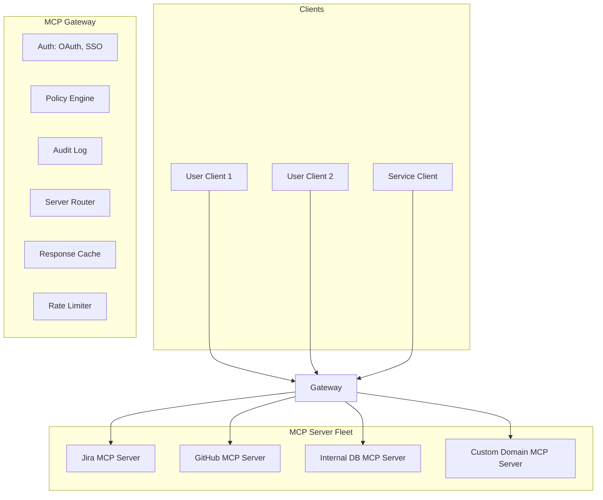
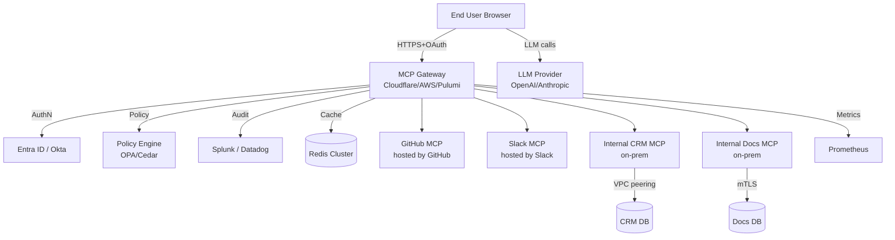

# 04 — MCP Enterprise Integration

> [!info] TL;DR
> Enterprise MCP deployments are not just "run an MCP server." They require an MCP gateway that handles authentication, authorization, audit logging, multi-tenancy, policy enforcement, and server management. The reference architecture places the gateway between LLM clients and a fleet of curated MCP servers, providing a single control point for security and observability.

## Why Enterprise MCP Is Different

The basic MCP deployment model — a user runs an MCP server locally, the LLM client connects via stdio — works for individuals and small teams. It does not work for enterprises because:

- **No central control**: each user installs and configures their own MCP servers. Security teams cannot audit or restrict what's running.
- **No authentication**: local MCP servers run as the user, with full user privileges. No way to enforce least privilege.
- **No audit trail**: tool calls happen on the user's machine, with no central log. Incidents cannot be investigated.
- **No multi-tenancy**: each user has their own MCP server instances, with no shared state, caching, or rate limiting.
- **No policy enforcement**: no way to enforce "users in department X cannot call tool Y" or "PII cannot be sent to MCP server Z".

Enterprise integration requires an **MCP gateway** — a central service that sits between clients and servers, providing the missing controls.

## The Reference Architecture



### The Gateway
The MCP gateway is the single entry point for all MCP traffic. It:
- Authenticates clients (OAuth 2.0, SSO integration).
- Enforces policies (per-user, per-tenant, per-tool).
- Logs every tool call for audit.
- Routes requests to the appropriate MCP server.
- Caches responses where safe.
- Rate-limits to prevent abuse.

### The Server Fleet
MCP servers run as separate processes (or containers), managed by the gateway. The fleet includes:
- **Curated third-party servers**: vetted, signed, and version-pinned.
- **Internal servers**: built for internal systems (proprietary databases, internal APIs).
- **Domain-specific servers**: for specific use cases (e.g., a medical-records MCP server for a healthcare company).

Servers are deployed, monitored, and updated by a platform team — not by individual users.

## Gateway Components

### Authentication
- Integrates with enterprise SSO (Okta, Azure AD, Google Workspace).
- Issues short-lived tokens (OAuth 2.0 access tokens, typically 1-hour TTL).
- Validates tokens on every request.
- Supports service-to-service authentication (for non-user clients).

### Policy Engine
Enforces rules like:
- "Users in the finance department can call the `accounting` MCP server's tools, but only during business hours."
- "PII fields (SSN, credit card numbers) must be redacted before being sent to third-party MCP servers."
- "Tool calls that modify production data require manager approval."
- "Rate limit: 100 tool calls per user per hour for high-risk tools."

The policy engine is consulted on every request. Policies are versioned and auditable.

### Audit Log
Immutable record of:
- Who (user, client, IP).
- When (timestamp).
- What (server, tool, arguments, result).
- Why (the conversation context — optional but valuable).

Audit logs are sent to a SIEM (Splunk, Datadog, Elastic Security) for retention and alerting. Required for compliance in most regulated industries.

### Server Router
Routes requests to the appropriate MCP server based on:
- The tool being called (each tool belongs to a specific server).
- The user's permissions (some users may only access certain servers).
- The server's health (route around failed servers).
- Geographic location (for data residency requirements).

### Response Cache
Some MCP tool calls are idempotent and cacheable:
- `read_file` — the file content doesn't change between calls (within a session).
- `list_issues` — the issue list is reasonably stable.
- `search` — same query, same results (within a TTL).

Caching reduces latency and load on backend systems. The cache must be per-user (or per-tenant) to prevent data leakage.

### Rate Limiter
Per-user, per-tool, per-server rate limits. Prevents:
- Abuse (a compromised account making thousands of calls).
- Runaway agents (a prompt-injected model calling a tool in a loop).
- Backend overload (too many concurrent calls to a fragile legacy system).

## Multi-Tenancy

For SaaS applications embedding MCP, multi-tenancy is critical:
- Each tenant has their own MCP server instances (or virtual partitions).
- Tenant data is isolated at the database level.
- Per-tenant rate limits and quotas.
- Per-tenant audit logs.

Implementation options:
- **Server-per-tenant**: each tenant gets dedicated MCP server processes. Strongest isolation, highest overhead.
- **Shared servers with tenant filtering**: all tenants share server processes, but every tool call is filtered by tenant ID. Lower overhead, weaker isolation.
- **Hybrid**: small tenants share; large tenants get dedicated servers.

## Server Lifecycle Management

### Server Onboarding
New MCP servers go through an onboarding process:
1. **Security review**: code audit, vulnerability scan.
2. **Policy definition**: what tools does it expose? Who can use them? What are the rate limits?
3. **Test deployment**: deploy in staging, run integration tests.
4. **Production deployment**: deploy with monitoring, alerting, and rollback procedures.

### Server Versioning
- Servers are versioned (semver).
- New versions go through the same onboarding process.
- Old versions remain available during a transition period.
- Breaking changes require migration plans.

### Server Health Monitoring
- Latency, error rate, throughput per server.
- Automatic failover to healthy instances.
- Alerting on degradation.

### Server Decommissioning
- Notify users in advance.
- Provide a migration path (alternative servers or direct API access).
- Archive audit logs.

## Integration with Enterprise Systems

### Identity Provider
The gateway integrates with the enterprise IdP (Okta, Azure AD) for SSO. Users authenticate with their enterprise credentials; no separate MCP accounts.

### SIEM
Audit logs are streamed to the SIEM (Splunk, Elastic, Datadog) for security monitoring and compliance retention.

### Observability Stack
- Metrics (Prometheus, Datadog): per-server, per-tool latency and error rates.
- Traces (OpenTelemetry): end-to-end request tracing across the gateway and servers.
- Logs (Loki, ELK): structured logs with trace IDs.

### Policy Engine
For complex policy enforcement, integrate with a dedicated policy engine:
- **OPA (Open Policy Agent)**: rego-based policies, integrated as a sidecar.
- **Cedar** (Amazon): policy language designed for authorization.
- **Custom**: many enterprises build custom policy engines tailored to their compliance requirements.

### API Gateway
The MCP gateway may sit behind (or alongside) a general-purpose API gateway (Kong, Apigee, AWS API Gateway) that handles TLS termination, WAF, and rate limiting for all enterprise APIs.

## Deployment Patterns

### Cloud-Hosted
The MCP gateway and server fleet run in the cloud (AWS, GCP, Azure). Clients connect over HTTPS.
- Pro: scalable, managed, easy to update.
- Con: data leaves the enterprise network (compliance concern for some industries).

### On-Premises
The MCP gateway and servers run on enterprise infrastructure. Clients connect via internal network or VPN.
- Pro: data stays in the enterprise; full control.
- Con: scaling is the enterprise's responsibility; updates are slower.

### Hybrid
Gateway in the cloud; some servers on-premises (for sensitive systems); some in the cloud (for SaaS integrations).
- Pro: balances control and convenience.
- Con: more complex to operate.

## Common Pitfalls

### No Central Gateway
Each user runs their own MCP servers. No audit, no policy enforcement, no central control. This is fine for individuals but unacceptable for enterprises.

### No Server Vetting
Users install arbitrary third-party MCP servers. A malicious server can exfiltrate data or execute arbitrary code. Always vet and approve servers centrally.

### No Audit Log
Tool calls happen with no record. Incidents cannot be investigated. Compliance violations. Always log centrally.

### No Rate Limiting
A compromised or runaway agent calls tools thousands of times per second. Backend systems fail. Always rate-limit.

### No Multi-Tenant Isolation
Tenant A's data leaks to Tenant B because the gateway doesn't enforce tenant scoping. Use row-level security or per-tenant server instances.

### Trusting Client-Side Security
Security enforced in the client (e.g., the LLM application) can be bypassed by a modified client. Always enforce security in the gateway.

## The State of Enterprise MCP (2025–2026)

Enterprise MCP is an emerging product category:
- **MCP gateway products**: several vendors offer managed MCP gateways (Cloudflare, Stripe, and others have announced MCP-related products).
- **Open-source gateways**: projects like `mcp-gateway` provide self-hosted alternatives.
- **Spec evolution**: the MCP spec continues to add enterprise features (server discovery, OAuth flows, structured permissions).
- **Adoption**: large enterprises are piloting MCP for internal tool integration; production deployments are still rare but growing.

For AI engineers in 2026, enterprise MCP is a "watch this space" technology. The patterns are clear, but the tooling is still maturing. Most production deployments today are custom-built on top of open-source MCP servers, with the gateway implemented internally.

## See Also

- [[01 - MCP Overview]]
- [[02 - MCP Components]]
- [[03 - MCP Security]]
- [[04 - Enterprise Multi-Agent Architectures]]
- [[01 - Production AI Stack]]
- [[19 - MCP/MOC|19 MCP MOC]]
- [[22 - Production AI/MOC|22 Production AI]]

## Modern Developments (2025–2026)

### Enterprise MCP Gateways Become a Product Category
What was a "watch this space" in 2024 became a real product category in 2025–2026:
- **Cloudflare AI Gateway with MCP support** — global edge-deployed gateway with built-in caching, rate limiting, auth, and observability for MCP tool calls.
- **AWS Bedrock Agent Gateway** — managed gateway for Bedrock agents, integrating with IAM, CloudTrail, and VPC policies.
- **Pulumi MCP Hub** — multi-cloud registry with policy-as-code (Pulumi program) for tool authorization.
- **Microsoft Azure AI Foundry MCP Gateway** — enterprise-grade gateway with Entra ID integration.
- **Kong AI Gateway MCP plugin** — adds MCP support to Kong's existing API gateway, letting teams reuse their API management infrastructure.

These gateways share a common pattern: a **reverse proxy** in front of MCP servers that adds auth, policy, observability, and caching without modifying the servers themselves.

### MCP-as-a-Service Offerings
Major SaaS vendors now ship hosted MCP servers for their products:
- **GitHub MCP Server** (hosted by GitHub) — read repos, issues, PRs; write issues with policy.
- **Slack MCP Server** (hosted by Slack) — search messages, send messages with audit log.
- **Notion MCP Server** (hosted by Notion) — query databases, create pages.
- **Salesforce MCP Server** (hosted by Salesforce) — query CRM records with row-level security.
- **ServiceNow MCP Server** (hosted by ServiceNow) — query incidents, create tickets.

This shifts the burden of running servers from the enterprise to the vendor, who already maintains the underlying API. Enterprise customers connect to these via the MCP gateway with their existing SSO.

### Spec Evolution — 2025-06 and 2025-11 Revisions
Key enterprise-relevant spec changes:
- **OAuth 2.1 + PKCE** standardized for auth (replaced ad-hoc per-server schemes).
- **Server discovery protocol** — clients can fetch a manifest of available servers from a registry; the gateway returns the list dynamically based on the user's role.
- **Resource subscriptions** — push notifications enable real-time collaboration patterns.
- **Composability spec (2025-11)** — formal declaration of inter-server dependencies.
- **Structured audit log fields** — every tool call emits SIEM-compatible events.
- **Elicitation** — servers can request information from users mid-operation (e.g., 2FA code, confirmation).

These revisions closed most enterprise gaps; the 2026 spec roadmap focuses on **streaming tool results**, **batch tool calls**, and **multi-region failover**.

### Multi-Region and DR Patterns
Global enterprises need MCP infrastructure that survives region failures. The pattern:
- Deploy MCP gateways in 3+ regions (us-east, eu-west, ap-southeast).
- Use **anycast routing** (Cloudflare, AWS Global Accelerator) to route users to the nearest healthy region.
- MCP servers in each region replicate state via the underlying service (e.g., Slack API is already multi-region).
- For stateful MCP servers (rare — most are stateless proxies), use **active-active with eventual consistency** or **active-passive with DNS failover**.
- Audit logs replicate globally to a single SIEM; do not depend on regional SIEMs.

### Private MCP Registries
Enterprises don't want to rely on public marketplaces for security reasons. The pattern: a **private registry** (often built on Artifactory or Harbor) that:
- Hosts vetted MCP server binaries and Docker images.
- Requires code review + security scan before publishing.
- Pins versions (no auto-update from upstream).
- Publishes an SBOM with every release.
- Integrates with the corporate SSO for read access.

Internal developers install MCP servers from the private registry only; the gateway refuses connections to non-registry servers.

### Cost Allocation and Chargeback
For enterprises running MCP at scale, cost attribution matters. The gateway tags every tool call with:
- `user_id`, `tenant_id`, `team_id` (from SSO groups).
- `cost_usd` — based on the LLM tokens consumed by the call (if sampling was used) plus the underlying API cost.
- `project_id` — user-declared at session start.

Chargeback reports allocate costs to teams monthly. This pattern is essential for cost-sensitive enterprises (banks, healthcare) where MCP usage can balloon if unmonitored.

## Reference Architecture — Enterprise MCP Deployment



Key components of this architecture:
- **Gateway** is the single ingress point; all tool calls flow through it.
- **SSO** handles authentication (no per-server auth).
- **Policy engine** (OPA or AWS Cedar) makes per-call authorization decisions.
- **SIEM** ingests structured audit logs for compliance and anomaly detection.
- **Redis** caches tool results (TTL-based) to reduce load on upstream servers.
- **Internal MCP servers** connect via VPC peering or mTLS; never exposed to public internet.
- **Hosted MCP servers** (GitHub, Slack) are accessed over the public internet with OAuth.
- **LLM provider** is separate from MCP infrastructure; the gateway is LLM-agnostic.

## Worked Example — Multi-Tenant Gateway Policy

```python
# Cedar policy for MCP authorization
CEDAR_POLICY = """
// Engineers can call read tools on their own team's resources
permit (
    principal in Role::"engineer",
    action == Action::"tool_call",
    resource == Resource::"github__get_issue"
)
when {
    principal.team == resource.args.owner_team
};

// Senior engineers can create issues in their team's repos
permit (
    principal in Role::"senior_engineer",
    action == Action::"tool_call",
    resource == Resource::"github__create_issue"
)
when {
    principal.team == resource.args.repo_team
};

// No one can delete repos via MCP
forbid (
    principal,
    action == Action::"tool_call",
    resource == Resource::"github__delete_repo"
);

// Cross-team slack messages require approval
permit (
    principal,
    action == Action::"tool_call",
    resource == Resource::"slack__send_message"
)
when {
    principal.team != resource.args.channel_team
}
unless {
    context.has_approval
};
"""

# Gateway integration
from cedar import Authorizer

auth = Authorizer(policy=CEDAR_POLICY)

async def gateway_handler(request):
    user = await sso.authenticate(request.headers['Authorization'])
    tool = request.json['tool']
    args = request.json['args']

    decision = auth.evaluate(
        principal=user.to_cedar(),
        action="tool_call",
        resource={"id": tool, "args": args},
        context={"has_approval": await check_approval(user, tool, args)},
    )

    if decision == 'forbid':
        audit_log(user, tool, args, effect='deny')
        return JSONResponse({'error': 'denied'}, status=403)

    if decision == 'needs_approval':
        approval = await request_user_approval(user, tool, args)
        if not approval.granted:
            return JSONResponse({'error': 'approval denied'}, status=403)
        audit_log(user, tool, args, effect='approved', approver=approval.approver)

    # Cache check
    cache_key = f"{user.tenant}:{tool}:{hash_args(args)}"
    cached = await redis.get(cache_key)
    if cached and tool.startswith('get_'):
        audit_log(user, tool, args, effect='cache_hit')
        return JSONResponse(cached)

    # Forward to upstream
    result = await forward_to_upstream(tool, args, user)
    await redis.setex(cache_key, ttl=300, value=result)

    audit_log(user, tool, args, effect='ok',
              cost_usd=estimate_cost(result), duration_ms=...)
    return JSONResponse(result)
```

This example demonstrates: (1) declarative policy in Cedar (readable, auditable, version-controlled); (2) SSO-based user identity; (3) per-call authorization with approval escalation; (4) caching for read-only tools; (5) cost and duration tracking for chargeback.

## Common Failure Modes — Diagnostic Table

| Symptom                                | Likely Cause                                  | Fix                                                          |
|----------------------------------------|-----------------------------------------------|--------------------------------------------------------------|
| Tool latency 10x in production         | No caching; every call hits upstream          | Cache GET-style tools in Redis with TTL                      |
| Cost spikes at month-end               | No per-team cost attribution                  | Tag every call with team_id; weekly chargeback reports       |
| Cannot revoke access quickly            | Tokens cached too long; no revocation flow    | Short token TTL (15min); revocation list checked every call  |
| Compliance audit fails                 | Audit logs missing user_id or args_hash       | Mandatory structured logging; CI test for required fields    |
| Single region goes down, all users fail| Single-region gateway; no failover            | Multi-region gateway with anycast routing; health checks     |
| Tool call volume 100x expected         | LLM loops on a failing tool                   | Per-user-per-tool rate limit; circuit breaker on failures    |
| Internal server unreachable from cloud | No VPC peering; public-only connectivity      | PrivateLink / VPC peering; mTLS for internal MCP servers     |
| New MCP server takes weeks to deploy   | Manual security review bottleneck             | Automated SAST + SBOM in CI; pre-approved server templates   |
| Cross-tenant data exposure             | Cache key omits tenant_id                     | Cache key MUST include tenant_id + user_id                   |
| Vendor outage breaks all agents        | Synchronous dependency on vendor MCP          | Fallback to cached results; degrade gracefully               |

## Interview Questions

1. **Q: Walk me through the architecture of an enterprise MCP deployment.**
   A: Five layers: (1) **End user** accesses via SSO-authenticated browser/desktop client; (2) **MCP gateway** (Cloudflare, AWS, Pulumi) is the single ingress — handles auth, policy, caching, audit; (3) **SSO provider** (Entra ID, Okta) authenticates users and provides identity claims; (4) **Policy engine** (OPA, Cedar) evaluates per-call authorization based on user role, tool, and args; (5) **MCP servers** (hosted by SaaS vendors or internal) execute the actual tool calls. Audit logs flow to a SIEM; metrics flow to Prometheus. Internal servers connect via VPC peering; external servers via OAuth over the public internet.

2. **Q: How do you handle multi-tenant isolation in MCP?**
   A: Four layers: (1) **Auth-time** — every user authenticates via SSO which establishes their `tenant_id`; (2) **Policy-time** — Cedar/OPA policies check `principal.tenant == resource.args.tenant` for every tool call; (3) **Runtime** — cache keys include `tenant_id`; upstream API calls include `X-Tenant-ID` header; (4) **Audit-time** — every audit log entry includes `tenant_id`; SIEM queries can detect cross-tenant access attempts. Defense in depth: even if one layer fails, others catch the leak.

3. **Q: How would you migrate from direct-API-access to MCP-based tool calling?**
   A: Phased rollout: (1) **Inventory existing tool integrations** — what tools, what auth, what volumes; (2) **Stand up MCP gateway** in parallel with existing integration; (3) **Wrap existing APIs as MCP servers** (the "shim" pattern — minimal logic, just protocol translation); (4) **Pilot with one team** — route their agents through MCP; compare latency, error rates, cost; (5) **Gradually migrate** — per-team cutover with rollback capability; (6) **Decommission old integration** once 100% on MCP. Expect 3–6 months for a mid-size enterprise. The MCP gateway pays for itself in observability and policy gains even before full migration.

4. **Q: What's the cost model for enterprise MCP?**
   A: Three cost components: (1) **Gateway infrastructure** — gateway servers, Redis cache, SIEM ingestion; typically $5–20k/month for mid-size; (2) **MCP server execution** — most are free (hosted by SaaS vendor) but internal servers cost compute + the underlying API cost; (3) **LLM cost** — only if sampling is used; otherwise LLM cost is in the agent layer, not the gateway. Chargeback pattern: tag every call with `team_id`, generate monthly reports, allocate costs. Most enterprises find MCP cost is 5–10% of total LLM cost (the dominant cost is always the LLM).

5. **Q: How do you handle MCP server outages?**
   A: Layered resilience: (1) **Circuit breaker** — if a server fails >5% in 1 min, stop sending traffic for 30s; (2) **Cached results** — for read-only tools, serve stale cached data with a `stale=true` flag; (3) **Fallback tools** — if `slack__send_message` is down, queue the message and notify the user; (4) **Multi-region** — gateway routes to healthy regions; (5) **Vendor SLAs** — for hosted servers, hold vendors to SLAs (99.9% typical); (6) **Degraded mode** — agent should detect tool outage and switch to a no-tool workflow (e.g., "I can't access Slack right now; let me draft the message for you to send manually"). The agent's prompt should include fallback behavior.

6. **Q: How do you ensure MCP compliance with regulations like SOX, HIPAA, GDPR?**
   A: Per-regulation patterns: (1) **SOX** — every financial-data tool call must produce an immutable audit log retained 7 years; quarterly review of access patterns. (2) **HIPAA** — PHI must not leave the covered entity's network; internal MCP servers only; PHI in tool args must be encrypted at rest and in transit; BAA required with any SaaS MCP vendor. (3) **GDPR** — every memory/tool call tagged with `user_id`; right-to-be-forgotten request cascades through all MCP audit logs (delete or anonymize); data residency — EU users' tool calls stay in EU regions. The gateway's structured audit logs are the compliance backbone; without them, MCP is unusable in regulated industries.

## Connection to Other Concepts

- [[19 - MCP/Architecture/01 - MCP Overview]] — the architecture being integrated.
- [[19 - MCP/Components/02 - MCP Components]] — what gets deployed at scale.
- [[19 - MCP/Security/03 - MCP Security]] — security underlies every enterprise pattern.
- [[16 - Multi-Agent Systems/Enterprise/04 - Enterprise Multi-Agent Architectures]] — multi-agent + MCP at enterprise scale.
- [[22 - Production AI/Architecture/02 - Reference Production Architectures]] — where MCP fits in the production stack.
- [[22 - Production AI/Architecture/03 - Gateway and Router Patterns]] — MCP gateway is a specialization of the API gateway pattern.
- [[22 - Production AI/Security/04 - Guardrails]] — gateway-level guardrails complement MCP policies.
- [[21 - LLMOps and MLOps/Monitoring/05 - Production Monitoring]] — observability for MCP tool calls.
- [[21 - LLMOps and MLOps/Cost/06 - Cost Optimization]] — chargeback and cost allocation.
- [[20 - AI Infrastructure/MOC]] — infrastructure MCP servers run on.
- [[15 - AI Agents/Autonomy/08 - Autonomous Agent Lifecycles]] — agents with MCP tools over long lifecycles.
