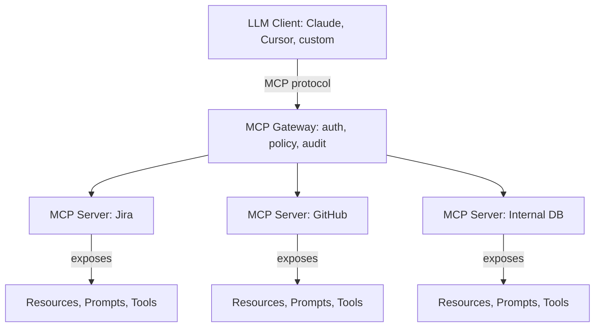

# 19 — MCP MOC

> [!info] The Model Context Protocol standardizes how LLMs connect to external data sources, tools, and services. Iteration 3 expanded this chapter with notes on MCP components (Resources, Prompts, Tools), security (authentication, prompt injection, supply chain), and enterprise integration (gateways, multi-tenancy, audit).

## Reading Order

| #   | Note                                              | Sub-domain    | Purpose                                            |
|-----|---------------------------------------------------|---------------|----------------------------------------------------|
| 01  | [[01 - MCP Overview]]                             | Architecture  | What MCP is and why it exists.                     |
| 02  | [[02 - MCP Components]]                           | Components    | Resources, Prompts, Tools — the three primitives.  |
| 03  | [[03 - MCP Security]]                             | Security      | Authentication, authorization, prompt injection.   |
| 04  | [[04 - MCP Enterprise Integration]]               | Integration   | Gateway, multi-tenancy, audit, policy.             |

## Sub-Domains

- [[19 - MCP/Architecture/01 - MCP Overview|Architecture]] — note 01
- [[19 - MCP/Components/02 - MCP Components|Components]] — note 02
- [[19 - MCP/Security/03 - MCP Security|Security]] — note 03
- [[19 - MCP/Integration/04 - MCP Enterprise Integration|Integration]] — note 04

## The MCP Architecture at a Glance

## Why This Matters for AI

- MCP standardizes the "last mile" between LLMs and external systems — replacing bespoke integrations with a common protocol.
- The three component types (Resources, Prompts, Tools) cleanly separate passive context, user workflows, and model actions.
- Security is the central challenge — prompt injection via retrieved content is a real attack surface, not a theoretical concern.
- Enterprise adoption requires a gateway pattern with authentication, policy enforcement, and audit logging.

## Production Implications

- **Treat every tool call as untrusted**: prompt injection means the model may be tricked into calling destructive tools.
- **Defense-in-depth**: combine input sanitization, output validation, tool allowlists, and human-in-the-loop for high-risk actions.
- **Audit every call**: who, when, what, why — essential for incident response and compliance.
- **Use a gateway**: centralize authentication, policy, and audit; don't distribute these concerns across clients.

## See Also

- [[15 - AI Agents/Tool Calling/04 - Function Calling|Function Calling]]
- [[15 - AI Agents/MOC|15 AI Agents]]
- [[04 - Enterprise Multi-Agent Architectures]]
- [[22 - Production AI/MOC|22 Production AI]]
- [[01 - LLM Security and Prompt Injection]]
