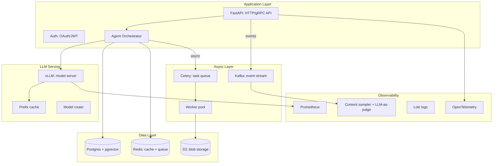

# 20 — AI Infrastructure MOC

> [!info] The infrastructure required to deploy production AI systems: storage (Postgres + pgvector), messaging (Kafka + Celery), compute (GPU sizing), and observability (metrics + logs + traces + content sampling). Iteration 3 expanded this chapter with four deep-dive notes.

## Reading Order

| #   | Note                                              | Sub-domain    | Purpose                                            |
|-----|---------------------------------------------------|---------------|----------------------------------------------------|
| 01  | [[01 - Production AI Stack]]                      | Serving       | The end-to-end production stack overview.          |
| 02  | [[02 - Vector Storage with pgvector]]             | Storage       | pgvector setup, indexing, hybrid search.           |
| 03  | [[03 - Messaging with Kafka and Celery]]          | Messaging     | Event streams + task queues.                       |
| 04  | [[04 - GPU Infrastructure and Sizing]]            | Compute       | GPU types, sizing, deployment models.              |
| 05  | [[05 - Observability Stack]]                      | Observability | Metrics, logs, traces, content sampling.           |

## Sub-Domains

- [[20 - AI Infrastructure/Serving/01 - Production AI Stack|Serving]] — note 01
- [[20 - AI Infrastructure/Storage/02 - Vector Storage with pgvector|Storage]] — note 02
- [[20 - AI Infrastructure/Messaging/03 - Messaging with Kafka and Celery|Messaging]] — note 03
- [[20 - AI Infrastructure/Compute/04 - GPU Infrastructure and Sizing|Compute]] — note 04
- [[20 - AI Infrastructure/Observability/05 - Observability Stack|Observability]] — note 05

## The Production AI Stack

## Why This Matters for AI

- Production AI is 90% infrastructure, 10% model. The model is the easiest part to get right; the surrounding systems are where most teams struggle.
- pgvector is the right default for vector storage — integrated, transactional, sufficient for most use cases.
- Async messaging (Kafka + Celery) is essential for long-running workloads (training, batch inference, embedding).
- GPU sizing determines cost. Mismatched sizing (too big or too small) is a common waste.
- Content sampling is the AI-specific observability pillar. Without it, quality regressions go undetected.

## Production Implications

- **Start with pgvector** for vector storage; migrate to a dedicated DB only when you hit real scale limits.
- **Use Kafka for events, Celery for tasks** — they are not interchangeable.
- **Quantize models for inference** (INT8 or INT4) — 2–4× cost reduction with minimal quality loss.
- **Implement content sampling from day one** — retrofitting is painful.
- **Monitor GPU utilization** — underutilized GPUs are wasted spend.

## See Also

- [[21 - LLMOps and MLOps/MOC|21 LLMOps]] — operations on top of infrastructure
- [[22 - Production AI/MOC|22 Production AI]] — production patterns
- [[04 - vLLM and Continuous Batching]] — inference server
- [[03 - Quantization]] — model compression
- [[04 - LLM-as-Judge Evaluation]] — quality monitoring
