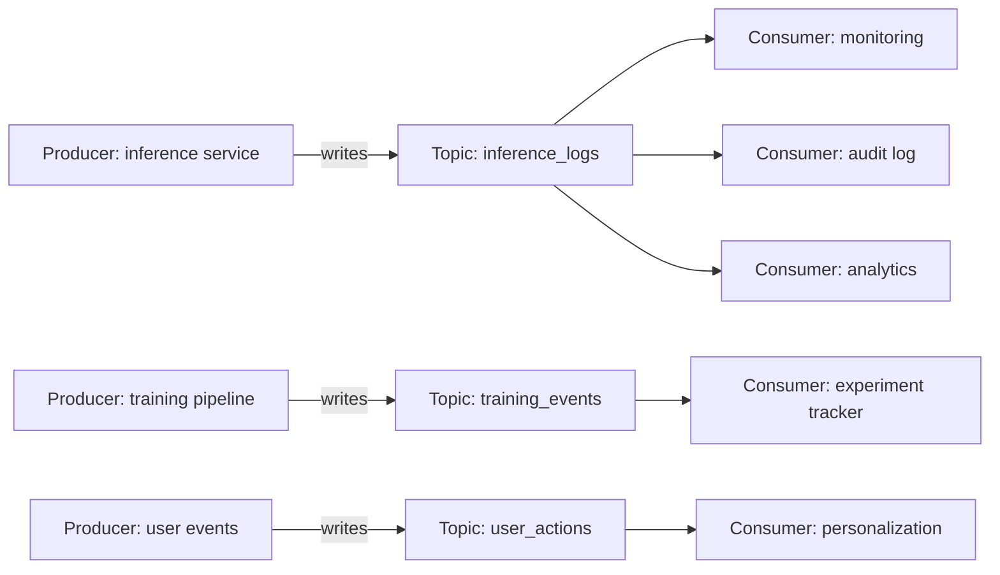
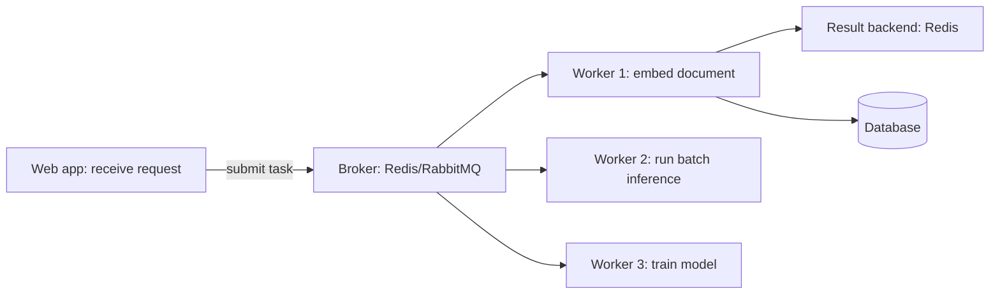
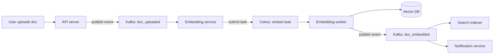

# 03 — Messaging with Kafka and Celery

> [!info] TL;DR
> Production AI systems need async messaging for two distinct workloads: **event streams** (Kafka — high-throughput, durable, multi-consumer) and **task queues** (Celery/RabbitMQ/SQS — point-to-point work distribution, retry semantics). Kafka is for moving large volumes of events between services; Celery is for distributing discrete units of work to workers. Most AI platforms need both.

## Why Messaging Matters for AI

AI workloads are often long-running and bursty:
- Embedding a corpus of 1M documents takes hours; you don't want to do it synchronously.
- Training a model takes days; you need to queue jobs and distribute across GPUs.
- Inference requests can take 10+ seconds; you need streaming or async patterns.
- Batch evaluation runs need to be triggered, monitored, and retried.

Synchronous request/response works for interactive queries but breaks down for these workloads. Messaging systems decouple producers from consumers, enabling:
- **Async processing**: producer doesn't wait for consumer.
- **Work distribution**: multiple consumers process work in parallel.
- **Retry semantics**: failed messages are retried automatically.
- **Decoupling**: producer and consumer can be deployed independently.
- **Buffering**: consumer processes at its own pace; producer doesn't block.

## Two Distinct Patterns

### Event Streams (Kafka)
- **Pattern**: many producers write events to a topic; many consumers read independently.
- **Semantics**: durable, ordered within a partition, replayable.
- **Use cases**: audit logs, click streams, model inference logs, training data pipelines.
- **Tool**: Apache Kafka (or managed equivalents: AWS MSK, Confluent Cloud, Upstash).

### Task Queues (Celery / RabbitMQ / SQS)
- **Pattern**: producer submits a task to a queue; one consumer picks it up and processes it.
- **Semantics**: at-least-once delivery, retry on failure, dead-letter queue for poison messages.
- **Use cases**: embedding generation, batch inference, model training, email sending.
- **Tools**: Celery (Python + RabbitMQ/Redis), AWS SQS, Google Cloud Tasks, RabbitMQ directly.

The two patterns overlap but are not interchangeable. Kafka can do task-queue semantics with consumer groups, but it's awkward. Celery can do event-stream semantics by publishing to a topic, but it's not designed for it. Most production systems use both.

## Kafka for AI Workloads

### Architecture


Kafka topics are partitioned. Each partition is an ordered, append-only log. Consumers in a consumer group split partitions among themselves for parallel processing.

### Common AI Use Cases

**Inference logging**: every LLM call produces a log entry (prompt, response, model, tokens, cost, latency). Producers are inference services; consumers are monitoring, audit, and analytics systems. Kafka handles the volume (millions of entries per day) and lets multiple consumers read independently.

**Training data pipelines**: raw data (web crawls, user interactions) flows through Kafka topics. Consumers clean, filter, deduplicate, and write to training data stores. Kafka's durability lets you replay the pipeline if you change the cleaning logic.

**Model event streams**: every model training run emits events (started, checkpoint saved, eval results, completed). Downstream systems (experiment trackers, dashboards, alerting) consume these events.

**RAG ingestion**: documents to be indexed flow through Kafka. Consumers chunk, embed, and write to the vector DB. If the vector DB needs rebuilding (e.g., embedding model change), replay the topic.

### Production Considerations

- **Partitioning**: choose a partition key that distributes evenly (e.g., `user_id`, `document_id`). Hot partitions cause skew.
- **Retention**: configure based on use case. Audit logs: 7+ days. Training data: indefinite (until consumed). Inference logs: 24–48 hours.
- **Consumer groups**: each consumer group has its own offset. Multiple consumer groups can read the same topic independently.
- **Exactly-once vs. at-least-once**: Kafka supports exactly-once semantics with idempotent producers and transactions, but most use cases work fine with at-least-once.
- **Schema management**: use a schema registry (Confluent Schema Registry, Apicurio) to enforce Avro/Protobuf schemas. Without it, producers and consumers drift.

### Managed vs. Self-Hosted
- **Managed** (AWS MSK, Confluent Cloud, Upstash, Aiven): zero ops, scales automatically, expensive at high throughput.
- **Self-hosted**: cheaper, full control, but requires Kafka expertise to operate. Not recommended for teams without dedicated infrastructure engineers.

## Celery for AI Workloads

### Architecture


Celery is a Python task queue. Producers submit tasks (function calls) to a broker (Redis or RabbitMQ). Workers pick up tasks, execute them, and store results in a result backend.

### Common AI Use Cases

**Embedding generation**: when a document is uploaded, submit a Celery task to embed it. The web request returns immediately; the embedding is stored when the task completes.

**Batch inference**: submit a task per inference request. Workers process in parallel; results are stored as they complete.

**Model training**: submit a long-running training task. Workers report progress via task state; the web app can poll or subscribe to updates.

**Scheduled jobs**: Celery Beat schedules periodic tasks (e.g., "every night at 2am, re-embed documents updated in the last 24 hours").

### Production Considerations

- **Broker choice**: Redis is fast but limited durability. RabbitMQ is more durable with better retry semantics. For AI workloads (which can be expensive to redo), prefer RabbitMQ.
- **Worker concurrency**: Celery workers can use prefork (process-based), eventlet (green threads), or gevent. For CPU-bound AI workloads, prefork is the right choice — one process per core.
- **Task timeouts**: always set. A hung task without a timeout blocks a worker indefinitely.
- **Retries**: configure max retries and exponential backoff. Tasks that fail repeatedly should go to a dead-letter queue.
- **Idempotency**: Celery delivers at-least-once. If a task is retried (because the worker crashed), it runs twice. Design tasks to be idempotent.
- **Result backend**: for long-running tasks, results may expire before they're read. Use a durable backend (database) for important results; Redis for ephemeral ones.

### Worker Sizing for AI

AI workloads have unusual resource profiles:
- **Embedding workers**: CPU-bound, ~1GB RAM, fast (milliseconds per task). Run many per machine.
- **Inference workers (CPU)**: CPU-bound, ~4GB RAM, moderate latency (seconds). Run a few per machine.
- **Inference workers (GPU)**: GPU-bound, ~16GB RAM + 1 GPU. One per GPU.
- **Training workers**: GPU-bound, ~64GB RAM + multiple GPUs. One per node.

Use Celery's worker classes to route tasks to appropriate workers:
```python
@celery.task(queue='embedding')
def embed_document(doc_id): ...

@celery.task(queue='gpu_inference')
def run_inference(model_id, input_data): ...

@celery.task(queue='training')
def train_model(config): ...

# Run workers per queue:
# celery -A app worker -Q embedding --concurrency=8
# celery -A app worker -Q gpu_inference --concurrency=1
```

## Combining Kafka and Celery

Most production AI systems use both:
- **Kafka** for event streams (logs, audit, analytics).
- **Celery** for task queues (embedding, inference, training).

A typical pattern: an event in Kafka triggers a Celery task. For example, a "document uploaded" event in Kafka is consumed by a service that submits a Celery task to embed the document. The task result is published back to Kafka as a "document embedded" event.



This architecture gives you:
- Decoupling: each service can be deployed and scaled independently.
- Replayability: if the embedding model changes, replay the Kafka topic to re-embed everything.
- Observability: every event is logged; you can trace the full pipeline.
- Scalability: add more workers, more partitions, more consumers as needed.

## Common Pitfalls

### Using Kafka as a Task Queue
Kafka can do task-queue semantics, but it's awkward. Tasks have complex retry, timeout, and dead-letter requirements that Kafka doesn't natively support. Use Celery or SQS for task queues.

### Using Celery for Event Streams
Celery can publish events, but it's not designed for high-throughput, multi-consumer streaming. Use Kafka for event streams.

### No Dead-Letter Queue
Tasks that fail repeatedly block workers and never complete. Always configure a dead-letter queue for poison messages.

### No Idempotency
A retried task runs twice. If it has side effects (e.g., creates a database row), you get duplicates. Design tasks to be idempotent (use deterministic IDs, check before writing).

### No Task Timeouts
A hung task blocks a worker forever. Always set timeouts.

### Synchronous Calls in Workers
A Celery worker that calls another service synchronously (e.g., an LLM API) blocks the worker for the duration. Use async patterns or increase concurrency.

### No Backpressure
Producers submit tasks faster than workers can process them. The queue grows unboundedly, eventually OOMing. Use rate limiting or backpressure signals.

## Tooling

### Kafka Ecosystem
- **Confluent Platform**: commercial Kafka distribution with management tools.
- **AWS MSK**: managed Kafka on AWS.
- **Strimzi**: Kafka on Kubernetes.
- **Schema Registry**: schema enforcement for Avro/Protobuf.
- **Kafka UI** (various open-source projects): web UI for browsing topics.

### Celery Ecosystem
- **Flower**: real-time Celery monitoring.
- **Celery Beat**: scheduler for periodic tasks.
- **Django-Q2 / RQ**: alternatives with simpler APIs (less feature-rich than Celery).

### Alternatives
- **AWS SQS + Lambda**: serverless task queue. No workers to manage.
- **Google Cloud Tasks**: similar to SQS.
- **Temporal**: workflow engine for complex, long-running processes. More powerful than Celery for multi-step workflows.
- **Dramatiq**: Python task queue, alternative to Celery with simpler API.

## See Also

- [[01 - Production AI Stack]]
- [[02 - Vector Storage with pgvector]]
- [[04 - GPU Infrastructure and Sizing]]
- [[05 - Observability Stack]]
- [[21 - LLMOps and MLOps/MOC|21 LLMOps]]
- [[20 - AI Infrastructure/MOC|20 AI Infrastructure MOC]]
