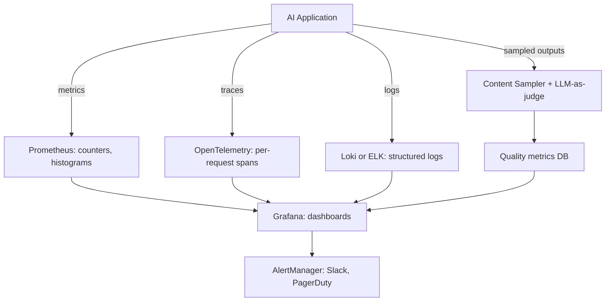

# 05 — Observability Stack

> [!info] TL;DR
> AI observability extends classical three-pillar observability (metrics, logs, traces) with **content sampling** — capturing actual LLM inputs and outputs for quality monitoring. The reference stack combines Prometheus (metrics), OpenTelemetry (traces), Loki/ELK (logs), and a content sampling pipeline that runs LLM-as-judge on 1–5% of traffic. Without content sampling, you cannot detect quality regressions in production.

## The Three Pillars + One

Classical observability has three pillars: metrics, logs, traces. AI workloads add a fourth: content sampling.



The first three pillars are inherited from web/SRE observability. The fourth — content sampling — is unique to AI and exists because LLM outputs are open-ended, and metrics alone cannot tell you if quality has degraded.

## Pillar 1: Metrics

Metrics are numerical measurements aggregated over time. They are cheap to collect, store, and query. Use them for dashboards and alerting.

### Key Metrics for AI Systems

**Latency**:
- `llm_request_duration_seconds` (histogram): end-to-end request latency.
- `llm_time_to_first_token_seconds` (histogram): TTFT.
- `llm_tokens_per_second` (histogram): generation speed.
- `tool_call_duration_seconds` (histogram): per-tool latency.

**Volume**:
- `llm_requests_total` (counter, with model/tenant labels): request count.
- `llm_tokens_total` (counter, with direction input/output): token volume.
- `llm_tool_calls_total` (counter, with tool name): tool invocation count.

**Errors**:
- `llm_errors_total` (counter, with error_type): error count.
- `llm_refusals_total` (counter): model refusal count.
- `llm_timeouts_total` (counter): timeout count.

**Cost**:
- `llm_cost_usd_total` (counter, with model/tenant): cumulative cost.
- `llm_cost_per_request_usd` (histogram): per-request cost distribution.

**Quality** (from content sampling):
- `llm_quality_score` (gauge, by model/feature): LLM-as-judge score.
- `llm_faithfulness_score` (gauge): RAG faithfulness.
- `llm_toxicity_score` (gauge): toxicity classifier output.

**Resources**:
- `gpu_utilization_percent` (gauge, by GPU): GPU compute utilization.
- `gpu_memory_used_bytes` (gauge): GPU memory usage.
- `kv_cache_hit_rate` (gauge): cache effectiveness.

### Tools
- **Prometheus**: open-source metrics database. Industry standard.
- **Datadog**: commercial all-in-one. Popular with enterprises.
- **Cloud provider metrics**: AWS CloudWatch, GCP Cloud Monitoring, Azure Monitor.
- **Grafana**: dashboarding. Works with all of the above.

### Best Practices
- Use histograms (not just averages) for latency. p50, p95, p99 tell different stories.
- Label metrics with tenant, model, feature, error_type. High-cardinality labels (user_id) are problematic — use them sparingly.
- Set retention based on need: 15 days for routine metrics, 13 months for compliance.

## Pillar 2: Logs

Logs are timestamped text records. Use them for debugging individual requests and auditing.

### Structured Logging
Always log in structured format (JSON), not free-form text:

```json
{
  "timestamp": "2026-08-07T12:34:56.789Z",
  "level": "info",
  "trace_id": "abc123",
  "tenant_id": "acme",
  "user_id": "user_42",
  "event": "llm_request",
  "model": "gpt-4o-2024-08-06",
  "prompt_tokens": 1234,
  "completion_tokens": 567,
  "latency_ms": 2340,
  "cost_usd": 0.0234
}
```

Structured logs are queryable ("show me all requests from tenant X with latency > 5s"). Free-form text is not.

### Log Levels
- **ERROR**: something failed; needs investigation.
- **WARN**: something unusual but handled; may indicate a problem.
- **INFO**: normal operations; useful for audit and debugging.
- **DEBUG**: detailed diagnostic info; off in production.

### What to Log
- Every LLM request (prompt summary, response summary, model, tokens, cost, latency).
- Every tool call (tool name, arguments summary, result summary, latency).
- Every error (with stack trace and context).
- Every state transition (agent moved from state A to state B).
- Every policy decision (allowed/denied, reason).

### What Not to Log
- Full prompts and responses (privacy, PII). Log summaries or hashes instead.
- Full tool arguments (may contain PII). Log types and sizes.
- Secrets (API keys, passwords). Never.
- User data not relevant to the operation.

### Tools
- **Loki**: open-source log aggregation. Integrates with Grafana.
- **ELK Stack** (Elasticsearch, Logstash, Kibana): full-featured, expensive at scale.
- **Datadog Logs**: commercial, integrated with metrics.
- **Cloud provider logs**: AWS CloudWatch Logs, GCP Cloud Logging, Azure Monitor Logs.
- **Splunk**: enterprise log management, expensive but feature-rich.

### Retention
- 7–30 days for routine logs.
- 1–7 years for audit logs (compliance requirement).
- Archive old logs to cold storage (S3 Glacier) to reduce costs.

## Pillar 3: Traces

Traces show the full execution path of a request across services. Each request has a trace ID; each component adds spans to the trace.

### Why Traces Matter for AI
An AI request might invoke:
1. The API gateway (auth, rate limit).
2. The orchestrator (agent graph traversal).
3. Agent A (LLM call).
4. A retrieval system (vector search).
5. Agent B (LLM call, with retrieved context).
6. A tool (database query).
7. Agent A again (final response synthesis).

Without traces, debugging a slow request is a nightmare. With traces, you can see exactly which span took the most time.

### Span Structure
Each span has:
- Trace ID (shared across all spans in a request).
- Span ID (unique per span).
- Parent span ID (for nesting).
- Operation name ("llm_request", "tool_call", "vector_search").
- Start time, end time.
- Attributes (model, tokens, cost, etc.).
- Events (errors, log messages).

### OpenTelemetry
The standard for distributed tracing. Vendor-neutral: instrument once, export to any backend (Jaeger, Zipkin, Datadog, Honeycomb, Tempo).

```python
from opentelemetry import trace

tracer = trace.get_tracer(__name__)

def handle_request(request):
    with tracer.start_as_current_span("llm_request") as span:
        span.set_attribute("model", "gpt-4o")
        span.set_attribute("prompt_tokens", len(prompt))
        response = llm.chat(messages=...)
        span.set_attribute("completion_tokens", len(response))
        span.set_attribute("cost_usd", calculate_cost(response))
        return response
```

### Tools
- **OpenTelemetry**: instrumentation standard.
- **Jaeger**: open-source trace storage and UI.
- **Tempo**: Grafana's trace backend.
- **Datadog APM**: commercial, integrated with metrics and logs.
- **Honeycomb**: commercial, optimized for high-cardinality queries.
- **LangSmith**: LLM-specific tracing, includes content capture.

### Sampling
Traces are expensive to store (kilobytes per request). Sample:
- **Head sampling**: sample at the entry point (e.g., 10% of requests). Simple but cannot sample based on later events.
- **Tail sampling**: sample based on the full trace (e.g., keep all error traces, sample 1% of success traces). More flexible but requires buffering.

For AI systems, tail sampling is valuable — keep all error traces, all high-latency traces, all high-cost traces, and a small sample of normal traces.

## Pillar 4: Content Sampling

The AI-specific pillar. Capture actual LLM inputs and outputs, run quality evaluators, store quality scores.

### Why Content Sampling Is Necessary
Metrics tell you *that* something happened (latency, cost, error rate). They don't tell you *what* the model said. A model can have perfect metrics (fast, cheap, no errors) while producing low-quality or hallucinated outputs.

Content sampling closes this gap by:
1. Capturing a sample of inputs and outputs.
2. Running LLM-as-judge (or other evaluators) on the sample.
3. Storing quality scores as metrics.
4. Alerting on quality regression.

### Implementation
```python
import random

def maybe_sample(request, response):
    if random.random() < 0.01:  # 1% sample
        quality_score = llm_as_judge(request, response)
        prom_quality_score.set(quality_score, labels={
            "model": request.model,
            "feature": request.feature,
        })
        # Also store the actual content for offline analysis
        content_store.save({
            "request": request,
            "response": response,
            "quality_score": quality_score,
            "timestamp": now(),
        })
```

### Sampling Strategies
- **Uniform**: sample N% of all requests. Simple, unbiased.
- **Stratified**: sample more from rare categories (e.g., sample all errors, 10% of edge cases, 1% of normal).
- **Active**: sample based on uncertainty (e.g., sample requests where the model's confidence was low).
- **New-feature**: sample 100% of new features during canary, drop to 1% after promotion.

### Content Storage
- **PII risk**: captured content may contain user PII. Scrub before storage; restrict access.
- **Cost**: content is large (kilobytes per sample). Use a cost-effective store (S3, BigQuery).
- **Retention**: 30–90 days for routine samples; longer for audit.

### Quality Evaluators
- **LLM-as-judge**: GPT-4-class model scores the output. See [[04 - LLM-as-Judge Evaluation]].
- **Toxicity classifier**: smaller, faster model checks for hate speech, PII, etc.
- **Faithfulness checker**: for RAG, verify claims are grounded in retrieved documents.
- **Custom evaluators**: domain-specific checks (e.g., "does this response mention the return policy?").

## Putting It Together: The Dashboard

A production AI dashboard shows:
- **Latency**: p50, p95, p99 over time, by model and feature.
- **Volume**: requests per second, tokens per second.
- **Errors**: error rate, error types, recent error traces.
- **Cost**: cumulative spend, spend per tenant, spend per feature.
- **Quality**: LLM-as-judge score over time, faithfulness, toxicity.
- **Resources**: GPU utilization, KV cache hit rate, queue depth.

Each panel should link to traces and logs for debugging. A latency spike should be one click away from "show me the slow traces" → "show me the log for this trace."

## Alerting

### Alert on Symptoms, Not Causes
- ✅ "p99 latency > 5s for 5 minutes"
- ❌ "GPU utilization > 80%" (cause, not symptom; may be normal)

### Multi-Level Alerts
- **Warning**: investigate soon. Slack notification.
- **Critical**: page on-call. PagerDuty.
- **Emergency**: automatic mitigation (failover, rate limit).

### Alert Runbooks
Every alert should link to a runbook with:
- What the alert means.
- How to investigate.
- Common causes.
- Mitigation steps.
- When to escalate.

### Alert Fatigue
Bad alerts cause fatigue, which causes real alerts to be ignored. Review alert history monthly; silence or fix noisy alerts. Target <5% false positive rate.

## Common Pitfalls

### No Content Sampling
The most common gap. Metrics, logs, and traces are set up, but content sampling is missing. Quality regressions go undetected until users complain.

### No Distributed Tracing
Without traces, debugging multi-agent or multi-service requests is nearly impossible. Each component logs in isolation, with no way to correlate.

### Free-Form Logs
Unstructured text logs cannot be queried effectively. Always use structured (JSON) logs.

### Logging PII
Prompt and response logs that contain user PII. Compliance violation. Scrub before logging; restrict access.

### No Alert Runbooks
Alerts fire but no one knows what to do. Document every alert with a runbook.

### Too Many Alerts
Alerting on every metric, every threshold. Tune to focus on actionable alerts.

### No Trace Sampling
Storing 100% of traces is expensive. Use tail sampling to keep interesting traces (errors, slow requests) and sample the rest.

## See Also

- [[01 - Production AI Stack]]
- [[02 - Vector Storage with pgvector]]
- [[03 - Messaging with Kafka and Celery]]
- [[04 - GPU Infrastructure and Sizing]]
- [[04 - LLM-as-Judge Evaluation]]
- [[05 - Production Monitoring]]
- [[21 - LLMOps and MLOps/MOC|21 LLMOps]]
- [[20 - AI Infrastructure/MOC|20 AI Infrastructure MOC]]
