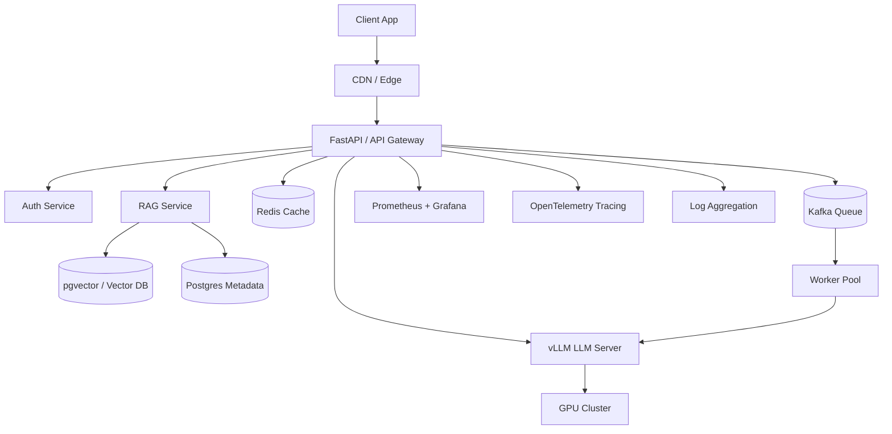
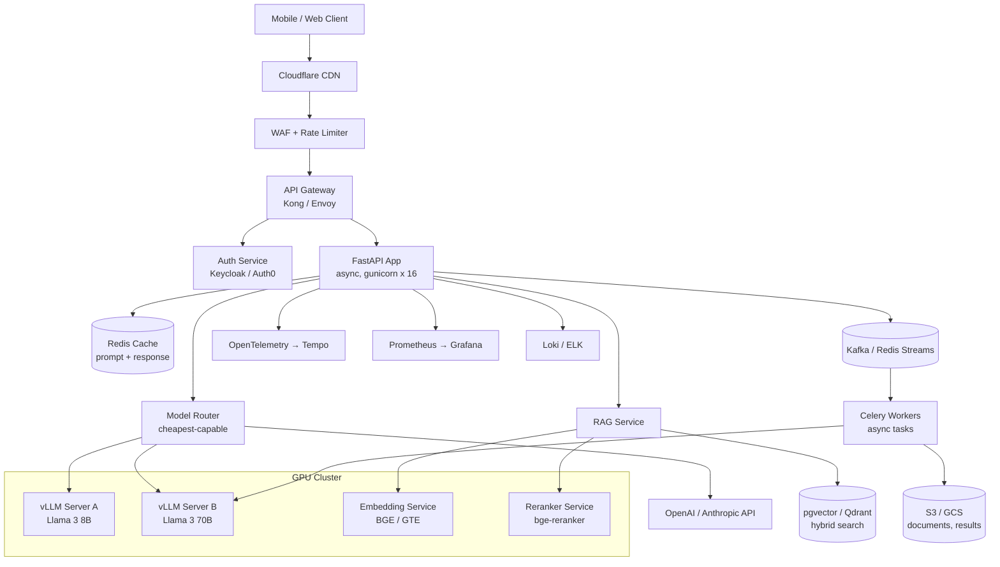

# 01 - Production AI Infrastructure Stack

> [!info] TL;DR
> Production AI infrastructure: FastAPI for the API layer, Docker for packaging, Kubernetes for orchestration, PostgreSQL + pgvector for relational + vector data, Redis for caching, Kafka for streaming, GPU clusters for compute, Prometheus + Grafana for monitoring. This note surveys the standard stack.

## The Stack



## Components

### API Layer: FastAPI
- Python async framework; perfect for LLM workloads.
- Native OpenAPI docs.
- Streaming responses for token-by-token LLM output.
- Pydantic for request/response validation.

### Packaging: Docker
- Reproducible deployments.
- GPU support via `nvidia-container-toolkit`.
- Multi-stage builds to keep image sizes small.
- Image: usually PyTorch + vLLM + your code; ~10GB.

### Orchestration: Kubernetes
- Standard for production container orchestration.
- GPU scheduling via NVIDIA device plugin.
- HPA (horizontal pod autoscaler) for traffic-based scaling.
- StatefulSets for stateful services (databases, LLM servers).

### Database: PostgreSQL + pgvector
- Postgres for relational data (users, sessions, metadata).
- pgvector extension for vector storage and ANN search.
- One database for both — simpler ops.
- Alternatives: dedicated vector DBs (Qdrant, Weaviate, Milvus) for scale.

### Cache: Redis
- Cache LLM responses for identical queries.
- Rate limiting.
- Session state.
- Pub/sub for real-time updates.

### Streaming: Kafka (for high-scale)
- Event streaming between services.
- Async task queues (alternative: Celery, Redis Streams).
- Audit logs.
- Most teams don't need Kafka until ~100M events/day.

### Compute: GPU clusters
- NVIDIA H100 / A100 / L40S for serving.
- Multi-GPU nodes for tensor parallelism.
- GPU autoscaling is hard — scale-up time is minutes, not seconds.
- Spot instances for batch / async workloads.

### Monitoring: Prometheus + Grafana
- Metrics: latency, throughput, error rate, GPU utilization, token cost.
- Dashboards: per-endpoint, per-model, per-tenant.
- Alerting: latency SLO breach, error spike, GPU memory pressure.

### Tracing: OpenTelemetry
- Distributed traces across services.
- For LLM: trace each prompt, retrieval, tool call, and generation.
- Essential for debugging multi-step agent pipelines.
- Backends: Jaeger, Tempo, Honeycomb, Datadog.

### Logging
- Structured logs (JSON) for searchability.
- Centralized: ELK, Loki, or vendor (Datadog, Splunk).
- For LLM: log prompts and responses (with PII redaction!) for debugging and audit.

## Worked Example (FastAPI + vLLM)

```python
from fastapi import FastAPI
from fastapi.responses import StreamingResponse
from pydantic import BaseModel
from vllm import LLM, SamplingParams

app = FastAPI()
llm = LLM(model="meta-llama/Meta-Llama-3-8B-Instruct")

class ChatRequest(BaseModel):
    messages: list[dict]
    temperature: float = 0.7
    max_tokens: int = 512

@app.post("/chat")
def chat(req: ChatRequest):
    sampling = SamplingParams(temperature=req.temperature, max_tokens=req.max_tokens)
    outputs = llm.chat(req.messages, sampling)
    return {"response": outputs[0].outputs[0].text}

@app.post("/chat/stream")
def chat_stream(req: ChatRequest):
    def gen():
        for token in llm.stream_chat(req.messages):
            yield f"data: {token}\n\n"
    return StreamingResponse(gen(), media_type="text/event-stream")
```

Dockerfile:

```dockerfile
FROM vllm/vllm-openai:latest AS base
COPY app/ /app/
WORKDIR /app
CMD ["python", "-m", "uvicorn", "main:app", "--host", "0.0.0.0", "--port", "8000"]
```

## Why This Matters for AI

- This stack is **what production AI actually looks like**. Most "I built an LLM app" tutorials skip 80% of this.
- AI engineering is increasingly indistinguishable from general software engineering — the AI-specific components (vLLM, vector DB, embedding model) sit inside a standard web service architecture.
- Understanding the full stack makes you a complete AI engineer, not just a prompt-tinkerer.

## Production Implications

- **Start simple**: FastAPI + vLLM + Postgres. Add complexity only as needed.
- **Don't roll your own LLM server** — use vLLM, TGI, or SGLang.
- **Multi-tenant isolation**: separate databases per tenant, or row-level security.
- **Cost monitoring**: track tokens per request, GPU hours, infra cost. Cost can spiral fast.
- **GPU autoscaling is hard**: scale based on queue depth, not CPU. Plan for minutes-scale spin-up.

## Common Pitfalls

- **No caching** — identical LLM queries billed multiple times.
- **No streaming** — users wait 30s for full response instead of seeing tokens stream.
- **No timeout handling** — hung LLM calls block request slots.
- **No tracing** — multi-service failures are impossible to debug.
- **Forgetting PII in logs** — log redaction is essential for compliance.
- **GPU underutilization** — running batch size 1 wastes 90% of GPU. Use vLLM's batching.

## Further Reading

- FastAPI docs: https://fastapi.tiangolo.com
- vLLM serving docs.
- "Machine Learning Systems Design" by Eugene Yan.

## Reference Production Architecture (Detailed)

A realistic 2026 production AI stack for a mid-sized LLM application (10K-100K daily active users, multi-tenant):



Component count for a typical deployment:
- 2-4 API gateway instances (Kong/Envoy).
- 8-16 FastAPI app instances (auto-scaled on CPU).
- 2-4 vLLM servers per model (8B, 70B), each 1-8 GPUs.
- 1-2 embedding service instances (CPU or small GPU).
- 1 reranker instance (small GPU).
- 1 Postgres + pgvector instance (vertical scaling; read replicas for scale).
- 1 Redis cluster (3-5 nodes).
- 1 Kafka cluster (3 brokers) — only if async tasks are heavy.
- Observability stack (Prometheus, Grafana, Loki, Tempo) — shared across services.

## Detailed Component Selection

### LLM Server: vLLM vs TGI vs TensorRT-LLM vs SGLang

| Server           | Best For                              | Strengths                              | Weaknesses                            |
|------------------|---------------------------------------|----------------------------------------|---------------------------------------|
| vLLM             | General-purpose serving               | Open, broad model support, PagedAttention | Slower than TRT-LLM for some models |
| TGI (HuggingFace)| HuggingFace ecosystem                 | Easy deployment, broad model support   | Less optimized than vLLM/TRT-LLM      |
| TensorRT-LLM     | Maximum throughput on NVIDIA          | Fastest on H100, FP8 support           | NVIDIA-only, complex build process    |
| SGLang           | Structured generation, programs       | Best for tool-use, structured output   | Newer, smaller community              |

Production recommendation (2026):
- Default: **vLLM** for open models. Best balance of speed, flexibility, community.
- Maximum throughput on H100: **TensorRT-LLM**. Worth the complexity if you're serving billions of tokens.
- Heavy structured output (function calling, JSON): **SGLang**. Best for agent/tool-use workloads.

### Vector Database: pgvector vs Qdrant vs Weaviate vs Milvus

| DB          | Best For                          | Strengths                              | Weaknesses                            |
|-------------|-----------------------------------|----------------------------------------|---------------------------------------|
| pgvector    | Small-medium (<10M vectors)       | One DB for relational + vector, simple | Slower at scale, no GPU indexing      |
| Qdrant      | Medium-large (10M-1B)             | Fast, Rust-based, good filtering       | Newer ecosystem                       |
| Weaviate    | Medium-large, hybrid search       | Built-in hybrid search, GraphQL API    | Heavier resource usage                |
| Milvus      | Very large (1B+)                  | Scales horizontally, GPU indexing      | Complex ops, distributed system       |
| Pinecone    | Managed service                   | Zero ops, scalable                     | Closed-source, expensive at scale     |

Production recommendation:
- Start with **pgvector**. If you're already on Postgres, it's the simplest path.
- Move to **Qdrant** when you exceed 10M vectors or need sub-50ms search at scale.
- Use **Milvus** only if you're at billion-vector scale and have a dedicated platform team.
- Use **Pinecone** if you want zero ops and can afford the markup.

### Cache: Redis Patterns for LLMs

Redis is the workhorse of LLM caching. Three patterns:

1. **Response cache** (exact match): cache `(prompt, model, params) → response`. Hit rate ~10-30% for chat apps, ~50%+ for Q&A. TTL based on prompt stability.
2. **Prompt cache** (prefix match): cache the prompt's KV states for long shared prefixes (system prompt, few-shot examples). vLLM and Anthropic's prompt caching support this. Hit rate can be 80%+ for templated prompts.
3. **Semantic cache** (embedding match): embed the prompt, check if any cached prompt has cosine similarity > threshold. Risky — semantically similar prompts can have different intents. Use with caution.

### Streaming: SSE vs WebSocket vs gRPC

- **SSE (Server-Sent Events)**: standard for LLM token streaming. Simple HTTP, works through proxies, one-directional (server → client). Used by OpenAI, Anthropic, vLLM.
- **WebSocket**: bidirectional, useful for interactive chat with interrupts. More complex; some proxies don't handle well.
- **gRPC streaming**: best for service-to-service streaming (e.g., app → LLM server). Binary protocol, efficient, but clients need gRPC support.

Production: SSE for client-facing streaming. gRPC for internal service-to-service. WebSocket rarely needed for LLM apps.

## Scaling Patterns

### Horizontal vs Vertical Scaling for LLMs

LLM serving has unusual scaling characteristics:
- **Vertical scaling** (bigger GPUs): for a single model, vertical scaling (e.g., A100 80GB → H100 80GB → H200 141GB) gives ~2-4× throughput per instance.
- **Horizontal scaling** (more replicas): linear throughput scaling, but requires load balancing and shared KV cache (or accept per-instance cache).
- **Tensor parallelism** (within a node): split one model across multiple GPUs. Necessary for models >80GB (Llama 3 70B in fp16 needs 140GB).
- **Pipeline parallelism** (across nodes): for very large models (405B+). Adds latency; avoid unless necessary.

Production pattern for Llama 3 70B: 1 model replica = 2 H100s (tensor parallel = 2). For higher throughput, deploy multiple replicas behind a load balancer.

### GPU Autoscaling Challenges

GPU autoscaling is fundamentally harder than CPU autoscaling:
- **Cold start time**: loading a 70B model takes 30-60s. HPA scaling on traffic spikes will overshoot latency SLOs.
- **Cost**: GPUs are 10-100× more expensive than CPUs. Idle GPUs are very expensive.
- **Allocation**: GPU availability in cloud providers is not guaranteed. Spot instances help cost but reduce reliability.

Production patterns:
- **Predictive scaling**: scale based on historical traffic patterns (e.g., scale up at 9am on weekdays).
- **Always-warm baseline**: keep minimum capacity for steady-state traffic; autoscale for spikes.
- **Queue-based scaling**: scale on queue depth, not request rate. Allows buffer for cold starts.
- **Multi-model sharing**: serve multiple models from one GPU cluster with model routing (cheap model on small GPU, expensive model on big GPU).

## Cost Optimization Patterns

Concrete techniques, ranked by impact:

1. **Model routing** (50-80% cost reduction): route easy queries to a small model, hard queries to a large model. Use a classifier or LLM-as-judge for routing.
2. **Prompt caching** (30-60% cost reduction for templated prompts): cache KV states for shared prefixes.
3. **Quantization** (50-75% cost reduction): INT8 or FP8 quantization for inference. ~1% quality loss.
4. **Batching** (2-5× throughput): use vLLM's continuous batching. Critical for cost-efficient serving.
5. **Speculative decoding** (1.5-3× speedup): for latency-sensitive workloads. Doesn't reduce cost per token but reduces latency, allowing higher throughput.
6. **Caching responses** (10-30% cost reduction): cache identical prompts. Lower hit rate than prompt caching but simpler.
7. **Self-hosting vs API** (variable): self-hosting open models is cheaper at high volume (>10M tokens/day) but requires ops investment.

## Production Worked Example: Multi-Tenant Chat Service

```python
import os
import redis
import json
import hashlib
from fastapi import FastAPI, HTTPException, Header, StreamingResponse
from pydantic import BaseModel
from openai import AsyncOpenAI

app = FastAPI()
redis_client = redis.Redis.from_url(os.environ["REDIS_URL"])
vllm_client = AsyncOpenAI(base_url="http://vllm-server:8000/v1", api_key="dummy")
openai_client = AsyncOpenAI(api_key=os.environ["OPENAI_API_KEY"])

class ChatRequest(BaseModel):
    messages: list[dict]
    model: str = "auto"  # auto = router decides
    temperature: float = 0.7
    max_tokens: int = 512

def get_cache_key(req: ChatRequest, tenant_id: str) -> str:
    payload = json.dumps({"m": req.messages, "mo": req.model, "t": req.temperature, "tok": req.max_tokens}, sort_keys=True)
    return f"chat:{tenant_id}:{hashlib.sha256(payload.encode()).hexdigest()}"

def route_model(req: ChatRequest) -> tuple[str, AsyncOpenAI]:
    if req.model != "auto":
        return req.model, vllm_client if "llama" in req.model else openai_client
    # Simple router: short prompts → 8B, long or complex → 70B or GPT-4o
    total_tokens = sum(len(m["content"]) // 4 for m in req.messages)
    if total_tokens < 500:
        return "llama-3-8b-instruct", vllm_client
    elif total_tokens < 4000:
        return "llama-3-70b-instruct", vllm_client
    else:
        return "gpt-4o", openai_client

@app.post("/chat")
async def chat(req: ChatRequest, x_tenant_id: str = Header(...)):
    cache_key = get_cache_key(req, x_tenant_id)
    # Check cache
    cached = redis_client.get(cache_key)
    if cached:
        return {"response": cached.decode(), "cached": True}

    model, client = route_model(req)
    try:
        response = await client.chat.completions.create(
            model=model,
            messages=req.messages,
            temperature=req.temperature,
            max_tokens=req.max_tokens,
        )
        result = response.choices[0].message.content
        # Cache for 1 hour
        redis_client.setex(cache_key, 3600, result.encode())
        return {"response": result, "model": model, "cached": False}
    except Exception as e:
        raise HTTPException(status_code=502, detail=f"LLM error: {e}")

@app.post("/chat/stream")
async def chat_stream(req: ChatRequest, x_tenant_id: str = Header(...)):
    model, client = route_model(req)
    async def gen():
        try:
            stream = await client.chat.completions.create(
                model=model,
                messages=req.messages,
                temperature=req.temperature,
                max_tokens=req.max_tokens,
                stream=True,
            )
            async for chunk in stream:
                if chunk.choices[0].delta.content:
                    yield f"data: {json.dumps({'token': chunk.choices[0].delta.content})}\n\n"
            yield "data: [DONE]\n\n"
        except Exception as e:
            yield f"data: {json.dumps({'error': str(e)})}\n\n"
    return StreamingResponse(gen(), media_type="text/event-stream")
```

This example shows: model routing, response caching, multi-tenant isolation via headers, streaming, and graceful error handling. Production systems add: observability, rate limiting, PII redaction, prompt-injection filtering, and structured outputs.

## Common Production Failure Modes

| Failure Mode | Symptom | Mitigation |
|--------------|---------|------------|
| Cold-start latency spike | First request after deploy takes 60s | Pre-warm: send dummy request after deploy |
| Memory leak in vLLM | OOM after days of operation | Restart pods on schedule (e.g., every 24h) |
| Cache stampede | 1000s of identical requests bypass cache | Single-flight cache (lock during cache fill) |
| Token explosion | User sends 100K-token prompt | Cap input length; rate-limit per tenant |
| Provider outage | OpenAI API down | Fallback to self-hosted or another provider |
| Slow degradation | Quality drops over weeks | Regression evals on schedule; provider drift |
| GPU underutilization | GPU at 20% utilization | Increase batch size; use continuous batching |
| Hot shard | One pgvector node handles 80% of traffic | Consistent hashing; rebalance shards |

## Connection to Other Concepts

- [[13 - Inference/Serving/04 - vLLM and Continuous Batching|vLLM]] — the LLM server.
- [[13 - Inference/Serving/06 - Continuous Batching Deep Dive|Continuous Batching]] — the key throughput technique.
- [[20 - AI Infrastructure/Storage/02 - Vector Storage with pgvector|pgvector]] — vector storage.
- [[20 - AI Infrastructure/Messaging/03 - Messaging with Kafka and Celery|Messaging]] — async task patterns.
- [[20 - AI Infrastructure/Compute/04 - GPU Infrastructure and Sizing|GPU Infrastructure]] — compute sizing.
- [[20 - AI Infrastructure/Observability/05 - Observability Stack|Observability]] — monitoring.
- [[21 - LLMOps and MLOps/Pipelines/01 - LLMOps vs MLOps|LLMOps]] — operational patterns.
- [[22 - Production AI/Architecture/02 - Reference Production Architectures|Reference Architectures]] — alternate patterns.
- [[22 - Production AI/Architecture/03 - Gateway and Router Patterns|Gateway Patterns]] — model routing.

## Interview Questions

1. **Q: Walk through the components of a production LLM application stack.**
   A: Client → CDN/WAF → API Gateway → Auth → FastAPI app → (Cache check, Model Router → vLLM/external API, RAG service → embedding → pgvector → reranker, async queue → workers) → Observability (Prometheus, Loki, Tempo) + Logs. Each component has a specific role; skipping any creates production risk.

2. **Q: How do you choose between vLLM, TGI, TensorRT-LLM, and SGLang?**
   A: Default vLLM (open, broad support, PagedAttention). TensorRT-LLM for max throughput on H100 (worth the build complexity for billions of tokens). SGLang for structured output (tool use, JSON). TGI for HuggingFace ecosystem alignment. Most teams should start with vLLM and only switch if they hit a specific limitation.

3. **Q: How do you autoscale GPU-based LLM serving?**
   A: GPU autoscaling is hard because (1) cold starts take 30-60s, (2) GPUs are expensive, (3) availability isn't guaranteed. Patterns: predictive scaling (historical patterns), always-warm baseline + autoscale for spikes, queue-based scaling (not request rate), multi-model sharing. Don't rely on HPA alone — it'll overshoot SLOs during cold starts.

4. **Q: What's the difference between prompt caching and response caching?**
   A: Response caching: store (prompt → full response), hit on exact match. Prompt caching: store KV states for shared prefixes (system prompt, few-shot examples), allows the model to skip re-computing those tokens. Prompt caching has higher hit rates (80%+ for templated prompts) but requires server support (vLLM, Anthropic). Response caching is simpler but lower hit rate.

5. **Q: How do you handle a multi-tenant LLM application securely?**
   A: Five practices. (1) Tenant ID in every request, validated against auth. (2) Per-tenant rate limits and quotas. (3) Per-tenant cache namespaces (no cross-tenant cache hits). (4) Per-tenant data isolation in storage (separate DB schemas or row-level security). (5) Per-tenant logging with PII redaction. Audit logs per tenant for compliance.

6. **Q: How would you reduce LLM serving costs by 80%?**
   A: Stack the techniques: (1) model routing — 50% reduction (route easy to small model). (2) Quantization — 50% reduction (INT8 or FP8). (3) Prompt caching — 30-60% reduction for templated prompts. (4) Continuous batching — 2-5× throughput. (5) Response caching — 10-30% for repeated queries. Combined, these can get to 80-90% cost reduction with ~1-3% quality loss.

## See Also

- [[13 - Inference/Serving/04 - vLLM and Continuous Batching|vLLM]]
- [[21 - LLMOps and MLOps/MOC|21 LLMOps]]
- [[22 - Production AI/MOC|22 Production AI]]
- [[20 - AI Infrastructure/MOC|Infrastructure MOC]]