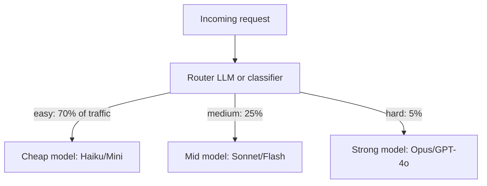

# 06 — Cost Optimization

> [!info] TL;DR
> LLM cost is dominated by tokens, not compute. A single misconfigured prompt can multiply cost 10×. The five levers for cost reduction are: **model routing** (cheap model for easy queries), **prompt compression** (shorter prompts), **caching** (reuse previous results), **output length control** (max_tokens, structured outputs), and **batching** (offline processing for non-interactive workloads). A mature cost strategy combines all five and typically achieves 5–10× reduction vs. a naive deployment.

## Why LLM Cost Is Different

In classical ML, cost is dominated by compute: training is expensive, inference is cheap. A trained model runs at a fixed cost per request — milliseconds of GPU time.

In LLMOps, cost is dominated by **tokens**:
- **Closed-model APIs** charge per token: $0.01–$0.06 per 1K tokens for input, $0.03–$0.15 per 1K tokens for output (GPT-4-class pricing, 2024).
- **Self-hosted models** charge per GPU-hour, but the GPU-hours per request scale with token count.
- **Output tokens cost more than input tokens** (typically 3× for closed models, because generation is sequential and slower than prefill).

The implication: cost is not a fixed per-request value. It varies by 100× depending on prompt length, output length, and model choice. A single 10k-token prompt with a 5k-token output costs 50× more than a 200-token prompt with a 100-token output on the same model.

This variability makes cost engineering a first-class concern. Teams that ignore it routinely run 5–10× over budget.

## The Five Cost Levers

### 1. Model Routing
Not every request needs the strongest model. A routing layer classifies each request by difficulty and sends it to the appropriate model:

Implementation options:
- **LLM router**: a small LLM (or the same model with a routing prompt) classifies the request. Adds latency but enables sophisticated routing.
- **Classifier**: a fine-tuned BERT or similar classifies by difficulty. Fast but less accurate.
- **Cascade**: try the cheap model first; if the response is low-confidence (e.g., refusal, uncertain), retry with the strong model. Adds latency for the failed cases but maximally cheap.
- **Feature-based**: route based on input features (length, language, topic). Simplest, but coarse.

Typical savings: 50–70% vs. always using the strong model, with minimal quality impact if the router is well-tuned.

### 2. Prompt Compression
Longer prompts cost more — directly (input tokens) and indirectly (slower prefill). Strategies:

- **System prompt compression**: review your system prompt for redundancy. Cut anything that does not change behavior. A 2000-token system prompt often compresses to 500 tokens with no quality loss.
- **Few-shot example selection**: instead of always including 10 examples, retrieve the 2–3 most relevant per query. See [[17 - RAG/MOC|RAG]].
- **Context pruning**: for long conversations, periodically summarize older turns rather than including them verbatim.
- **Tool description compression**: tool schemas can be verbose. Minimize descriptions to what the model needs to choose correctly.
- **Prompt caching**: many providers (Anthropic, OpenAI, vLLM) now support prefix caching — if multiple requests share a prefix, the cached prefix is charged at a discount (often 50–90% off).

Typical savings: 30–60% on input cost.

### 3. Caching
LLM outputs are deterministic at temperature 0, and approximately deterministic at low temperatures. Cache aggressively:

- **Exact-match cache**: if the same prompt was asked recently, return the cached response. Hit rate depends on the use case (5–30% for general chat, 50–80% for FAQ-style queries).
- **Semantic cache**: embed the prompt, retrieve similar past prompts, return the cached response if similarity is above a threshold. Higher hit rate but risks returning wrong answers.
- **Prefix cache**: for requests sharing a system prompt or few-shot prefix, cache the prefix's KV state. This is the deepest level — the model literally resumes from the cached state.

Cache hit rates of 20–50% are typical in production. Combined with provider-side prefix caching (which discounts cached tokens), this can halve effective cost.

### 4. Output Length Control
Output tokens cost 3× input tokens on most APIs. Controlling output length is the highest-leverage cost optimization.

- **`max_tokens`**: always set this. Without it, a model can generate 4000+ tokens for a simple question.
- **Structured outputs**: ask for JSON or a specific format. Models produce more concise outputs when constrained.
- **"Be concise" in the prompt**: explicitly tell the model to be brief. Effects vary by model but can reduce output length 30–50%.
- **Stop sequences**: if you only need the answer (not the reasoning), use a stop sequence to terminate generation early.
- **For reasoning models** (o1, R1): use the smallest reasoning effort that solves the problem. Reasoning tokens are charged like output tokens and can dominate cost.

Typical savings: 40–80% on output cost.

### 5. Batching
For non-interactive workloads (data labeling, bulk summarization, classification), use batch APIs:

- **OpenAI Batch API**: 50% discount, 24-hour turnaround.
- **Anthropic Message Batches**: 50% discount, async processing.
- **Self-hosted batching**: with vLLM, continuous batching processes many requests in parallel, dramatically improving throughput.

Batching trades latency for cost. For workloads where 24-hour latency is acceptable (most offline processing), the 50% discount is free money.

## Token Economics: A Worked Example

Consider a customer support chatbot handling 10,000 conversations per day, average 5 turns each, average 500 input tokens + 200 output tokens per turn.

**Naive deployment** (GPT-4o at $5/Mtok input, $15/Mtok output):
- Daily input tokens: 10,000 × 5 × 500 = 25M tokens → $125/day
- Daily output tokens: 10,000 × 5 × 200 = 10M tokens → $150/day
- Daily cost: $275/day → **$100,375/year**

**Optimized deployment**:
- Model routing: 70% on Haiku ($0.25/Mtok in, $1.25/Mtok out), 30% on GPT-4o.
- Prompt compression: cut input from 500 → 300 tokens.
- Output control: cut output from 200 → 120 tokens via "be concise" + max_tokens.
- Caching: 30% cache hit rate on inputs.
- Batching: not applicable (interactive).

Calculation:
- Routed to Haiku (70%): 7,000 × 5 turns × (300 in × 0.7 cache-adjusted + 120 out) = 7,300 × 5 × (210 + 120) = 7,300 × 5 × 330 = 12M tokens
  - Input: 7,665K × $0.25/M = $1.92
  - Output: 4,380K × $1.25/M = $5.48
- Routed to GPT-4o (30%): 3,000 × 5 × (210 + 120) = 5M tokens
  - Input: 3,150K × $5/M = $15.75
  - Output: 1,800K × $15/M = $27.00
- **Total: $50.15/day → $18,305/year**

That is a **5.5× cost reduction** from a reasonable set of optimizations. The full optimization stack (caching + routing + compression + output control) routinely achieves 5–10× in production.

## Cost Monitoring

You cannot optimize what you cannot measure. A cost monitoring stack should track:

- **Per-request cost** — input + output, by model.
- **Per-tenant cost** — which customers are expensive?
- **Per-feature cost** — which features consume the most budget?
- **Cost trends** — is daily cost increasing? Why?
- **Cost per successful outcome** — not just per request. If a feature has 50% retry rate, the cost per successful answer is 2× the per-request cost.

Alert on:
- Daily cost exceeding budget.
- Per-request cost exceeding threshold (often a bug).
- Cost per tenant spiking (often abuse or a tenant-side bug).

## Common Pitfalls

### No `max_tokens`
A model generating 4000 tokens for a yes/no question. Always set `max_tokens` based on the expected response length.

### Verbose System Prompts
System prompts that say "You are a helpful, friendly, knowledgeable assistant who is also patient and concise..." cost tokens for every request without changing behavior. Cut aggressively.

### Always Using the Strongest Model
GPT-4o for "what's the weather?" is wasteful. Route easy queries to cheaper models.

### No Caching
Asking the same question twice and paying both times. Implement at least exact-match caching; semantic caching for higher hit rates.

### Not Using Batch APIs for Offline Work
If you're processing 100K documents overnight, use the batch API and save 50%.

### Ignoring Output Token Cost
Input and output tokens are priced differently. A prompt that doubles input tokens but halves output tokens may be a net win (output is 3× more expensive). Always calculate net cost.

## The Build-vs-Buy Decision

Many teams build custom cost optimization (routing, caching, semantic dedup). Before building, evaluate:

- **LiteLLM** — open-source proxy with routing, caching, fallbacks.
- **Portkey** — commercial LLM gateway with cost optimization.
- **OpenRouter** — multi-model routing as a service.
- **Cloud provider gateways** — AWS Bedrock, Azure AI, Google Vertex AI all offer routing + caching.

Building custom makes sense when you have unusual requirements (specialized routing logic, tight latency constraints, custom caching). For most teams, a gateway is sufficient and much faster to deploy.

## See Also

- [[01 - LLMOps vs MLOps]]
- [[02 - Prompt Management]]
- [[05 - Production Monitoring]]
- [[07 - A/B Testing and Shadow Deployment]]
- [[04 - vLLM and Continuous Batching]]
- [[21 - LLMOps and MLOps/MOC|21 LLMOps MOC]]
