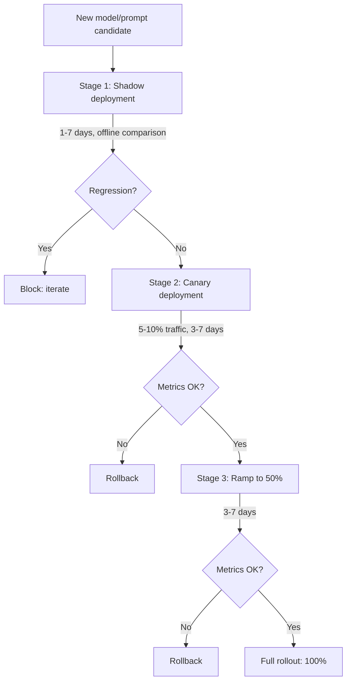

# 07 — A/B Testing and Shadow Deployment

> [!info] TL;DR
> LLM A/B testing differs from classical web A/B testing because LLM outputs are non-deterministic, multi-dimensional, and slow to evaluate. The standard pipeline uses **shadow deployment** (run new model in parallel, compare offline) → **canary** (small traffic percentage) → **full rollout**, with LLM-as-judge and human review gates at each stage. Without this pipeline, you ship regressions to all users at once.

## Why LLM A/B Testing Is Hard

Classical web A/B testing is well-understood: split users into control and treatment, measure a conversion metric, run a t-test. The assumptions are: the treatment is deterministic (same user always sees the same variant), the metric is clear (click-through, conversion), and effects are measurable within hours.

LLM A/B testing violates all three assumptions:

### Non-Determinism
The same prompt can produce different outputs on different requests (especially at temperature > 0). A user in the treatment group might get a great answer on one try and a bad answer on the next. This adds variance that classical A/B testing does not handle.

### Multi-Dimensional Metrics
"Quality" is not a single number. A response can be correct but verbose, helpful but slow, accurate but tone-deaf. You need multiple metrics (correctness, helpfulness, latency, cost) and a way to combine them into a rollout decision.

### Slow Feedback
For many LLM applications, the "conversion" (did the user find the answer helpful?) takes hours or days to manifest. You cannot run a 1-hour A/B test and conclude anything about quality.

### Cost Asymmetry
A bad classical A/B test wastes some users' time. A bad LLM A/B test can cost thousands of dollars (if the new model is more expensive) or cause real harm (if the new model hallucinates medical advice). The stakes for safe rollout are higher.

## The Three-Stage Rollout Pipeline



### Stage 1: Shadow Deployment
Run the new model in parallel with the current production model. For every production request:
1. Send to the production model (serves the user).
2. Send to the shadow model (output discarded, or logged for offline comparison).
3. Log both outputs for later analysis.

Shadow deployment lets you see what the new model *would have* done, without exposing users to it. The cost is 2× (you pay for both models), but the safety is invaluable.

After 1–7 days of shadow traffic:
1. Run LLM-as-judge on a sample of paired outputs.
2. Compute aggregate metrics (latency, cost, refusal rate).
3. Look for regressions on specific user segments or query types.

If the shadow model is statistically worse on any critical metric, block the rollout and iterate.

### Stage 2: Canary Deployment
Serve the new model to a small percentage of users (typically 5–10%). Monitor:
- Real user feedback (thumbs up/down, follow-up corrections).
- Latency, cost, error rates.
- LLM-as-judge on sampled outputs.
- Refusal rate, safety classifier alerts.

Canary duration depends on traffic volume:
- High-traffic (10K+ requests/day): 3–5 days.
- Medium-traffic (1K–10K): 5–7 days.
- Low-traffic (<1K): 1–2 weeks (need more time to accumulate statistical power).

If any metric regresses, rollback. If all metrics are stable, ramp to 50%.

### Stage 3: Ramp to 50% then 100%
Increase traffic gradually. Each step is a checkpoint:
- 5% → 25% → 50% → 100%.
- At each step, monitor metrics for 1–3 days.
- Rollback is always available.

The gradual ramp catches issues that only appear at scale (e.g., a model that handles 100 requests/minute fine but breaks at 1000 requests/minute due to batching effects).

## Statistical Considerations

### Sample Size
LLM outputs have high variance. To detect a 5% quality difference with 80% power, you typically need 1,000–10,000 examples per variant. For low-traffic features, this means canary periods of weeks.

### Multiple Testing
If you measure 20 metrics, one will appear statistically significant by chance. Use Bonferroni correction (divide α by 20) or focus on a small number of pre-registered primary metrics.

### Sequential Testing
Classical A/B testing assumes you test once, after a fixed sample size. In practice, teams check metrics daily, which inflates false positives. Use sequential testing methods (always-valid p-values, group sequential designs) to avoid this.

### Heterogeneous Effects
A model might be better on average but worse for a specific user segment. Always segment the analysis by:
- User type (new vs. returning, free vs. paid).
- Query type (easy vs. hard, short vs. long).
- Language / region.

## Shadow Traffic Analysis

The most valuable part of the pipeline is the shadow stage, because it lets you compare models on the *same* inputs. Two analysis patterns:

### Paired Comparison
For each shadowed request, you have the production output and the shadow output for the same input. Run an LLM-as-judge pairwise comparison:

```
For the question {question}:
  Response A (production): {response_a}
  Response B (shadow): {response_b}
  
  Which is better?
```

Paired comparisons are much more powerful than unpaired (you eliminate input variance). With 500–1000 paired examples, you can detect 2–3% quality differences.

### Failure Mode Analysis
Identify requests where the shadow model failed but the production model succeeded (and vice versa). Look for patterns:
- Does the shadow model fail on a specific query type?
- Does it fail on long inputs? Short inputs? Code? Math?
- Are there specific topics where it's worse?

This analysis often reveals issues that aggregate metrics miss. A model might be "5% better on average" but catastrophically worse on a critical query type — which aggregate metrics hide.

## Rollback Strategy

Rollback must be fast and reliable. Requirements:

- **One-command rollback**: a single API call or config change that reverts traffic to the previous version.
- **No data loss**: in-flight requests complete on the new model; new requests go to the old model. No user-visible errors.
- **Versioned artifacts**: the previous model + prompt + adapter are still in the registry, ready to serve.
- **Tested rollback**: run a rollback drill before you need it. Many teams discover their rollback is broken only during a real incident.

The rollback target should be the previous *known-good* version, not just any previous version. If you've had two consecutive bad deploys, rolling back to the immediately previous one is not enough — you need to roll back to the last known-good.

## Common Pitfalls

### Skipping Shadow for "Small" Changes
A prompt tweak seems small, but it can break edge cases that only appear in production traffic. Always shadow, even for changes that look trivial.

### Insufficient Canary Duration
3 days is the minimum for high-traffic features; 1 day is not enough. Weekday/weekend traffic patterns differ, and you need both to make a confident decision.

### Ignoring Long-Tail Metrics
Mean latency looks fine, but p99 latency regressed. Users notice the slow requests, not the average. Always look at percentiles, not just means.

### Not Segmenting by User Type
A model that's better on average but worse for paying customers is a bad trade. Always segment by user value.

### No Pre-Registered Success Criteria
Without pre-registered criteria, you can rationalize any result. Before the canary starts, write down: "We will roll out if metric X is ≥ baseline and metric Y is ≤ baseline + Z%." Stick to it.

### Trusting LLM-as-Judge Without Human Validation
LLM-as-judge scores can be biased. Always validate a sample of canary outputs with human review before rolling out.

## Tooling

### Feature Flag Systems
- **LaunchDarkly** — commercial feature flagging with traffic-percentage controls.
- **Statsig** — experimentation platform with LLM-aware features.
- **GrowthBook** — open-source experimentation.
- **Eppo** — experimentation platform with statistical rigor.

### LLM-Specific Tools
- **LangSmith** — built-in A/B testing for LLMs.
- **Helicone** — observability with experiment tracking.
- **Parea AI** — experiment + eval pipeline.
- **Braintrust** — prompt + model experimentation.

### Custom Pipelines
Most mature teams build a custom pipeline:
1. Feature flag for traffic routing (percentage + user-segment).
2. Shadow traffic logger (writes paired outputs to S3/BigQuery).
3. Offline analysis job (runs LLM-as-judge, computes metrics).
4. Dashboard (Grafana, Metabase) showing the comparison.
5. Rollback button (one API call to revert).

## See Also

- [[01 - LLMOps vs MLOps]]
- [[02 - Prompt Management]]
- [[03 - Model Registry and Versioning]]
- [[04 - LLM-as-Judge Evaluation]]
- [[05 - Production Monitoring]]
- [[21 - LLMOps and MLOps/MOC|21 LLMOps MOC]]
