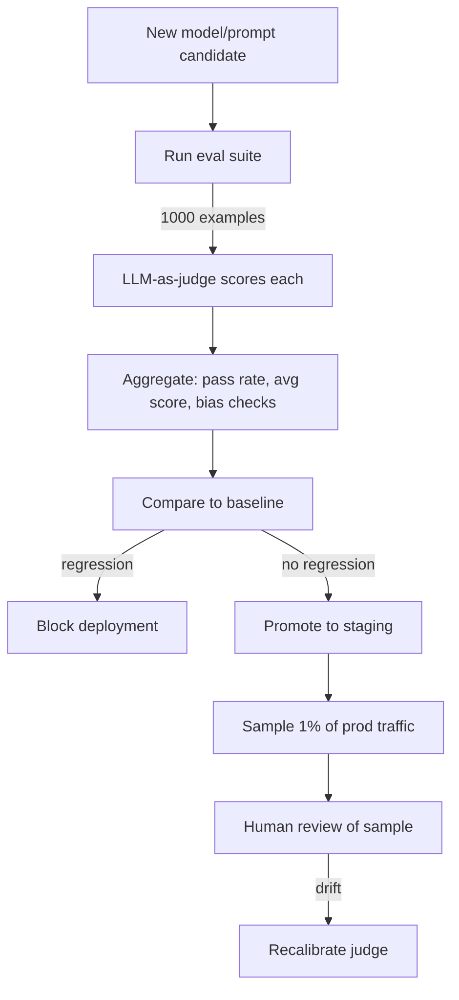

# 04 — LLM-as-Judge Evaluation

> [!info] TL;DR
> LLM-as-judge uses a strong LLM (GPT-4, Claude) to evaluate the outputs of another LLM. It is the dominant evaluation method for open-ended generation tasks where ground-truth labels are unavailable. Cheap, scalable, and reasonably correlated with human judgment — but biased, brittle, and not a replacement for human evaluation. Use it as a fast iteration signal, not as the final word on quality.

## Why LLM-as-Judge Exists

Classical ML evaluation is straightforward: you have labeled test data, you compute accuracy/F1/AUC. The model either predicts the right label or it doesn't.

LLM evaluation is harder because outputs are open-ended. "Write a summary of this article" has no single correct answer. Even for tasks with a target answer (e.g., translation), multiple valid outputs exist. Human evaluation is the gold standard but expensive ($5–50 per evaluation) and slow (days to weeks).

LLM-as-judge fills the gap: use a strong LLM to score outputs on dimensions like correctness, helpfulness, faithfulness, tone. It costs pennies per evaluation and runs in minutes. This makes it possible to:
- Iterate on prompts and models quickly.
- Run thousands of evaluations per change.
- Set up automated eval gates in CI.

The trade-off: LLM judges have known biases and are imperfectly correlated with human judgment. They are a useful signal, not ground truth.

## Evaluation Patterns

### 1. Single-Output Scoring
The judge scores one output on a scale (e.g., 1–5) against a rubric.

```
Prompt to judge:
  You are evaluating a customer support response.
  Rate the response on a scale of 1-5 for:
  - Correctness (does it accurately answer the question?)
  - Helpfulness (does it solve the user's problem?)
  - Tone (is it polite and professional?)
  
  User question: {question}
  Response: {response}
  
  Output JSON: {"correctness": int, "helpfulness": int, "tone": int, "rationale": str}
```

Pros: simple, works for any output. Cons: absolute scores are noisy; judges use the scale inconsistently.

### 2. Pairwise Comparison
The judge compares two outputs (A and B) and decides which is better.

```
Prompt to judge:
  You are evaluating two responses to the same question.
  Which response is better?
  
  Question: {question}
  Response A: {response_a}
  Response B: {response_b}
  
  Output: "A", "B", or "tie". Provide a rationale.
```

Pros: relative judgments are more reliable than absolute scoring. Cons: quadratic cost if you compare all pairs; results depend on the order (A/B bias).

### 3. Reference-Based Evaluation
The judge scores an output against a known-correct reference.

```
Prompt to judge:
  You are evaluating a translation.
  Source (English): {source}
  Reference (French, human): {reference}
  Candidate (French, model): {candidate}
  
  Rate the candidate's accuracy on a scale of 1-5, where 5 means identical in meaning to the reference.
```

Pros: grounded in a reference; more reliable than free-form scoring. Cons: requires references (which are expensive to produce); does not reward outputs that are better than the reference.

### 4. Rubric-Based Evaluation
The judge evaluates whether the output satisfies specific criteria.

```
Prompt to judge:
  Evaluate whether the response satisfies each criterion:
  - Mentions the return policy (yes/no)
  - Includes a link to the returns page (yes/no)
  - Does not make up policies not in the knowledge base (yes/no)
  - Is under 100 words (yes/no)
  
  Response: {response}
  
  Output JSON: {"mentions_return_policy": bool, ...}
```

Pros: precise, debuggable (you can see which criteria failed). Cons: requires you to enumerate criteria in advance; misses unanticipated failure modes.

### 5. Multi-Turn / Agentic Evaluation
For agents and multi-turn conversations, the judge evaluates the entire trajectory — not just the final output.

```
Prompt to judge:
  Evaluate the agent's trajectory:
  - Did it use the right tools?
  - Did it ask clarifying questions when needed?
  - Did it recover from errors?
  - Did it converge on a correct answer?
  
  Trajectory: {messages}
  
  Output JSON with per-step and overall scores.
```

This is the most complex pattern but essential for agent evaluation. Tools like LangSmith and LangGraph provide specialized support for trajectory evaluation.

## Known Biases

LLM judges have well-documented biases. You must account for these in your eval pipeline.

### Position Bias
In pairwise comparison, judges prefer the first or second output depending on training. Mitigation: run each comparison twice (A/B and B/A); if the judge disagrees, mark as "tie" or use a third comparison.

### Length Bias
Judges prefer longer outputs, even when the shorter output is more concise and correct. Mitigation: normalize by length, or use rubrics that explicitly penalize verbosity.

### Self-Preference Bias
Judges prefer outputs from their own model family. GPT-4 prefers GPT-4 outputs; Claude prefers Claude outputs. Mitigation: use a judge from a different family than the model being evaluated, or use multiple judges and average.

### Format Bias
Judges prefer well-formatted outputs (markdown, lists, headers) over plain text. Mitigation: normalize formatting before evaluation, or use rubrics that ignore formatting.

### Sycophancy Bias
Judges may agree with the response even when it's wrong, especially if the response is confident. Mitigation: structure the prompt to make the judge skeptical ("Find three problems with this response").

### Knowledge Leakage
For tasks where the judge doesn't know the answer (e.g., a recent news event), the judge may guess — and its guess is biased toward plausibility, not correctness. Mitigation: provide the reference or knowledge base to the judge, so it doesn't have to rely on its own knowledge.

## Calibrating Against Human Judgment

The most important practice is to **calibrate your judge against human evaluation** on a sample of outputs. Steps:

1. Sample 100–500 outputs from your test set.
2. Have humans score them on the same rubric you'll use for the judge.
3. Have the judge score the same outputs.
4. Compute correlation (Spearman, Kendall) and agreement (Cohen's kappa) between judge and human.

A well-calibrated judge achieves correlation >0.7 with humans. If your correlation is below 0.5, your judge is unreliable for that task — either change the judge, change the prompt, or accept that the task needs human evaluation.

Recalibrate periodically — judge behavior changes as model providers update their APIs.

## Production Pipeline



A mature pipeline:
1. Runs LLM-as-judge on every deploy (automated gate).
2. Samples 1–5% of production outputs for human review (ground-truth check).
3. Periodically re-runs the eval suite on the current production model to detect drift.
4. Recalibrates the judge when correlation with humans drops.

## Cost Considerations

LLM-as-judge is much cheaper than human eval but not free. Typical costs:
- Single-output scoring: 500–2000 tokens per evaluation. At $5/Mtok (GPT-4-class), that's $0.0025–0.01 per eval.
- Pairwise comparison: 1000–3000 tokens per eval. $0.005–0.015 per eval.
- 1000-example eval suite, single-output: $2.50–$10 per run.

For a team iterating daily, this adds up. Mitigation:
- Use a cheaper judge (Llama-3-70B, Claude Haiku) for routine evals; reserve GPT-4-class for final pre-deploy checks.
- Cache evaluations — if you re-run the same example against the same judge, return the cached result.
- Use **active evaluation**: prioritize examples where the model is uncertain or where past runs showed variance.

## Tooling

- **LangSmith Eval** — built-in LLM-as-judge with common evaluators (helpfulness, faithfulness, correctness).
- **OpenAI Evals** — OpenAI's framework for running LLM evaluations.
- **Promptfoo** — open-source CLI for prompt + model evaluation.
- **Ragas** — RAG-specific evaluators (faithfulness, relevance, context precision).
- **DeepEval** — Pytest-style LLM unit testing.
- **Inspect AI** (UK AISI) — evaluation framework for safety + capability evals.

## Common Pitfalls

### Trusting the Judge Without Calibration
The most common mistake. Teams set up an LLM-as-judge, see numbers, and start optimizing against them. Without calibration, they may be optimizing for the judge's biases rather than actual quality.

### Using a Single Judge
A single judge's biases dominate. Use 2–3 judges from different model families and average, or use a cheap judge for routine evals and an expensive judge for final checks.

### Not Updating Eval Sets
Eval sets become stale. Real user queries evolve; new edge cases appear. Refresh the eval set monthly with sampled production traffic.

### Optimizing for the Judge
If your prompt is over-tuned to the judge's preferences, it may score high in eval but perform poorly in production. Always validate top-performing prompts against human review of a sample.

### Ignoring Cost
LLM-as-judge at scale is expensive. Without caching and cost tracking, eval costs can rival training costs.

## See Also

- [[01 - LLMOps vs MLOps]]
- [[02 - Prompt Management]]
- [[05 - Production Monitoring]]
- [[06 - LLM Benchmarks]]
- [[21 - LLMOps and MLOps/MOC|21 LLMOps MOC]]
- [[17 - RAG/MOC|17 RAG]] — RAG-specific evaluators
