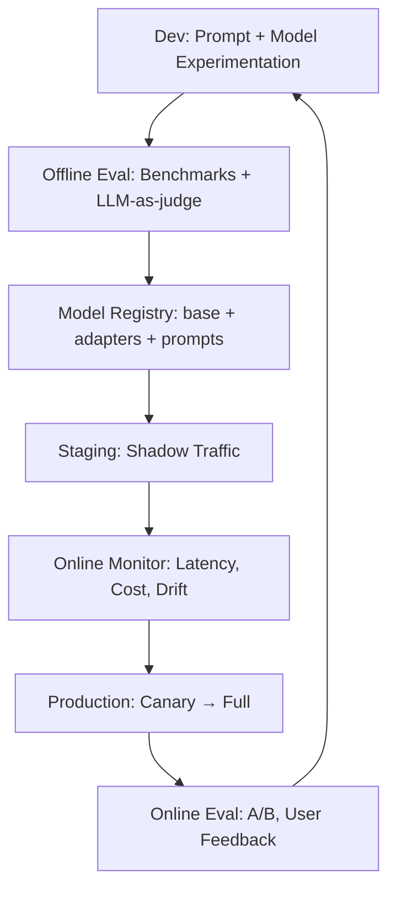

# 21 — LLMOps and MLOps MOC

> [!info] LLMOps is MLOps adapted for LLMs. New challenges: prompt management, model versioning (base + adapter), LLM-as-judge evaluation, hallucination monitoring, token-cost tracking, prompt-injection defense. Iteration 3 added the full set of seven planned notes.

## Reading Order

| #   | Note                                              | Sub-domain        | Purpose                                            |
|-----|---------------------------------------------------|-------------------|----------------------------------------------------|
| 01  | [[01 - LLMOps vs MLOps]]                          | Pipelines         | What's different about LLM ops.                    |
| 02  | [[02 - Prompt Management]]                        | Pipelines         | Versioning, A/B testing prompts.                   |
| 03  | [[03 - Model Registry and Versioning]]            | Pipelines         | Base + adapter versioning as a deployment unit.    |
| 04  | [[04 - LLM-as-Judge Evaluation]]                  | Evaluation        | Using LLMs to evaluate LLMs.                       |
| 05  | [[05 - Production Monitoring]]                    | Monitoring        | Latency, cost, drift, hallucination.               |
| 06  | [[06 - Cost Optimization]]                        | Cost              | Token economics, model routing, caching.           |
| 07  | [[07 - A-B Testing and Shadow Deployment]]        | Deployment        | Safe rollout of new models.                        |

## Sub-Domains

- [[21 - LLMOps and MLOps/Pipelines/01 - LLMOps vs MLOps|Pipelines]] — notes 01, 02, 03
- [[21 - LLMOps and MLOps/Evaluation/04 - LLM-as-Judge Evaluation|Evaluation]] — note 04
- [[21 - LLMOps and MLOps/Monitoring/05 - Production Monitoring|Monitoring]] — note 05
- [[21 - LLMOps and MLOps/Cost/06 - Cost Optimization|Cost]] — note 06
- [[21 - LLMOps and MLOps/Deployment/07 - A-B Testing and Shadow Deployment|Deployment]] — note 07

## The LLMOps Stack

## Key Differences from Classical MLOps

| Aspect                  | Classical ML                    | LLMOps                                   |
|-------------------------|---------------------------------|------------------------------------------|
| Model artifact          | One model file                  | Base model + adapter + prompts + tools   |
| Evaluation              | Held-out accuracy               | Benchmarks + LLM-as-judge + human eval   |
| Retraining frequency    | Monthly / weekly                | Continuous (prompts), occasional (model) |
| Failure modes           | Drift, accuracy drop            | Hallucination, prompt injection, cost    |
| Cost driver             | Compute (training + inference)  | Tokens (per-request, scales with usage)  |
| Versioning unit         | Model + features                | Prompt + model + adapter + system msg    |

## Why This Matters for AI

- LLMOps is where AI engineering meets SRE. Most production AI failures are ops failures, not model failures.
- The token-cost dimension is new and significant — a single LLM feature can cost $10k+/month at scale without optimization.
- LLM-as-judge evaluation enables fast iteration without human labelers, but introduces its own biases (see [[04 - LLM-as-Judge Evaluation]]).
- Prompt management is a new artifact type that needs versioning, review, and rollback (see [[02 - Prompt Management]]).

## Production Implications

- **Invest in eval first**. Without a reliable eval pipeline, you can't iterate safely.
- **Track token cost per request, per user, per feature**. Cost is the #1 surprise for new LLM deployments.
- **Prompt versioning**: treat prompts like code. Git-track, review, test.
- **Shadow deployment**: send production traffic to the new model in parallel, compare outputs, don't serve to users until you're confident (see [[07 - A-B Testing and Shadow Deployment]]).
- **LLM-as-judge** for online quality monitoring — sample 1% of traffic, judge quality, alert on degradation (see [[05 - Production Monitoring]]).

## See Also

- [[20 - AI Infrastructure/MOC|20 AI Infrastructure]]
- [[22 - Production AI/MOC|22 Production AI]]
- [[08 - LLMs/Evaluation/06 - LLM Benchmarks|LLM Benchmarks]]
- [[08 - LLMs/Limitations/05 - Hallucination|Hallucination]]
- [[22 - Production AI/Security/01 - LLM Security and Prompt Injection|LLM Security]]
