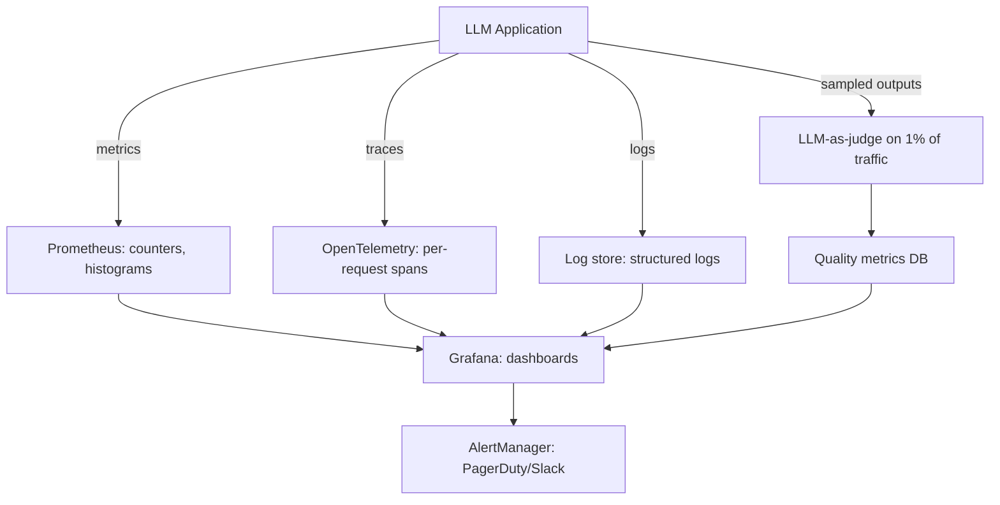

# 05 — Production Monitoring

> [!info] TL;DR
> LLM production monitoring tracks five signal classes: **latency, cost, quality, safety, and usage**. Classical ML monitoring (latency, accuracy) is necessary but insufficient — LLMs add token-cost tracking, hallucination detection, prompt-injection alerts, and per-user/per-tenant breakdowns. A robust monitoring stack combines structured metrics (Prometheus), trace logs (OpenTelemetry), and content sampling (LLM-as-judge on 1% of traffic).

## What to Monitor

### 1. Latency
- **Time to first token (TTFT)** — how long until the user sees the first response. Dominated by prefill (processing the prompt) and network RTT.
- **Time per output token (TPOT)** — how fast tokens stream once they start. Dominated by decode speed and KV cache efficiency.
- **Total request latency** — TTFT + (output_tokens × TPOT). What the user experiences end-to-end.

For agentic workloads, also track:
- **Tool call latency** — time spent in tool execution vs. LLM inference.
- **Iteration count** — how many ReAct loops before termination.
- **Context size growth** — how the conversation grows over turns.

SLOs typically target TTFT < 1s, TPOT < 50ms for interactive use cases. Long-tail latency (p99) matters more than mean — users notice the slow requests, not the average ones.

### 2. Cost
- **Tokens per request** — input + output, separately.
- **Cost per request** — `input_tokens × input_price + output_tokens × output_price`.
- **Cost per user / per tenant** — for multi-tenant systems, track per-customer cost.
- **Cost per feature** — which features (chat, summarization, RAG) are the cost drivers?

Cost monitoring should alert on:
- Per-request cost exceeding a threshold (e.g., $0.50 — usually a bug).
- Daily cost exceeding budget.
- Sudden cost spikes (often a prompt regression causing longer outputs).

### 3. Quality
Quality is the hardest to monitor because there is no ground truth at inference time. Approaches:

- **LLM-as-judge on a sample**: run an LLM judge on 1–5% of production outputs, alert on quality regression. See [[04 - LLM-as-Judge Evaluation]].
- **User feedback**: thumbs-up/down, ratings, follow-up corrections. Sparse but high-signal.
- **Implicit signals**: users re-asking the same question (suggests bad answer), users abandoning mid-conversation (suggests frustration), users editing outputs (suggests errors).
- **Task-specific metrics**: for RAG, track retrieval recall (did we retrieve the right documents?). For tool-calling, track tool success rate.

### 4. Safety
- **Refusal rate** — what percentage of requests does the model refuse? High refusal rate suggests over-alignment; zero refusal rate may suggest under-alignment.
- **Prompt-injection detection** — classify inputs for known injection patterns. Alert on spikes.
- **PII leakage** — scan outputs for personal information (SSNs, emails, phone numbers).
- **Toxicity / hate speech** — run a toxicity classifier on outputs.
- **Policy violations** — domain-specific checks (e.g., medical advice restrictions).

### 5. Usage
- **Requests per second (RPS)** — overall load.
- **Active users** — distinct users per time window.
- **Feature usage** — which features are used most?
- **Geographic distribution** — for capacity planning and latency optimization.
- **Error rate** — HTTP 4xx/5xx, model errors, tool errors.

## The Monitoring Stack

### Metrics (Prometheus / Datadog)
Structured numerical data, aggregated over time windows. Examples:
- `llm_requests_total{model="gpt-4o", tenant="acme"}` — counter.
- `llm_request_duration_seconds` — histogram.
- `llm_tokens_total{direction="input|output"}` — counter.
- `llm_cost_usd_total` — counter.
- `llm_quality_score` — gauge (from LLM-as-judge).

Metrics are cheap to collect and query. Use them for alerting and dashboards.

### Traces (OpenTelemetry / LangSmith)
Per-request structured logs showing the full execution path:
- The prompt sent to the model.
- The model's response.
- Tool calls made and their results.
- Sub-requests (e.g., to a retrieval system).
- Latency breakdown by component.

Traces are essential for debugging individual requests. They are expensive to store (kilobytes per request), so usually sampled (10–100% for dev, 1–10% for production).

### Logs (Loki / ELK / Datadog)
Unstructured or semi-structured text logs. Useful for:
- Error messages and stack traces.
- Application-level events (user logged in, feature flag changed).
- Audit logs (who called what when).

### Content Sampling
A separate pipeline that samples 1–5% of production traffic, runs LLM-as-judge, and stores quality scores. This is the only way to detect quality regressions in production — metrics alone cannot tell you if outputs have become worse.

## Alerting Strategy

### Alert on Symptoms, Not Causes
- ✅ "p99 latency > 5s for 5 minutes" — clear symptom.
- ❌ "GPU utilization > 80%" — cause, not symptom; may be normal during peak.

### Multi-Level Alerts
- **Warning**: investigate soon (e.g., p95 latency 20% above baseline).
- **Critical**: page on-call (e.g., error rate > 5%, or cost spike > 10×).
- **Emergency**: automatic mitigation (e.g., failover to backup model).

### Alert Fatigue
Bad alerts cause alert fatigue, which causes real alerts to be ignored. Rules:
- Every alert should have a clear runbook.
- Tune alert thresholds to <5% false positive rate.
- Review alert history monthly — silence or fix noisy alerts.

## Common Production Issues

### Cost Spike
A prompt change causes outputs to be 5× longer. Cost per request jumps from $0.01 to $0.05. Daily cost goes from $100 to $500.

**Detection**: per-request cost alert (>$0.05 triggers investigation), daily budget alert.

**Mitigation**: rollback the prompt; add `max_tokens` limits; route long requests to a cheaper model.

### Latency Regression
A new model version is slower. TTFT jumps from 800ms to 2s.

**Detection**: p95 TTFT alert, comparison to previous version's baseline.

**Mitigation**: rollback; investigate (KV cache hit rate? prompt caching enabled? batching?).

### Quality Drift
Closed-model provider silently updates. Outputs become slightly less helpful. No single request is obviously bad, but aggregate quality metrics drop.

**Detection**: LLM-as-judge on 1% sample shows quality score dropping from 4.2 to 3.9 over a week.

**Mitigation**: pin to specific model version; re-evaluate prompt; consider switching providers.

### Prompt Injection
An attacker discovers your system prompt and crafts inputs that extract it or override instructions.

**Detection**: prompt-injection classifier on inputs; output classifier for policy violations; spike in refusal rate or unusual tool calls.

**Mitigation**: rate-limit the attacker; add input sanitization; review and harden system prompt.

### Hallucination Spike
A knowledge base update introduces conflicting information. The model starts hallucinating to resolve conflicts.

**Detection**: LLM-as-judge faithfulness check on RAG outputs shows spike in ungrounded claims.

**Mitigation**: rollback the knowledge base update; add citation requirements to the prompt.

## Tooling

### General-Purpose
- **Prometheus + Grafana + AlertManager** — open-source metrics stack.
- **Datadog** — commercial all-in-one observability.
- **OpenTelemetry** — vendor-neutral tracing standard.

### LLM-Specific
- **LangSmith** — LangChain's observability platform; traces, eval, prompt management.
- **Helicone** — open-source LLM observability.
- **Parea AI** — eval + monitoring.
- **Phoenix** (Arize) — open-source LLM observability.
- **Braintrust** — eval + monitoring with focus on prompt iteration.

### Content Sampling Infrastructure
Most teams build a small custom pipeline:
1. Sample 1% of production requests (configurable per feature).
2. Send the sampled request + response to an LLM judge.
3. Store the judge's scores in a time-series DB.
4. Alert on score regression.

This is straightforward to build but essential for catching quality issues that metrics miss.

## Common Pitfalls

### Monitoring Only Latency and Cost
The most common mistake. Teams set up latency and cost monitoring (because those are easy) but skip quality monitoring (because it's hard). They discover quality regressions only when users complain — by which point the damage is done.

### No Per-Tenant Breakdown
In multi-tenant systems, aggregate metrics hide tenant-specific issues. One tenant may be experiencing 5× latency while the average looks fine. Always break down by tenant.

### Sampling Bias
If you sample the first 1% of requests per day, you miss diurnal patterns. Sample uniformly across time, or use reservoir sampling.

### No Trace for Failed Requests
Failed requests are often dropped before tracing completes, leaving you with no data to debug. Always emit traces for failed requests, with the error captured.

### Not Pinning Model Versions in Telemetry
If your telemetry says "model: gpt-4o" without a version, you cannot correlate regressions with provider updates. Always include the pinned version identifier in telemetry.

## See Also

- [[01 - LLMOps vs MLOps]]
- [[04 - LLM-as-Judge Evaluation]]
- [[06 - Cost Optimization]]
- [[01 - Production AI Stack]]
- [[01 - LLM Security and Prompt Injection]]
- [[21 - LLMOps and MLOps/MOC|21 LLMOps MOC]]
