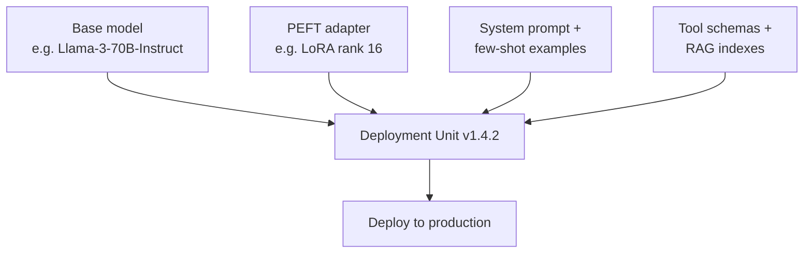
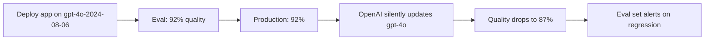
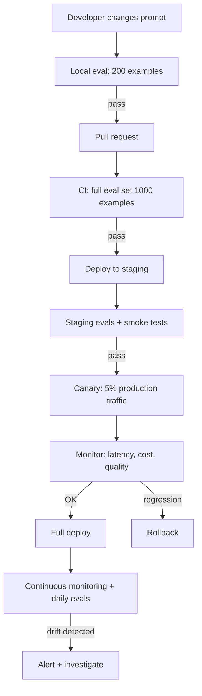

# 01 — LLMOps vs MLOps

> [!info] TL;DR
> LLMOps extends MLOps with new artifact types (prompts, adapters, system messages), new failure modes (hallucination, prompt injection), and new cost drivers (tokens, not just compute). The pipelines look similar — train, register, deploy, monitor — but every stage has LLM-specific concerns. Treating an LLM application like a classical ML deployment leads to predictable production failures.

## The Core Difference

Classical MLOps was built around one artifact: a trained model. You version the model, version the features, deploy the model, monitor the predictions for drift. The pipeline is conceptually simple because the model is the only thing that changes.

LLMOps has *four* coupled artifacts that can change independently:

1. **Base model** — the pretrained or fine-tuned LLM (GPT-4o, Claude, Llama-3, etc.).
2. **Adapter** — a LoRA or similar PEFT module that modifies the base model's behavior.
3. **Prompt** — system prompt, few-shot examples, output format instructions.
4. **Tools / RAG context** — the function schemas, retrieval indexes, knowledge bases the LLM can access.

A "model deployment" in LLMOps is really a deployment of *all four*. Changing the prompt can have as much impact as changing the model. This makes versioning, rollback, and A/B testing significantly more complex.

## Side-by-Side Comparison

| Aspect                  | Classical ML                              | LLMOps                                                  |
|-------------------------|-------------------------------------------|---------------------------------------------------------|
| Primary artifact        | One trained model                         | Base model + adapter + prompt + tools                   |
| Training frequency      | Weekly / monthly                          | Continuous (prompts), occasional (model)                |
| Evaluation              | Held-out accuracy / F1                    | Benchmarks + LLM-as-judge + human eval                  |
| Cost driver             | Compute (training + inference)            | Tokens (per-request, scales with usage)                 |
| Latency characteristic  | ms-scale, predictable                     | 100ms–10s, variable (output length, reasoning steps)    |
| Failure modes           | Drift, accuracy drop                      | Hallucination, prompt injection, cost spikes, refusals  |
| Ground truth            | Available (labeled data)                  | Often unavailable (open-ended generation)               |
| Retraining signal       | Drift detection on features/labels        | Quality regression on eval set + user feedback          |
| Reproducibility         | High (fixed model + features)             | Low (model providers silently update; nondeterminism)   |
| Telemetry               | Predictions, confidence, latency          | Predictions, prompt, tool calls, token counts, cost     |

## The New Failure Modes

LLMOps inherits the classical failure modes (drift, latency, errors) and adds several LLM-specific ones:

### Hallucination
The model confidently produces false statements. There is no analog in classical ML — a classifier either predicts the right label or it doesn't, but it doesn't invent new labels. See [[05 - Hallucination]].

**Detection**: fact-checking against a knowledge base, LLM-as-judge verification, citation faithfulness checks.

**Mitigation**: RAG grounding, structured outputs (force the model to cite sources), guardrails, lower temperature.

### Prompt Injection
A malicious user embeds instructions in the input that override the system prompt. Classical ML has no analog — model inputs are numbers, not natural language. See [[01 - LLM Security and Prompt Injection]].

**Detection**: input classification, output monitoring for policy violations.

**Mitigation**: input sanitization, output filtering, defense-in-depth (multiple guardrails), separate privileges for tool-calling.

### Cost Spikes
A single long-context request can cost dollars, not cents. A bug that causes the model to produce 10k-token outputs instead of 500-token outputs multiplies cost by 20×. Classical ML costs are bounded per request; LLM costs are unbounded.

**Detection**: per-request cost tracking, anomaly alerts on token usage.

**Mitigation**: max_tokens limits, prompt caching, model routing (cheap model for easy queries), budget caps per user/tenant.

### Refusal and Bias
The model refuses benign requests (over-alignment) or produces biased outputs. These are not bugs in the traditional sense — the model is doing what it was trained to do, but the policy is wrong for your use case.

**Detection**: refusal-rate monitoring, demographic-bias testing.

**Mitigation**: prompt engineering, system-prompt adjustments, model selection (different models have different policies).

### Provider Drift
Closed-model providers (OpenAI, Anthropic) silently update their models. The same `gpt-4o` API call can produce different outputs this week vs. last week. This breaks reproducibility in a way classical ML never dealt with — your own model never silently changes.

**Detection**: eval-set regression runs on a schedule (daily/weekly), comparing current outputs to baselines.

**Mitigation**: pin to specific model versions (e.g., `gpt-4o-2024-08-06`), maintain fallback models, run canary tests before deploying.

## The Pipeline Stages (Compared)

### Data / Prompt Management
- **Classical ML**: feature store, schema enforcement, data versioning (DVC).
- **LLMOps**: prompt registry, prompt versioning (LangSmith, PromptLayer), few-shot example management, evaluation datasets.

### Training / Fine-Tuning
- **Classical ML**: training job on labeled data, hyperparameter tuning.
- **LLMOps**: SFT, DPO, or RLHF runs; LoRA adapter training; benchmark evaluation; LLM-as-judge evaluation.

### Model Registry
- **Classical ML**: model file + metadata + schema.
- **LLMOps**: base model + adapter + prompt + system message + tool schemas, all versioned together as a single "deployment unit."

### Deployment
- **Classical ML**: model server (TF Serving, Triton), canary rollout.
- **LLMOps**: model server (vLLM, TGI) + prompt loader + tool executor + guardrails; canary with shadow traffic.

### Monitoring
- **Classical ML**: prediction drift, feature drift, accuracy (when labels arrive).
- **LLMOps**: token usage, cost per request, latency per output token, refusal rate, hallucination rate (via sampling + verification), prompt-injection alerts.

### Evaluation
- **Classical ML**: held-out accuracy, F1, AUC.
- **LLMOps**: benchmarks (MMLU, GPQA) + LLM-as-judge on eval set + human eval on a sample + task-specific metrics (e.g., retrieval faithfulness for RAG).

## Why This Matters

For AI engineers, the practical implication is that LLMOps is *not* just "MLOps with a bigger model." It requires new tooling, new metrics, and new skills:

- **Prompt engineering as a first-class discipline**, not an afterthought.
- **Cost engineering** — token economics is a critical skill; teams without it routinely run 10× over budget.
- **Eval-driven development** — because there is no held-out test set with ground-truth labels, you need a robust LLM-as-judge pipeline to iterate safely.
- **Defense-in-depth security** — prompt injection is a real attack surface, not a theoretical concern.

Teams that treat LLMOps like MLOps typically discover the gap the hard way: a cost surprise, a hallucination incident, or a security breach.

## The Four-Artifact Deployment Unit (Detailed)

The fundamental LLMOps shift is that "the model" is no longer the only artifact. A production LLM deployment is a tuple of four coupled artifacts:

Each artifact can change independently, and each change can affect behavior:
- **Base model change**: usually a major version bump (Llama 3 → Llama 4). Breaks compatibility; needs full re-eval.
- **Adapter change**: routine LoRA fine-tune update. Needs eval on regression set.
- **Prompt change**: a single word can break behavior. The most common production failure mode; needs eval + canary.
- **Tools change**: adding/removing tools or changing schemas. Needs eval for tool-calling accuracy.

Versioning all four together as a single "deployment unit" is essential. Without it, you can't reproduce behavior — you don't know which artifact caused a regression.

## Eval-Driven Development for LLMs

Classical ML has a clean train/test split: train on training data, evaluate on held-out test. LLMs don't have this — outputs are open-ended, ground truth is often unavailable, and "quality" is multi-dimensional.

The LLMOps solution is **eval-driven development**:

1. **Build an eval set** (50-500 examples covering the task distribution).
2. **Define metrics** (LLM-as-judge for quality, exact match for verifiable, BLEU/ROUGE for translation, retrieval faithfulness for RAG).
3. **Run evals on every change** (prompt tweak, adapter update, base model swap).
4. **Compare to baseline** (statistical significance, not single-run noise).
5. **Canary in production** (5% traffic, monitor key metrics).

Tools: LangSmith, Langfuse, Braintrust, Promptfoo, OpenAI Evals. All provide eval set management, multi-metric evaluation, and comparison views.

The eval set itself is a living artifact — add examples from production failures, edge cases, and adversarial inputs. A mature eval set has 200-2000 examples covering the task's full distribution.

## Provider Drift: The Hidden LLMOps Challenge

Closed-model providers (OpenAI, Anthropic, Google) silently update their models. The same `gpt-4o` API call can produce different outputs this week vs. last week. This is fundamentally different from classical ML, where your own model never changes without your action.

### The drift problem

The drift happens because:
- Providers update model weights without version bumps.
- Providers change tokenization, system prompts, or safety classifiers.
- Providers change rate limits, latency, or availability.

### Mitigations

1. **Pin to specific versions**: use `gpt-4o-2024-08-06`, not `gpt-4o`. This locks you to a specific snapshot.
2. **Run regression evals daily**: even pinned versions can change (providers may deprecate or update).
3. **Maintain fallback models**: if OpenAI deprecates your version, fall back to Anthropic or self-hosted.
4. **Track behavior over time**: log inputs and outputs; periodically re-run old inputs to detect drift.
5. **SLA contracts with providers**: for enterprise, demand advance notice of model changes.

## Cost Engineering Deep Dive

LLM costs are unbounded in a way classical ML costs are not. A single long-context request can cost dollars; a bug that causes 10K-token outputs multiplies cost 20×. Cost engineering is a first-class LLMOps discipline.

### Per-request cost tracking

Every request must be attributed:
- User ID (for billing and quotas).
- Tenant ID (for multi-tenant cost allocation).
- Model used (for routing analysis).
- Input/output token counts (for actual cost).
- Tool calls made (for tool-attributed cost).
- Latency (for SLO analysis).

This data feeds dashboards: cost per user, cost per tenant, cost per model, cost per request type.

### Cost reduction techniques (ranked by impact)

| Technique                          | Cost Reduction | Quality Impact | Implementation Difficulty |
|------------------------------------|----------------|----------------|---------------------------|
| Model routing (cheap for easy)     | 50-80%         | <1%            | Medium                    |
| Prompt caching (shared prefixes)   | 30-60%         | 0%             | Low (server-side)         |
| Quantization (INT8/FP8)            | 50-75%         | ~1%            | Medium                    |
| Continuous batching                | 2-5× throughput| 0%             | Use vLLM (free)           |
| Response caching (exact match)     | 10-30%         | 0%             | Low                       |
| Max token limits                   | Variable       | Caps tail quality | Trivial                |
| Smaller model fine-tuned for task  | 80-95%         | -1 to +3%      | High (needs fine-tuning)  |
| Distillation to smaller model      | 90-99%         | -2 to -5%      | Very high                 |

Most production teams stack 3-5 of these. The first three (model routing, prompt caching, quantization) give 80%+ cost reduction with minimal quality loss.

## Monitoring Stack for LLMs (Detailed)

LLM monitoring is richer than classical ML monitoring:

| Metric Category | Specific Metrics | Alert Threshold |
|-----------------|------------------|-----------------|
| Latency         | P50, P95, P99 latency per endpoint/model | P95 > 2× baseline |
| Throughput      | Requests/sec, tokens/sec | Sustained drop > 20% |
| Error rate      | HTTP 5xx, LLM errors, timeout rate | > 1% sustained |
| Cost            | Cost per request, cost per tenant, cost per day | Daily cost > 1.5× baseline |
| Token usage     | Input/output tokens per request, p99 output length | p99 output > 5× baseline |
| Quality (sampled) | LLM-as-judge score, hallucination rate | Quality drop > 5% |
| Safety          | Refusal rate, prompt-injection alerts | Refusal rate > 2× baseline |
| Provider health | API error rate, latency, deprecation warnings | Provider 5xx > 5% |

Each metric needs: real-time dashboard, historical trend, alerting threshold, and incident response runbook.

## Worked Example: LLMOps Pipeline for a Chat Product

This pipeline is the LLMOps equivalent of a classical ML CI/CD pipeline, but every stage has LLM-specific concerns:
- Local eval: developer runs eval set on their machine before pushing.
- CI eval: full eval set runs on every PR; blocks merge on regression.
- Staging: deploy to staging, run smoke tests, sample LLM-as-judge.
- Canary: 5% production traffic; monitor key metrics for 1 hour.
- Full deploy: if canary is clean, ramp to 100%.
- Continuous: daily regression evals detect provider drift; alerts on quality regression.

## Connection to Other Concepts

- [[20 - AI Infrastructure/Serving/01 - Production AI Stack|Production AI Stack]] — the infrastructure LLMOps operates on.
- [[21 - LLMOps and MLOps/Pipelines/02 - Prompt Management|Prompt Management]] — versioning prompts as first-class artifacts.
- [[21 - LLMOps and MLOps/Pipelines/03 - Model Registry and Versioning|Model Registry]] — versioning the four-artifact deployment unit.
- [[21 - LLMOps and MLOps/Evaluation/04 - LLM-as-Judge Evaluation|LLM-as-Judge]] — the eval methodology.
- [[21 - LLMOps and MLOps/Monitoring/05 - Production Monitoring|Production Monitoring]] — monitoring stack.
- [[21 - LLMOps and MLOps/Deployment/07 - A-B Testing and Shadow Deployment|A/B Testing]] — safe rollout patterns.
- [[21 - LLMOps and MLOps/Cost/06 - Cost Optimization|Cost Optimization]] — cost engineering.
- [[22 - Production AI/Security/01 - LLM Security and Prompt Injection|LLM Security]] — security concerns.
- [[08 - LLMs/Limitations/05 - Hallucination|Hallucination]] — the failure mode monitoring must detect.

## Interview Questions

1. **Q: What are the four artifacts in an LLMOps deployment unit?**
   A: Base model, PEFT adapter (LoRA), prompt (system + few-shot), tools/RAG context. All four can change independently and each can affect behavior. Version them together as a single deployment unit; without this, you can't reproduce behavior or diagnose regressions.

2. **Q: How is LLMOps different from MLOps?**
   A: Three core differences: (1) four coupled artifacts instead of one (model), (2) new failure modes (hallucination, prompt injection, cost spikes, provider drift), (3) cost is per-token and unbounded, not per-prediction and bounded. The pipelines look similar (train, register, deploy, monitor) but every stage has LLM-specific concerns.

3. **Q: What is provider drift, and how do you mitigate it?**
   A: Provider drift is when a closed-model provider (OpenAI, Anthropic) silently updates their model, changing your application's behavior without your action. Mitigations: pin to specific versions (`gpt-4o-2024-08-06`), run daily regression evals, maintain fallback models, track behavior over time, demand SLA contracts for enterprise.

4. **Q: How do you evaluate an LLM application in production?**
   A: Eval-driven development. Build a 200-2000 example eval set covering the task distribution. Define multi-dimensional metrics (LLM-as-judge for quality, exact match for verifiable, retrieval faithfulness for RAG). Run evals on every change (prompt, adapter, base model). Compare to baseline with statistical significance. Canary in production (5% traffic, monitor for 1 hour). Continuous monitoring with daily regression evals.

5. **Q: How do you attribute cost in an LLM application?**
   A: Per-request attribution: log user ID, tenant ID, model, input/output token counts, tool calls, and latency for every request. Aggregate into dashboards: cost per user, cost per tenant, cost per model, cost per request type. Use these to identify optimization opportunities (e.g., 80% of cost from one tenant suggests a custom solution; 50% of cost from one model suggests routing to a cheaper model).

6. **Q: What's the LLMOps equivalent of a CI/CD pipeline?**
   A: Local eval → PR with CI eval (full eval set) → staging deploy with smoke tests → canary (5% production traffic) → full deploy → continuous monitoring with daily regression evals. Each stage has LLM-specific concerns: local eval uses developer's eval subset, CI uses the full set, staging runs LLM-as-judge, canary monitors cost/latency/quality, continuous catches provider drift.

## See Also

- [[21 - LLMOps and MLOps/MOC|21 LLMOps MOC]]
- [[01 - Production AI Stack]]
- [[04 - LLM-as-Judge Evaluation]]
- [[05 - Production Monitoring]]
- [[06 - Cost Optimization]]
- [[22 - Production AI/MOC|22 Production AI]]