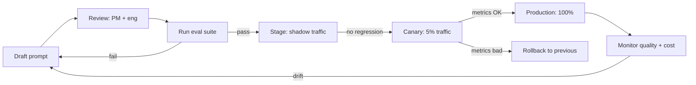

# 02 — Prompt Management

> [!info] TL;DR
> Prompts are first-class artifacts in LLMOps: they need versioning, review, testing, and rollback just like code. A mature prompt-management system treats prompts as configuration (not source code), separates them from application logic, and integrates them into CI/CD pipelines with automated evaluation gates.

## Why Prompts Need Management

In the early days of LLM apps, prompts were hardcoded strings in source files. This works for prototypes but breaks down in production:

- **Iteration friction**: changing a prompt requires a code deploy. If you want to A/B test 5 prompt variants, that is 5 deploys.
- **No audit trail**: who changed the prompt last week, and why? Without version history, you cannot answer.
- **No rollback**: if a prompt change degrades quality, reverting is painful (find the old version in git history, redeploy).
- **No separation of concerns**: prompts are written by PMs, subject-matter experts, or prompt engineers — not necessarily the developers who own the code. Hardcoded prompts force these teams to interact through pull requests.
- **No testing**: a prompt change can break the model's output format, fail to handle edge cases, or trigger refusals. Without an automated eval pipeline, you find out in production.

Mature LLMOps treats prompts as **configuration**: a separate artifact, versioned independently of code, deployed independently, and tested against an eval suite before going live.

## The Anatomy of a Prompt Artifact

A "prompt" in a production system is more than a string. It typically includes:

1. **System message** — defines the model's role, tone, and constraints.
2. **User message template** — the variable-filled template for the actual user input.
3. **Few-shot examples** — demonstrations of expected input/output pairs.
4. **Tool descriptions** — schemas for any tools the model can call.
5. **Output format specification** — JSON schema, regex, or natural-language description of the expected response shape.
6. **Model parameters** — temperature, top_p, max_tokens, stop sequences.
7. **Model identifier** — which model (and version) this prompt is designed for.

A prompt artifact bundles all of these together so they version as a unit. Changing the temperature is a prompt change; changing the model is a prompt change; changing the system message is a prompt change.

## The Prompt Management Lifecycle



### Draft
Prompt engineers draft candidate prompts, often experimenting in a notebook or playground. Tools like LangSmith, PromptLayer, and Helicone provide a playground for iterating on prompts with immediate eval feedback.

### Review
Prompts are reviewed by both product (for behavior) and engineering (for correctness, edge cases, security). The review checks:
- Does the prompt follow the model's best practices (clear instructions, examples, format)?
- Does it handle edge cases (empty inputs, adversarial inputs, very long inputs)?
- Does it have prompt-injection defenses (if user input is included)?
- Does it match the model's known strengths and weaknesses?

### Test
The candidate prompt runs against an eval suite — a set of test inputs with expected outputs (or LLM-as-judge criteria). The suite must cover:
- **Golden cases**: known-good inputs with expected outputs.
- **Edge cases**: empty inputs, very long inputs, malformed inputs.
- **Adversarial cases**: prompt-injection attempts, attempts to extract the system prompt.
- **Diverse cases**: varied languages, tones, lengths.

If the candidate prompt's eval score is below the current production prompt's, it does not ship.

### Stage / Canary / Production
Promotes through shadow traffic (run alongside the current prompt, outputs not served to users) → canary (small percentage of traffic) → full production. At each stage, metrics (quality, cost, latency, refusal rate) are compared against the baseline.

### Rollback
If any stage shows regression, the system rolls back to the previous prompt version. Because prompts are versioned, rollback is a config change, not a code deploy.

## Tooling

### Prompt Registries
- **LangSmith** (LangChain) — prompt management, eval, tracing.
- **PromptLayer** — prompt versioning + review workflow.
- **Helicone** — observability with prompt history.
- **Parea AI** — prompt testing and versioning.
- **Weave** (Weights & Biases) — prompt + eval tracking.

These tools provide:
- A central registry for prompts (separate from code).
- Version history with diffs.
- Review workflows (PRs for prompts).
- Eval integration (run a prompt against a test set with one click).
- A/B testing infrastructure.

### Prompt Templating
Most production prompts use a templating language to separate static text from dynamic variables. Common patterns:

```python
# Jinja2 template
SYSTEM = """
You are a helpful assistant. Answer the user's question about {{product}}.
If you don't know, say so. Do not make up information.

Examples:

Q: {{ex.question}}
A: {{ex.answer}}

"""
```

The template is versioned; the variables (`product`, `examples`) are filled at runtime. This lets you change the prompt structure without changing the application code.

### Prompt + Code Coupling
A subtle design decision: should prompt templates live in the codebase (git-tracked, deployed with code) or in a prompt registry (deployed independently)?

- **In code**: simpler, version-controlled, but iteration requires deploys.
- **In registry**: faster iteration, but introduces a runtime dependency on the registry service.

Most teams start with prompts in code, then migrate to a registry once prompt iteration becomes a bottleneck (typically when non-developers need to edit prompts).

## Common Pitfalls

### Hardcoding Prompts in Source
The #1 mistake. Prompts in source files become invisible configuration — no one knows they exist until they break. Move prompts to a dedicated location (registry or config files) as soon as the project moves beyond prototype.

### No Eval Before Deploying
Changing a prompt without running the eval suite is like deploying code without running tests. It will work for the cases you mentally checked, and break for the cases you didn't.

### Mixing Prompt and Logic
If the prompt includes business logic (e.g., "if the user is a premium customer, do X"), that logic should probably be in code, not in the prompt. Prompts are best for shaping behavior; code is best for enforcing it.

### Ignoring Token Cost
A verbose prompt costs more per request. A prompt that asks for "detailed reasoning" costs more than one that asks for a short answer. Prompt changes can silently double your cost. Always measure token cost as part of the eval.

### No Pinning of Model Versions
A prompt written for `gpt-4o-2024-08-06` may behave differently on `gpt-4o-2024-11-20`. Always pin the model version in the prompt artifact, and re-run evals when upgrading.

## Best Practices

1. **Treat prompts as configuration**: separate from code, versioned independently, deployed via config changes.
2. **Maintain an eval suite**: golden cases, edge cases, adversarial cases. Run before every prompt deploy.
3. **Use a registry for non-trivial projects**: enables iteration without deploys, review workflows, A/B testing.
4. **Pin model versions**: never use unpinned model identifiers in production.
5. **Track cost per prompt variant**: a "better" prompt that costs 2× more may not be worth it.
6. **Document prompt intent**: each prompt should have a comment explaining what behavior it's designed to elicit. Without this, future prompt editors won't know what they're preserving.
7. **Review prompts for security**: any prompt that includes user input is prompt-injection-vulnerable. Add defenses (input sanitization, output validation, system-prompt hardening).

## See Also

- [[01 - LLMOps vs MLOps]]
- [[03 - Model Registry and Versioning]]
- [[04 - LLM-as-Judge Evaluation]]
- [[07 - A/B Testing and Shadow Deployment]]
- [[01 - LLM Security and Prompt Injection]]
- [[21 - LLMOps and MLOps/MOC|21 LLMOps MOC]]
