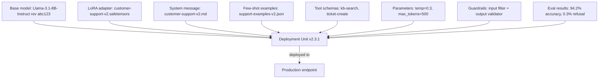

# 03 — Model Registry and Versioning

> [!info] TL;DR
> A production LLM deployment is not just a model file — it is a bundle of base model + adapter + prompt + system message + tool schemas + model parameters. The registry versions all of these together as a single deployable unit, with provenance tracking, dependency management, and rollback support. Without a registry, you cannot reliably reproduce, roll back, or audit a production LLM deployment.

## What Is a Model Registry?

A model registry is a versioned store for ML artifacts. In classical MLOps, it stores trained model files with metadata (training data, hyperparameters, metrics). Examples: MLflow Model Registry, Vertex AI Model Registry, SageMaker Model Registry, Weights & Biases.

In LLMOps, the registry must store more than just model weights. A "model" in production is really a **deployment unit** consisting of:

1. **Base model identifier** — e.g., `meta-llama/Llama-3.1-8B-Instruct`, pinned to a specific revision.
2. **Adapter weights** (if PEFT is used) — LoRA or QLoRA checkpoint.
3. **System message** — the prompt that defines the model's role.
4. **Few-shot examples** — demonstrations included in every request.
5. **Tool schemas** — function-calling definitions.
6. **Model parameters** — temperature, top_p, max_tokens, stop sequences.
7. **Guardrail configuration** — input/output filter settings.
8. **Eval results** — benchmark scores from the eval suite run before promotion.

All eight should be versioned together as a single artifact. Changing any one of them is a new version. This is the LLMOps analog of "container image" in DevOps — a single immutable unit that captures everything needed to deploy.

## Versioning Schemes

### Semantic Versioning for LLMs
Adapt semver to LLM artifacts:

- **Major version** (e.g., v2.0.0): breaking change — different base model, different output format, different tool set. Users must update their integration.
- **Minor version** (e.g., v2.1.0): new capability — new tool, new system message feature, new few-shot example. Backwards compatible.
- **Patch version** (e.g., v2.1.1): bug fix — prompt typo, parameter tweak, guardrail update. Backwards compatible.

This gives consumers a clear contract: minor/patch updates should not break their integration; major updates might.

### Promotion Stages
Most registries track a stage for each version:
- **Development** — internal testing only.
- **Staging** — shadow traffic, integration tests.
- **Canary** — small percentage of production traffic.
- **Production** — full production traffic.
- **Archived** — no longer served, retained for audit.

Promotion between stages is gated by eval results and human approval.

## Dependency Management

### Base Model Pinning
The base model is a dependency of your deployment unit. If the base model provider updates (Meta releases Llama-3.1-8B-Instruct-v2), your deployment unit might break. The registry must:

- Pin the exact model revision (commit hash, model card version).
- Track the source (HuggingFace Hub, internal mirror, closed-model API).
- Detect when the upstream has changed and alert.

For closed models (OpenAI, Anthropic), you cannot pin to a model file — but you *can* pin to a model version identifier (e.g., `gpt-4o-2024-08-06`). The registry should store this version explicitly.

### Adapter Compatibility
A LoRA adapter is only compatible with a specific base model. Adapters trained on Llama-3.1-8B will not work on Llama-3.2-8B (different architecture). The registry must:

- Record which base model the adapter was trained on.
- Refuse to deploy an adapter with an incompatible base model.
- Detect base model upgrades and trigger adapter retraining.

### Tool Schema Evolution
If your deployment unit includes tool schemas, those schemas are part of the contract. Changing a tool's parameter names is a breaking change for any client that calls your endpoint. The registry should:

- Version tool schemas alongside the model.
- Detect breaking changes (renamed parameters, removed tools) and require a major version bump.

## Provenance and Audit

A mature registry records the full provenance of each deployment unit:

- **Training data** — what dataset was used to train the adapter? What version?
- **Training code** — what commit of the training script produced this adapter?
- **Hyperparameters** — LoRA rank, learning rate, batch size.
- **Eval results** — what scores did it achieve on which benchmarks?
- **Approval** — who approved promotion to production? When?
- **Deployment history** — when was it deployed, to which endpoint, by whom?

This audit trail is essential for:
- **Reproducing** a past deployment (e.g., to debug a regression).
- **Compliance** — many industries require auditable model lineage.
- **Incident response** — when something goes wrong, you need to know exactly what was deployed when.

## Rollback Strategy

The registry enables fast rollback. If a new deployment unit shows regression in production:

1. Identify the previous deployment unit version (still in the registry, marked "Archived" or "Production-previous").
2. Repoint the production endpoint to the previous version.
3. The rollback is a config change, not a redeploy — it takes seconds.

This is much faster than redeploying a previous code version (which may require building images, restarting pods, etc.). The ability to roll back quickly is one of the main practical benefits of a registry.

## Multi-Tenant Deployment

In multi-tenant systems (e.g., a SaaS offering LLM features to many customers), each customer may have a different deployment unit:

- Customer A uses the latest general model.
- Customer B has a custom LoRA fine-tuned on their data.
- Customer C uses an older model version (pinned for compliance).

The registry must support deploying multiple versions concurrently, with routing logic that directs each customer's traffic to the correct version. This is the "one base model + many adapters" pattern made operational.

## Tooling

### General-Purpose Registries
- **MLflow Model Registry** — open source, widely used, supports LLM artifacts as a generic "model."
- **Weights & Biases** — model registry with experiment tracking integration.
- **HuggingFace Hub** — model hosting with versioning; can serve as a registry for open-weights models.

### LLM-Specific Registries
- **LangSmith** — prompt + model registry with eval integration.
- **Vertex AI Model Registry** + Vertex AI Extensions — Google Cloud's LLM-aware registry.
- **Azure ML Model Catalog** — Microsoft's LLM registry.

### Custom Registries
Many teams build a custom registry on top of a blob store (S3) + a database (Postgres) + a small API. The implementation is straightforward; the value is in the workflow (review, approval, promotion) wrapped around it.

## Common Pitfalls

### Versioning Only the Model
The most common mistake: versioning the LoRA adapter but not the prompt. When the prompt changes and quality drops, you cannot tell whether it was the adapter or the prompt. Version *everything* together as a deployment unit.

### Not Pinning Base Model Versions
Using `meta-llama/Llama-3.1-8B-Instruct` (unpinned) means your deployment can change silently when Meta pushes an update. Always pin to a specific revision or model card version.

### No Eval Gate
Promoting a new version without running the eval suite is asking for trouble. Even "small" prompt changes can cause large quality regressions on edge cases.

### No Rollback Drill
Teams assume rollback works but never test it. Run a rollback drill periodically — promote a known-bad version, verify the alert fires, roll back, verify traffic shifts. If you wait for a real incident to discover your rollback is broken, you have a multi-hour outage.

### Treating Closed Models as Stable
Closed-model providers silently update their models. A versioned identifier like `gpt-4o-2024-08-06` is stable, but the default `gpt-4o` alias can change. Always use the pinned version identifiers in production.

## See Also

- [[01 - LLMOps vs MLOps]]
- [[02 - Prompt Management]]
- [[04 - LLM-as-Judge Evaluation]]
- [[07 - A/B Testing and Shadow Deployment]]
- [[21 - LLMOps and MLOps/MOC|21 LLMOps MOC]]
