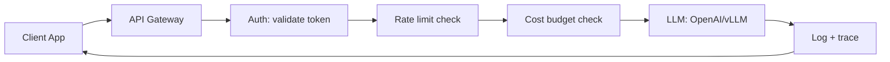
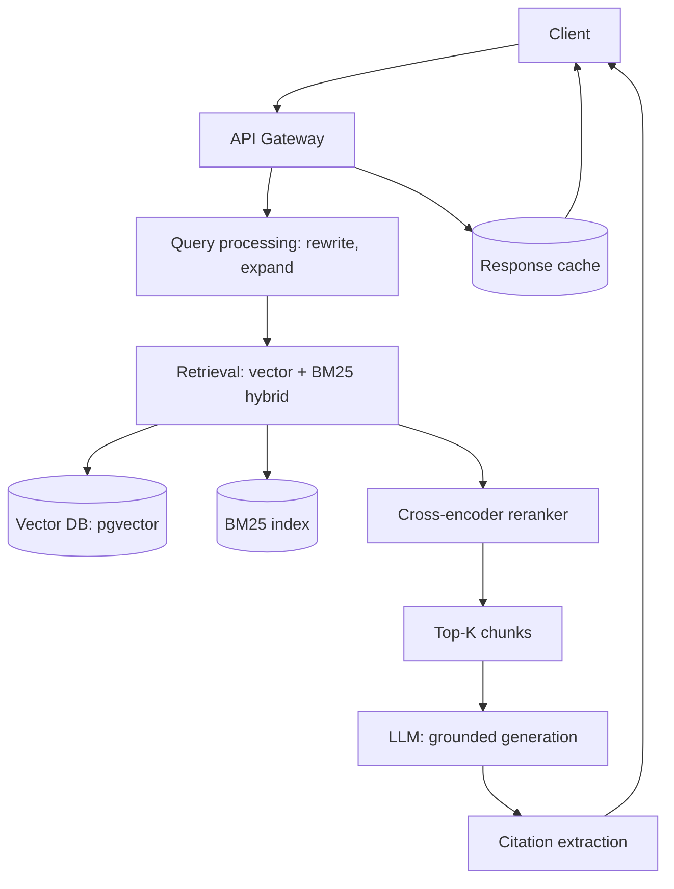
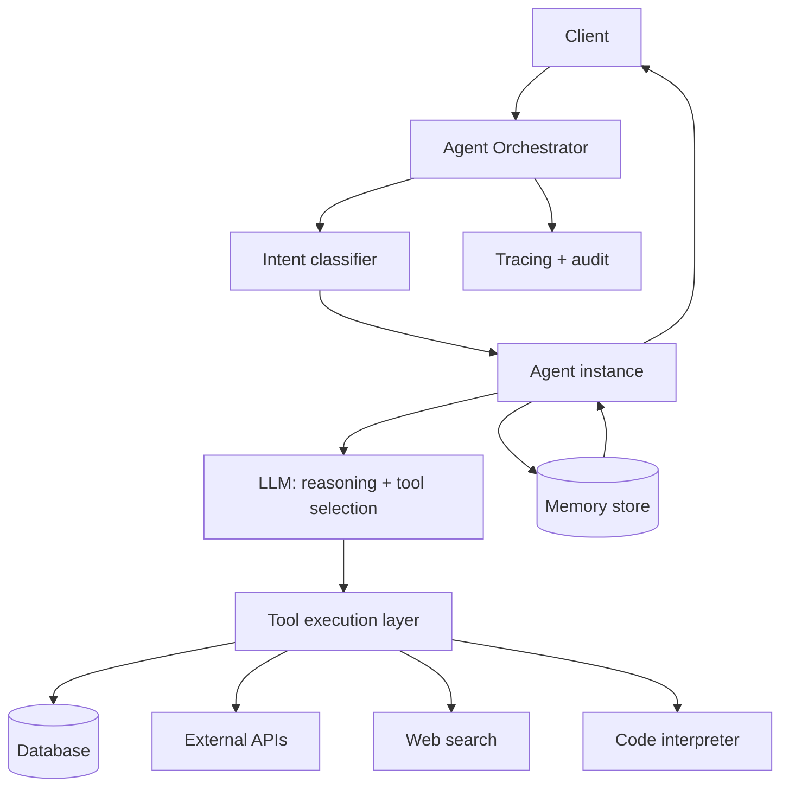
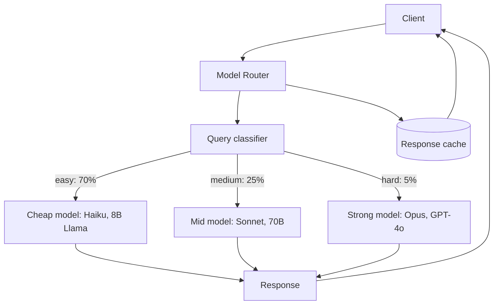

# 02 — Reference Production Architectures

> [!info] TL;DR
> Production AI systems follow a small number of recurring patterns: the **API gateway** (LLM behind a service), the **RAG platform** (retrieval + generation), the **agent platform** (LLM with tools and memory), and the **multi-model router** (cheap model first, expensive model for hard cases). Each pattern has standard components, failure modes, and scaling strategies. Choosing the right pattern up front saves months of rearchitecture.

## The Four Reference Architectures

### 1. The API Gateway Pattern
The simplest production pattern: wrap an LLM (closed or self-hosted) behind an API gateway that handles authentication, rate limiting, logging, and cost control.

**Components**:
- API Gateway (FastAPI, Kong, AWS API Gateway).
- Authentication (OAuth, API keys).
- Rate limiter (Redis, in-memory).
- Cost tracker (per-tenant budget enforcement).
- LLM backend (OpenAI API, vLLM, TGI).
- Logger (structured logs with trace IDs).

**Use case**: simple LLM features (summarization, classification, completion) where you don't need retrieval, tools, or complex orchestration.

**Failure modes**:
- LLM provider outage → failover to backup model or cached response.
- Cost spike → rate limiting or budget cap triggers.
- Latency spike → timeout + fallback.

### 2. The RAG Platform Pattern
The most common production pattern for knowledge-grounded applications. Combines retrieval (vector + keyword search) with generation (LLM produces grounded answers).

**Components**:
- Document ingestion pipeline (chunking, embedding, indexing).
- Vector database (pgvector, Qdrant, Pinecone).
- BM25 index (Elasticsearch, Postgres full-text).
- Reranker (cross-encoder model).
- LLM for generation (with citation prompting).
- Response cache (Redis).
- Feedback collector (thumbs up/down).

**Use case**: knowledge-base Q&A, document search, customer support, any application where answers must be grounded in specific documents.

**Failure modes**:
- Retrieval misses relevant documents → query rewriting, multi-hop retrieval, fallback to broader search.
- Hallucination → faithfulness checking (LLM-as-judge), citation requirements, lower temperature.
- Stale documents → re-indexing pipeline, document versioning.

### 3. The Agent Platform Pattern
For applications that need multi-step reasoning, tool use, and stateful interaction. The LLM acts as a controller, deciding which tools to call and how to combine their outputs.

**Components**:
- Orchestrator (manages agent lifecycle, routing).
- Agent instances (stateful, with conversation history).
- Tool execution layer (sandboxed, with permissions).
- Memory store (per-conversation, per-user).
- Tracing (distributed traces across the agent loop).
- Audit log (every tool call, every decision).

**Use case**: customer support agents, research assistants, code assistants, any application requiring multi-step workflows.

**Failure modes**:
- Agent loops forever → max iterations, timeout.
- Tool failure → retry, fallback, graceful degradation.
- Hallucinated tool calls → argument validation, schema enforcement.
- Cost runaway → per-request cost cap, tool call rate limit.

### 4. The Multi-Model Router Pattern
For cost optimization: route easy queries to a cheap model, hard queries to an expensive model.

**Components**:
- Router (LLM-based or classifier-based).
- Multiple model backends (different sizes/providers).
- Fallback logic (if cheap model fails, retry with stronger).
- Cache (exact-match and semantic).

**Use case**: high-volume applications where cost matters (chatbots, content moderation, classification).

**Failure modes**:
- Router misclassifies → quality regression on misrouted queries. Monitor and retrain.
- Cheap model fails silently → confidence estimation, fallback to stronger model.
- Provider outage → failover to alternative provider.

## Common Components Across Patterns

### Observability Stack
Every production AI system needs:
- **Metrics** (Prometheus): latency, cost, error rate, quality scores.
- **Logs** (Loki, ELK): structured logs with trace IDs.
- **Traces** (OpenTelemetry): per-request spans across all components.
- **Content sampling**: 1–5% of outputs sampled for LLM-as-judge quality monitoring.

See [[05 - Observability Stack]] for details.

### Cost Management
Every production AI system needs:
- Per-request cost tracking.
- Per-tenant budget caps.
- Cost spike alerts.
- Cost optimization (caching, routing, quantization).

See [[06 - Cost Optimization]] for details.

### Safety and Guardrails
Every production AI system needs:
- Input validation (prompt injection detection, PII scrubbing).
- Output filtering (toxicity, policy violations, hallucination checks).
- Rate limiting (per-user, per-tenant).
- Audit logging (every request, every tool call).

See [[04 - Guardrails]] and [[01 - LLM Security and Prompt Injection]] for details.

## Scaling Strategies

### Vertical Scaling (Bigger GPUs)
First approach: use more powerful hardware. Works up to a point, but eventually you hit GPU memory limits or latency requirements.

### Horizontal Scaling (More Replicas)
Standard approach: run multiple model replicas behind a load balancer. Scales throughput, not single-request latency. Requires stateless model servers (vLLM with prefix caching handles shared state).

### Multi-Region
For global applications: deploy in multiple regions, route by geography. Reduces latency for distant users, provides disaster recovery.

### Disaggregated Inference
Advanced approach: separate prefill (processing the prompt) from decode (generating tokens). Prefill is compute-bound; decode is memory-bound. Different hardware pools for each can improve utilization. See DeepSeek/Mooncake.

### Caching at Multiple Levels
- **Prefix cache**: shared system prompts, cached at the model server.
- **Response cache**: exact-match queries, cached at the application level.
- **Semantic cache**: similar queries, cached by embedding similarity.
- **Tool result cache**: tool outputs cached for reuse.

## Choosing a Pattern

| Use Case                              | Recommended Pattern         |
|---------------------------------------|-----------------------------|
| Simple LLM feature (summary, classify)| API Gateway                 |
| Knowledge-grounded Q&A                | RAG Platform                |
| Multi-step workflow with tools        | Agent Platform              |
| High-volume cost-sensitive chat       | Multi-Model Router          |
| Customer support                      | RAG + Agent (hybrid)        |
| Code assistant                        | Agent Platform              |
| Content moderation                    | Multi-Model Router          |

Most production systems combine patterns. A customer support platform might use RAG for knowledge retrieval, an agent for multi-step resolution, and a multi-model router for cost optimization.

## See Also

- [[01 - LLM Security and Prompt Injection]]
- [[03 - Gateway and Router Patterns]]
- [[04 - Guardrails]]
- [[05 - PII and Data Leakage]]
- [[06 - Failure Modes and Graceful Degradation]]
- [[01 - Production AI Stack]]
- [[22 - Production AI/MOC|22 Production AI MOC]]
