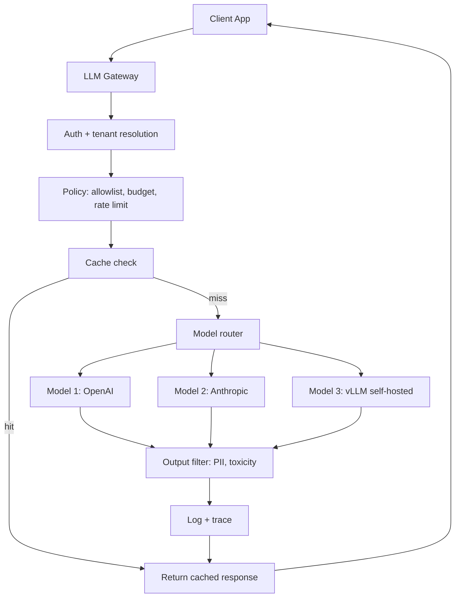

# 03 — Gateway and Router Patterns

> [!info] TL;DR
> The gateway pattern centralizes authentication, policy, logging, and routing in a single service between clients and LLM backends. The router pattern extends this with intelligent request routing: cheap model first, expensive model for hard cases, fallback on failure. Together, they decouple clients from LLM providers, enable multi-provider strategies, and provide a single control point for cost, safety, and observability.

## The Gateway Pattern

### What an LLM Gateway Does
An LLM gateway sits between client applications and LLM providers (OpenAI, Anthropic, self-hosted vLLM). It provides:

- **Unified API**: clients call one API regardless of which backend model is used. The gateway translates to provider-specific formats.
- **Authentication**: validates client tokens, maps to tenants/users.
- **Rate limiting**: per-user, per-tenant, per-model throttling.
- **Cost tracking**: per-request cost attribution, budget enforcement.
- **Logging and tracing**: structured logs with trace IDs for every request.
- **Caching**: prefix caching, response caching, semantic caching.
- **Policy enforcement**: input/output filtering, PII redaction, model allowlists.
- **Fallback**: if one provider fails, route to another.



### Why Use a Gateway

**Provider abstraction**: clients don't need to know which provider serves which model. The gateway handles API differences (OpenAI's chat format vs. Anthropic's message format vs. vLLM's OpenAI-compatible format).

**Multi-provider strategy**: avoid lock-in. If OpenAI has an outage, route to Anthropic. If Anthropic raises prices, switch to self-hosted. The gateway makes switching a config change, not a code change.

**Centralized policy**: instead of every client implementing auth, rate limiting, and logging, the gateway does it once. This is especially valuable in enterprises with many teams building LLM features.

**Cost control**: the gateway enforces per-tenant budgets, tracks cost per request, and can route to cheaper models when possible.

**Observability**: all requests flow through one point, making it easy to monitor latency, cost, quality, and errors across the entire organization.

### Gateway Implementations

**Open-source**:
- **LiteLLM**: Python proxy that unifies 100+ LLM APIs. Popular for multi-provider setups.
- **Portkey**: commercial gateway with focus on reliability.
- **OneAPI**: open-source gateway with multi-provider support.

**Commercial**:
- **OpenRouter**: multi-provider routing as a service.
- **Cloud provider gateways**: AWS Bedrock, Azure AI, Google Vertex AI.

**Custom**: many enterprises build custom gateways on top of Kong, Envoy, or FastAPI, tailored to their specific compliance and integration requirements.

## The Router Pattern

### Why Route?
Not every request needs the strongest (most expensive) model. A simple factual question can be answered by a small model; a complex reasoning task needs a large model. Routing easy queries to cheap models dramatically reduces cost.

Typical savings: 50–70% vs. always using the strongest model, with minimal quality impact.

### Routing Strategies

#### 1. Classifier-Based Routing
Train a classifier (BERT, small LLM) on query difficulty. The classifier predicts which model tier (cheap / mid / expensive) should handle the query.

```python
def route_query(query):
    difficulty = classifier.predict(query)  # 'easy', 'medium', 'hard'
    if difficulty == 'easy':
        return cheap_model
    elif difficulty == 'medium':
        return mid_model
    else:
        return expensive_model
```

**Pros**: fast (no LLM call for routing), cheap.
**Cons**: classifier quality limits routing quality; needs labeled training data.

#### 2. LLM-Based Routing
Use a small LLM (or the same model with a routing prompt) to classify the query.

```python
def route_query(query):
    routing_prompt = f"Classify this query's difficulty (easy/medium/hard): {query}"
    difficulty = small_llm.generate(routing_prompt)
    return select_model(difficulty)
```

**Pros**: more flexible than a classifier; can handle novel query types.
**Cons**: adds latency (an LLM call before the actual request); costs tokens.

#### 3. Cascade Routing
Try the cheap model first. If the response is low-confidence (e.g., the model says "I don't know", or a confidence metric is low), retry with a stronger model.

```python
def route_query(query):
    response = cheap_model.generate(query)
    if is_low_confidence(response):
        response = expensive_model.generate(query)
    return response
```

**Pros**: maximally cheap (only escalates when needed); no classifier needed.
**Cons**: adds latency for escalated requests; defining "low confidence" is tricky.

#### 4. Feature-Based Routing
Route based on input features (length, language, topic) without a learned classifier.

```python
def route_query(query):
    if len(query) < 100:
        return cheap_model
    elif is_code(query):
        return code_specialist_model
    elif is_multilingual(query):
        return multilingual_model
    else:
        return general_model
```

**Pros**: simple, fast, no training.
**Cons**: coarse; misses nuances that a learned classifier would catch.

### Fallback Chains
Routing also handles failures. If the primary model fails (timeout, rate limit, error), fall back to a secondary:

```python
def route_with_fallback(query):
    for model in [primary_model, secondary_model, tertiary_model]:
        try:
            return model.generate(query, timeout=10)
        except (TimeoutError, RateLimitError, APIError):
            continue
    return fallback_response("All models unavailable")
```

This is essential for high-availability systems. Without fallback chains, a single provider outage takes down the entire application.

### Cost-Aware Routing
Combine routing with cost tracking. If a tenant has exceeded their budget for the strong model, route to the cheap model even if the query is hard. This enforces budget caps without rejecting requests.

```python
def route_query(query, tenant):
    difficulty = classify(query)
    if difficulty == 'hard' and tenant.budget_remaining('expensive') > 0:
        return expensive_model
    elif difficulty == 'hard':
        return mid_model  # downgrade due to budget
    else:
        return cheap_model
```

## Common Patterns

### The Semantic Cache Layer
Before routing, check the cache. If a similar query was answered recently, return the cached response without calling any model.

```python
def handle_query(query):
    cached = semantic_cache.lookup(query)
    if cached and cached.confidence > 0.9:
        return cached.response
    response = router.route(query)
    semantic_cache.store(query, response)
    return response
```

Semantic caches (using embedding similarity) achieve 20–50% hit rates in production, dramatically reducing cost and latency.

### The Streaming Proxy
For streaming responses, the gateway proxies the stream from the provider to the client, applying transformations (PII redaction, content filtering) on the fly.

### The Batch Aggregator
For non-interactive workloads, the gateway can aggregate multiple requests into a batch, submit to a batch API (50% discount on OpenAI/Anthropic), and return results when ready.

## Production Considerations

### Latency Budget
Routing adds latency (classifier call, cache lookup, fallback). Budget this carefully:
- Cache lookup: <5ms.
- Classifier: <50ms.
- LLM-based routing: <500ms (significant; only use if necessary).
- Fallback: adds the full latency of the secondary model.

### Cold Start
If the gateway spawns model instances on demand, cold start can add 10–30 seconds. Use warm pools or serverless functions with pre-warmed containers.

### Observability
The gateway is the natural place for observability. Log every request with:
- Client ID, tenant ID.
- Model used, tokens consumed, cost.
- Latency breakdown (cache lookup, routing, model call).
- Quality score (from content sampling).

### Configuration Management
Routing rules, model allowlists, and budget caps change frequently. Manage these as configuration (not code), with hot-reload support.

## Common Pitfalls

### No Fallback
Single-provider setups fail when the provider has an outage. Always have a fallback, even if it's just "sorry, try again later".

### Router Misclassification
A poorly-trained router sends hard queries to the cheap model, producing bad outputs. Monitor routing accuracy and retrain regularly.

### No Cache
Every request hits the model, even repeat queries. Implement at least exact-match caching; semantic caching for higher hit rates.

### Gateway as Bottleneck
If the gateway is single-threaded or under-provisioned, it becomes the bottleneck. Scale the gateway horizontally; use async I/O.

### No Cost Cap
Without per-tenant cost caps, a single tenant can rack up thousands of dollars. Always enforce budgets at the gateway.

## See Also

- [[02 - Reference Production Architectures]]
- [[04 - Guardrails]]
- [[05 - PII and Data Leakage]]
- [[06 - Failure Modes and Graceful Degradation]]
- [[06 - Cost Optimization]]
- [[01 - Production AI Stack]]
- [[22 - Production AI/MOC|22 Production AI MOC]]
