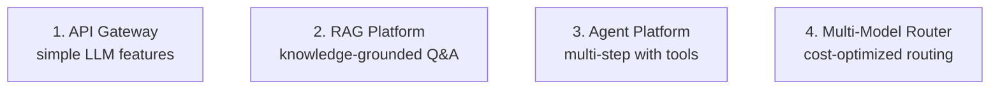

# 22 — Production AI MOC

> [!info] Running AI in production: architectures, reliability, security, scaling, patterns. Iteration 4 expanded this chapter with reference architectures, gateway/router patterns, guardrails, PII protection, and failure-mode handling.

## Reading Order

| #   | Note                                              | Sub-domain    | Purpose                                            |
|-----|---------------------------------------------------|---------------|----------------------------------------------------|
| 01  | [[01 - LLM Security and Prompt Injection]]        | Security      | The #1 production AI threat; defense in depth.     |
| 02  | [[02 - Reference Production Architectures]]       | Architecture  | Four canonical patterns.                           |
| 03  | [[03 - Gateway and Router Patterns]]              | Architecture  | Centralized control + model routing.               |
| 04  | [[04 - Guardrails]]                               | Security      | Input/output filtering frameworks.                 |
| 05  | [[05 - PII and Data Leakage]]                     | Security      | Three leakage paths + mitigations.                 |
| 06  | [[06 - Failure Modes and Graceful Degradation]]   | Reliability   | Fallbacks, circuit breakers, bulkheads.            |

## Sub-Domains

- [[22 - Production AI/Architecture/02 - Reference Production Architectures|Architecture]] — notes 02, 03
- [[22 - Production AI/Reliability/06 - Failure Modes and Graceful Degradation|Reliability]] — note 06
- [[22 - Production AI/Security/01 - LLM Security and Prompt Injection|Security]] — notes 01, 04, 05
- [[22 - Production AI/Scaling|Scaling]] — (planned)
- [[22 - Production AI/Patterns|Patterns]] — (covered in Architecture)

## The Four Reference Architectures

## Why This Matters for AI

- Production AI is 90% systems engineering, 10% model. The model is the easiest part; the surrounding infrastructure is where teams struggle.
- The gateway/router pattern decouples clients from providers, enabling multi-provider strategies and cost optimization.
- Guardrails are essential — LLMs hallucinate, leak data, and can be prompt-injected. Defense-in-depth is required.
- Graceful degradation (fallbacks, circuit breakers) is what separates production AI from demos. Without it, a single provider outage takes down the application.

## Production Implications

- **Start with the API Gateway pattern** for simple features; add RAG when knowledge grounding is needed.
- **Always have fallbacks**: single-provider setups fail completely on provider outage.
- **Implement guardrails from day one**: retrofitting safety is painful and risky.
- **Track PII**: compliance regulations (GDPR, HIPAA) require strict PII handling.
- **Plan for failure**: documented incident response, tested rollback, post-mortem culture.

## See Also

- [[20 - AI Infrastructure/MOC|20 AI Infrastructure]] — the infrastructure layer
- [[21 - LLMOps and MLOps/MOC|21 LLMOps]] — operations on top of infrastructure
- [[15 - AI Agents/MOC|15 AI Agents]] — agents in production need extra security
- [[04 - Guardrails]] — input/output filtering
- [[03 - Gateway and Router Patterns]] — centralized control
