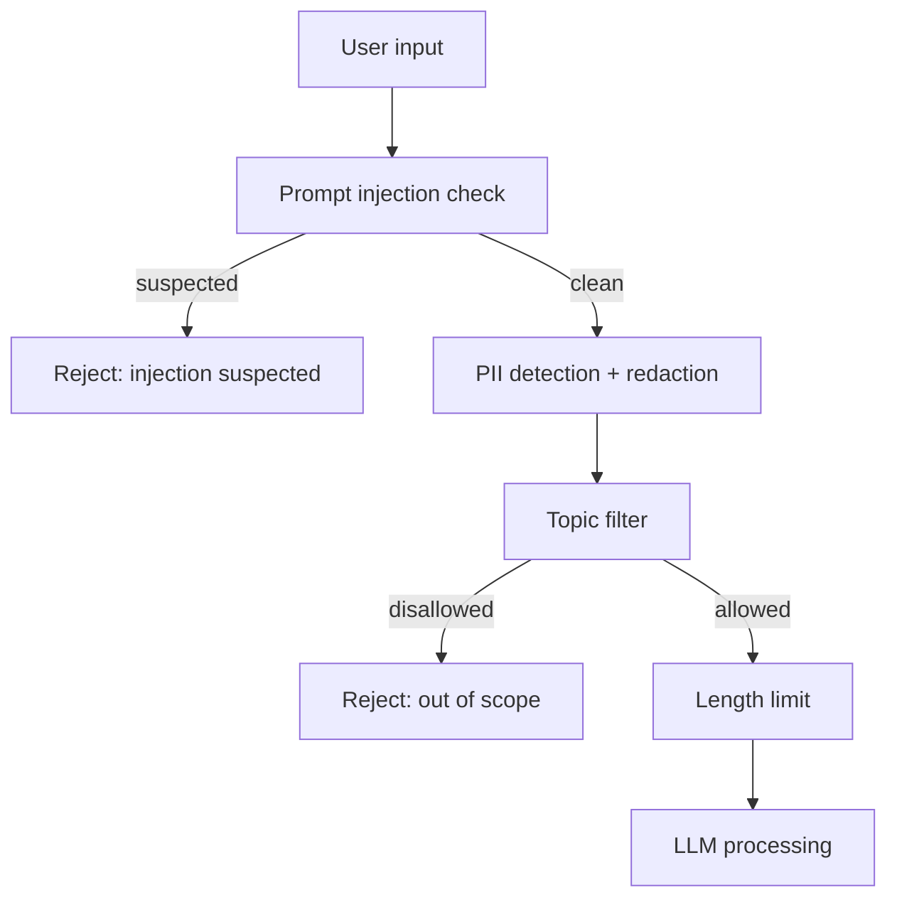
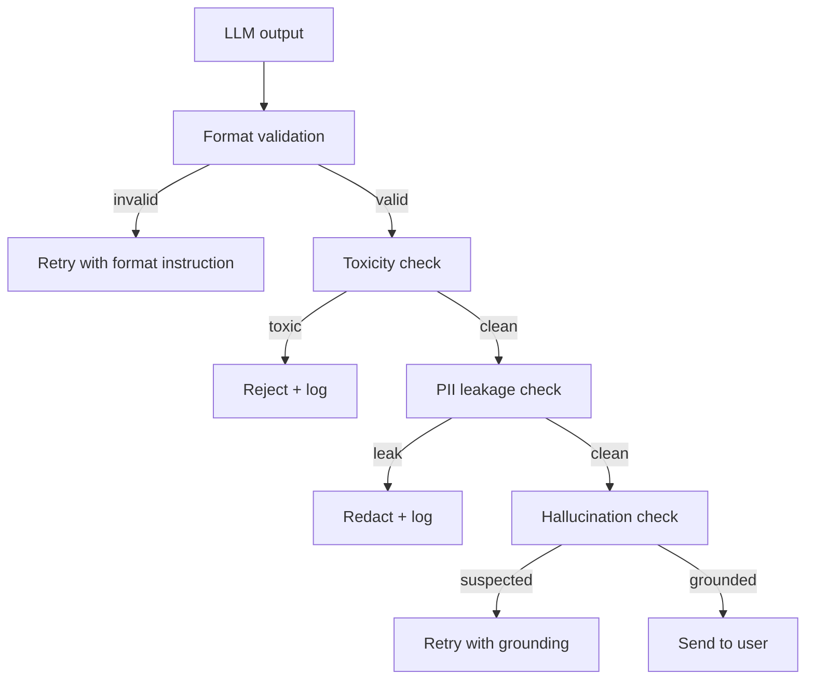

# 04 — Guardrails

> [!info] TL;DR
> Guardrails are input/output filters that enforce safety, format, and policy constraints on LLM applications. Input guardrails detect prompt injection, PII, and disallowed topics before the LLM sees the request. Output guardrails detect hallucination, toxicity, and policy violations before the response reaches the user. The two main frameworks are NeMo Guardrails (NVIDIA, open-source) and Guardrails AI (library with typed validators). Defense-in-depth — multiple guardrails at different layers — is essential because no single guardrail is sufficient.

## Why Guardrails

LLMs are unreliable by design: they hallucinate, they can be tricked by prompt injection, they produce toxic content, and they leak information from their context. In production, you cannot trust the LLM's output directly — you need filters that catch failures before they reach users.

Guardrails serve three purposes:
1. **Safety**: prevent harmful, toxic, or policy-violating outputs.
2. **Reliability**: enforce output format, catch hallucinations, validate facts.
3. **Compliance**: redact PII, enforce data residency, log for audit.

Without guardrails, a single bad output can cause real harm (medical misinformation, leaked PII, hate speech) and legal/compliance issues.

## Input vs. Output Guardrails

### Input Guardrails
Run *before* the LLM sees the request. They filter, transform, or reject the input.

**Common input guardrails**:
- **Prompt injection detection**: classify the input for known injection patterns ("ignore previous instructions", "system override", etc.).
- **PII detection and redaction**: detect SSNs, credit card numbers, emails, phone numbers; redact or hash before sending to the LLM.
- **Topic filtering**: reject queries about disallowed topics (medical advice, legal advice, weapons, etc.) based on your application's scope.
- **Length limiting**: truncate overly long inputs to control cost and prevent context overflow.
- **Language detection**: route non-supported languages or translate before processing.
- **Toxicity detection**: reject abusive or harassing inputs.



### Output Guardrails
Run *after* the LLM produces a response, before it reaches the user.

**Common output guardrails**:
- **Hallucination detection**: verify claims against retrieved documents (for RAG) or a knowledge base.
- **Toxicity detection**: classify the output for hate speech, harassment, explicit content.
- **PII leakage detection**: scan for PII that shouldn't be in the output (e.g., other users' data leaked via RAG).
- **Format validation**: ensure the output matches the expected schema (JSON, specific fields, length constraints).
- **Fact-checking**: verify factual claims against trusted sources.
- **Sentiment / tone filtering**: ensure the output meets tone guidelines (professional, empathetic, etc.).
- **Citation verification**: for RAG, verify that cited sources actually support the claims.



## Guardrail Frameworks

### NeMo Guardrails (NVIDIA)
Open-source framework for adding programmable guardrails to LLM applications. Uses Colang (a domain-specific language) to define guardrail flows.

**Key features**:
- **Colang flows**: declarative definitions of input/output checks and actions.
- **Pre-built guardrails**: topic control, jailbreak detection, hallucination prevention, moderation.
- **Integration**: works with LangChain, LlamaIndex, OpenAI SDK.
- **Action executors**: custom Python functions for complex checks.

```python
# Example NeMo Guardrails config
define user ask medical advice
  "How should I treat my illness?"
  "What medicine should I take?"

define bot refuse medical advice
  "I'm not able to provide medical advice. Please consult a healthcare professional."

define flow medical advice
  user ask medical advice
  bot refuse medical advice
```

**Use case**: enterprise applications needing fine-grained control over conversation flows and topic restrictions.

### Guardrails AI
Open-source Python library with typed validators for common guardrail patterns.

**Key features**:
- **Validators**: pre-built checks (toxicity, PII, hallucination, format, length, regex).
- **Custom validators**: write your own with a simple decorator.
- **Schemas**: define expected output structure; guardrails validate against it.
- **Retry logic**: if validation fails, automatically retry with corrective instructions.

```python
from guardrails import Guard
from guardrails.hub import ToxicLanguage, PIIFilter

guard = Guard().use_many(
    ToxicLanguage(threshold=0.5, on_fail="fix"),
    PIIFilter(pii_entities=["EMAIL_ADDRESS", "PHONE_NUMBER"], on_fail="filter"),
)

response = guard(
    llm_api=openai.chat.completions.create,
    model="gpt-4o-mini",
    messages=[{"role": "user", "content": user_input}],
)
```

**Use case**: applications needing programmatic guardrails with automatic retry.

### Llama Guard (Meta)
A fine-tuned Llama model specifically for safety classification. Classifies inputs and outputs as safe or unsafe across categories (violence, hate, sexual content, etc.).

**Use case**: lightweight safety filtering, especially for open-source deployments.

### OpenAI Moderation API
Free API that classifies content for hate, harassment, sexual content, violence, self-harm. Fast and reliable for English content.

**Use case**: simple toxicity filtering for OpenAI-based applications.

### Custom Guardrails
Many production teams build custom guardrails tailored to their domain:
- **Domain-specific fact-checkers**: verify claims against internal knowledge bases.
- **Compliance filters**: enforce industry-specific regulations (HIPAA, GDPR, FINRA).
- **Brand voice validators**: ensure outputs match brand tone and style guidelines.

## Defense-in-Depth

No single guardrail is sufficient. Production systems use multiple layers:

1. **Input layer**: prompt injection detection, PII redaction, topic filtering.
2. **LLM layer**: system prompt with safety instructions, function calling constraints, tool use limits.
3. **Output layer**: toxicity detection, hallucination checking, format validation.
4. **Application layer**: business logic validation, user confirmation for high-stakes actions.
5. **Monitoring layer**: content sampling, LLM-as-judge quality monitoring, alerting on anomalies.

Each layer catches different failure modes. Prompt injection might bypass the input filter but get caught by the output toxicity check. Hallucination might pass the format check but fail the fact-checker. Multiple layers ensure that failures in one guardrail don't reach the user.

## Common Guardrail Patterns

### The "Safe Response" Pattern
When a guardrail triggers, don't just reject — provide a safe fallback response:
- Injection detected: "I can only help with [topic]. How can I assist you with that?"
- Hallucination detected: "I'm not confident in my answer. Could you rephrase or provide more context?"
- Toxicity detected: "I can't help with that. Let's talk about something else."

This is much better than a bare error message, which frustrates users.

### The "Retry with Correction" Pattern
When an output fails validation (e.g., wrong format, contains PII), retry the LLM call with corrective instructions:
- Format failure: "Your response must be valid JSON. Please retry."
- PII failure: "Your response contained personal information. Please retry without including PII."

This often succeeds on the second try without user-visible failure.

### The "Human Review" Pattern
For high-stakes outputs (medical, legal, financial), route flagged responses to a human reviewer before sending to the user. Adds latency but ensures safety for critical applications.

### The "Citation Requirement" Pattern
For RAG applications, require the model to cite sources. If a claim lacks a citation, or the citation doesn't support the claim, reject or retry. This dramatically reduces hallucination.

## Limitations

### Guardrails Add Latency
Each guardrail adds latency (typically 50–500ms). With 5 guardrails, that's 250ms–2.5s of overhead. Balance thoroughness with latency requirements.

### Guardrails Can Be Bypassed
Sophisticated prompt injection can sometimes bypass input filters. Always combine with output guardrails and monitoring.

### False Positives
Overly strict guardrails reject legitimate inputs, frustrating users. Tune thresholds based on real traffic.

### Maintenance Burden
Guardrails need continuous tuning as new attack patterns emerge and application requirements change. Budget ongoing engineering effort.

### Cost
Some guardrails (LLM-based fact-checking, hallucination detection) require additional LLM calls, adding cost. Use cheaper models for guardrails when possible.

## See Also

- [[01 - LLM Security and Prompt Injection]]
- [[02 - Reference Production Architectures]]
- [[03 - Gateway and Router Patterns]]
- [[05 - PII and Data Leakage]]
- [[06 - Failure Modes and Graceful Degradation]]
- [[22 - Production AI/MOC|22 Production AI MOC]]
