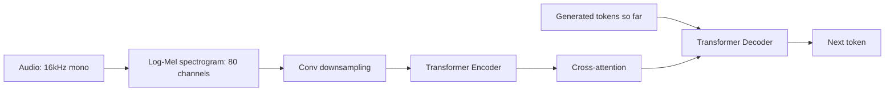

# 04 — Whisper

> [!info] TL;DR
> Whisper is OpenAI's speech-to-text model, trained on 680,000 hours of multilingual audio-transcript pairs scraped from the web. It uses a standard encoder-decoder Transformer, with the audio converted to a log-Mel spectrogram as input. Whisper achieves near-human accuracy on speech recognition across 99 languages, with strong robustness to accents, background noise, and technical jargon. It became the default open-source ASR model and is deployed in production by countless applications.

## Citation

Radford, A., Kim, J. W., Xu, T., Brockman, G., McLeavey, C., & Sutskever, I. (2023). *Robust Speech Recognition via Large-Scale Weak Supervision*. ICML 2023. arXiv:2212.04356.

## The Problem Being Solved

Before Whisper, automatic speech recognition (ASR) was dominated by specialized models trained on narrow datasets (LibriSpeech, Common Voice). These models:
- Worked well on clean, accented-less English.
- Failed on accents, background noise, or non-standard speech.
- Required language-specific models for each language.
- Needed fine-tuning for domain-specific vocabulary (medical, legal, technical).

The fundamental issue: supervised ASR data is expensive to collect (human transcribers), so datasets were small and narrow. This limited model capability and robustness.

Whisper's approach: use **weak supervision** from web data. Millions of hours of audio on YouTube, podcasts, and other platforms come with transcripts (subtitles, captions). These transcripts are noisy (auto-generated, incomplete, mistimed), but they're free and cover diverse languages, accents, and topics. By training on this large, diverse, noisy dataset, Whisper learned robust speech recognition without expensive human-labeled data.

## The Architecture

Whisper uses a standard encoder-decoder Transformer — no novel architecture, just scale and data.

### Input Processing
1. **Audio sampling**: 16 kHz mono audio.
2. **Spectrogram conversion**: compute an 80-channel log-Mel spectrogram with 10ms windows.
3. **Convolutional downsampling**: two conv layers reduce the spectrogram length by 2× (to 50ms per frame).
4. **Positional encoding**: sinusoidal, added to the spectrogram features.

### Encoder
A standard Transformer encoder (no vision or audio-specific components). Takes the spectrogram sequence and produces hidden states.

| Model    | Encoder Layers | Decoder Layers | Hidden | Heads | Params |
|----------|----------------|----------------|--------|-------|--------|
| Tiny     | 4              | 4              | 384    | 6     | 39M    |
| Base     | 6              | 6              | 512    | 8     | 74M    |
| Small    | 12             | 12             | 768    | 12    | 244M   |
| Medium   | 24             | 24             | 1024   | 16    | 769M   |
| Large    | 32             | 32             | 1280   | 20    | 1550M  |
| Large-v2 | 32             | 32             | 1280   | 20    | 1550M  |
| Large-v3 | 32             | 32             | 1280   | 20    | 1550M  |

### Decoder
A standard Transformer decoder. Takes the encoder's hidden states (via cross-attention) and the previously-generated tokens (via self-attention), and generates the transcript autoregressively.

Special tokens control behavior:
- `<|startoftranscript|>` — begins generation.
- `<|en|>` (or other language codes) — sets the output language.
- `<|translate|>` — translates non-English audio to English text.
- `<|transcribe|>` — transcribes in the original language.
- `<|notimestamps|>` or timestamp tokens — controls timestamp generation.

## The Multitask Format

Whisper frames ASR as a multitask problem. The decoder's first tokens determine the task:

- **Transcription**: `<|en|> <|transcribe|> <|notimestamps|> [transcript]`
- **Translation**: `<|en|> <|translate|> <|notimestamps|> [English translation]`
- **Language ID**: `<|startoftranscript|> [detected language code] ...`
- **Timestamps**: include timestamp tokens to align transcript with audio.

This unified format means a single model handles transcription, translation, language identification, and timestamping — all through the decoder's token sequence.

## Training Data

680,000 hours of audio-transcript pairs:
- 438,000 hours of English audio (YouTube, podcasts).
- 242,000 hours of audio in 98 other languages.

The data is "weakly supervised" — transcripts are auto-generated or crowd-sourced, not professionally transcribed. This means:
- Some transcripts are inaccurate or incomplete.
- Some audio-transcript pairs are misaligned.
- Quality varies wildly across the dataset.

Whisper's robustness comes from this diversity: the model sees enough varied (if noisy) data to generalize across accents, noise conditions, and languages.

## Key Results

Whisper achieved state-of-the-art zero-shot ASR performance:

| Benchmark                | Previous SOTA | Whisper Large |
|--------------------------|---------------|---------------|
| LibriSpeech (WER)        | 1.8%          | 1.9%          |
| Common Voice (WER, avg)  | ~15%          | 9.1%          |
| Fleurs (WER, avg)        | ~20%          | 11.2%         |
| CallHome (WER)           | ~30%          | 19.4%         |

Key observations:
- On clean English (LibriSpeech), Whisper matched specialized models.
- On noisy/multilingual data (Common Voice, Fleurs, CallHome), Whisper significantly outperformed specialized models. This is where the diverse training data paid off.
- Whisper achieved usable accuracy on languages with very little training data (low-resource languages), demonstrating transfer from related languages.

## Why It Worked

### Scale and Diversity of Data
680K hours of audio across 99 languages provided enough diversity for the model to learn robust speech recognition. The noise in the data was outweighed by the coverage.

### Weak Supervision Sufficient
The transcripts didn't need to be perfect — they needed to be "good enough" on average. The model learned to recognize speech patterns from the audio, with the transcripts providing the target signal. Noisy targets degraded quality somewhat, but the scale compensated.

### Standard Architecture, No Specialized Components
Whisper's architecture is a vanilla Transformer encoder-decoder. No specialized audio processing (beyond the spectrogram), no specialized attention mechanisms. The simplicity made the model easy to train, deploy, and fine-tune.

### Multitask Format
The token-based multitask format let one model handle transcription, translation, and language ID. This unified approach is more efficient than training separate models for each task.

## Limitations

### No Real-Time Streaming (Originally)
Whisper processes the entire audio at once. Real-time applications (live transcription, voice assistants) require streaming adaptations. Faster-Whisper and whisper.cpp added streaming support.

### Hallucination
On silent or noisy audio, Whisper can "hallucinate" transcripts — generating text that wasn't spoken. This is a known issue with the model.

### Language-Specific Quality
While Whisper covers 99 languages, quality varies dramatically. English and other high-resource languages have low WER; low-resource languages (African, indigenous) have much higher WER.

### Domain Shift
Whisper trained on web data may underperform on highly specialized domains (medical dictation, legal proceedings) with domain-specific vocabulary. Fine-tuning on domain data addresses this.

### 30-Second Segments
Whisper processes audio in 30-second chunks. Long files require chunking, which can cause boundary artifacts. Specialized chunking strategies (VAD-based, sliding window) mitigate this.

## Successors and Variants

### Whisper Large-v2, v3
Improved training data and slight architectural tweaks. Better performance on more languages.

### Faster-Whisper
CTranslate2-based implementation. 4× faster than the original, with minimal quality loss. The standard for production deployment.

### whisper.cpp
C++ implementation by Georgi Gerganov (creator of llama.cpp). Runs on CPU, including mobile devices. Enables on-device ASR.

### Distil-Whisper
Distilled versions that are 6× faster with ~1% WER increase. For high-throughput applications.

### WhisperX
Adds word-level timestamps, speaker diarization, and improved accuracy via forced alignment with phoneme models.

## Impact and Legacy

Whisper transformed speech recognition:

1. **Default open-source ASR**. Whisper is the standard for open-source speech recognition. Most applications that need ASR use Whisper or a derivative.

2. **Multilingual ASR accessible**. Before Whisper, multilingual ASR required language-specific models. Whisper made 99 languages accessible from a single model.

3. **Enabled voice applications**. Voice assistants, transcription services, podcast indexing, video subtitle generation — all became dramatically better and cheaper with Whisper.

4. **On-device ASR**. whisper.cpp and similar implementations run on phones and laptops, enabling privacy-preserving voice processing without cloud dependency.

5. **Weak supervision as a paradigm**. Whisper demonstrated that weakly supervised training on web data can match or exceed fully supervised training, given enough scale. This influenced other domains (vision, text) to leverage web-scale noisy data.

For AI engineers, Whisper is the go-to ASR model. If you need speech-to-text in an application, Whisper (specifically Faster-Whisper or whisper.cpp) is almost certainly the right choice. Understanding Whisper clarifies how to deploy ASR, what performance to expect, and how to handle multilingual or domain-specific needs.

## Further Reading

- Original paper: arXiv:2212.04356
- Faster-Whisper: github.com/SYSTRAN/faster-whisper
- whisper.cpp: github.com/ggerganov/whisper.cpp
- Distil-Whisper: arXiv:2310.16086

## See Also

- [[01 - Multimodal AI Overview]]
- [[06 - Cross-Modal Attention]]
- [[02 - Vaswani Attention Is All You Need 2017]]
- [[23 - Multimodal AI/MOC|23 Multimodal MOC]]
