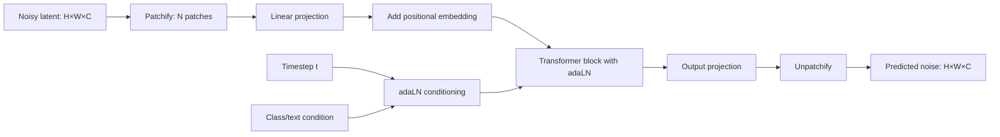

# 05 — DiT and FLUX

> [!info] TL;DR
> DiT (Diffusion Transformer) replaced the U-Net (the standard diffusion model backbone) with a Transformer architecture, showing that Transformers work for diffusion-based image generation. FLUX (Black Forest Labs, 2024) scaled this approach with flow matching and produced state-of-the-art text-to-image quality. Together, DiT and FLUX established that the same Transformer architecture that dominates text and vision also dominates image generation — unifying the field around a single architecture.

## DiT (Peebles & Xie, 2023)

### Citation
Peebles, W., & Xie, S. (2023). *Scalable Diffusion Models with Transformers*. ICCV 2023. arXiv:2212.09748.

### The Problem Being Solved
Diffusion models (DDPM, Stable Diffusion) used U-Net architectures — convolutional networks with skip connections between encoder and decoder layers. U-Nets worked well but had two limitations:
1. **Architecture-specific**: U-Nets are designed for dense prediction (images), not general sequence modeling. Architectural improvements (better attention, scaling laws) developed for Transformers didn't transfer.
2. **Scaling uncertainty**: it was unclear how U-Nets scale. Do they follow predictable scaling laws like Transformers? Can you train a 10× larger U-Net and expect proportional quality improvement?

DiT asked: what if you replace the U-Net with a Transformer? The patch-based approach from ViT makes this straightforward — treat the noisy image (during diffusion) as a sequence of patches, process with a Transformer, predict the noise.

### The Architecture
DiT is a Transformer that operates on noisy image latents:

1. **Input**: the noisy latent (from the diffusion forward process), shape `(H, W, C)`.
2. **Patchify**: split into patches (typically 2×2 or 4×4), flatten, linearly project to `d_model`. Same as ViT.
3. **Positional embedding**: added to patch tokens.
4. **Conditioning**: the diffusion timestep and class/text conditioning are injected via adaptive layer norm (adaLN) — the conditioning vector predicts scale and shift parameters for each LayerNorm.
5. **Transformer blocks**: standard Transformer encoder layers (self-attention + MLP).
6. **Output**: linear projection back to patch shape, unpatchify to the predicted noise.



### Key Design Choice: adaLN Conditioning
Standard LayerNorm applies fixed scale and shift. adaLN (adaptive Layer Norm) makes these parameters functions of the conditioning (timestep, class, text):

```
adaLN(h, c) = γ(c) · LayerNorm(h) + β(c)
```

where `γ(c)` and `β(c)` are predicted from the conditioning vector `c` via an MLP. This lets the model modulate its activations based on the diffusion timestep and conditioning — essential for diffusion, where the model must behave differently at different noise levels.

### Key Results
DiT-XL/2 (the largest variant) achieved SOTA on class-conditional ImageNet generation (FID 2.27), beating prior U-Net-based diffusion models. More importantly, DiT showed clean scaling laws: larger models + more compute = better quality, following predictable power laws. This was the key finding — DiT scales like a Transformer, unlike U-Nets which had unclear scaling.

### Why It Worked

**Transformer scaling laws apply**. DiT demonstrated that Transformers scale for diffusion, just as they do for text and vision. This enabled principled capacity planning — you could predict how good a 10× larger model would be.

**adaLN is effective conditioning**. The adaLN mechanism provided a clean way to inject conditioning without modifying the Transformer architecture. This became the standard conditioning approach for diffusion Transformers.

**Patchification reuses ViT infrastructure**. Treating images as patches (like ViT) meant all the ViT research (positional encodings, scaling, data augmentation) transferred to DiT.

## FLUX (Black Forest Labs, 2024)

### The Problem Being Solved
Stable Diffusion 3 and earlier text-to-image models used U-Nets or hybrid architectures. The DiT paper showed Transformers work for class-conditional generation, but it wasn't clear they would work for text-to-image (which requires complex text conditioning). FLUX demonstrated that a pure Transformer architecture, scaled up and trained with flow matching, achieves SOTA text-to-image quality.

### Architecture
FLUX is a MMDiT (Multimodal Diffusion Transformer):
- **Image tokens**: the noisy latent is patchified into tokens (like DiT).
- **Text tokens**: the text prompt is encoded by a text encoder (T5 or CLIP) and tokenized.
- **Joint processing**: image and text tokens are processed together in the same Transformer (via cross-attention or mixed self-attention).
- **Flow matching**: instead of standard diffusion (predict noise), FLUX uses flow matching (predict a velocity vector field). Flow matching has better theoretical properties and trains faster.

### Key Results
FLUX.1 [dev] (12B parameters) achieved state-of-the-art text-to-image quality, matching or exceeding DALL-E 3, Midjourney v6, and Stable Diffusion 3. FLUX.1 [schnell] is a 4-step distilled version for fast generation.

FLUX was released as open weights, making it the strongest open-source text-to-image model as of 2024.

### Why It Worked

**Scale**. FLUX is 12B parameters — much larger than typical U-Net diffusion models (~1B). The scaling laws DiT identified held: larger model = better quality.

**Flow matching**. Flow matching is a more principled training objective than standard diffusion. It converges faster and produces better samples.

**Joint multimodal processing**. Processing image and text tokens in the same Transformer (rather than separate encoders with cross-attention) allows richer interaction between modalities.

**Strong text encoder**. Using T5 (a powerful text encoder) for the text prompt gives FLUX strong text understanding, which translates to better adherence to complex prompts.

## Comparison: U-Net vs. Diffusion Transformer

| Aspect                | U-Net (Stable Diffusion 1/2) | DiT/FLUX             |
|-----------------------|------------------------------|----------------------|
| Architecture          | Convolutional + attention    | Pure Transformer     |
| Scaling               | Unclear                      | Power-law (predictable) |
| Conditioning          | Cross-attention              | adaLN + cross-attention |
| Text encoder          | CLIP                         | T5 + CLIP            |
| Training objective    | Diffusion (predict noise)    | Diffusion or flow matching |
| Maximum scale tested  | ~1B parameters               | 12B (FLUX)           |
| State-of-the-art      | SDXL (2023)                  | FLUX, SD3 (2024)     |

## Impact and Legacy

DiT and FLUX established Transformers as the default architecture for diffusion-based image generation:

1. **Stable Diffusion 3** uses an MMDiT architecture, directly influenced by DiT.
2. **Sora** (OpenAI's video generation model) uses a DiT-based architecture, scaled to video.
3. **FLUX** is the leading open-source text-to-image model, used in production by many applications.
4. **Unified architecture**. The same Transformer architecture now dominates text (GPT, Llama), vision (ViT), and image generation (DiT, FLUX). This unification simplifies research and infrastructure.

For AI engineers, DiT/FLUX matters if you're working with image generation. Understanding the architecture clarifies how text-to-image models work, why they scale, and how to fine-tune or modify them. The shift from U-Net to Transformer also means that techniques developed for text Transformers (FlashAttention, quantization, efficient inference) apply to image generation.

## Further Reading

- DiT paper: arXiv:2212.09748
- FLUX: blackforestlabs.ai (model weights on HuggingFace)
- Stable Diffusion 3: arXiv:2403.03206
- Flow Matching: arXiv:2210.02747

## Diffusion Mathematics (Refresher)

Standard diffusion (DDPM): given data $\mathbf{x}_0$, the forward process adds Gaussian noise over $T$ steps:

$$
q(\mathbf{x}_t | \mathbf{x}_0) = \mathcal{N}(\mathbf{x}_t; \sqrt{\bar{\alpha}_t} \mathbf{x}_0, (1 - \bar{\alpha}_t) \mathbf{I})
$$

The model learns to predict the noise $\epsilon$ that was added, allowing reverse denoising:

$$
\mathbf{x}_{t-1} = \frac{1}{\sqrt{\alpha_t}} \left( \mathbf{x}_t - \frac{1 - \alpha_t}{\sqrt{1 - \bar{\alpha}_t}} \epsilon_\theta(\mathbf{x}_t, t) \right) + \sigma_t \mathbf{z}
$$

where $\epsilon_\theta$ is the neural network (DiT in our case). Training loss:

$$
\mathcal{L} = \mathbb{E}_{t, \mathbf{x}_0, \epsilon} \left[ \| \epsilon - \epsilon_\theta(\mathbf{x}_t, t, \mathbf{c}) \|^2 \right]
$$

where $\mathbf{c}$ is the conditioning (text prompt, class).

## Flow Matching vs. Standard Diffusion

FLUX uses **flow matching** instead of standard diffusion. The key difference:

**Standard diffusion**: learns to predict the noise $\epsilon$ at each step. Reverse process is iterative denoising.

**Flow matching**: learns a velocity field $\mathbf{v}_\theta(\mathbf{x}_t, t)$ that defines a continuous-time flow from noise to data. The ODE is:

$$
\frac{d\mathbf{x}}{dt} = \mathbf{v}_\theta(\mathbf{x}_t, t)
$$

Training: minimize $\| \mathbf{v}_\theta(\mathbf{x}_t, t) - (\mathbf{x}_1 - \mathbf{x}_0) \|^2$ where $\mathbf{x}_t = (1-t) \mathbf{x}_0 + t \mathbf{x}_1$ (linear interpolation between data $\mathbf{x}_0$ and noise $\mathbf{x}_1$).

**Why flow matching is better**:
1. Simpler training objective (no noise schedule to tune).
2. Better theoretical properties (optimal transport interpretation).
3. Fewer steps needed for sampling (FLUX-schnell does 4 steps vs. 20-50 for standard diffusion).
4. More stable training at scale.

Most 2024+ diffusion models (FLUX, SD3, Stable Cascade) use flow matching or variants.

## adaLN-Zero Initialization

A critical detail in DiT: the adaLN layers use **zero initialization**. The MLP that predicts $\gamma$ and $\beta$ from the conditioning is initialized so that the initial output is exactly 0. This means:
- At initialization, every DiT block is the identity function.
- The model starts as a simple linear projection (patch embed → unpatch).
- Gradient flows cleanly through the residual connections.
- Training is more stable than random initialization.

This trick is essential for stable DiT training at scale. Without it, early training is unstable and quality suffers.

## Scaling Laws for DiT (Detailed)

DiT demonstrated clean scaling laws. The relationship between compute $C$ (FLOPs) and validation loss $L$ is approximately:

$$
L(C) = a C^{-b} + L_\infty$$

where $a$, $b$, and $L_\infty$ are fitted constants. For DiT on ImageNet, $b \approx 0.3$ — meaning 10× more compute gives ~50% loss reduction.

This predictability is the key finding. It means:
- You can predict how good a 10× larger DiT will be without training it.
- Compute-optimal training (when to stop) is well-defined.
- Architecture comparisons are easier — train at small scale, predict at large scale.

These scaling laws generalize to text-to-image (FLUX) and video (Sora). The unified Transformer scaling law (text, vision, image generation, video) is one of the most important empirical findings of 2023-2026.

## Latent Diffusion: Why DiT Operates on Latents, Not Pixels

FLUX and SD3 operate on **latent** representations, not raw pixels. The pipeline:

1. **VAE encoder**: compress 512×512×3 image → 64×64×4 latent (compression: 48×).
2. **DiT operates on latent**: process 64×64 = 4096 latent tokens with Transformer.
3. **VAE decoder**: decompress 64×64×4 latent → 512×512×3 image.

Why latents?
- **Efficiency**: 4096 tokens vs. 196K pixels (48× reduction).
- **Quality**: the VAE learns a semantically meaningful latent space; diffusion in this space is more efficient.
- **Memory**: 4 channels vs. 3 channels (with spatial compression, net memory reduction).

This is the **latent diffusion** innovation (Rombach et al. 2022, Stable Diffusion). DiT applies it to Transformers; FLUX scales it up.

## Worked Example: Generating an Image with FLUX

```python
import torch
from diffusers import FluxPipeline

pipe = FluxPipeline.from_pretrained(
    "black-forest-labs/FLUX.1-dev",
    torch_dtype=torch.bfloat16,
    device_map="auto",
)

prompt = "A serene mountain landscape at sunset, with a lake in the foreground reflecting the orange and pink sky. The mountains are snow-capped. High detail, photorealistic."

image = pipe(
    prompt,
    num_inference_steps=28,  # standard for FLUX-dev
    guidance_scale=3.5,      # FLUX-specific; lower than SD
    height=1024,
    width=1024,
    generator=torch.Generator("cuda").manual_seed(42),
).images[0]

image.save("mountain_sunset.png")
```

Notable FLUX-specific settings:
- `guidance_scale=3.5`: FLUX uses lower guidance than SD (which typically uses 7-10). Higher values burn out details.
- `num_inference_steps=28`: FLUX-dev converges in 20-30 steps (vs. 30-50 for SD).
- For FLUX-schnell (4-step distilled): `num_inference_steps=4`, `guidance_scale=0`.

## Fine-Tuning Diffusion Transformers

Common fine-tuning techniques for DiT/FLUX:

| Technique                | What It Does                              | Compute Needed |
|--------------------------|-------------------------------------------|----------------|
| LoRA fine-tune           | Add low-rank adapters to DiT layers       | 1-8 GPUs, hours |
| Textual Inversion        | Learn a new token for a concept           | 1 GPU, minutes |
| DreamBooth               | Fine-tune on a few images of a subject    | 1-8 GPUs, hours |
| ControlNet               | Add conditioning (pose, depth, edges)     | 8+ GPUs, days  |
| Full fine-tune           | Update all DiT weights                    | 32+ GPUs, days |

LoRA is the most popular — it lets you add a style or subject to FLUX with 5-20 reference images in a few hours on a single H100. The LoRA adapter is ~100MB and can be shared/loaded independently of the base model.

## Comparison of Image Generation Models (2026)

| Model              | Year | Architecture       | Params | Open? | Strengths                              |
|--------------------|------|--------------------|--------|-------|----------------------------------------|
| Stable Diffusion 1.5 | 2022 | U-Net + CLIP       | 870M   | Yes   | First major open model; huge ecosystem |
| SDXL               | 2023 | U-Net + dual CLIP  | 3.5B   | Yes   | Better quality than SD1.5              |
| Stable Diffusion 3 | 2024 | MMDiT              | 2-8B   | Yes   | Better text rendering, DiT-based       |
| FLUX.1-dev         | 2024 | MMDiT + flow match | 12B    | Yes   | SOTA open text-to-image                |
| FLUX.1-schnell     | 2024 | Distilled FLUX     | 12B    | Yes   | 4-step fast generation                 |
| DALL-E 3            | 2023 | Unknown (closed)   | Unknown| No    | Strong prompt adherence via GPT rewrite|
| Midjourney v6       | 2024 | Unknown (closed)   | Unknown| No    | Best aesthetic quality                 |
| Imagen 3            | 2024 | Unknown (closed)   | Unknown| No    | Strong text understanding              |

For most open-source users in 2026, FLUX-dev is the default. Midjourney leads on aesthetics; DALL-E 3 leads on prompt adherence; FLUX leads on overall open-source quality.

## Connection to Other Concepts

- [[07 - Transformers/Variants/13 - Vision Transformer ViT|ViT]] — DiT's patchify is borrowed from ViT.
- [[23 - Multimodal AI/Vision-Language/02 - CLIP|CLIP]] — provides text conditioning for FLUX.
- [[23 - Multimodal AI/Vision-Language/01 - Multimodal AI Overview|Multimodal Overview]] — broader multimodal context.
- [[24 - Research Frontiers/State Space Models/01 - SSMs Mamba and Frontiers|SSMs/Mamba]] — alternative to attention for diffusion.
- [[12 - Fine-Tuning/PEFT/01 - LoRA|LoRA]] — standard fine-tuning technique for DiT/FLUX.
- [[13 - Inference/Quantization/03 - Quantization|Quantization]] — INT8/FP8 quantization for FLUX inference.

## Interview Questions

1. **Q: What is adaLN, and why is it needed for diffusion Transformers?**
   A: adaLN (adaptive Layer Norm) makes the LayerNorm's scale and shift parameters functions of the conditioning (timestep, class, text). Needed because diffusion models must behave differently at different noise levels — early denoising steps focus on global structure, late steps on detail. adaLN lets the model modulate its activations based on the timestep, which cross-attention alone can't do efficiently.

2. **Q: Why does DiT scale better than U-Net for diffusion?**
   A: Three reasons. (1) Transformers have well-understood scaling laws (predictable improvement with more compute); U-Nets had unclear scaling. (2) DiT reuses ViT infrastructure (patchify, positional embeddings, attention mechanisms); improvements in vision Transformers transfer directly. (3) DiT's architecture is uniform (all Transformer blocks), making it easier to optimize for hardware (FlashAttention, tensor parallelism). U-Net's heterogeneous structure (encoder, decoder, skip connections) is harder to optimize.

3. **Q: What is flow matching, and why does FLUX use it instead of standard diffusion?**
   A: Flow matching learns a velocity field that defines a continuous-time ODE from noise to data, instead of predicting noise at discrete timesteps. Better because (1) simpler training objective, (2) better theoretical properties (optimal transport), (3) fewer sampling steps needed (4 steps for FLUX-schnell vs. 20-50 for standard diffusion), (4) more stable training at scale. Most 2024+ diffusion models use flow matching.

4. **Q: Why does FLUX operate on latents, not pixels?**
   A: Latent diffusion (Rombach 2022) compresses images via a VAE before diffusion. 512×512×3 image → 64×64×4 latent (48× compression). Benefits: (1) efficiency (4096 tokens vs. 196K pixels), (2) quality (VAE learns semantically meaningful space), (3) memory (4 channels vs. 3 + spatial compression). All modern diffusion models (SD, FLUX, SD3) use latent diffusion.

5. **Q: How would you fine-tune FLUX to generate images in a specific style?**
   A: LoRA fine-tuning. Collect 10-50 high-quality images in the target style. Caption each image. Train LoRA adapters (rank 16-64) on FLUX's attention layers for 1000-5000 steps with the images and captions. The resulting LoRA (~100MB) can be loaded on top of FLUX at inference time: `pipe.load_lora_weights("my-style-lora")`. This gives you FLUX-quality images in your style without retraining the 12B base model.

6. **Q: What's the significance of DiT's clean scaling laws?**
   A: They show that diffusion models, like text Transformers, scale predictably with compute. This enables principled capacity planning (predict how good a 10× larger model will be without training it), architecture comparison (train at small scale, predict at large scale), and unified understanding (same scaling laws apply to text, vision, image generation, video). The unified Transformer scaling law is one of the most important empirical findings of 2023-2026.

## See Also

- [[01 - Multimodal AI Overview]]
- [[21 - Vision Transformer ViT 2020]]
- [[06 - Cross-Modal Attention]]
- [[02 - CLIP]]
- [[23 - Multimodal AI/MOC|23 Multimodal MOC]]