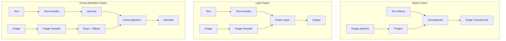

# 06 — Cross-Modal Attention

> [!info] TL;DR
> Cross-modal attention is the mechanism by which a model in one modality (e.g., text) attends to representations in another modality (e.g., image). The three fusion patterns are: **early fusion** (combine raw features before processing), **late fusion** (process modalities separately, combine at the end), and **cross-attention fusion** (use one modality's tokens as queries, another's as keys/values). Cross-attention is the dominant pattern in modern multimodal LLMs — it's how vision-language models, video-language models, and audio-language models integrate information.

## The Problem Being Solved

Multimodal models must combine information from different modalities (text, image, audio, video). The modalities have different:
- **Dimensionalities**: text is discrete tokens; images are continuous pixels or patch embeddings; audio is spectrograms.
- **Spatial structures**: text is 1D sequences; images are 2D grids; video is 3D (space + time).
- **Information densities**: a single image token carries more information than a single text token.

The question: how do you fuse these different representations into a single coherent model?

## The Three Fusion Patterns

### 1. Early Fusion
Combine raw features from different modalities before any processing.

```
text_features = tokenize(text)
image_features = patchify(image)
combined = concat(text_features, image_features)
output = transformer(combined)
```

**Example**: LLaVA. CLIP image embeddings are projected and concatenated with text tokens, then processed by a single LLM.

**Pros**:
- Simple architecture (one Transformer processes everything).
- Maximum interaction — modalities can influence each other from the start.
- Efficient (no separate encoders for each modality after the initial projection).

**Cons**:
- Requires aligned representations from the start. If the vision encoder produces poor embeddings, the LLM can't recover.
- Less modular — hard to swap out one modality's encoder independently.

### 2. Late Fusion
Process each modality separately, combine only at the final layer.

```
text_features = text_encoder(text)
image_features = image_encoder(image)
combined = fusion_layer(text_features, image_features)
output = classifier(combined)
```

**Example**: classical multimodal classifiers (visual question answering with separate vision and language models).

**Pros**:
- Modular — each encoder can be improved independently.
- Each modality is processed by a specialized model.
- Easy to add new modalities (just add another encoder).

**Cons**:
- Limited cross-modal interaction — modalities only meet at the end.
- Cannot leverage fine-grained alignments (e.g., "this word refers to that image region").
- Larger total parameter count (separate encoder per modality).

### 3. Cross-Attention Fusion
Use one modality's tokens as queries, another's as keys and values. This is the standard attention mechanism applied across modalities.

```
text_features = text_encoder(text)        # N_text tokens
image_features = image_encoder(image)      # N_image tokens

# Cross-attention: text queries attend to image keys/values
attended = cross_attention(
    Q=text_features,  # queries from text
    K=image_features,  # keys from image
    V=image_features,  # values from image
)  # N_text tokens, each enriched with relevant image info

output = decoder(attended)
```

**Example**: Flamingo, BLIP-2, and many vision-language models use cross-attention to let the text decoder attend to image features.

**Pros**:
- Fine-grained alignment — each text token can attend to specific image regions.
- Flexible — the model learns which cross-modal connections matter.
- Preserves modality-specific processing (separate encoders) while enabling interaction.

**Cons**:
- More complex architecture (separate encoders + cross-attention layers).
- Higher parameter count.
- Cross-attention layers add compute (especially for long sequences).



## How Cross-Modal Attention Works

### The Mechanism
Cross-modal attention is just standard [[04 - Self-Attention|scaled dot-product attention]], but with queries from one modality and keys/values from another:

```
Attention(Q_text, K_image, V_image) = softmax(Q_text K_image^T / sqrt(d)) V_image
```

Each text token (query) computes a similarity with each image patch (key), and the output is a weighted sum of image patches (values). The text token's representation is enriched with the most relevant visual information.

### Multi-Head Cross-Attention
Like self-attention, cross-modal attention uses multiple heads. Different heads can specialize in different types of cross-modal relationships:
- One head might attend to spatial location (which part of the image does this word refer to?).
- Another might attend to color or texture.
- Another might attend to object categories.

### Conditioning the LLM on Visual Input
In vision-language models like Flamingo and BLIP-2, cross-attention layers are interleaved with the LLM's self-attention layers:

```
For each layer in the LLM:
    1. Self-attention over text tokens (standard LLM operation)
    2. Cross-attention: text tokens attend to image features
    3. Feed-forward network
```

This lets the LLM access visual information at every layer, enabling fine-grained vision-language reasoning.

## Cross-Attention vs. Concatenation (Early Fusion)

The choice between cross-attention and concatenation is the central architectural decision in multimodal LLMs:

**Concatenation (LLaVA-style)**:
- Image features are treated as additional input tokens.
- The LLM's self-attention naturally handles cross-modal interaction (image tokens and text tokens attend to each other).
- Simpler architecture — no separate cross-attention layers.
- Works well when image features are already aligned with text (e.g., CLIP embeddings).

**Cross-attention (Flamingo-style)**:
- Image features are kept separate; the LLM attends to them via cross-attention.
- More parameters (cross-attention layers).
- Better when image features are not pre-aligned (the cross-attention can learn the alignment).
- More flexible — can use different image encoders without retraining the LLM.

Modern multimodal LLMs use both patterns. LLaVA and its successors use concatenation; Flamingo, BLIP-2, and Qwen-VL use cross-attention. The choice depends on the training data, model size, and whether the vision encoder produces aligned embeddings.

## Applications

### Visual Question Answering (VQA)
The model answers questions about an image. Cross-attention lets each word in the question attend to relevant image regions:
- "What color is the car?" → "color" attends to the car region, extracts color.
- "How many people are there?" → "how many" attends to person regions, counts.

### Image Captioning
The model generates a description of an image. Cross-attention lets each generated word attend to the relevant image region:
- "A dog" → "dog" attends to the dog region.
- "running through" → "running" attends to the dog's pose, "through" attends to the background.

### Text-to-Image Generation
In diffusion models, cross-attention lets the image generation process attend to the text prompt:
- "A red car" → image patches attend to "red" (color) and "car" (object).
- The model learns to generate red cars, not just any car.

### Video Understanding
Cross-attention lets text queries attend to specific video frames:
- "What happens at the end?" → text attends to later frames.
- "Describe the action" → text attends to frames with high motion.

### Audio-Language Models
Cross-attention lets text attend to audio features:
- Speech recognition: text tokens attend to audio frames.
- Music description: text attends to musical features (tempo, instruments).

## Implementation Considerations

### Positional Encoding for Cross-Modal
Cross-modal attention needs positional information for both modalities. Approaches:
- **Separate positional encodings**: text has 1D positions, image has 2D positions.
- **Relative position bias**: encode the relative position between text token and image patch.
- **No positional encoding**: rely on the encoders to produce position-informed features.

### Sequence Length Management
Image and video sequences can be very long (576 patches for a 336×336 image, thousands of frames for video). Cross-attention with long sequences is expensive:
- **Token reduction**: pool or downsample image features before cross-attention.
- **Perceiver-style**: use a fixed number of learned "latent" tokens that attend to the image, reducing the sequence length.
- **Sparse cross-attention**: attend only to a subset of image patches per text token.

### Freezing vs. Fine-Tuning Encoders
For multimodal models with pretrained vision/text encoders:
- **Freeze both**: train only the cross-attention layers. Cheap, preserves pretrained features.
- **Freeze vision, fine-tune text**: common when the text encoder is the LLM being aligned.
- **Fine-tune both**: most expressive but most expensive; risk of catastrophic forgetting.

## Common Pitfalls

### Misaligned Embedding Spaces
If the vision encoder produces embeddings in a different "space" than the text encoder, cross-attention struggles. Solution: use encoders trained with contrastive loss (like CLIP) which produces aligned embeddings, or train a projection layer to align them.

### Too Many Cross-Attention Layers
Adding cross-attention to every LLM layer is expensive and may not improve quality. Many models add cross-attention only to every other layer, or use a "gated" cross-attention that learns when to use visual information.

### Ignoring Sequence Length
Video models that attend to every frame at every layer are prohibitively expensive. Use temporal downsampling, sparse attention, or hierarchical processing.

### No Modality Dropout
If the model always sees both modalities, it may learn to rely on one and ignore the other. Modality dropout (randomly mask one modality during training) forces the model to use both.

## See Also

- [[01 - Multimodal AI Overview]]
- [[02 - CLIP]]
- [[03 - LLaVA]]
- [[04 - Whisper]]
- [[05 - DiT and FLUX]]
- [[04 - Self-Attention]]
- [[23 - Multimodal AI/MOC|23 Multimodal MOC]]
