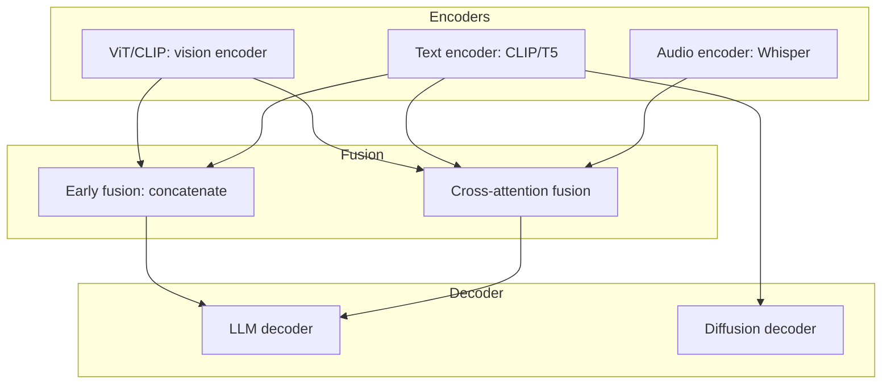

# 23 — Multimodal AI MOC

> [!info] AI that handles multiple modalities: text, image, audio, video. Iteration 4 expanded this chapter with notes on CLIP, LLaVA, Whisper, DiT/FLUX, and cross-modal attention.

## Reading Order

| #   | Note                                              | Sub-domain         | Purpose                                            |
|-----|---------------------------------------------------|--------------------|----------------------------------------------------|
| 01  | [[01 - Multimodal AI Overview]]                   | Vision-Language    | Survey of VLMs, diffusion, audio, video.           |
| 02  | [[02 - CLIP]]                                     | Vision-Language    | Contrastive vision-language pretraining.           |
| 03  | [[03 - LLaVA]]                                    | Vision-Language    | Open-source multimodal LLM template.               |
| 04  | [[04 - Whisper]]                                  | Audio              | Open-source ASR on 99 languages.                   |
| 05  | [[05 - DiT and FLUX]]                             | Diffusion          | Transformer-based diffusion models.                |
| 06  | [[06 - Cross-Modal Attention]]                    | Fusion Architectures| How modalities are fused via attention.            |

## Sub-Domains

- [[23 - Multimodal AI/Vision-Language/03 - LLaVA|Vision-Language]] — notes 01, 02, 03
- [[23 - Multimodal AI/Audio/04 - Whisper|Audio]] — note 04
- [[23 - Multimodal AI/MOC|Video]] — (planned: Sora, Veo)
- [[23 - Multimodal AI/Diffusion/05 - DiT and FLUX|Diffusion]] — note 05
- [[23 - Multimodal AI/Fusion Architectures/06 - Cross-Modal Attention|Fusion Architectures]] — note 06

## The Multimodal Stack

## Why This Matters for AI

- Multimodal capability is now a default expectation for frontier LLMs (GPT-4V, Claude 3, Gemini, Llama 3.2).
- CLIP is the default visual encoder — most multimodal LLMs use CLIP or a successor (SigLIP, EVA-CLIP).
- LLaVA's architecture (vision encoder + projection + LLM) is the template for open-source multimodal LLMs.
- Cross-modal attention is the key fusion mechanism — it lets text tokens attend to relevant image regions.
- DiT/FLUX established Transformers as the default for diffusion-based image generation, unifying the architecture across modalities.

## Production Implications

- **For vision-language applications**: LLaVA-family models are the open-source default. CLIP/SigLIP for visual embeddings.
- **For ASR**: Whisper (specifically Faster-Whisper or whisper.cpp) is the standard. Run locally with Ollama for privacy.
- **For image generation**: FLUX is the strongest open-source model; Stable Diffusion 3 for more options.
- **For fusion**: choose early fusion (concatenation, LLaVA-style) for simplicity, cross-attention (Flamingo-style) for fine-grained control.

## See Also

- [[09 - Foundation Models/Vision/01 - Vision Foundation Models|Vision Foundation Models]]
- [[07 - Transformers/Variants/13 - Vision Transformer ViT|ViT]]
- [[21 - Vision Transformer ViT 2020]] — the paper
- [[08 - LLMs/MOC|08 LLMs]]
- [[24 - Research Frontiers/MOC|24 Research Frontiers]] — emerging multimodal research
