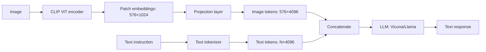

# 03 — LLaVA

> [!info] TL;DR
> LLaVA (Large Language and Vision Assistant) connected a pretrained vision encoder (CLIP ViT) to a pretrained LLM (Llama/Vicuna) via a simple projection layer, then fine-tuned on visual instruction data. The result: an open-source multimodal LLM that can describe images, answer visual questions, and follow instructions about visual content. LLaVA's simplicity (just a projection layer between two frozen models) made it the template for open-source multimodal LLMs.

## Citation

Liu, H., Li, C., Wu, Q., & Lee, Y. J. (2023). *Visual Instruction Tuning*. NeurIPS 2023. arXiv:2304.08485.

## The Problem Being Solved

By 2023, closed-source multimodal LLMs (GPT-4V, Gemini) demonstrated impressive image understanding, but their architectures were undisclosed. Open-source LLMs (Llama, Vicuna) were text-only. The community needed an open multimodal LLM that could be studied, modified, and deployed without API restrictions.

The challenge: how do you give a text-only LLM the ability to understand images? Two approaches:
1. **Train from scratch** on image-text data — expensive, requires massive compute.
2. **Connect a pretrained vision encoder to a pretrained LLM** — cheap, leverages existing models.

LLaVA took the second approach. The key insight: CLIP's vision encoder already produces image embeddings aligned with text. If you project those embeddings into the LLM's input space, the LLM can "read" the image as if it were a sequence of tokens.

## The Architecture

LLaVA has three components:

### 1. Vision Encoder
A pretrained CLIP ViT (typically ViT-L/14). Takes an image and produces a sequence of patch embeddings (e.g., 576 patches for a 336×336 image, each 1024-dimensional).

### 2. Projection Layer
A single linear layer (or a small MLP in LLaVA-1.5) that maps CLIP embeddings to the LLM's input dimension.

```
image_features = clip_vision_encoder(image)  # 576 × 1024
projected = projection(image_features)        # 576 × 4096 (Llama's dimension)
```

The projected image features are treated as "image tokens" — analogous to text tokens, but representing visual information.

### 3. LLM
A pretrained LLM (Vicuna, Llama, Mistral). The input sequence is:

```
[<image_tokens>] [<text_tokens>]
```

where `<image_tokens>` are the projected image features and `<text_tokens>` are the user's question or instruction. The LLM processes this mixed sequence and generates a text response.



### Why This Works
The LLM doesn't need to "see" pixels — it needs to consume information about the image in a format it can process. CLIP's embeddings encode visual concepts in a way that's already aligned with text (thanks to CLIP's contrastive training). The projection layer just maps this aligned representation into the LLM's input space.

The LLM's pretrained language capabilities (reasoning, instruction following, generation) transfer directly to the multimodal setting. The model can describe images, answer questions about them, and follow instructions — all by treating image features as additional input tokens.

## Training

### Stage 1: Pretraining the Projection
- **Frozen**: CLIP vision encoder, LLM.
- **Trainable**: projection layer only.
- **Data**: 595K image-caption pairs (CC3M, filtered).
- **Objective**: next-token prediction, where the input is `[image] caption_so_far` and the target is `caption_next_token`.
- **Purpose**: teach the projection layer to map image features into the LLM's input space.

This stage is cheap (only a small projection layer is trained) and fast (hours on a single GPU).

### Stage 2: Visual Instruction Tuning
- **Frozen**: CLIP vision encoder.
- **Trainable**: projection layer + LLM (full fine-tuning or LoRA).
- **Data**: 158K visual instruction examples (GPT-4 generated).
- **Objective**: next-token prediction on instruction-response pairs.
- **Purpose**: teach the LLM to follow instructions about images.

The visual instruction data was generated by prompting GPT-4 with image captions and bounding box descriptions, asking it to generate diverse instructions (descriptions, questions, reasoning tasks) and responses. This "synthetic instruction tuning" leveraged GPT-4's capability to bootstrap a smaller open-source model.

## Key Results

LLaVA achieved impressive performance for an open-source model:

| Benchmark              | GPT-4V | LLaVA | LLaVA-1.5 |
|------------------------|--------|-------|-----------|
| VQA v2 (accuracy)      | —      | 64.9  | 78.5      |
| GQA (accuracy)         | —      | 47.8  | 62.8      |
| ScienceQA (accuracy)   | 75.2   | 61.9  | 70.4      |
| TextVQA (accuracy)     | —      | 25.4  | 58.2      |

LLaVA-1.5 (with an improved projection MLP and better training data) approached GPT-4V on several benchmarks, despite being much smaller (13B vs. undisclosed GPT-4V size).

## Why It Worked

### Leverage Pretrained Components
LLaVA didn't train CLIP or the LLM from scratch — it used existing, highly-capable models. The only new component was the projection layer. This made training cheap (a few hundred GPU-hours vs. thousands for training from scratch).

### CLIP Embeddings Are LLM-Compatible
CLIP's contrastive training aligns image and text embeddings in a shared space. This alignment means the LLM can interpret CLIP image features as "visual words" — the features encode concepts the LLM already understands from text.

### Instruction Tuning Transfers
The LLM's instruction-following capability (from text pretraining and instruction tuning) transfers to the multimodal setting. The model doesn't need to relearn how to follow instructions — it just needs to learn that image tokens are additional input.

### Synthetic Data Bootstrapping
Using GPT-4 to generate visual instruction data was a clever way to bootstrap a smaller model. The data quality was high enough to teach LLaVA effectively, without requiring expensive human annotation.

## Limitations

### Hallucination
LLaVA hallucinates image content — it describes objects that aren't there, especially when asked about specific details. This is a general problem with multimodal LLMs, not specific to LLaVA.

### Limited Image Resolution
LLaVA processes images at CLIP's native resolution (336×336 or 224×224). Fine details (small text, distant objects) are lost. Later variants (LLaVA-NeXT, LLaVA-1.6) address this with dynamic resolution.

### Single Image Input
LLaVA processes one image at a time. Multi-image reasoning (e.g., "compare these two images") requires architectural changes.

### Projection Layer Is Simple
A single linear layer is a simple mapping. More sophisticated fusion (cross-attention, Q-Former) can capture richer interactions but requires more training data and compute.

## Successors

### LLaVA-1.5
Improved projection (MLP instead of linear), better training data, larger LLM backbone. Significant quality improvement.

### LLaVA-NeXT / LLaVA-1.6
Dynamic resolution (processes images at higher resolution), better OCR capability, improved reasoning.

### LLaVA-Video
Extends LLaVA to video understanding — processes sequences of frames.

### MiniGPT-4
Similar approach to LLaVA, with a different projection architecture (Q-Former from BLIP-2).

### Qwen-VL, InternVL, CogVLM
Other open-source multimodal LLMs, all following the "vision encoder + projection + LLM" template introduced by LLaVA.

## Impact and Legacy

LLaVA's influence on multimodal AI:

1. **Template for open-source multimodal LLMs**. Almost every open-source multimodal LLM (Qwen-VL, InternVL, CogVLM, MiniGPT-4) follows LLaVA's architecture: pretrained vision encoder + projection + pretrained LLM. The specific components differ, but the template is the same.

2. **Democratized multimodal AI**. LLaVA showed that you could build a capable multimodal LLM with modest compute (a few hundred GPU-hours). This made multimodal AI accessible to academic labs and individual researchers, not just big labs.

3. **Synthetic data as a bootstrap**. Using GPT-4 to generate training data became a standard technique. The "model distillation via synthetic data" pattern appears in many subsequent open-source models.

4. **Visual instruction tuning as a paradigm**. The idea of fine-tuning on visual instructions (rather than just image-caption pairs) became standard. This mirrors the instruction tuning that made text LLMs useful as assistants.

5. **Foundation for commercial open-source multimodal models**. Many commercial multimodal AI products (customer support, accessibility tools, content moderation) build on LLaVA-family models.

For AI engineers, LLaVA is the canonical reference for building multimodal LLMs. If you're building a vision-language application and want an open-source model, LLaVA (or a derivative) is the default starting point. Understanding LLaVA clarifies how to connect vision and language models, what training data is needed, and what performance to expect.

## Further Reading

- Original paper: arXiv:2304.08485
- LLaVA-1.5: arXiv:2310.03744
- LLaVA-NeXT: arXiv:2401.04088 (LLaVA-1.6)
- Project page: llava-vl.github.io

## See Also

- [[01 - Multimodal AI Overview]]
- [[02 - CLIP]]
- [[06 - Cross-Modal Attention]]
- [[21 - Vision Transformer ViT 2020]]
- [[01 - Vision Foundation Models]]
- [[23 - Multimodal AI/MOC|23 Multimodal MOC]]
