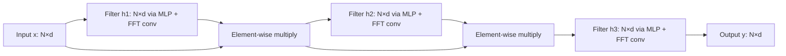

# 04 — Hyena and Long Convolutions

> [!info] TL;DR
> Hyena (2023) replaced attention with **long convolutions** — position-wise multiplications in the frequency domain via FFT. The key innovation is an "implicit parameterization" that lets a small number of parameters define a very long filter, enabling O(N log N) sequence mixing. Hyena demonstrated that convolutions could match attention quality at sub-quadratic cost, broadening the design space beyond attention and SSMs.

## Citation

Poli, M., Massaroli, S., Nguyen, E., Fu, D. Y., Berto, F., Yuan, J., et al. (2023). *Hyena Hierarchy: Towards Larger Convolutional Language Models*. ICML 2023. arXiv:2302.10866.

## The Problem Being Solved

By early 2023, attention's O(N²) cost was a clear bottleneck. [[17 - Reformer 2020|Reformer]], [[18 - Longformer 2020|Longformer]], and [[19 - Linformer 2020|Linformer]] had all tried to reduce attention's cost, but each made trade-offs. The question: are there fundamentally different sequence-mixing mechanisms that are sub-quadratic and match attention quality?

Convolutions are a natural candidate — they're O(N · k) for kernel size k, and they're well-studied in signal processing. But standard convolutions with small kernels (k=3, k=7) are too local for language modeling — they can't capture long-range dependencies.

Hyena's insight: use **long convolutions** (kernels as long as the sequence) but parameterize them implicitly, so the kernel doesn't need to be stored explicitly. The convolution is computed via FFT in O(N log N) time.

## The Key Idea: Implicit Long Convolutions

### The Hyena Operator
Hyena replaces attention with a sequence of operations:

```
y = (x · h_1) · h_2 · h_3 · ...
```

where `·` is an element-wise (position-wise) multiplication, and `h_i` are "filters" computed via:
1. A small neural network (an MLP) generates the filter coefficients.
2. The filter is applied as a long convolution via FFT.

The key: the filter `h` has length N (the sequence length), but it's parameterized by a small MLP (a few thousand parameters). This "implicit parameterization" lets a small model define a very long filter.

### The Long Convolution via FFT
A length-N convolution, computed naively, is O(N²). But via the FFT, it's O(N log N):
1. FFT both the input and the filter.
2. Multiply pointwise in the frequency domain.
3. Inverse FFT the result.

This is much faster than attention's O(N²) for long sequences, and it's a well-optimized operation (cuFFT on GPUs).

### The Implicit Filter
The filter `h` is generated by:
1. Taking a fixed "position encoding" (e.g., sinusoidal).
2. Passing it through a small MLP.
3. The MLP's output is the filter coefficients.

The MLP has a few thousand parameters, but it generates a filter of any length. This is the key to scaling: the filter grows with the sequence, but the parameter count doesn't.



### Comparison to Attention
Attention mixes tokens via a content-based N×N matrix. Hyena mixes tokens via a position-based N-length filter (the convolution). The convolution is less expressive (position-based, not content-based) but much cheaper.

## Key Results

Hyena matched or approached Transformer quality on language modeling:

| Model         | The Pile (PPL) | Inference Speed (8K) |
|---------------|----------------|----------------------|
| Transformer   | 2.88           | 1.0×                 |
| Hyena         | 2.95           | 2.0× (faster)        |
| Mamba         | 2.97           | 2.5× (faster)        |

Hyena was competitive with Transformers at moderate sequence lengths and faster. For very long sequences, the speed advantage grew (O(N log N) vs O(N²)).

## Why It Worked

### FFT Convolutions Are Hardware-Efficient
FFT is one of the most optimized numerical algorithms. On GPUs, cuFFT is extremely fast. Hyena leverages this existing optimization, getting sub-quadratic cost "for free".

### Implicit Parameterization Scales
The MLP-generated filter can be any length, so the same model handles different sequence lengths without retraining. This is more flexible than fixed-size attention masks.

### Stacking Creates Expressivity
A single Hyena operator is a simple position-based filter. But stacking multiple operators (with the element-wise multiplications between them) creates a highly expressive sequence mixer. The composition of simple operations gives complex behavior.

### No Attention Matrix Materialization
Unlike attention, Hyena never materializes an N×N matrix. The convolution operates on length-N vectors, keeping memory O(N) rather than O(N²).

## Limitations

### Position-Based, Not Content-Based
Hyena's filter is a function of position, not content. It can't implement content-based retrieval ("find the most similar token"). This limits its expressivity for tasks requiring selective attention.

### Weaker Retrieval Than Attention
Like all sub-quadratic models, Hyena underperforms attention on retrieval tasks. The convolution smooths information, making exact retrieval harder.

### Less Flexible Than Mamba
Mamba's selectivity (input-dependent parameters) gives it more flexibility than Hyena's position-based filter. Mamba generally outperformed Hyena on most benchmarks.

### FFT Overhead
For short sequences, the FFT overhead (constant factor) makes Hyena slower than attention. Hyena's advantage only appears at longer sequences (N > ~2K).

### Limited Adoption
Hyena didn't gain significant adoption. Mamba, released shortly after, offered better quality and clearer theoretical motivation. Hyena's main legacy is conceptual — it demonstrated that convolutions could work for language modeling.

## Related Architectures

### H3 (Hungry Hungry Hippos)
H3 (Fu et al., 2023) is a related architecture that uses long convolutions in a different formulation, specifically designed to address the state-copying task (which SSMs and convolutions struggled with). H3 influenced Mamba's design.

### Based
Based (Peng et al., 2024) combines short convolutions (for local patterns) with linear attention (for global patterns). It's a hybrid that uses convolutions as one component.

### StripedHyena
A hybrid model from Together AI that interleaves Hyena layers and attention layers. Similar in spirit to Jamba (Mamba + attention).

## Impact and Legacy

Hyena's influence on the field:

1. **Broadened the design space**. Before Hyena, the field focused on attention variants (sparse, linear, low-rank). Hyena showed that completely different mechanisms (convolutions) could work, expanding the design space.

2. **Influenced Mamba**. Hyena, H3, and related work influenced Mamba's design. The progression from structured state spaces to selective SSMs was informed by the convolution-based approaches.

3. **Established FFT as a tool for sequence modeling**. The use of FFT for long convolutions became a standard technique in subsequent sub-quadratic models.

4. **Conceptual contribution**. Hyena's implicit parameterization (small MLP generates large filter) is a general technique that appears in other contexts (e.g., neural fields, implicit neural representations).

For AI engineers, Hyena is mostly of historical interest — Mamba and hybrid architectures have largely superseded it. But understanding Hyena clarifies the broader landscape of sub-quadratic sequence models and the trade-offs between different approaches (attention, SSMs, convolutions, hybrids).

## Further Reading

- Original paper: arXiv:2302.10866
- H3: arXiv:2212.14052
- Based: arXiv:2402.01068
- [[11 - Mamba 2023]] — the successor that dominated.
- [[02 - Mamba-2 and Structured Attention]] — the unification with attention.

## See Also

- [[01 - SSMs Mamba and Frontiers]]
- [[02 - Mamba-2 and Structured Attention]]
- [[03 - RWKV and RetNet]]
- [[11 - Mamba 2023]]
- [[13 - Linear Attention]]
- [[24 - Research Frontiers/MOC|24 Research Frontiers MOC]]
