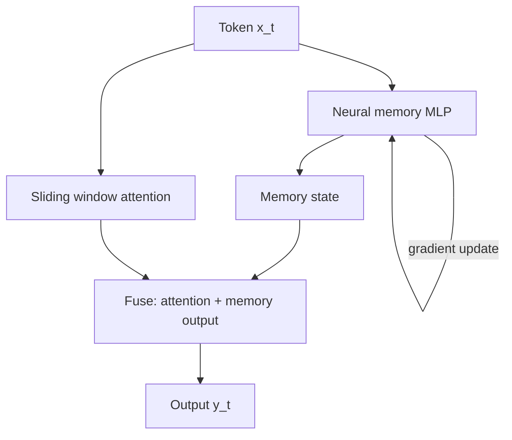

# 05 — DeltaNet and Titans

> [!info] TL;DR
> DeltaNet (2024) improved linear attention with a "delta rule" update rule that lets the state overwrite past information, addressing linear attention's forgetting problem. Titans (Google, 2024–2025) introduced a **neural memory** module — a small neural network trained at inference time (test-time learning) that stores task-relevant information. Both represent the 2024–2025 frontier of memory-augmented sequence models, pushing beyond what fixed-state SSMs can achieve.

## DeltaNet

### Citation
Yang, S., Kautz, J., & Hatamizadeh, A. (2024). *DeltaNet: Parallelizable State Space Models are Long-Term Memories*. arXiv:2412.06464.

### The Problem Being Solved
Linear attention and SSMs accumulate information into a fixed-size state, but they can't easily *overwrite* past information. If the model learned something wrong early in the sequence, it can't correct it — the wrong information persists in the state.

This is the "forgetting" problem: linear models don't forget selectively. They either retain everything (slowly decaying) or forget everything (fast decay). Attention doesn't have this problem — each token's contribution is independent, so new information naturally overwrites old.

### The Delta Rule
DeltaNet adapts the classical "delta rule" from neural network learning (a precursor to backpropagation) to sequence modeling:

```
Standard linear attention:
  S_t = S_{t-1} + k_t · v_t^T        # additive update (can't overwrite)

DeltaNet:
  S_t = S_{t-1} + k_t · (v_t - S_{t-1}^T · k_t) · k_t^T / (1 + k_t^T · k_t)
```

The delta update subtracts the state's current prediction (`S_{t-1}^T · k_t`) from the target (`v_t`), so the update only changes what's wrong. This lets new information overwrite old information when there's a conflict.

### Parallelization
The delta rule is sequential (each update depends on the previous state), which would make it O(N²) to compute naively. DeltaNet shows how to parallelize it using a chunked approach: process the sequence in chunks, use parallel computation within chunks, and sequential updates across chunks. This gives O(N · chunk_size) complexity.

### Results
DeltaNet outperformed standard linear attention and Mamba on long-context benchmarks:
- Better retrieval (the delta update lets the model "remember" recent information more precisely).
- Competitive language modeling quality.
- O(N) inference cost (like Mamba).

### Why It Matters
DeltaNet addresses a fundamental limitation of linear attention — the inability to overwrite. This brings linear attention closer to attention's flexibility while maintaining linear cost.

## Titans

### Citation
Behrouz, A., Zhong, P., Mirrokni, V. (Google DeepMind, 2024). *Titans: Learning to Memorize at Test Time*. arXiv:2501.00663.

### The Problem Being Solved
SSMs and linear attention store information in a fixed-size state (a matrix). This state is limited in capacity — you can't store more information than the state's dimension allows. For very long sequences with lots of information, the state saturates and information is lost.

Attention solves this by storing all token information explicitly (in the KV cache) — no capacity limit, but O(N) memory and O(N²) compute. There's a fundamental trade-off: fixed-state models are efficient but capacity-limited; attention is capacity-unlimited but expensive.

Titans' question: can we have a model that's efficient *and* has high capacity? Their answer: use a **neural network as memory**, trained at inference time.

### The Key Idea: Neural Memory
Titans introduces a "neural memory" module — a small neural network (e.g., a 1–2 layer MLP) that:
- Takes the current token as input.
- Outputs a "memory" vector.
- Is **trained at inference time** (test-time learning) to store task-relevant information.

The training happens via gradient descent on a surprise/loss signal — the memory network learns to predict what comes next, and updates its weights based on prediction error. This is "learning to memorize at test time."



### The Three Memory Types
Titans combines three memory types:
1. **Short-term memory**: the recent context (via sliding window attention).
2. **Long-term memory**: the neural memory module (trained at test time).
3. **Persistent memory**: model parameters (learned during pretraining).

The three memories interact: the short-term memory handles recent context, the long-term memory stores task-relevant information from the full sequence, and the persistent memory provides general knowledge.

### Test-Time Learning
The neural memory is updated at inference time using gradient descent on a surprise metric:
- If the model is "surprised" by a token (high prediction error), the memory is updated more.
- If the model "expected" the token (low prediction error), the memory is updated less.

This is "learning to memorize" — the model decides what's worth remembering based on how surprising it is. This is similar to how humans remember surprising events better than expected ones.

### Results
Titans achieved strong results on long-context benchmarks:
- Needle-in-haystack at 1M+ tokens: Titans significantly outperformed pure attention and pure SSM models.
- Language modeling: competitive with Transformers while being more efficient at long contexts.
- The neural memory's capacity scales with the MLP's size — larger memory networks store more information.

### Why It Matters
Titans represents a new paradigm: models that learn at inference time. Unlike standard models (frozen after training), Titans' memory network continuously adapts to the current input. This is a form of test-time compute (the model does work at inference to improve its outputs) applied to memory.

## Comparison

| Aspect             | DeltaNet                    | Titans                              |
|--------------------|-----------------------------|-------------------------------------|
| Memory type        | Fixed-size state matrix     | Neural network (trained at inference)|
| Update rule        | Delta rule (overwriting)    | Gradient descent on surprise        |
| Capacity           | Fixed (state dimension)     | Scales with memory network size     |
| Inference cost     | O(N) per token              | O(N) + gradient update per token    |
| Novelty            | Better update rule for SSMs | Test-time learning paradigm         |
| Best for           | Long-context, moderate info | Very long context, high info density|

Both are 2024–2025 frontier work, pushing beyond what standard SSMs can do.

## Why These Matter

### Addressing Fundamental Limitations
DeltaNet addresses linear attention's inability to overwrite. Titans addresses the fixed-capacity limitation. Both tackle fundamental problems that limited SSMs and linear attention.

### Test-Time Compute as a Paradigm
Titans' test-time learning is part of the broader "test-time compute" trend (o1, DeepSeek-R1) — models that do significant computation at inference to improve outputs. Titans applies this to memory; reasoning models apply it to chain-of-thought.

### Memory-Augmented Architectures
Both are part of a trend toward memory-augmented LLMs — models with explicit memory modules beyond the KV cache. This trend includes retrieval-augmented models, persistent memory in agents, and now neural memory in the architecture itself.

### Scaling Long Context
Both target the long-context problem (>100K tokens). As applications demand longer contexts, the fixed-state limitations of SSMs become more apparent, and solutions like DeltaNet and Titans become essential.

## Limitations

### DeltaNet
- **Chunked parallelization adds complexity**: the chunking strategy is an engineering complication.
- **Still fixed-capacity**: the delta rule helps with overwriting, but the state still has finite capacity.

### Titans
- **Test-time learning is expensive**: gradient updates at inference add compute cost.
- **Memory network tuning**: the size and architecture of the memory network is a new hyperparameter.
- **Limited production deployment**: Titans is primarily research; no major production model uses it yet (as of mid-2025).

### Both
- **Maturity**: these are 2024–2025 research, not yet battle-tested in production.
- **Hybrid necessity**: both still benefit from combination with attention for retrieval-critical tasks.

## Impact and Legacy

DeltaNet and Titans represent the frontier of memory-augmented sequence modeling:

1. **Pushing beyond fixed-state SSMs**. Both demonstrate that fixed-state models have fundamental limitations, and offer paths forward (better update rules or neural memory).

2. **Test-time learning as a new paradigm**. Titans' inference-time gradient descent is a novel idea that could apply beyond memory — any model component could potentially be adapted at inference.

3. **Influencing hybrid architecture design**. As hybrid models (Mamba + attention) mature, the question of what to use for the "linear" component is open. DeltaNet and Titans offer higher-quality alternatives to standard SSMs.

4. **Long-context frontier**. Both target the >100K context regime that's becoming important for production applications (full-codebase analysis, long-document research).

For AI engineers, DeltaNet and Titans are research to watch. They're not yet production-ready, but they represent the direction of long-context architecture development. Understanding them clarifies what the next generation of efficient long-context models might look like.

## Further Reading

- DeltaNet: arXiv:2412.06464
- Titans: arXiv:2501.00663
- [[11 - Mamba 2023]] — the predecessor SSM.
- [[02 - Mamba-2 and Structured Attention]] — the unification with attention.

## See Also

- [[01 - SSMs Mamba and Frontiers]]
- [[02 - Mamba-2 and Structured Attention]]
- [[03 - RWKV and RetNet]]
- [[04 - Hyena and Long Convolutions]]
- [[06 - Test-Time Compute Scaling]]
- [[11 - Mamba 2023]]
- [[24 - Research Frontiers/MOC|24 Research Frontiers MOC]]
