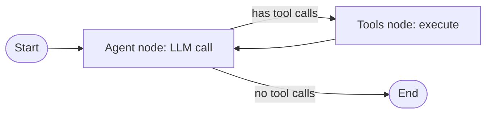

# 03 — LangGraph

> [!info] TL;DR
> LangGraph is LangChain's agent orchestration framework, built on a graph-based model: agents are nodes, transitions are edges, and state flows through the graph. Unlike LangChain's `AgentExecutor` (which is a fixed loop), LangGraph gives you explicit control over the agent's execution path, supporting cycles, conditional routing, human-in-the-loop, and persistent state. LangGraph is the recommended approach for production agent applications in the LangChain ecosystem.

## Overview

- **Developer**: LangChain Inc. (2024).
- **Language**: Python, JavaScript/TypeScript.
- **License**: MIT.
- **Status**: actively developed; the recommended framework for LangChain agents.

## Why LangGraph Exists

LangChain's original `AgentExecutor` was a black box: it ran an LLM in a loop, called tools, and returned when the LLM stopped calling tools. This worked for simple cases but failed for:
- **Complex workflows**: multi-step processes with branching logic.
- **Human-in-the-loop**: pausing for user approval mid-execution.
- **Persistent state**: resuming a conversation across sessions.
- **Multi-agent coordination**: orchestrating multiple agents with explicit roles.
- **Error recovery**: retrying specific steps, falling back to alternatives.

LangGraph was built to address these. The core idea: model the agent as a **graph** where you control every transition.

## Core Concepts

### State
LangGraph agents operate on a shared state object — typically a TypedDict or Pydantic model:

```python
from typing import TypedDict, Annotated
from langgraph.graph.message import add_messages

class AgentState(TypedDict):
    messages: Annotated[list, add_messages]  # accumulates messages
    documents: list  # retrieved documents
    iteration: int
```

The state flows through the graph and is updated by each node. The `Annotated` types specify how updates merge (e.g., `add_messages` appends rather than replaces).

### Nodes
Nodes are functions that take the state and return updates:

```python
def call_model(state: AgentState) -> dict:
    response = llm.invoke(state["messages"])
    return {"messages": [response]}  # appends to messages

def call_tool(state: AgentState) -> dict:
    tool_result = execute_tool(state["messages"][-1].tool_calls)
    return {"messages": [tool_result]}
```

Each node reads from the state, does work, and returns a partial state update.

### Edges
Edges define transitions between nodes:
- **Direct edge**: always go from A to B.
- **Conditional edge**: go to B or C based on a function.

```python
from langgraph.graph import StateGraph, END

graph = StateGraph(AgentState)
graph.add_node("agent", call_model)
graph.add_node("tools", call_tool)

graph.set_entry_point("agent")

# Conditional edge: after agent, either call tools or end
def should_continue(state: AgentState) -> str:
    last_message = state["messages"][-1]
    if last_message.tool_calls:
        return "tools"
    return END

graph.add_conditional_edges("agent", should_continue)
graph.add_edge("tools", "agent")  # after tools, back to agent

app = graph.compile()
```

### Cycles
The graph can have cycles (e.g., `agent → tools → agent → tools → ...`). This is how agent loops are implemented — but unlike `AgentExecutor`, you have explicit control over the cycle and can add conditions, limits, or interruptions.



## Key Features

### Human-in-the-Loop
LangGraph supports pausing execution for human approval:

```python
app = graph.compile(
    interrupt_before=["sensitive_tool"],
    checkpointer=memory_checkpointer,
)

# Run until the interrupt
result = app.invoke(input, config={"configurable": {"thread_id": "1"}})

# Human reviews, then continues
result = app.invoke(None, config={"configurable": {"thread_id": "1"}})
```

This is essential for high-stakes tool calls (sending emails, modifying production data) where human oversight is required.

### Persistent State
LangGraph supports checkpointer backends (in-memory, SQLite, Postgres) that save state after each node execution. This enables:
- **Resuming across sessions**: a user can close the app and resume the conversation later.
- **Time travel**: revert to a previous state and explore a different path.
- **Concurrency**: multiple users can run agents simultaneously, each with isolated state.

### Streaming
LangGraph streams events as the graph executes:
- **Node updates**: stream the output of each node as it completes.
- **Token streaming**: stream LLM tokens as they're generated.
- **State updates**: stream the evolving state.

This enables real-time UI updates in applications.

### Subgraphs
A node can be a subgraph — another LangGraph agent. This enables hierarchical multi-agent systems: a top-level orchestrator delegates to specialized sub-agents.

### Time Travel and Replay
Because state is checkpointed, you can:
- Replay execution from any point.
- Modify state and re-run from that point.
- Debug by inspecting state at each node.

This is invaluable for debugging complex agent behaviors.

## Common Patterns

### The ReAct Loop
The standard ReAct pattern (see [[03 - ReAct Pattern]]) is a simple LangGraph:
- `agent` node: LLM decides action.
- `tools` node: execute tool.
- Conditional edge: if tool calls, go to `tools`; else end.
- Edge from `tools` back to `agent`.

### Plan-and-Execute
A planner node generates a multi-step plan; an executor node executes each step:
- `planner` node: LLM produces a list of steps.
- `executor` node: executes the current step.
- Conditional edge: if more steps, continue; else end.

### Multi-Agent with Routing
A router node classifies the query; specialized agent nodes handle different query types:
- `router` node: classifies query type.
- Conditional edge: route to `billing_agent`, `tech_agent`, or `general_agent`.
- Each agent has its own subgraph.

### Reflection
After generating an answer, a reflection node critiques it; if the critique is negative, regenerate:
- `generator` node: produces answer.
- `critic` node: evaluates answer.
- Conditional edge: if critique is positive, end; else back to generator.

## Comparison to Alternatives

| Framework     | Approach                          | Strengths                          | Weaknesses                       |
|---------------|-----------------------------------|------------------------------------|----------------------------------|
| LangGraph     | Graph-based, explicit state       | Control, persistence, HiTL         | More verbose than AgentExecutor  |
| AgentExecutor | Black-box loop                    | Simple for basic cases             | Limited control, no HiTL         |
| CrewAI        | Role-based                        | Intuitive for team metaphors       | Less flexible than graph-based   |
| AutoGen       | Conversational                    | Multi-agent conversations          | Less structured state            |
| OpenAI Swarm  | Lightweight handoffs              | Simple                             | Limited features, experimental   |

LangGraph is the most feature-complete agent framework for production use. Its verbosity is the trade-off for explicit control.

## Strengths

### Explicit Control
Every transition is visible in the graph definition. No magic, no surprising defaults. This makes debugging and auditing much easier than black-box agent executors.

### Persistence and Resumability
Checkpointing enables long-running agents that span sessions, which is essential for production applications.

### Human-in-the-Loop
First-class support for pausing execution, getting human input, and resuming. This is hard to build correctly from scratch; LangGraph handles it.

### Observability
LangGraph integrates with LangSmith for detailed traces of every node execution, state transition, and LLM call.

### Multi-Agent Support
Subgraphs enable hierarchical multi-agent systems with clean separation of concerns.

## Weaknesses

### Verbose
Even simple agents require significant boilerplate (state definition, node functions, edges, compilation). For very simple use cases, this is overkill.

### Learning Curve
The graph-based model requires understanding state management, conditional edges, and checkpointing. Developers familiar with imperative agent loops may find it unintuitive.

### Performance Overhead
State checkpointing and serialization add overhead. For high-throughput applications, a simpler loop may be faster.

### LangChain Ecosystem Dependency
LangGraph is part of the LangChain ecosystem. While it can be used standalone, it works best with LangChain's model wrappers, tool definitions, and LangSmith observability.

## When to Use LangGraph

### Good Fit
- **Production agents**: explicit control and persistence are essential.
- **Human-in-the-loop workflows**: pausing for approval is a first-class feature.
- **Multi-agent systems**: subgraphs enable clean orchestration.
- **Long-running workflows**: checkpointing enables resumption across sessions.
- **Complex state**: when the agent's state is more than just a message list.

### Poor Fit
- **Simple chatbots**: a basic LLM call with history is enough.
- **High-throughput applications**: the overhead matters.
- **Non-Python ecosystems**: LangGraph is Python-first; the JS version lags.

## Production Patterns

### Use Persistent Checkpointing
For any agent that users interact with, use Postgres-backed checkpointing. This enables session resumption and crash recovery.

### Set Iteration Limits
Even with explicit control, cycles can loop forever. Add a maximum iteration count and a timeout.

### Stream Aggressively
Stream node updates and tokens to the UI. LangGraph's streaming is well-designed and improves perceived performance dramatically.

### Trace Everything
Integrate with LangSmith (or OpenTelemetry) for detailed traces. Without traces, debugging multi-step agents is nearly impossible.

### Test with Eval Sets
Build a test set of (input, expected behavior) pairs. Run them against the graph after every change. LangSmith's eval features help here.

## See Also

- [[02 - LangChain]]
- [[04 - DSPy]]
- [[05 - LlamaIndex]]
- [[01 - Framework Selection Guide]]
- [[03 - ReAct Pattern]]
- [[25 - Frameworks and Tools/MOC|25 Frameworks MOC]]
