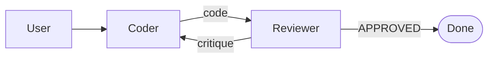

# 09 — AutoGen

> [!info] TL;DR
> AutoGen is Microsoft Research's multi-agent conversation framework. The core abstraction is the **conversable agent** — an entity that sends and receives messages. Agents are wired together into graphs (in 0.4+) or group chats (in 0.2 and earlier) and exchange structured messages until a termination condition is met. AutoGen is strongest for **multi-agent research and conversational workflows** where multiple specialized agents need to coordinate, critique, and collaborate on a single task. The 0.4 release (2025) rebuilt the framework around an asynchronous, event-driven core and explicit logging/observability.

## Overview

- **Developer**: Microsoft Research.
- **Languages**: Python (first-class), .NET (partial).
- **License**: MIT.
- **Status**: actively developed. The 0.2 line is the widely-used "group chat" API; the 0.4+ line is the rebuilt async, scalable core.

## Why AutoGen Exists

Most agent frameworks (LangChain's `AgentExecutor`, OpenAI's basic chat loop) model a single agent interacting with tools. But many real applications are inherently **multi-agent**:

- A coder agent and a reviewer agent iterating on a code change.
- A planner that decomposes tasks and executors that run them.
- A "society" of agents with different personas debating a question to converge on a better answer.

AutoGen was built to make these patterns first-class. Instead of forcing you to hack a single-agent loop, AutoGen gives you primitives to define multiple agents, wire them together, and let them converse. The framework handles message routing, termination, and (in 0.4) distributed execution.

## Core Concepts

### Conversable Agents

Every agent in AutoGen inherits from `ConversableAgent`. A conversable agent has:

- A `system_message` describing its role.
- A `llm_config` specifying the model.
- Optional `register_for_execution` / `register_for_llm` decorators binding tools.
- A `send` and `receive` method for messages.

```python
from autogen import ConversableAgent

coder = ConversableAgent(
    name="Coder",
    system_message="You are a Python developer. Write clean, tested code.",
    llm_config={"config_list": [{"model": "gpt-4o-mini"}]},
)

reviewer = ConversableAgent(
    name="Reviewer",
    system_message="You are a code reviewer. Critique the code for bugs and style.",
    llm_config={"config_list": [{"model": "gpt-4o"}]},
)
```

### Group Chats (AutoGen 0.2)

The classic AutoGen pattern is the **group chat**: a manager agent routes messages between worker agents.

```python
from autogen import GroupChat, GroupChatManager

group_chat = GroupChat(
    agents=[coder, reviewer, user_proxy],
    messages=[],
    max_round=10,
)
manager = GroupChatManager(group_chat)
user_proxy.initiate_chat(manager, message="Build a function that sorts a list of dicts by key.")
```

The manager decides which agent speaks next based on the conversation so far. Termination happens when `max_round` is reached or a stop string appears.

### The Event-Driven Core (AutoGen 0.4+)

The 0.4 release rebuilt AutoGen around:

- **Async-first runtime**: agents communicate via async messaging.
- **Two-agent conversations** as the primitive; group chats are composed of two-agent channels.
- **Topics and subscriptions**: agents publish to topics; subscribers receive messages. This enables broadcast and pub-sub patterns.
- **Single-threaded or distributed**: the same code can run in a single process or across machines via gRPC.
- **Structured logging**: every message and tool call is logged with correlation IDs for tracing.

```python
# AutoGen 0.4 style
from autogen_agentchat.agents import AssistantAgent
from autogen_agentchat.teams import RoundRobinGroupChat
from autogen_agentchat.conditions import TextMentionTermination

coder = AssistantAgent("Coder", model_client=client, system_message="...")
reviewer = AssistantAgent("Reviewer", model_client=client, system_message="...")

team = RoundRobinGroupChat([coder, reviewer], termination_condition=TextMentionTermination("APPROVED"))
result = await team.run(task="Build and review a Fibonacci function.")
```

### Tools and Function Calling

AutoGen supports OpenAI-style function calling. Tools are registered on agents via decorators:

```python
@coder.register_for_execution()
@coder.register_for_llm(name="run_python", description="Execute Python code and return stdout.")
def run_python(code: str) -> str:
    # Execute in a sandbox; return output
    return subprocess.run(["python", "-c", code], capture_output=True, text=True).stdout
```

When the LLM emits a tool call, AutoGen routes it to the registered function, executes it, and returns the result to the LLM.

### Code Executors

A signature feature is the **code executor**: an agent (typically a `UserProxyAgent`) that takes LLM-generated code blocks, runs them in a sandbox (Docker, local subprocess, or Jupyter kernel), and returns the output. This enables "write-and-run" loops where the coder writes code and the proxy executes it without human intervention.

## Common Patterns

### Two-Agent Coder-Reviewer

The simplest multi-agent pattern. The coder writes code; the reviewer critiques; the coder revises; loop until approved.



### Hierarchical (Manager-Worker)

A manager decomposes a task, dispatches subtasks to specialized workers, and synthesizes results. This is the pattern used in [[06 - Build a Multi-Agent System]].

### Sequential Pipeline

Agents are chained: agent A produces a draft, agent B refines it, agent C translates it. Each agent's output feeds the next. This is the simplest form of multi-agent orchestration.

### Debate / Society of Mind

Multiple agents with different personas (optimist, pessimist, pragmatist) debate a question for N rounds, then a synthesis agent combines their arguments. Useful for nuanced reasoning where diverse perspectives improve the answer.

## Comparison to Alternatives

| Framework     | Multi-Agent Model                | State Management        | Best For                              |
|---------------|----------------------------------|-------------------------|---------------------------------------|
| AutoGen       | Conversable agents + group chat  | Message history         | Multi-agent research, debate, code    |
| LangGraph     | Graph of nodes + shared state    | Checkpointed state      | Production agents, HiTL, durable      |
| CrewAI        | Roles + sequential tasks         | Task list               | Team metaphors, simple workflows      |
| OpenAI Swarm  | Lightweight handoffs             | Context variables       | Simple routing, experimental          |
| PydanticAI    | Single agent, type-safe          | Typed dependencies      | Type-safe, single-agent production    |

AutoGen's distinct strength is **conversational multi-agent**: multiple agents exchanging messages in a managed group. LangGraph is better for explicit graph control and persistence; CrewAI is simpler for role-based teams.

## Strengths

### Multi-Agent First

AutoGen's primitives assume multiple agents. You don't fight a single-agent abstraction to build multi-agent systems. Group chats, manager routing, and two-agent conversations are all first-class.

### Code Execution Built-In

The `UserProxyAgent` + Docker executor pattern is unique. Other frameworks leave code execution to the user; AutoGen ships it. This enables agentic coding workflows (HumanEval, SWE-bench style) out of the box.

### Research-Friendly

AutoGen is widely used in agentic AI research papers. Many published multi-agent patterns (MetaGPT, AgentVerse-style societies) are easiest to reproduce in AutoGen.

### 0.4 Async Core

The async, event-driven runtime in 0.4+ supports scaling to many agents and distributed execution. This addresses the 0.2 line's limitations around concurrency and observability.

## Weaknesses

### State Management

AutoGen 0.2's state is the message history — there's no first-class shared state object like LangGraph's `AgentState`. Complex applications that need to track structured state alongside messages find this limiting. The 0.4 release improves this with `Context` variables, but it's still less explicit than LangGraph.

### Observability (Pre-0.4)

Tracing multi-agent conversations in 0.2 requires reading the message log. There's no built-in trace UI like LangSmith. The 0.4 release adds structured logging with OpenTelemetry support, which closes this gap.

### Verbose for Simple Cases

If you just need a single agent with tools, AutoGen is overkill. The group chat abstraction adds overhead that's pointless for one-agent workflows.

### API Stability

The 0.2 → 0.4 transition is a significant rewrite. Code written for 0.2 doesn't run on 0.4 without changes. Teams adopting AutoGen should pick a line and stay on it.

## Production Patterns

### Use 0.4 for New Projects

For greenfield work, start on 0.4+. The async runtime, distributed execution, and observability are essential for production. Use 0.2 only if you have an existing codebase or need a feature not yet ported.

### Set Hard Round Limits

Multi-agent loops can run forever. Always set `max_round` (0.2) or a `TerminationCondition` (0.4). A common pattern: `max_round=20` plus a `TextMentionTermination("APPROVED")` so the loop stops when the reviewer approves.

### Use Docker for Code Execution

If your agents execute generated code, run the executor in a Docker container with resource limits. Never run LLM-generated code directly on the host — even with sandboxing, prompt injection can produce malicious code.

### Log Everything

In production, log every message, tool call, and agent transition. AutoGen 0.4's OpenTelemetry integration is the right pattern. Without traces, debugging multi-agent failures is nearly impossible.

### Cost Control

Multi-agent conversations multiply token costs. A 10-round group chat with 3 agents is 30 LLM calls. Set per-task token budgets and alert when exceeded.

## When to Use AutoGen

### Good Fit
- **Multi-agent research**: reproducing or extending published multi-agent patterns.
- **Code generation with review**: coder + reviewer + executor loops.
- **Debate-style reasoning**: multiple agents argue to converge on a better answer.
- **Hierarchical task decomposition**: planner + specialized workers.

### Poor Fit
- **Single-agent apps**: use LangChain or PydanticAI instead.
- **Production agents with strict state requirements**: LangGraph's checkpointed state is better.
- **Simple role-based teams without conversation**: CrewAI is simpler.

## See Also

- [[03 - LangGraph]] — graph-based alternative with explicit state
- [[10 - CrewAI]] — role-based alternative
- [[11 - PydanticAI]] — type-safe single-agent alternative
- [[01 - Multi-Agent Architectures]] — multi-agent patterns AutoGen implements
- [[03 - ReAct Pattern]] — the agent loop pattern
- [[25 - Frameworks and Tools/MOC|25 Frameworks MOC]]
