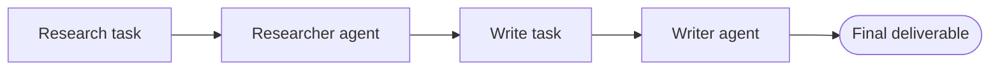

# 10 — CrewAI

> [!info] TL;DR
> CrewAI is a role-based multi-agent framework. You define **agents** (each with a role, goal, and backstory), **tasks** (each with a description, expected output, and assigned agent), and a **crew** that orchestrates them. The framework supports sequential and hierarchical execution, plus delegation between agents. CrewAI's strength is **intuitive role-based design** — the API reads like a job description, making it easy for non-developers to design agent teams. It's lighter than LangGraph and less research-flavored than AutoGen.

## Overview

- **Developer**: CrewAI Inc. (João Moura, 2024).
- **Languages**: Python (first-class).
- **License**: MIT.
- **Status**: actively developed; production-focused. Enterprise version (CrewAI+) adds hosted execution and monitoring.

## Why CrewAI Exists

LangGraph is powerful but verbose: every transition is explicit. AutoGen is research-flavored: conversations are flexible but state is implicit. Neither maps cleanly onto the way product teams think about agent work — as **roles** with **responsibilities** doing **tasks** in a defined order.

CrewAI was built to fill that gap. The core metaphor is a team of specialists:

- An agent is a specialist with a role ("Research Analyst"), a goal ("Find authoritative sources"), and a backstory ("PhD in finance, 10 years of experience").
- A task is a unit of work with a description and expected output, assigned to one agent.
- A crew is the team that executes the tasks in a defined order.

This metaphor maps directly to how product managers describe workflows, making CrewAI accessible to broader teams.

## Core Concepts

### Agents

```python
from crewai import Agent, Task, Crew, Process

researcher = Agent(
    role="Senior Research Analyst",
    goal="Uncover cutting-edge developments in AI agents",
    backstory="You are a PhD-trained analyst with 10 years covering AI.",
    verbose=True,
    allow_delegation=False,
    tools=[search_tool, scrape_tool],
    llm="gpt-4o-mini",
)

writer = Agent(
    role="Tech Content Strategist",
    goal="Write compelling content about AI agent developments",
    backstory="You are a former Wired editor specializing in deep tech.",
    verbose=True,
    allow_delegation=False,
    llm="gpt-4o",
)
```

The `role`, `goal`, and `backstory` are concatenated into the system prompt. This is CrewAI's signature design choice: persona-based prompting is built into the framework.

### Tasks

```python
research_task = Task(
    description="Investigate the latest agent frameworks released in 2026. Focus on architectural innovations.",
    expected_output="A 5-bullet summary with citations.",
    agent=researcher,
)

write_task = Task(
    description="Using the research, write a 500-word blog post accessible to engineering managers.",
    expected_output="A markdown blog post with a clear lede and 3 sections.",
    agent=writer,
    context=[research_task],  # input from prior task
)
```

Tasks have `expected_output`, which the framework uses to validate the result and to provide a stopping criterion. The `context` field lets a task consume the output of prior tasks — this is how data flows through the crew.

### Crews

```python
crew = Crew(
    agents=[researcher, writer],
    tasks=[research_task, write_task],
    process=Process.sequential,  # or Process.hierarchical
    verbose=True,
)

result = crew.kickoff()
```

A crew ties agents and tasks together. Sequential process runs tasks in list order. Hierarchical process introduces a manager agent that plans and delegates.

### Tools

CrewAI tools follow LangChain's tool interface (since 0.4+ uses LangChain's `BaseTool` internally):

```python
from crewai_tools import SerperDevTool, WebsiteSearchTool
search_tool = SerperDevTool()
scrape_tool = WebsiteSearchTool()
```

You can also define tools from plain functions using `@tool`:

```python
from crewai.tools import tool

@tool("Calculator")
def calculate(expression: str) -> str:
    """Evaluate a math expression and return the result."""
    return str(eval(expression))  # use a safe evaluator in production
```

### Memory

CrewAI supports three memory layers:

- **Short-term**: conversation within the current crew run.
- **Long-term**: facts learned across crew runs (stored in a local SQLite DB by default).
- **Entity memory**: structured knowledge about specific entities (people, companies).

Long-term memory lets a crew "remember" prior work — useful for ongoing projects where context accumulates.

### Hierarchical Process

In hierarchical mode, a manager agent:

1. Receives the task list.
2. Plans execution order.
3. Delegates tasks to specialist agents.
4. Reviews outputs and either accepts or asks for revision.
5. Synthesizes the final result.

This is closer to the planner-executor pattern (see [[07 - Planner-Executor Pattern]]) and works well when task order is unclear or requires dynamic replanning.

## Common Patterns

### Sequential Research-Then-Write

The canonical CrewAI pattern: a researcher gathers information, a writer drafts the deliverable. Clean separation of concerns, easy to extend (add a reviewer, add an editor, add a fact-checker).



### Hierarchical Multi-Specialist

A manager decomposes a complex task and routes subtasks to specialists (legal, finance, engineering). Useful when the task spans domains and the right specialist depends on the task content.

### Pipeline with Delegation

Agents can `allow_delegation=True`. When an agent can't complete a task alone, it can delegate to another agent in the crew. This adds flexibility but can produce unexpected call chains — use sparingly.

### Iterative Refinement

A writer drafts, an editor critiques, the writer revises. Use the `context` field to pass the draft to the editor and the critique back to the writer. Run the crew for N iterations to converge on a polished result.

## Comparison to Alternatives

| Framework   | Mental Model                  | State Management      | Best For                              |
|-------------|------------------------------|------------------------|---------------------------------------|
| CrewAI      | Roles + sequential tasks     | Task list + memory    | Team-metaphor workflows, content      |
| LangGraph   | Graph + shared state         | Checkpointed state    | Production agents, HiTL, durable      |
| AutoGen     | Conversable agents           | Message history       | Multi-agent research, debate          |
| PydanticAI  | Single agent, type-safe      | Typed dependencies    | Type-safe single-agent production     |
| OpenAI Swarm| Lightweight handoffs         | Context variables     | Simple routing                        |

CrewAI's distinct strength is **role-based design**: the API matches how non-developers describe workflows. LangGraph is more powerful but harder to teach; AutoGen is more research-flavored; PydanticAI is single-agent.

## Strengths

### Intuitive API

The role/goal/backstory triplet is intuitive. Product managers and domain experts can read and contribute to crew definitions without learning framework internals. This lowers the barrier to multi-agent design.

### Fast Iteration

Sequential crews are quick to build and run. You can have a working research-then-write crew in 30 lines of Python. This makes CrewAI excellent for prototyping content workflows.

### Built-In Memory

Long-term and entity memory are first-class. Crews can accumulate knowledge across runs without you building a memory layer. This is rare in agent frameworks — most leave memory to the user.

### Output Validation

Tasks have `expected_output`, which the framework uses to validate results. You can attach Pydantic models for structured outputs (`output_pydantic=MyModel`). This catches schema drift early.

## Weaknesses

### Less Explicit Control

CrewAI's high-level abstraction hides execution details. You can't easily inject "pause here for human review" or "if this task fails, retry with a different agent" without dropping down to lower-level APIs. LangGraph is better when you need this control.

### Newer Ecosystem

CrewAI's tool ecosystem is smaller than LangChain's. Most non-trivial integrations require either writing your own tool adapter or using LangChain tools via the compatibility layer.

### Hierarchical Process Limitations

The manager agent in hierarchical mode is somewhat opaque. You can't easily customize its planning strategy. For complex planning, you may need to fall back to a sequential crew with explicit task decomposition.

### Performance Overhead

Persona-based prompting produces long system prompts. With many agents, token costs add up. For high-throughput applications, consider trimming backstories or using a lighter framework.

### Less Mature Observability

CrewAI's tracing is less mature than LangSmith. The enterprise version (CrewAI+) adds a monitoring dashboard, but the open-source version relies on verbose console output and optional LangChain callbacks.

## Production Patterns

### Use Sequential for Predictable Workflows

If task order is fixed (research → write → review), use sequential. It's simpler, more deterministic, and easier to debug than hierarchical.

### Use Hierarchical for Dynamic Planning

If task order depends on content (e.g., the manager decides whether to call the legal specialist first or the finance specialist first), use hierarchical. Be aware of the cost: the manager makes extra LLM calls.

### Set `expected_output` and `output_pydantic`

Always specify `expected_output` for validation. For structured deliverables, attach a Pydantic model. This catches prompt drift and produces parseable outputs.

### Trim Personas for Cost

Long backstories help quality but cost tokens. For production, experiment with shorter backstories — sometimes a one-sentence role description is enough. Run A/B tests on a sample task set.

### Use Memory Sparingly

Long-term memory is useful but accumulates stale facts. Periodically review and prune memory. Forgetting is as important as remembering in agent systems.

### Add Human-in-the-Loop via Async Tasks

CrewAI doesn't have first-class HiTL (unlike LangGraph's `interrupt_before`). A workaround: split the crew into two runs. The first run produces a draft; a human reviews; the second run continues with the human's feedback in context.

## When to Use CrewAI

### Good Fit
- **Content pipelines**: research → write → edit → publish workflows.
- **Cross-functional teams**: when legal, finance, and engineering agents each contribute.
- **Rapid prototyping**: 30-line crews that demo well.
- **Non-developer collaboration**: PMs can read and contribute to crew definitions.

### Poor Fit
- **Strict state management**: LangGraph's checkpointed state is better.
- **High-throughput applications**: persona overhead and manager calls add cost.
- **Complex control flow**: when you need cycles, conditional edges, and HiTL, use LangGraph.
- **Research-grade multi-agent**: AutoGen is more flexible for novel patterns.

## See Also

- [[09 - AutoGen]] — conversational multi-agent alternative
- [[03 - LangGraph]] — graph-based alternative with explicit state
- [[11 - PydanticAI]] — type-safe single-agent alternative
- [[01 - Multi-Agent Architectures]] — multi-agent patterns CrewAI implements
- [[07 - Planner-Executor Pattern]] — what hierarchical mode does
- [[25 - Frameworks and Tools/MOC|25 Frameworks MOC]]
