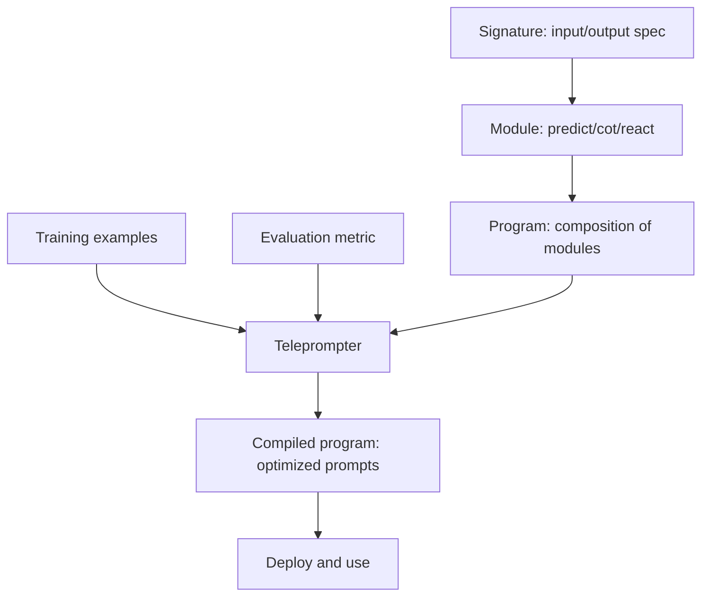

# 04 — DSPy

> [!info] TL;DR
> DSPy ("Declarative Self-improving Language Programs") is a framework that separates the *program* (what the LLM should do, declaratively) from the *prompts* (how to ask the LLM). You define a program with typed signatures and modules; DSPy then *compiles* the program by automatically optimizing prompts (or fine-tuning) against a metric. DSPy flips prompt engineering from manual tweaking to programmatic optimization — and often produces prompts that outperform hand-crafted ones.

## Overview

- **Developer**: Stanford NLP (Omar Khattab et al., 2023).
- **Language**: Python.
- **License**: MIT.
- **Status**: actively developed; growing adoption in research and production.

## The Problem Being Solved

Traditional prompt engineering is manual: you write a prompt, test it, tweak it, repeat. This has problems:
- **Non-systematic**: improvement depends on intuition and luck.
- **Brittle**: a prompt that works for one model may fail for another.
- **Non-portable**: prompts are tied to specific models and don't transfer.
- **Hard to optimize at scale**: with many prompt components, manual tuning becomes intractable.

DSPy's insight: treat prompts as compilable artifacts, not hand-written code. You declare what the LLM should do (signature), and a compiler optimizes the actual prompt text to maximize a metric. This is analogous to how SQL lets you declare what data you want, and the query optimizer figures out how to get it.

## Core Concepts

### Signatures
A signature is a declarative specification of what a module does — its inputs and outputs, with natural-language descriptions:

```python
import dspy

# Signature: "Given a question, produce an answer"
class QA(dspy.Signature):
    """Answer questions with short factoid answers."""
    question = dspy.InputField()
    answer = dspy.OutputField(desc="a short factoid answer, usually 1-5 words")
```

The signature doesn't contain the prompt — it describes the contract. The compiler generates the actual prompt.

### Modules
Modules are the building blocks of DSPy programs. They're analogous to PyTorch modules — composable, parameterized, and optimizable.

```python
# A simple predictor
predictor = dspy.Predict(QA)

# Chain of thought
cot = dspy.ChainOfThought(QA)

# Retrieve then read
class RAG(dspy.Module):
    def __init__(self):
        self.retrieve = dspy.Retrieve(k=3)
        self.generate = dspy.ChainOfThought("context, question -> answer")
    
    def forward(self, question):
        context = self.retrieve(question).passages
        return self.generate(context=context, question=question)
```

Common modules:
- `dspy.Predict`: basic input → output.
- `dspy.ChainOfThought`: input → reasoning → output.
- `dspy.ChainOfThoughtWithHint`: with an optional hint.
- `dspy.ReAct`: ReAct agent with tools.
- `dspy.Retrieve`: retrieval from a corpus.
- `dspy.ProgramOfThought`: generates and executes code.

### Teleprompters (Compilers)
Teleprompters optimize a DSPy program against a metric. They:
1. Run the program on training examples.
2. Identify which demonstrations led to good outputs.
3. Construct improved prompts (with few-shot examples, instructions, etc.).

```python
from dspy.teleprompt import BootstrapFewShot

# Define a metric
def metric(example, prediction, trace=None):
    return example.answer.lower() == prediction.answer.lower()

# Compile
teleprompter = BootstrapFewShot(metric=metric, max_bootstrapped_demos=4)
compiled_program = teleprompter.compile(student=RAG(), trainset=trainset)
```

The compiled program has optimized prompts — it includes the best few-shot examples from the training data, formatted optimally for the target model.

### Optimizers
DSPy includes several optimizers (teleprompters):
- **BootstrapFewShot**: selects good demonstrations as few-shot examples.
- **BootstrapFewShotWithRandomSearch**: tries multiple prompt combinations.
- **MIPRO**: optimizes instructions + few-shot examples jointly.
- **COPRO**: cooperative prompt optimization for multiple modules.
- **BootstrapFineTune**: fine-tunes the model on bootstrapped demonstrations (instead of few-shot prompting).

### Metrics
Metrics evaluate program quality. They can be:
- **Exact match**: for tasks with ground-truth answers.
- **LLM-as-judge**: for open-ended tasks (use an LLM to score outputs).
- **Custom**: any function that takes (example, prediction) and returns a score.

## How Compilation Works



1. **Define**: write the program with signatures and modules.
2. **Provide data**: a training set of (input, expected output) pairs.
3. **Choose metric**: how to evaluate quality.
4. **Compile**: the teleprompter runs the program on training data, identifies good demonstrations, and constructs optimized prompts.
5. **Deploy**: use the compiled program (with optimized prompts) in production.

## Why It Worked

### Separation of Concerns
The program (what to do) is separate from the prompt (how to ask). This lets you optimize prompts without changing program logic, and change program logic without rewriting prompts.

### Automated Optimization
Manual prompt engineering is slow and intuition-dependent. DSPy's optimizers systematically search the prompt space, often finding combinations humans wouldn't try.

### Portability
A compiled program can be re-compiled for a different model. If you switch from GPT-4 to Llama, re-run the compiler — it generates prompts optimized for the new model.

### Composition
Programs compose: a complex program can call simpler programs, each with its own optimized prompt. This enables modular LLM application design.

### Reproducibility
The compilation process is deterministic (given the same training data and seed). This makes experiments reproducible — unlike manual prompt engineering, where you can't easily reproduce why a specific prompt works.

## Key Results

DSPy has been shown to outperform hand-crafted prompts across multiple tasks:
- **GSM8K (math reasoning)**: DSPy-compiled programs with Llama-3-8B matched or exceeded GPT-4 with manual prompts.
- **MultiHop-RAG**: DSPy outperformed manual prompting by 10–20% on multi-hop QA.
- **Classification**: DSPy-compiled classifiers often match fine-tuned models without fine-tuning.

The general pattern: DSPy matches or beats manual prompting, especially for complex multi-step programs where manual prompt engineering is hardest.

## Strengths

### Systematic Optimization
Instead of guessing prompt improvements, DSPy optimizes programmatically. This scales to complex programs with many prompt components.

### Model Portability
Re-compiling for a new model is fast and produces prompts optimized for that model's characteristics.

### Composition
Programs compose naturally, enabling complex applications built from simpler modules.

### Reproducibility
Compilation is deterministic. Experiments can be reproduced and shared.

### Fine-Tuning Integration
The same program can be optimized via prompting (few-shot) or fine-tuning (BootstrapFineTune), depending on what works best.

## Weaknesses

### Learning Curve
The signature/module/teleprompter abstraction is unfamiliar. Developers used to writing prompts directly need time to adjust.

### Compilation Cost
Compilation requires running the program many times on training data, which costs LLM calls. For large training sets, this can be expensive.

### Metric Quality Matters
The optimizer is only as good as the metric. If the metric doesn't capture what you care about, the optimized program won't either.

### Less Control Over Prompts
If you need a specific prompt structure (for compliance, brand voice, etc.), DSPy's auto-generated prompts may not comply. You can constrain the optimization, but it's less flexible than hand-writing.

### Ecosystem Maturity
DSPy's ecosystem is smaller than LangChain's. Integrations with vector stores, tools, and observability platforms are less mature.

## When to Use DSPy

### Good Fit
- **Complex multi-step programs**: where manual prompt engineering is hardest.
- **Multi-model optimization**: when you need to support multiple LLM providers.
- **Systematic improvement**: when you need reproducible, measurable prompt optimization.
- **Research**: DSPy's systematic approach is excellent for ablation studies and prompt research.

### Poor Fit
- **Simple single-prompt applications**: hand-writing a prompt is faster.
- **Strict prompt requirements**: if compliance requires specific prompt structure, DSPy's optimization may not comply.
- **Small training sets**: compilation needs enough examples to identify good demonstrations.

## Comparison to Alternatives

| Framework   | Approach                          | Strengths                          | Weaknesses                       |
|-------------|-----------------------------------|------------------------------------|----------------------------------|
| DSPy        | Declarative + compilation         | Systematic optimization, portability | Learning curve, compilation cost |
| LangChain   | Imperative chains                 | Breadth, integrations              | Manual prompt engineering        |
| Direct SDK  | Write prompts directly            | Full control, simplicity           | No optimization, manual tuning   |

DSPy is unique in its compilation-based approach. It doesn't replace LangChain (which is broader) but offers a fundamentally different way to build LLM programs.

## Production Patterns

### Start Simple, Then Compile
Begin with a basic program (no compilation) to validate the logic. Once it works, add compilation to optimize prompts.

### Use Cheap Models for Compilation
Compilation runs many LLM calls. Use a cheaper model (Haiku, Llama-8B) for compilation, then deploy the compiled program on a stronger model.

### Iterate on Metrics
The metric is the most important component. Iterate on it until it captures what you care about. An LLM-as-judge metric is often better than exact match for open-ended tasks.

### Version Compiled Programs
Treat compiled programs as artifacts. Version them, track which training data and metrics produced each version, and enable rollback.

### Re-compile When Models Change
When you upgrade to a new model version, re-compile. The optimized prompts for the old model may not be optimal for the new one.

## See Also

- [[02 - LangChain]]
- [[03 - LangGraph]]
- [[05 - LlamaIndex]]
- [[01 - Framework Selection Guide]]
- [[04 - LLM-as-Judge Evaluation]]
- [[25 - Frameworks and Tools/MOC|25 Frameworks MOC]]
